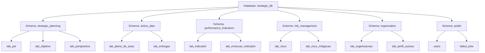
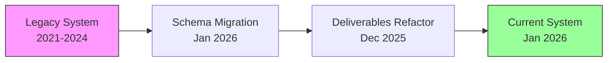

# Strategic Planning System with Laravel 12 + Livewire 3. Balanced Scorecard, KPIs, Risk Management, and Executive Dashboards.

**Strategic Planning System** is a comprehensive web application designed for Institutional Strategic Planning (PEI). It enables organizations to define, track, and manage their strategic goals using the Balanced Scorecard (BSC) methodology, Indicators (KPIs), Action Plans, and Risk Management.

This project was built upon the [Laravel Jetstream + Livewire + Bootstrap Starter Kit](https://github.com/marcioaxn/starter-kit-laravel-jetstream-livewire-bootstrap) by Marcio Alessandro Xavier Neto.

---

## 📋 Table of Contents

- [Overview](#-overview)
- [Key Features](#-key-features)
- [Tech Stack](#-tech-stack)
- [Requirements](#-requirements)
- [Installation Guide](#-installation-guide)
  - [Beginners](#-beginners-step-by-step)
  - [Experienced Developers](#-experienced-developers-tldr)
- [Database & Architecture](#-database--architecture)
- [Legacy Transition](#-legacy-transition)
- [Credits](#-credits)
- [License](#-license)

---

## 🎯 Overview

The system provides a robust platform for public and private organizations to execute their strategy. It moves beyond simple spreadsheets by integrating strategic objectives with real-time performance indicators and risk mitigation plans.

The system is designed with a "Single Page Application" (SPA) feel using **Livewire 3** and **wire:navigate**, ensuring a smooth and responsive user experience without full page reloads.

---

## ✨ Key Features

### 🧩 Strategic Planning (BSC)
- **Strategic Map**: Visual representation of the strategy (Perspectives, Objectives).
- **Identity**: Management of Mission, Vision, and Values.
- **Objectives**: Full CRUD for Strategic Objectives.
- **Perspectives**: Financial, Customer, Internal Processes, Learning & Growth.

### 📈 Performance Indicators (KPIs)
- **Indicator Management**: Define formulas, frequencies, and data sources.
- **Goals & Baselines**: Set targets for different periods.
- **Evolution Tracking**: Upload evidence and track progress over time.
- **Traffic Light System**: Automatic performance calculation (Green, Yellow, Red).
- **Temporal Calculation**: Smart handling of Year-to-Date (YTD) vs. Full Year logic.

### 📋 Action Plans
- **Project Management**: Create action plans linked to objectives.
- **Deliverables**: Track specific tasks and milestones.
- **Responsibility**: Assign managers to plans.
- **Gantt/Timeline**: Visual tracking of progress (via Audit trails).

### 🛡️ Risk Management
- **Risk Matrix (5x5)**: Heatmap visualization of Probability vs. Impact.
- **Mitigation Plans**: Actions to reduce risk exposure.
- **Occurrences**: Log materialized risks and their actual impact.

### 📊 Reporting & Dashboard
- **Executive Dashboard**: Real-time charts (Chart.js) and metrics.
- **PDF Reports**: High-quality exports using DomPDF.
- **Excel Exports**: Data extraction for offline analysis.
- **Global Context**: Smart selector for "Year" and "Organization" that filters all data globally.

### 🔒 Security & Audit
- **Audit Trail**: Complete history of changes (Who, What, When) for critical entities.
- **Role-Based Access**: Granular permissions (implicit via policies).
- **Authentication**: Secure login via Jetstream.

---

## 🛠️ Tech Stack

- **Framework**: Laravel 11 (PHP 8.2+)
- **Frontend**: Livewire 3 + AlpineJS + Bootstrap 5
- **Database**: PostgreSQL 13+
- **Styling**: SCSS (Custom Bootstrap theme)
- **PDF Generation**: `barryvdh/laravel-dompdf`
- **Excel**: `maatwebsite/excel`
- **Auditing**: `owen-it/laravel-auditing`
- **Build Tool**: Vite

---

## 📦 Requirements

Before installing, ensure your environment meets these criteria:

1.  **PHP 8.2+** (Extensions: `pgsql`, `pdo_pgsql`, `intl`, `gd`, `zip`, `xml`)
2.  **Composer 2.x**
3.  **Node.js 20 LTS**
4.  **PostgreSQL 13+** (Required for specific schema features)

---

## 🚀 Installation Guide

### 🟢 Beginners (Step-by-Step)

If you are new to Laravel or command-line tools, follow these steps carefully:

**1. Clone the Project**
Open your terminal (Command Prompt, PowerShell, or Terminal) and run:
```bash
git clone <repository_url> strategic-planning
cd strategic-planning
```

**2. Install Backend Dependencies**
Download the PHP libraries required by the system:
```bash
composer install
```
*Note: This may take a few minutes.*

**3. Install Frontend Dependencies**
Download the JavaScript libraries for the interface:
```bash
npm install
```

**4. Configure Environment**
Create your configuration file by copying the example:
```bash
cp .env.example .env
```
*Windows users might need to use `copy .env.example .env`*

**5. Generate Security Key**
```bash
php artisan key:generate
```

**6. Setup Database**
1.  Open your PostgreSQL tool (pgAdmin or DBeaver).
2.  Create a new database named `strategic_db` (or any name you prefer).
3.  Open the `.env` file in a text editor (like VS Code or Notepad).
4.  Find the `DB_CONNECTION` section and update it:
    ```env
    DB_CONNECTION=pgsql
    DB_HOST=127.0.0.1
    DB_PORT=5432
    DB_DATABASE=strategic_db
    DB_USERNAME=postgres
    DB_PASSWORD=your_password
    ```

**7. Run Migrations & Seeds**
This command creates all tables and inserts the initial data (admin user, basic settings):
```bash
php artisan migrate --seed
```

**8. Build Assets**
Compile the CSS and JavaScript files:
```bash
npm run build
```

**9. Start the Server**
Launch the application:
```bash
php artisan serve
```
Access http://localhost:8000 in your browser.

---

### 🟠 Experienced Developers (TL;DR)

```bash
# Clone
git clone <repository_url> strategic-planning && cd strategic-planning

# Install Deps
composer install && npm install

# Env Setup
cp .env.example .env
php artisan key:generate

# DB Config (Ensure PostgreSQL is running and DB exists)
# Edit .env DB_CONNECTION=pgsql etc.

# Migrate & Seed
php artisan migrate --seed

# Build & Run
npm run build
php artisan serve
```

**Default Credentials:**
- **Email:** `user_adm@user_adm.com`
- **Password:** `1352@765@1452`

---

## 🏛️ Database & Architecture

This project implements a **Domain-Driven Design (DDD)** approach in both its file structure and database schema architecture. This ensures modularity, scalability, and better organization compared to monolithic legacy systems.

### Domain Schemas (PostgreSQL)

Instead of a single `public` or `pei` schema, data is segregated into logical domains. This is transparent to the application code thanks to the `search_path` configuration in `config/database.php`.



### File Structure Map

The application code mirrors the database structure:

```text
app/
├── Models/
│   ├── ActionPlan/          (PlanoDeAcao, Entrega...)
│   ├── StrategicPlanning/   (PEI, Objetivo, Perspectiva...)
│   ├── PerformanceIndicators/ (Indicador, Meta...)
│   ├── RiskManagement/      (Risco, Mitigacao...)
│   ├── Organization/        (Organization, Perfil...)
│   └── User.php             (Auth - Public Domain)
├── Livewire/
│   ├── ActionPlan/
│   ├── StrategicPlanning/
│   ├── PerformanceIndicators/
│   ├── RiskManagement/
│   └── ...
```

---

## 🔄 Legacy Transition & Migration Strategy

This project evolved from a legacy structure (available at [marcioaxn/planejamento-estrategico](https://github.com/marcioaxn/planejamento-estrategico)) through a carefully planned migration strategy that preserves **100% data integrity** while modernizing the architecture.

### Evolution Timeline



### Legacy vs. Current Architecture

| Feature | Legacy System | Current System |
| :--- | :--- | :--- |
| **Schema** | Monolithic (`pei` or `public`) | **Domain-Segregated** (`strategic_planning`, `action_plan`, etc.) |
| **Models** | All in `App\Models` or `App\Models\PEI` | **Domain Folders** (`App\Models\ActionPlan`, etc.) |
| **Organization** | Mixed responsibilities | **Separation of Concerns** (DDD) |
| **Naming** | `pei.tab_tabela` (Hardcoded) | `tab_tabela` (Schema agnostic via `search_path`) |
| **Deliverables** | Simple hierarchical list | **Notion-like Board** (Kanban, Timeline, Calendar, List) |
| **Data Structure** | Fixed columns | **Flexible JSON properties** + Rich metadata |

---

## 📦 Migration Strategy Overview

The migration strategy was designed as a **zero-downtime, backward-compatible** transition path with multiple layers:

### Layer 1: Domain Schema Segregation

**Migration:** `2026_01_02_000001_migrate_legacy_tables_to_domain_schemas.php`

**Purpose:** Restructure the database from a monolithic schema into domain-specific schemas following DDD principles.

**What it does:**
1. Creates 5 new PostgreSQL schemas:
   - `strategic_planning` - PEI, objectives, perspectives, BSC components
   - `action_plan` - Action plans, deliverables, execution types
   - `performance_indicators` - KPIs, goals, baselines, evolutions
   - `risk_management` - Risks, mitigations, occurrences
   - `organization` - Organizations, profiles, user relationships

2. Safely moves existing tables from `pei` and `public` schemas to their new domains using:
   ```sql
   ALTER TABLE old_schema.table_name SET SCHEMA new_schema;
   ```

3. **Safety Features:**
   - Uses `IF EXISTS` checks before moving tables
   - Preserves all data, indexes, and constraints
   - Works on both fresh installs and legacy upgrades
   - No data loss, no downtime

**Tables Migrated:**

<details>
<summary><b>Strategic Planning Schema (14 tables)</b></summary>

- `tab_pei` - Strategic planning cycles
- `tab_missao_visao_valores` - Mission & Vision
- `tab_valores` - Organizational values
- `tab_perspectiva` - BSC perspectives
- `tab_objetivo` - Strategic objectives
- `tab_objetivo_estrategico` - Legacy objectives (renamed)
- `tab_futuro_almejado_objetivo` - Future state per objective
- `tab_nivel_hierarquico` - Hierarchical levels
- `tab_grau_satisfacao` - Performance satisfaction degrees
- `tab_arquivos` - Evidence attachments
- `tab_atividade_cadeia_valor` - Value chain activities
- `tab_processos_atividade_cadeia_valor` - Value chain processes
- `tab_analise_ambiental` - Environmental analysis (SWOT)
</details>

<details>
<summary><b>Action Plan Schema (9 tables)</b></summary>

- `tab_plano_de_acao` - Action plans
- `tab_entregas` - Deliverables (main table)
- `tab_entrega_comentarios` - Comments on deliverables
- `tab_entrega_labels` - Tags/labels for categorization
- `rel_entrega_labels` - Many-to-many pivot
- `tab_entrega_anexos` - File attachments
- `tab_entrega_historico` - Activity history/audit trail
- `rel_entrega_users_responsaveis` - Assigned users
- `tab_tipo_execucao` - Execution types (Action, Initiative, Project)
- `acoes` - Legacy actions log
</details>

<details>
<summary><b>Performance Indicators Schema (5 tables)</b></summary>

- `tab_indicador` - Performance indicators (KPIs)
- `tab_evolucao_indicador` - Monthly evolution tracking
- `tab_linha_base_indicador` - Baseline per year
- `tab_meta_por_ano` - Annual goals
- `rel_indicador_objetivo_organizacao` - Indicator ↔ Organization
</details>

<details>
<summary><b>Risk Management Schema (4 tables)</b></summary>

- `tab_risco` - Strategic risks (5×5 matrix)
- `tab_risco_objetivo` - Risks ↔ Objectives pivot
- `tab_risco_mitigacao` - Mitigation plans
- `tab_risco_ocorrencia` - Risk occurrence log
</details>

<details>
<summary><b>Organization Schema (5 tables)</b></summary>

- `tab_organizacoes` - Organizational units
- `tab_perfil_acesso` - Access profiles (roles)
- `rel_users_tab_organizacoes` - Users ↔ Organizations
- `rel_organizacao` - Organizational hierarchy
- `rel_users_tab_organizacoes_tab_perfil_acesso` - Full access control
</details>

---

### Layer 2: Deliverables Modernization (Notion-like Interface)

**Migration Set:** `2025_12_27_180000` through `2025_12_27_193000` (7 migrations)

**Purpose:** Transform the simple deliverables system into a powerful, Notion-like project management interface with multiple views and rich metadata.

#### 2.1 Core Table Enhancement

**Migration:** `2025_12_27_180000_alter_pei_tab_entregas_add_notion_fields.php`

**New Fields Added:**
- `cod_entrega_pai` (UUID) - Parent deliverable for hierarchical subtasks
- `dsc_tipo` (VARCHAR) - Block type: task, heading, text, divider, checklist
- `json_propriedades` (JSONB) - Custom properties (colors, icons, metadata)
- `dte_prazo` (DATE) - Due date
- `cod_responsavel` (UUID) - Assigned user
- `cod_prioridade` (VARCHAR) - Priority: low, medium, high, urgent
- `num_ordem` (INTEGER) - Sort order for drag-and-drop
- `bln_arquivado` (BOOLEAN) - Archived flag (soft archive, not deleted)

**Data Migration:**
```sql
-- Migrates existing data from num_nivel_hierarquico_apresentacao to num_ordem
UPDATE pei.tab_entregas
SET
    num_ordem = COALESCE(num_nivel_hierarquico_apresentacao, 0),
    dsc_tipo = 'task',
    cod_prioridade = 'media',
    bln_arquivado = false,
    json_propriedades = '{}'::jsonb
WHERE num_ordem = 0 OR num_ordem IS NULL;
```

#### 2.2 Supporting Tables

**`tab_entrega_comentarios`** - Discussion threads on deliverables
- Rich text comments with markdown support
- @mentions via JSON (`json_mencoes`)
- Threaded replies (via parent_id added in migration `2025_12_27_193000`)

**`tab_entrega_labels`** - Color-coded tags per action plan
- Customizable colors (HEX format)
- Optional icons (Bootstrap Icons)
- Sortable for organization

**`rel_entrega_labels`** - Many-to-many pivot for tagging deliverables

**`tab_entrega_anexos`** - File attachments
- Supports images, documents, any MIME type
- Stores thumbnails for preview
- Tracks file size and metadata

**`tab_entrega_historico`** - Complete audit trail
- Tracks all changes (created, updated, deleted, restored, status_changed)
- Stores before/after values in JSONB
- Human-readable descriptions

**`rel_entrega_users_responsaveis`** - Multiple assignees per deliverable

**Features Enabled:**
- ✅ **4 Views:** Kanban, List, Timeline/Gantt, Calendar
- ✅ **Drag-and-drop** reordering within and across columns
- ✅ **Inline editing** of titles and properties
- ✅ **Hierarchical subtasks** with unlimited nesting
- ✅ **Rich comments** with @mentions
- ✅ **File attachments** with preview
- ✅ **Color-coded labels** for visual categorization
- ✅ **Complete history** of all changes
- ✅ **Multiple assignees** per task
- ✅ **Priority levels** with visual indicators

---

### Layer 3: Strategic Objectives Restructuring

**Migrations:**
- `2025_12_28_185851_rename_objetivo_estrategico_to_objetivo.php`
- `2025_12_28_203425_create_new_tab_objetivo_estrategico.php`

**Purpose:** Simplify and standardize objective naming while maintaining backward compatibility.

**Changes:**
1. Renamed tables:
   - `tab_objetivo_estrategico` → `tab_objetivo` (main working table)
   - `tab_futuro_almejado_objetivo_estrategico` → `tab_futuro_almejado_objetivo`
   - `rel_indicador_objetivo_estrategico_organizacao` → `rel_indicador_objetivo_organizacao`

2. Created new `tab_objetivo_estrategico` in `strategic_planning` schema for new architecture

**Why:** The term "objetivo_estrategico" was redundant - all objectives in PEI are strategic by definition. The renaming simplifies code and database queries.

---

### Layer 4: Data Quality Fixes

**Migration:** `2026_01_02_000002_fix_grau_satisfacao_table.php`

**Purpose:** Fix historical typos and ensure data consistency.

**Corrections:**
- `tab_grau_satisfcao` (typo) → `tab_grau_satisfacao` (correct Portuguese)
- Handles multiple scenarios:
  1. Table stuck in `pei` schema with wrong name
  2. Table stuck in `pei` schema with correct name
  3. Table already moved to `strategic_planning` but with wrong name

**Safety:** Uses existence checks to handle all possible states gracefully.

---

## 🚀 Upgrading from Legacy System

### For Existing Installations

If you have an existing database from the legacy system:

```bash
# 1. Backup your database first (CRITICAL!)
pg_dump -U postgres strategic_db > backup_$(date +%Y%m%d).sql

# 2. Pull the latest code
git pull origin main

# 3. Run migrations
php artisan migrate

# Expected output:
# ✓ Creating schemas (strategic_planning, action_plan...)
# ✓ Moving tables to new schemas
# ✓ Adding Notion-like fields to deliverables
# ✓ Creating supporting tables
# ✓ Fixing table names
```

**The migrations are:**
- ✅ **Idempotent** - Safe to run multiple times
- ✅ **Non-destructive** - Zero data loss
- ✅ **Backward compatible** - Old code continues working during transition

### For Fresh Installations

Simply run:
```bash
php artisan migrate --seed
```

All tables will be created directly in their final domain schemas.

---

## 🔙 Rollback Considerations

**⚠️ Important:** Rolling back schema migrations in production is **not recommended** due to:
1. Complexity of moving tables back to original schemas
2. Potential foreign key conflicts
3. Risk to data integrity

**Best Practice:**
- Always test migrations in **development** first
- Keep database backups before migrating
- Use Laravel's migration status: `php artisan migrate:status`

**Emergency Rollback:**
```bash
# Only in development/staging!
php artisan migrate:rollback --step=1
```

---

## 📊 Migration Impact Summary

| Aspect | Before | After |
|--------|--------|-------|
| **Schemas** | 2 (`public`, `pei`) | 6 (including `strategic_planning`, `action_plan`, etc.) |
| **Total Tables** | 37 | 47 (+10 for Notion-like features) |
| **Deliverables Fields** | 12 basic | 20+ with rich metadata |
| **Audit Capability** | Limited | Full history + comments + attachments |
| **User Experience** | Basic list | 4 interactive views (Kanban/List/Timeline/Calendar) |

---

## 📝 Related Documentation

For detailed information about the migration system:
- **Migration Summary:** See `MIGRATIONS_SUMMARY.md`
- **Deliverables Roadmap:** See `ai/20251227_roadmap_sistema_entregas_notion.md`
- **Architecture Details:** See `ai/PROJECT_STATE.md`

---

## 📜 License

This project is proprietary software customized for specific institutional needs. However, the underlying starter kit is open-source under the MIT license.

---

## 👏 Credits

- **Base Project:** [Starter Kit Laravel Jetstream Livewire Bootstrap](https://github.com/marcioaxn/starter-kit-laravel-jetstream-livewire-bootstrap)
- **Author:** Marcio Alessandro Xavier Neto
- **AI Assistance:** Developed with the aid of advanced AI agents (Gemini, Claude) for rapid prototyping and refactoring.