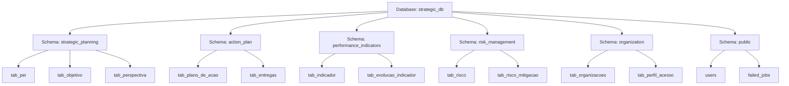

# Strategic Planning System with Laravel 12 + Livewire 3. Balanced Scorecard, KPIs, Risk Management, and Executive Dashboards.

**Strategic Planning System** is a comprehensive web application designed for Institutional Strategic Planning (PEI). It enables organizations to define, track, and manage their strategic goals using the Balanced Scorecard (BSC) methodology, Indicators (KPIs), Action Plans, and Risk Management.

This project was built upon the [Laravel Jetstream + Livewire + Bootstrap Starter Kit](https://github.com/marcioaxn/starter-kit-laravel-jetstream-livewire-bootstrap) by Marcio Alessandro Xavier Neto.

---

## 📋 Table of Contents

- [Overview](#-overview)
- [Key Features](#-key-features)
- [Tech Stack](#-tech-stack)
- [Requirements](#-requirements)
- [Installation Guide](#-installation-guide)
  - [Beginners](#-beginners-step-by-step)
  - [Experienced Developers](#-experienced-developers-tldr)
- [Database & Architecture](#-database--architecture)
- [Legacy Transition](#-legacy-transition)
- [Credits](#-credits)
- [License](#-license)

---

## 🎯 Overview

The system provides a robust platform for public and private organizations to execute their strategy. It moves beyond simple spreadsheets by integrating strategic objectives with real-time performance indicators and risk mitigation plans.

The system is designed with a "Single Page Application" (SPA) feel using **Livewire 3** and **wire:navigate**, ensuring a smooth and responsive user experience without full page reloads.

---

## ✨ Key Features

### 🧩 Strategic Planning (BSC)
- **Strategic Map**: Visual representation of the strategy (Perspectives, Objectives).
- **Identity**: Management of Mission, Vision, and Values.
- **Objectives**: Full CRUD for Strategic Objectives.
- **Perspectives**: Financial, Customer, Internal Processes, Learning & Growth.

### 📈 Performance Indicators (KPIs)
- **Indicator Management**: Define formulas, frequencies, and data sources.
- **Goals & Baselines**: Set targets for different periods.
- **Evolution Tracking**: Upload evidence and track progress over time.
- **Traffic Light System**: Automatic performance calculation (Green, Yellow, Red).
- **Temporal Calculation**: Smart handling of Year-to-Date (YTD) vs. Full Year logic.

### 📋 Action Plans
- **Project Management**: Create action plans linked to objectives.
- **Deliverables**: Track specific tasks and milestones.
- **Responsibility**: Assign managers to plans.
- **Gantt/Timeline**: Visual tracking of progress (via Audit trails).

### 🛡️ Risk Management
- **Risk Matrix (5x5)**: Heatmap visualization of Probability vs. Impact.
- **Mitigation Plans**: Actions to reduce risk exposure.
- **Occurrences**: Log materialized risks and their actual impact.

### 📊 Reporting & Dashboard
- **Executive Dashboard**: Real-time charts (Chart.js) and metrics.
- **PDF Reports**: High-quality exports using DomPDF.
- **Excel Exports**: Data extraction for offline analysis.
- **Global Context**: Smart selector for "Year" and "Organization" that filters all data globally.

### 🔒 Security & Audit
- **Audit Trail**: Complete history of changes (Who, What, When) for critical entities.
- **Role-Based Access**: Granular permissions (implicit via policies).
- **Authentication**: Secure login via Jetstream.

---

## 🛠️ Tech Stack

- **Framework**: Laravel 11 (PHP 8.2+)
- **Frontend**: Livewire 3 + AlpineJS + Bootstrap 5
- **Database**: PostgreSQL 13+
- **Styling**: SCSS (Custom Bootstrap theme)
- **PDF Generation**: `barryvdh/laravel-dompdf`
- **Excel**: `maatwebsite/excel`
- **Auditing**: `owen-it/laravel-auditing`
- **Build Tool**: Vite

---

## 📦 Requirements

Before installing, ensure your environment meets these criteria:

1.  **PHP 8.2+** (Extensions: `pgsql`, `pdo_pgsql`, `intl`, `gd`, `zip`, `xml`)
2.  **Composer 2.x**
3.  **Node.js 20 LTS**
4.  **PostgreSQL 13+** (Required for specific schema features)

---

## 🚀 Installation Guide

### 🟢 Beginners (Step-by-Step)

If you are new to Laravel or command-line tools, follow these steps carefully:

**1. Clone the Project**
Open your terminal (Command Prompt, PowerShell, or Terminal) and run:
```bash
git clone <repository_url> strategic-planning
cd strategic-planning
```

**2. Install Backend Dependencies**
Download the PHP libraries required by the system:
```bash
composer install
```
*Note: This may take a few minutes.*

**3. Install Frontend Dependencies**
Download the JavaScript libraries for the interface:
```bash
npm install
```

**4. Configure Environment**
Create your configuration file by copying the example:
```bash
cp .env.example .env
```
*Windows users might need to use `copy .env.example .env`*

**5. Generate Security Key**
```bash
php artisan key:generate
```

**6. Setup Database**
1.  Open your PostgreSQL tool (pgAdmin or DBeaver).
2.  Create a new database named `strategic_db` (or any name you prefer).
3.  Open the `.env` file in a text editor (like VS Code or Notepad).
4.  Find the `DB_CONNECTION` section and update it:
    ```env
    DB_CONNECTION=pgsql
    DB_HOST=127.0.0.1
    DB_PORT=5432
    DB_DATABASE=strategic_db
    DB_USERNAME=postgres
    DB_PASSWORD=your_password
    ```

**7. Run Migrations & Seeds**
This command creates all tables and inserts the initial data (admin user, basic settings):
```bash
php artisan migrate --seed
```

**8. Build Assets**
Compile the CSS and JavaScript files:
```bash
npm run build
```

**9. Start the Server**
Launch the application:
```bash
php artisan serve
```
Access http://localhost:8000 in your browser.

---

### 🟠 Experienced Developers (TL;DR)

```bash
# Clone
git clone <repository_url> strategic-planning && cd strategic-planning

# Install Deps
composer install && npm install

# Env Setup
cp .env.example .env
php artisan key:generate

# DB Config (Ensure PostgreSQL is running and DB exists)
# Edit .env DB_CONNECTION=pgsql etc.

# Migrate & Seed
php artisan migrate --seed

# Build & Run
npm run build
php artisan serve
```

**Default Credentials:**
- **Email:** `user_adm@user_adm.com`
- **Password:** `1352@765@1452`

---

## 🏛️ Database & Architecture

This project implements a **Domain-Driven Design (DDD)** approach in both its file structure and database schema architecture. This ensures modularity, scalability, and better organization compared to monolithic legacy systems.

### Domain Schemas (PostgreSQL)

Instead of a single `public` or `pei` schema, data is segregated into logical domains. This is transparent to the application code thanks to the `search_path` configuration in `config/database.php`.



### File Structure Map

The application code mirrors the database structure:

```text
app/
├── Models/
│   ├── ActionPlan/          (PlanoDeAcao, Entrega...)
│   ├── StrategicPlanning/   (PEI, Objetivo, Perspectiva...)
│   ├── PerformanceIndicators/ (Indicador, Meta...)
│   ├── RiskManagement/      (Risco, Mitigacao...)
│   ├── Organization/        (Organization, Perfil...)
│   └── User.php             (Auth - Public Domain)
├── Livewire/
│   ├── ActionPlan/
│   ├── StrategicPlanning/
│   ├── PerformanceIndicators/
│   ├── RiskManagement/
│   └── ...
```

---

## 🔄 Legacy Transition

This project evolved from a legacy structure (available at [marcioaxn/planejamento-estrategico](https://github.com/marcioaxn/planejamento-estrategico)). Below is the detail of the architectural shift performed via migrations.

### Legacy vs. Current Architecture

| Feature | Legacy System | Current System (SEAE) |
| :--- | :--- | :--- |
| **Schema** | Monolithic (`pei` or `public`) | **Domain-Segregated** (`strategic_planning`, `action_plan`, etc.) |
| **Models** | All in `App\Models` or `App\Models\PEI` | **Domain Folders** (`App\Models\ActionPlan`, etc.) |
| **Organization** | Mixed responsibilities | **Separation of Concerns** (DDD) |
| **Naming** | `pei.tab_tabela` (Hardcoded) | `tab_tabela` (Schema agnostic via `search_path`) |

### Migration Strategy

We developed a safe migration path that preserves data integrity while refactoring the structure.

**Key Migration Files:**

1.  **Original Migrations (Refactored):**
    All original migrations were preserved but moved to their respective domain folders (`database/migrations/ActionPlan`, etc.). They now define tables using the schema-agnostic approach.

2.  **`2026_01_02_000001_migrate_legacy_tables_to_domain_schemas.php`:**
    *   **Purpose:** The "Big Bang" migration.
    *   **Action:** Creates the new schemas (`strategic_planning`, `action_plan`, etc.) and safely moves existing tables from the legacy `pei`/`public` schemas to their new homes using `ALTER TABLE ... SET SCHEMA`.
    *   **Safety:** Uses `IF EXISTS` checks to ensure it runs smoothly on both fresh installs and existing legacy databases.

3.  **`2026_01_02_000002_fix_grau_satisfacao_table.php`:**
    *   **Purpose:** Data correction.
    *   **Action:** Fixes historical typos (e.g., `satisfcao` -> `satisfacao`) ensuring consistency across the entire system.

**Note on Upgrading:**
If you are upgrading from the legacy version, simply run `php artisan migrate`. The system will automatically detect the old tables and move them to the new structure **without data loss**.

---

## 📜 License

This project is proprietary software customized for specific institutional needs. However, the underlying starter kit is open-source under the MIT license.

---

## 👏 Credits

- **Base Project:** [Starter Kit Laravel Jetstream Livewire Bootstrap](https://github.com/marcioaxn/starter-kit-laravel-jetstream-livewire-bootstrap)
- **Author:** Marcio Alessandro Xavier Neto
- **AI Assistance:** Developed with the aid of advanced AI agents (Gemini, Claude) for rapid prototyping and refactoring.