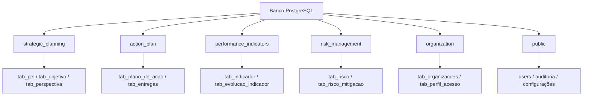

# Sistema de Planejamento Estratégico Institucional (PEI)

Plataforma web de gestão estratégica para **organizações públicas brasileiras**, construída sobre **Laravel 12 + Livewire 3**. Permite definir, executar e monitorar a estratégia institucional usando a metodologia **Balanced Scorecard (BSC)**, indicadores de desempenho (KPIs), planos de ação, entregas e gestão de riscos — alinhada ao **Guia Prático de Planejamento Estratégico Institucional (GPPEI / MGI 2025)** e à **Agenda 2030 / ODS**.

> Referência metodológica: `documentacao/pdf/Guia_PEI_VF.pdf`
> Documento mestre do projeto: `documentacao/documento-mestre-evolucao-sistema-pei.md`

---

## 📋 Sumário

- [Cenário atual do projeto](#-cenário-atual-do-projeto)
- [Stack tecnológica](#-stack-tecnológica)
- [Requisitos](#-requisitos)
- [Instalação](#-instalação)
- [Arquitetura](#-arquitetura)
- [Boas práticas de desenvolvimento](#-boas-práticas-de-desenvolvimento)
- [Migração da versão anterior (v1 → v2)](#-migração-da-versão-anterior-v1--v2)
- [Testes e qualidade](#-testes-e-qualidade)
- [Documentação relacionada](#-documentação-relacionada)
- [Licença e créditos](#-licença-e-créditos)

---

## 🎯 Cenário atual do projeto

O sistema está em operação evolutiva e cobre o ciclo completo do PEI. Os módulos abaixo estão implementados:

| Módulo | O que entrega |
|---|---|
| **Planejamento Estratégico (BSC)** | Ciclos PEI, Identidade (Missão/Visão/Valores), Perspectivas, Objetivos, Mapa Estratégico, Graus de Satisfação |
| **Análises de Ambiente** | SWOT e PESTEL |
| **Indicadores (KPIs)** | Indicadores, metas por ano, linha de base, evolução, cálculo de farol (semáforo) e polaridade |
| **Planos de Ação** | Planos vinculados a objetivos, tipos de execução, responsáveis |
| **Entregas (modelo Notion)** | Quadro Kanban, Lista, Timeline e Calendário; subtarefas hierárquicas, rótulos, comentários, anexos, histórico e múltiplos responsáveis |
| **Gestão de Riscos** | Matriz 5×5, mitigações e ocorrências |
| **Agenda 2030 / ODS** | 17 ODS oficiais como eixo transversal, vínculo objetivo↔ODS e painel dedicado |
| **Relatórios e Dashboard** | Dashboard executivo (Chart.js), relatórios em PDF e exportações em Excel |
| **Organização** | Organizações hierárquicas, perfis de acesso |
| **Auditoria** | Trilha de alterações (quem, o quê, quando) nas entidades de negócio |
| **Administração** | Configurações sistêmicas e alertas estratégicos |

**Fluxo metodológico guiado** (`PeiGuidanceService`):
`Ciclo PEI → Identidade → Perspectivas → Objetivos → Graus de Satisfação → Indicadores → Planos de Ação → Dashboard`.

---

## 🛠️ Stack tecnológica

- **PHP** 8.2+ · **Laravel** 12 · **Livewire** 3 · **Alpine.js** 3
- **Frontend**: Bootstrap 5.3 + Bootstrap Icons · **Build**: Vite 7
- **Banco**: **PostgreSQL multi-schema** (6 schemas de domínio)
- **Autenticação**: Fortify + Jetstream + Sanctum
- **Fila / Cache / Sessão**: driver `database`
- **Testes**: Pest 4 · **Lint**: Laravel Pint
- **PDF**: `barryvdh/laravel-dompdf` · **Excel**: `maatwebsite/excel` · **Auditoria**: `owen-it/laravel-auditing` · **HTML**: `spatie/laravel-html`

---

## 📦 Requisitos

1. **PHP 8.2+** — extensões: `pgsql`, `pdo_pgsql`, `intl`, `mbstring`, `gd`, `zip`, `xml`
2. **Composer 2.x**
3. **Node.js 20 LTS**
4. **PostgreSQL 13+** (mínimo absoluto **9.4** para `jsonb` e `gen_random_uuid`)

> Ambiente de referência de desenvolvimento: Windows 10 + XAMPP, PostgreSQL local.

---

## 🚀 Instalação

### Passo a passo

```bash
# 1. Clonar
git clone <url_do_repositorio> planejamento-estrategico
cd planejamento-estrategico

# 2. Dependências
composer install
npm install

# 3. Crie o arquivo .env na raiz e configure ao menos a conexão do banco:
#    DB_CONNECTION=pgsql
#    DB_HOST=127.0.0.1
#    DB_PORT=5432
#    DB_DATABASE=planejamento_estrategico
#    DB_USERNAME=postgres
#    DB_PASSWORD=sua_senha

# 4. Gerar a chave da aplicação (requer o .env já criado)
php artisan key:generate

# 5. Migrations + dados iniciais
php artisan migrate --seed

# 6. Compilar assets e subir
npm run build
php artisan serve
```

Acesse `http://localhost:8000`.

### Ambiente de desenvolvimento completo

```bash
composer dev   # server + queue:listen + Vite, em paralelo
```

### Credenciais iniciais (seed)

- **E-mail:** `user_adm@user_adm.com`
- **Senha:** `1352@765@1452`

> ⚠️ **Troque essa senha imediatamente** em qualquer ambiente que não seja local de desenvolvimento.

---

## 🏛️ Arquitetura

O projeto adota **Domain-Driven Design (DDD)** tanto na estrutura de arquivos quanto no banco. Em vez de um único schema, os dados são segregados em **6 schemas PostgreSQL** por domínio.

> ⚠️ **Nunca assuma que todas as tabelas estão em `public`.** Os Models declaram `$table` com o prefixo de schema explícito (ex.: `strategic_planning.tab_pei`).


```mermaid
graph TD
    DB[Banco PostgreSQL] --> SP[strategic_planning]
    DB --> AP[action_plan]
    DB --> PI[performance_indicators]
    DB --> RM[risk_management]
    DB --> ORG[organization]
    DB --> PUB[public]

    SP --> S1[tab_pei / tab_objetivo / tab_perspectiva]
    AP --> A1[tab_plano_de_acao / tab_entregas]
    PI --> P1[tab_indicador / tab_evolucao_indicador]
    RM --> R1[tab_risco / tab_risco_mitigacao]
    ORG --> O1[tab_organizacoes / tab_perfil_acesso]
    PUB --> U1[users / auditoria / configurações]
```

| Schema | Propósito |
|---|---|
| `strategic_planning` | Ciclos PEI, perspectivas BSC, objetivos, identidade, cadeia de valor |
| `action_plan` | Planos de ação, entregas, rótulos, comentários, histórico, anexos |
| `performance_indicators` | Indicadores/KPIs, metas, linha de base, evolução |
| `risk_management` | Riscos, mitigações, ocorrências |
| `organization` | Organizações hierárquicas, perfis de acesso |
| `public` | Usuários, auditoria, relatórios, alertas, configurações, análise ambiental |

### Estrutura de pastas

```text
app/
├── Livewire/              # Componentes por domínio (StrategicPlanning, ActionPlan,
│                          #   Deliverables, PerformanceIndicators, RiskManagement,
│                          #   Organization, Reports, Audit, Admin, Dashboard)
├── Models/                # Eloquent com schema qualificado explícito
├── Services/              # PeiGuidanceService, IndicadorCalculoService, ReportGenerationService
├── Policies/              # Organizacao, PlanoDeAcao, Indicador, Risco
└── Observers/             # EntregaObserver (recálculo automático de indicadores)

resources/views/livewire/  # Views Blade por domínio
database/
├── migrations/            # Organizadas por subpastas de domínio
└── seeders/               # OdsSeeder, BaseStrategicSeeder, PEIDataSeeder
```

### Stack de middleware (rotas protegidas)

`auth:sanctum` → `jetstream.auth_session` → `verified` → `CheckPasswordChange`

---

## ✅ Boas práticas de desenvolvimento

### Convenções

- **Idioma**: variáveis, comentários e mensagens em **Português do Brasil**.
- **Livewire**: componente PHP em `app/Livewire/<Domínio>/`, view correspondente em `resources/views/livewire/`, nomes em kebab-case no Blade.
- **Models**: sempre declarar `$table` com prefixo de schema (ex.: `action_plan.tab_plano_de_acao`).
- **Chaves primárias**: UUID com `gen_random_uuid()` como default, `$incrementing = false`, `$keyType = 'string'`.
- **Soft delete**: usar `deleted_at` nas tabelas de negócio.
- **UI**: Bootstrap 5 + Bootstrap Icons, seguindo o padrão visual existente (tema claro + dark mode).
- **Commits**: em PT-BR, com prefixo `feat | fix | refactor | chore | docs`.

### Banco de dados e migrations

- ✅ Migrations são sempre **novas** — **jamais** altere uma migration já aplicada.
- ✅ Crie novas migrations na **subpasta do domínio** correspondente.
- ✅ Em manutenção pontual, prefira execução **específica**: `php artisan migrate --path=...` (arquivo) e `--class=...` (seeder), evitando comandos globais.
- ❌ **Nunca** rode `php artisan migrate` sem necessidade clara, nem `migrate:fresh` / `migrate:rollback` em produção.
- ❌ **Nunca** edite `.env` ou `config/database.php` diretamente.

### Protocolo de edição de código

1. Ler o arquivo-alvo do disco antes de editar.
2. Confirmar dependências reais: rotas, componentes Livewire, includes Blade, Models referenciados.
3. Após alterar PHP, validar sintaxe: `php -l caminho/do/arquivo.php`.
4. Rodar o lint no que mudou: `vendor/bin/pint --dirty`.

### Comandos essenciais

```bash
composer dev                          # server + queue + Vite em paralelo
php artisan test                      # Pest / PHPUnit
php artisan test --filter=NomeTeste   # teste filtrado
vendor/bin/pint --dirty               # lint do que mudou
php artisan optimize:clear            # limpar caches
php artisan route:list                # inspecionar rotas
```

> 💡 Em ambiente local com Apache/OPcache (XAMPP), **evite** `config:cache` e `optimize` — eles podem deixar a aplicação web servindo um config sem `APP_KEY` (erro 500 `MissingAppKey` global), resolvido reiniciando o Apache.

---

## 🔄 Migração da versão anterior (v1 → v2)

> Esta seção é **dedicada aos usuários e organizações que utilizavam a versão anterior** do sistema (repositório [`marcioaxn/planejamento-estrategico`](https://github.com/marcioaxn/planejamento-estrategico), construído em Laravel 8, com todos os dados no schema `pei`).

**Você não precisa redigitar nada.** A migração dos dados existentes é feita por um **único comando Artisan**, que orquestra todo o processo no **mesmo banco PostgreSQL**, preservando os identificadores (UUIDs) originais — ou seja, todos os vínculos entre registros permanecem válidos.

### Como funciona

O comando opera em fases auditáveis e **reversíveis até a etapa final**:

| Fase | Ação | Reversível? |
|---|---|---|
| 0 — Pré-checagem | Versão do PostgreSQL (≥ 9.4), confirmação de backup, estado do banco | — |
| 1 — Quarentena | `pei` → `legacy_pei` (preserva 100% do legado sob outro nome) | ✅ |
| 2 — Construção | Cria os 6 schemas e tabelas da v2 (`migrate`) | ✅ |
| 3 — Transferência | Copia os dados legados → v2, **preservando UUIDs** | ✅ (legado intacto) |
| 4 — Validação | Compara contagens origem × destino | — |
| 5 — Descarte | Remove o legado **somente** sob confirmação explícita | ⚠️ irreversível |

### Execução

```bash
# 1. Backup completo (OBRIGATÓRIO)
pg_dump -U <usuario> -F c -b -f backup_v1.dump <banco>

# 2. Simulação — não grava nada, apenas relatório de contagens
php artisan migracao:v1-para-v2 --dry-run

# 3. Execução real
php artisan migracao:v1-para-v2

# 4. Após validar tudo, descartar o legado (opcional, irreversível)
php artisan migracao:v1-para-v2 --descartar-legado
```

> O comando é um **assistente interativo**: antes de gravar, mostra uma pré-visualização dos volumes e as decisões aplicadas, e faz apenas perguntas **operacionais por seleção** (backup, `pgcrypto`, prosseguir, destino do legado) — nunca texto livre. Use `--force` para execução não-interativa (automação). Flags de ajuste: `--migrar-auditoria`, `--status-entrega-padrao="..."`.

### O que muda e o que não migra

- **UUIDs**: preservados 1:1 (gerados por código na v1) — FKs continuam válidas.
- **Senhas**: hashes migrados como estão (bcrypt compatível); o sistema força a troca no primeiro acesso quando aplicável.
- **Entregas**: o modelo mudou para o estilo Notion. Campos sem equivalente direto (unidade de medida, item entregue, quantidade prevista) são **preservados** em `json_propriedades` — nada se perde.
- **Auditoria** (`audits` / `tab_audit`): **não é migrada** por decisão de projeto — o histórico permanece apenas no backup.
- **Módulos novos da v2** (Riscos, Temas Norteadores, Agenda 2030): nascem vazios, pois não existiam na v1.

📖 **Documentos de apoio:**
- **Runbook do executor** (passo a passo para analistas de infraestrutura): `documentacao/runbook-migracao-v1-para-v2.md`
- **Mapa De→Para campo a campo**: `documentacao/migracao-legado-v1-para-v2-mapa-de-para.md`

---

## 🧪 Testes e qualidade

```bash
php artisan test            # suíte completa (Pest)
vendor/bin/pint --dirty     # padronização de estilo (PSR-12)
```

---

## 📚 Documentação relacionada

- **Documento mestre / roadmap**: `documentacao/documento-mestre-evolucao-sistema-pei.md`
- **Documentação técnica (v2)**: `documentacao/documentacao-tecnica-planejamento-estrategico-v2.md`
- **Manual operacional**: `documentacao/manual-operacional-planejamento-estrategico-v1.md`
- **Dicionário de dados (PostgreSQL)**: `documentacao/dicionario-dados-postgresql-planejamento-estrategico.md`
- **Agenda 2030 / ODS**: `documentacao/agenda_2030_ods_agregado_ao_planejamento_estrategico.md`
- **Guia GPPEI (MGI 2025)**: `documentacao/pdf/Guia_PEI_VF.pdf`

---

## 📜 Licença e créditos

Software proprietário, customizado para necessidades institucionais específicas. O starter kit de base é open-source sob licença MIT.

- **Projeto base**: [Starter Kit Laravel Jetstream Livewire Bootstrap](https://github.com/marcioaxn/starter-kit-laravel-jetstream-livewire-bootstrap)
- **Autor**: Marcio Alessandro Xavier Neto
