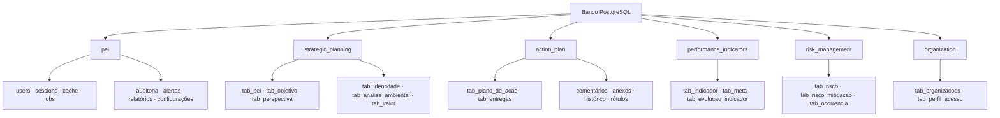

# Sistema de Planejamento Estratégico Integrado (PEI)

Plataforma web de gestão estratégica para **organizações públicas brasileiras**, construída sobre **Laravel 12 + Livewire 3**. Permite definir, executar e monitorar a estratégia institucional usando a metodologia **Balanced Scorecard (BSC)**, indicadores de desempenho (KPIs), planos de ação, entregas e gestão de riscos — alinhada ao **Guia Prático de Planejamento Estratégico Institucional (GPPEI / MGI 2025)** e à **Agenda 2030 / ODS**.

> **Referência metodológica:** `documentacao/pdf/Guia_PEI_VF.pdf`
> **Documento mestre do projeto:** `documentacao/documento-mestre-evolucao-sistema-pei.md`

---

## 📋 Sumário

- [O que o sistema entrega](#-o-que-o-sistema-entrega)
- [Stack tecnológica](#-stack-tecnológica)
- [Requisitos de instalação](#-requisitos-de-instalação)
- [Instalação passo a passo](#-instalação-passo-a-passo)
  - [Opção A — Servidor Linux / Apache](#opção-a--servidor-linux--apache)
  - [Opção B — php artisan serve (desenvolvimento rápido)](#opção-b--php-artisan-serve-desenvolvimento-rápido)
- [Configuração do ambiente (.env)](#-configuração-do-ambiente-env)
- [Primeiro acesso e passos iniciais](#-primeiro-acesso-e-passos-iniciais)
- [Arquitetura do sistema](#-arquitetura-do-sistema)
- [Desenvolvimento](#-desenvolvimento)
- [Testes e qualidade de código](#-testes-e-qualidade-de-código)
- [Solução de problemas frequentes](#-solução-de-problemas-frequentes)
- [Migração da versão anterior (v1 → v2)](#-migração-da-versão-anterior-v1--v2)
- [Documentação relacionada](#-documentação-relacionada)
- [Licença e créditos](#-licença-e-créditos)

---

## 🎯 O que o sistema entrega

O PEI cobre o **ciclo completo de planejamento estratégico institucional**, do diagnóstico à prestação de contas, com todos os módulos integrados entre si:

| Módulo | O que entrega |
|---|---|
| **Planejamento Estratégico (BSC)** | Ciclos PEI, Identidade (Missão / Visão / Valores), Perspectivas, Objetivos, Mapa Estratégico, Graus de Satisfação |
| **Análises de Ambiente** | SWOT e PESTEL com interface guiada |
| **Indicadores (KPIs)** | Indicadores com metas por ano, linha de base, evolução histórica, cálculo automático de farol (semáforo) e polaridade |
| **Planos de Ação** | Planos vinculados a objetivos estratégicos, tipos de execução, responsáveis e prazos |
| **Entregas (modelo Notion)** | Quadro Kanban, Lista, Timeline e Calendário; subtarefas hierárquicas, rótulos, comentários, anexos, histórico de alterações e múltiplos responsáveis |
| **Gestão de Riscos** | Matriz de risco 5 × 5, planos de mitigação e registro de ocorrências |
| **Agenda 2030 / ODS** | 17 Objetivos de Desenvolvimento Sustentável como eixo transversal, vínculo objetivo ↔ ODS e painel dedicado |
| **Relatórios e Dashboard** | Dashboard executivo com gráficos (Chart.js), geração de relatórios em PDF e exportações em Excel |
| **Organização** | Estrutura hierárquica de organizações com perfis de acesso granulares |
| **Auditoria** | Trilha de alterações completa (quem, o quê, quando) em todas as entidades de negócio |
| **Administração** | Configurações sistêmicas, alertas estratégicos e gestão de usuários |

### Fluxo metodológico guiado

O serviço `PeiGuidanceService` orienta o gestor em etapas sequenciais, garantindo que o ciclo PEI seja construído na ordem metodológica correta:

```
Ciclo PEI → Identidade (Missão/Visão/Valores) → Perspectivas BSC
  → Objetivos Estratégicos → Graus de Satisfação
  → Indicadores (KPIs) → Planos de Ação → Dashboard
```

---

## 🛠️ Stack tecnológica

| Camada | Tecnologia |
|---|---|
| **Backend** | PHP 8.2+ · Laravel 12 · Livewire 3 · Alpine.js 3 |
| **Frontend** | Bootstrap 5.3 + Bootstrap Icons · Vite 7 |
| **Banco de dados** | PostgreSQL 13+ (arquitetura multi-schema, 6 domínios) |
| **Autenticação** | Laravel Fortify + Jetstream + Sanctum |
| **Fila / Cache / Sessão** | Driver `database` (sem dependência de Redis ou Memcached) |
| **Testes** | Pest 4 |
| **Lint** | Laravel Pint (PSR-12) |
| **PDF** | `barryvdh/laravel-dompdf` |
| **Excel** | `maatwebsite/excel` |
| **Auditoria** | `owen-it/laravel-auditing` |
| **HTML helpers** | `spatie/laravel-html` |

---

## 📦 Requisitos de instalação

Antes de começar, certifique-se de que o ambiente possui:

| Requisito | Versão mínima | Observação |
|---|---|---|
| **PHP** | 8.2 | Extensões obrigatórias: `pgsql`, `pdo_pgsql`, `intl`, `mbstring`, `gd`, `zip`, `xml` |
| **Composer** | 2.x | Gerenciador de dependências PHP |
| **Node.js** | 20 LTS | Para compilar os assets (CSS/JS) com Vite |
| **npm** | 10+ | Incluído com o Node.js 20 LTS |
| **PostgreSQL** | 13+ | Mínimo absoluto: 9.4 (necessário `jsonb` e `gen_random_uuid`) |
| **Servidor web** | Apache 2.4+ / Nginx | Ou `php artisan serve` para desenvolvimento local |

### Verificando os requisitos

```bash
php -v                    # deve mostrar 8.2.x ou superior
php -m | grep pgsql       # deve listar pdo_pgsql e pgsql
composer --version        # deve mostrar 2.x
node --version            # deve mostrar v20.x ou superior
psql --version            # deve mostrar 13.x ou superior
```

> **Extensões PHP ausentes?** No Ubuntu/Debian: `sudo apt install php8.2-pgsql php8.2-intl php8.2-mbstring php8.2-gd php8.2-zip php8.2-xml`. No XAMPP para Windows, habilite as extensões no `php.ini` removendo o `;` antes de `extension=pgsql` e `extension=pdo_pgsql`.

---

## 🚀 Instalação passo a passo

### Preparação do banco de dados (comum a todas as opções)

O sistema usa **múltiplos schemas** dentro de um único banco PostgreSQL. O banco precisa existir antes do primeiro `migrate`, mas **todos os schemas são criados automaticamente** pelas migrations — você não precisa criá-los manualmente.

```sql
-- Execute no psql ou em qualquer cliente PostgreSQL (pgAdmin, DBeaver, etc.)
CREATE DATABASE pei_producao;   -- escolha o nome que preferir

-- Opcional: crie um usuário dedicado (recomendado para produção)
CREATE USER pei_user WITH PASSWORD 'senha_forte_aqui';
GRANT ALL PRIVILEGES ON DATABASE pei_producao TO pei_user;
```

> **Extensão pgcrypto:** se o PostgreSQL não tiver a extensão `pgcrypto` habilitada no banco, a primeira migration a ativará automaticamente. Se o usuário do banco não tiver permissão `SUPERUSER`, execute manualmente: `CREATE EXTENSION IF NOT EXISTS pgcrypto;`

---

### Opção A — Servidor Linux / Apache

**1. Clone o repositório:**

```bash
cd /var/www
git clone <url_do_repositorio> pei
cd pei
```

**2. Instale as dependências:**

```bash
composer install --no-dev --optimize-autoloader
npm install
npm run build
```

**3. Configure as permissões:**

```bash
chown -R www-data:www-data /var/www/pei
chmod -R 755 /var/www/pei
chmod -R 775 /var/www/pei/storage /var/www/pei/bootstrap/cache
```

**4. Configure o VirtualHost do Apache** (`/etc/apache2/sites-available/pei.conf`):

```apache
<VirtualHost *:80>
    ServerName pei.sua-organizacao.gov.br
    DocumentRoot /var/www/pei/public

    <Directory /var/www/pei/public>
        AllowOverride All
        Require all granted
    </Directory>

    ErrorLog ${APACHE_LOG_DIR}/pei_error.log
    CustomLog ${APACHE_LOG_DIR}/pei_access.log combined
</VirtualHost>
```

```bash
a2ensite pei.conf
a2enmod rewrite
systemctl reload apache2
```

**5. Configure o `.env`:**

```bash
cp .env.example .env
nano .env
```

```dotenv
APP_ENV=production
APP_DEBUG=false
APP_URL=https://pei.sua-organizacao.gov.br
SESSION_DOMAIN=pei.sua-organizacao.gov.br

DB_HOST=127.0.0.1
DB_PORT=5432
DB_DATABASE=pei_producao
DB_USERNAME=pei_user
DB_PASSWORD=senha_forte_aqui
```

**6. Finalize a instalação:**

```bash
php artisan key:generate
php artisan migrate --seed
php artisan storage:link
```

---

### Opção B — php artisan serve (desenvolvimento rápido)

Ideal para desenvolvimento local sem necessidade de configurar Apache ou Nginx.

```bash
git clone <url_do_repositorio> pei
cd pei

composer install
npm install

cp .env.example .env
```

Configure o `.env` com:

```dotenv
APP_URL=http://localhost:8000
SESSION_DOMAIN=localhost

DB_HOST=127.0.0.1
DB_PORT=5432
DB_DATABASE=pei_dev
DB_USERNAME=seu_usuario
DB_PASSWORD=sua_senha
```

```bash
php artisan key:generate
php artisan migrate --seed
php artisan storage:link
npm run build
php artisan serve
```

Acesse: `http://localhost:8000`

> Para desenvolvimento com hot-reload (Vite em modo dev), use `composer dev` em vez de `php artisan serve` + `npm run build`. Veja a seção [Desenvolvimento](#-desenvolvimento).

---

## ⚙️ Configuração do ambiente (.env)

As variáveis mais importantes e seus impactos:

### Aplicação

| Variável | Exemplo | Descrição |
|---|---|---|
| `APP_NAME` | `"Sistema PEI"` | Nome exibido no layout e nos e-mails |
| `APP_ENV` | `local` / `production` | Modo da aplicação. Em produção, sempre `production` |
| `APP_DEBUG` | `false` | Em produção, **sempre `false`** — evita expor stack traces |
| `APP_URL` | `https://pei.org.gov.br` | URL completa de acesso, incluindo subdiretório se houver |
| `APP_KEY` | gerada por `key:generate` | Nunca compartilhe ou versione esta chave |

### Banco de dados

| Variável | Exemplo | Descrição |
|---|---|---|
| `DB_CONNECTION` | `pgsql` | Não altere — o sistema é exclusivo para PostgreSQL |
| `DB_HOST` | `127.0.0.1` | Host do servidor PostgreSQL |
| `DB_PORT` | `5432` | Porta padrão do PostgreSQL |
| `DB_DATABASE` | `pei_producao` | Nome do banco criado na preparação |
| `DB_USERNAME` | `pei_user` | Usuário com acesso ao banco |
| `DB_PASSWORD` | `...` | Senha do usuário do banco |

### Sessão (crítico para o Livewire)

| Variável | Exemplo | Descrição |
|---|---|---|
| `SESSION_DRIVER` | `database` | Não altere — sessões ficam no banco |
| `SESSION_LIFETIME` | `120` | Minutos de inatividade antes de expirar a sessão |
| `SESSION_DOMAIN` | `pei.org.gov.br` | **Apenas o host**, sem protocolo, porta ou subdiretório. Se errado, o Livewire gera erros 419 |

> **Por que `SESSION_DOMAIN` é tão importante?** O Livewire faz requisições AJAX ao servidor. O cookie de sessão só é enviado nessas requisições se o domínio do cookie bater com o host da requisição. Um valor incorreto causa falhas silenciosas de autenticação ou erros 419 (CSRF token mismatch).

### E-mail

| Variável | Exemplo | Descrição |
|---|---|---|
| `MAIL_MAILER` | `smtp` | Driver de envio de e-mail |
| `MAIL_HOST` | `sandbox.smtp.mailtrap.io` | Para desenvolvimento, use [Mailtrap](https://mailtrap.io) |
| `MAIL_FROM_ADDRESS` | `noreply@org.gov.br` | Remetente dos e-mails do sistema |

> Para ambientes de desenvolvimento sem e-mail configurado, defina `MAIL_MAILER=log` — os e-mails serão gravados em `storage/logs/laravel.log` em vez de enviados.

---

## 🖥️ Primeiro acesso e passos iniciais

### Credenciais iniciais (criadas pelo seed)

Após `php artisan migrate --seed`, um Super Admin é criado automaticamente:

| Campo | Valor |
|---|---|
| **E-mail** | `user_adm@user_adm.com` |
| **Senha** | `1352@765@1452` |

> ⚠️ **Troque a senha imediatamente** após o primeiro acesso em qualquer ambiente que não seja sua máquina local de desenvolvimento. Acesse **Perfil → Alterar Senha**.

### O que fazer após o primeiro login

O sistema possui um **assistente de configuração guiado** (`PeiGuidanceService`) que orientará cada etapa. Mesmo assim, aqui está o roteiro recomendado:

1. **Trocar a senha padrão** — Menu de perfil no canto superior direito
2. **Configurar a organização** — `/organizacoes` — cadastre a unidade institucional antes de qualquer outro dado
3. **Iniciar o Ciclo PEI** — `/pei/ciclos` — defina o ciclo vigente (ex.: 2024–2027)
4. **Preencher a Identidade Estratégica** — `/pei` — Missão, Visão e Valores da organização
5. **Configurar as Perspectivas BSC** — `/pei/perspectivas` — as dimensões que estruturam os objetivos
6. **Cadastrar Objetivos Estratégicos** — `/objetivos` — vinculados às perspectivas
7. **Criar Indicadores** — `/indicadores` — com metas anuais para cada objetivo
8. **Criar Planos de Ação** — `/planos` — detalhando como os objetivos serão atingidos
9. **Acompanhar no Dashboard** — `/dashboard` — visão consolidada do ciclo

---

## 🏛️ Arquitetura do sistema

### Multi-schema PostgreSQL

O projeto adota **Domain-Driven Design (DDD)** tanto na estrutura de código quanto no banco. Em vez de um único schema `public`, os dados são segregados em **6 schemas PostgreSQL** por domínio de negócio:


```mermaid
graph TD
    DB[Banco PostgreSQL] --> PEI[pei]
    DB --> SP[strategic_planning]
    DB --> AP[action_plan]
    DB --> PI[performance_indicators]
    DB --> RM[risk_management]
    DB --> ORG[organization]

    PEI --> U1[users · sessions · cache · jobs]
    PEI --> U2[auditoria · alertas · relatórios · configurações]
    SP --> S1[tab_pei · tab_objetivo · tab_perspectiva]
    SP --> S2[tab_identidade · tab_analise_ambiental · tab_valor]
    AP --> A1[tab_plano_de_acao · tab_entregas]
    AP --> A2[comentários · anexos · histórico · rótulos]
    PI --> P1[tab_indicador · tab_meta · tab_evolucao_indicador]
    RM --> R1[tab_risco · tab_risco_mitigacao · tab_ocorrencia]
    ORG --> O1[tab_organizacoes · tab_perfil_acesso]
```

| Schema | Propósito |
|---|---|
| `pei` | Usuários, sessões, cache, filas, tokens de acesso, auditoria, relatórios, alertas estratégicos, configurações sistêmicas e status |
| `strategic_planning` | Ciclos PEI, perspectivas BSC, objetivos, identidade (missão/visão/valores), cadeia de valor e análise ambiental (SWOT/PESTEL) |
| `action_plan` | Planos de ação, entregas (Kanban/Lista/Timeline/Calendário), rótulos, comentários, histórico de alterações e anexos |
| `performance_indicators` | Indicadores/KPIs, metas por ano, linha de base e evolução histórica |
| `risk_management` | Riscos, planos de mitigação e ocorrências registradas |
| `organization` | Organizações hierárquicas e perfis de acesso granulares |

> ⚠️ **Importante para desenvolvedores:** todos os Models declaram `$table` com o prefixo de schema explícito (ex.: `'strategic_planning.tab_pei'`). **Nunca assuma que uma tabela está em `public`** — esse schema não é utilizado pelo sistema.

### Estrutura de pastas

```text
app/
├── Livewire/                   # Componentes Livewire por domínio
│   ├── StrategicPlanning/      # PEI, Identidade, Perspectivas, Objetivos, Mapa, SWOT, PESTEL
│   ├── ActionPlan/             # Planos de Ação
│   ├── Deliverables/           # Entregas (Kanban / Lista / Timeline / Calendário)
│   ├── PerformanceIndicators/  # Indicadores e Evolução
│   ├── RiskManagement/         # Riscos e Mitigações
│   ├── Organization/           # Organizações e Perfis
│   ├── Reports/                # Relatórios
│   ├── Audit/                  # Auditoria
│   ├── Admin/                  # Configurações do sistema
│   └── Dashboard/              # Dashboard executivo
├── Models/                     # Eloquent com schema qualificado explícito
├── Services/                   # PeiGuidanceService · IndicadorCalculoService · ReportGenerationService
├── Policies/                   # OrganizacaoPolicy · PlanoDeAcaoPolicy · IndicadorPolicy · RiscoPolicy
└── Observers/                  # EntregaObserver (recálculo automático de indicadores)

resources/views/livewire/       # Views Blade organizadas por domínio
database/
├── migrations/                 # Organizadas em subpastas por domínio
└── seeders/                    # OdsSeeder · BaseStrategicSeeder · PEIDataSeeder
```

### Stack de middleware (rotas protegidas)

```
auth:sanctum → jetstream.auth_session → verified → CheckPasswordChange
```

O middleware `CheckPasswordChange` redireciona o usuário para a troca de senha obrigatória quando o campo `trocarsenha = true` está ativado no perfil.

### Rotas principais

| URL | Componente | Descrição |
|---|---|---|
| `/` | `LandingPage` | Página inicial / Mapa Estratégico |
| `/dashboard` | `Dashboard\Index` | Dashboard executivo |
| `/pei` | `MissaoVisao` | Identidade estratégica |
| `/pei/ciclos` | `ListarPeis` | Ciclos PEI |
| `/pei/mapa` | `MapaEstrategico` | Mapa estratégico visual |
| `/pei/perspectivas` | `ListarPerspectivas` | Perspectivas BSC |
| `/pei/swot` | `AnaliseSWOT` | Análise SWOT |
| `/pei/pestel` | `AnalisePESTEL` | Análise PESTEL |
| `/objetivos` | `ListarObjetivos` | Objetivos estratégicos |
| `/indicadores` | `ListarIndicadores` | Indicadores / KPIs |
| `/planos` | `ListarPlanos` | Planos de Ação |
| `/riscos` | `GestaoRiscos` | Gestão de Riscos |
| `/agenda2030` | `Agenda2030` | Painel ODS |
| `/relatorios` | `ListarRelatorios` | Relatórios |
| `/auditoria` | `ListarLogs` | Trilha de auditoria |
| `/organizacoes` | `ListarOrganizacoes` | Organizações |
| `/configuracoes` | `ConfiguracaoSistema` | Configurações do sistema |

---

## 💻 Desenvolvimento

### Iniciar o ambiente de desenvolvimento completo

```bash
composer dev
```

Este comando inicia em paralelo:
- **Laravel server** (`php artisan serve`) na porta 8000
- **Queue worker** (`php artisan queue:listen`) para processamento de filas
- **Vite dev server** com hot-reload de CSS e JS

### Comandos essenciais

```bash
# Servidor e build
composer dev                             # Ambiente de dev completo (server + queue + Vite)
npm run build                            # Compilar assets para produção

# Banco de dados
php artisan migrate                      # Executar novas migrations
php artisan migrate --path=database/migrations/Dominio/arquivo.php  # Migration específica
php artisan db:seed --class=NomeDoSeeder # Seeder específico (nunca rode seeders globais em produção)

# Cache e otimização
php artisan optimize:clear               # Limpar todos os caches (obrigatório após alterações de config)
php artisan route:list                   # Inspecionar rotas registradas

# Qualidade
vendor/bin/pint --dirty                  # Lint apenas dos arquivos modificados
php -l app/Livewire/MeuComponente.php    # Validar sintaxe de um arquivo PHP

# Testes
php artisan test                         # Suíte completa (Pest)
php artisan test --filter=NomeTeste      # Teste filtrado por nome
```

> ⚠️ **XAMPP com OPcache (Apache):** **nunca** rode `php artisan config:cache` ou `php artisan optimize` nesse ambiente. Esses comandos podem deixar a aplicação servindo uma configuração sem `APP_KEY`, causando erro 500 global. Se isso ocorrer, reinicie o Apache para limpar o OPcache.

### Convenções de código

- **Idioma**: variáveis, comentários e mensagens de usuário em **Português do Brasil**
- **Componentes Livewire**: PHP em `app/Livewire/<Domínio>/`, view em `resources/views/livewire/`, nome kebab-case no Blade
- **Models**: sempre declarar `$table` com prefixo de schema (`strategic_planning.tab_pei`)
- **Chaves primárias**: UUID com `gen_random_uuid()` como default, `$incrementing = false`, `$keyType = 'string'`
- **Soft delete**: usar `deleted_at` nas tabelas de negócio
- **UI**: Bootstrap 5 + Bootstrap Icons, seguindo o padrão visual do sistema (tema claro + dark mode)
- **Commits**: PT-BR, com prefixo `feat | fix | refactor | chore | docs`
- **Migrations**: sempre novas — **jamais** altere uma migration já aplicada em banco compartilhado

### Protocolo de edição de código

1. Ler o arquivo-alvo do disco antes de qualquer edição
2. Confirmar dependências reais: rotas, componentes Livewire referenciados, includes Blade, Models
3. Após alterar qualquer arquivo PHP, validar sintaxe: `php -l caminho/do/arquivo.php`
4. Rodar o lint no que mudou: `vendor/bin/pint --dirty`

---

## 🧪 Testes e qualidade de código

```bash
# Executar toda a suíte de testes
php artisan test

# Executar apenas um teste específico
php artisan test --filter=NomeTeste

# Alternativa via Pest diretamente
vendor/bin/pest

# Verificar e corrigir estilo de código (PSR-12)
vendor/bin/pint

# Apenas arquivos modificados (mais rápido durante o desenvolvimento)
vendor/bin/pint --dirty
```

---

## 🔧 Solução de problemas frequentes

### Erro 419 — CSRF token mismatch

**Causa:** `SESSION_DOMAIN` incorreto no `.env`.
**Solução:** Confirme que `SESSION_DOMAIN` contém **apenas o host**, sem protocolo (`http://`), porta (`:8000`) ou caminho (`/fs-v1/public`). Exemplo correto: `SESSION_DOMAIN=localhost`.

### Livewire não funciona (requisições AJAX falhando)

**Causa:** `APP_URL` não corresponde ao endereço pelo qual o navegador acessa o sistema.
**Solução:** Certifique-se de que `APP_URL` está exatamente igual à URL que aparece na barra de endereços, incluindo subdiretório. Exemplo: `APP_URL=http://192.168.1.10/fs-v1/public`.
Após corrigir o `.env`, execute: `php artisan optimize:clear`.

### Ícones Bootstrap Icons não aparecem (404 nas fontes)

**Causa:** A variável `base` no `vite.config.js` não corresponde ao caminho de deploy.
**Solução:** Verifique se `base` está configurada com o caminho correto para o ambiente (ex.: `base: '/fs-v1/public/build/'` para XAMPP com subdiretório). Execute `npm run build` após qualquer alteração no `vite.config.js`.

### Erro 500 — MissingAppKey

**Causa:** No XAMPP, o OPcache do Apache pode servir um `.env` ou config em cache sem `APP_KEY`.
**Solução:** Reinicie o Apache no painel do XAMPP. **Nunca** use `php artisan config:cache` ou `optimize` em ambientes XAMPP.

### Caractere estranho () no início das respostas JSON

**Causa:** Um arquivo PHP (normalmente em `config/`) foi salvo com BOM UTF-8.
**Solução:** Abra o arquivo no editor e salve-o sem BOM. Em VSCode: canto inferior direito → `UTF-8` → "Save with Encoding" → `UTF-8` (sem BOM). Após corrigir, execute `php artisan optimize:clear`.

### Migrations falham com erro de schema

**Causa:** O banco PostgreSQL não existe ou o usuário não tem permissões suficientes.
**Solução:** Verifique que o banco foi criado conforme a seção de [Preparação do banco](#preparação-do-banco-de-dados-comum-a-todas-as-opções) e que as credenciais no `.env` estão corretas.

### `pg_dump` / `psql` não encontrado no Windows

**Causa:** O PostgreSQL não está no `PATH` do sistema.
**Solução:** Adicione ao `PATH`: `C:\Program Files\PostgreSQL\<versao>\bin`. Ou use o caminho completo: `"C:\Program Files\PostgreSQL\16\bin\pg_dump.exe"`.

---

## 🔄 Migração da versão anterior (v1 → v2)

> **Esta seção é exclusiva para organizações que já utilizavam a versão anterior** do sistema ([`marcioaxn/planejamento-estrategico`](https://github.com/marcioaxn/planejamento-estrategico), construído em Laravel 8 com dados no schema `pei`). Se você está instalando pela primeira vez, pode ignorar esta seção.

**Você não precisa redigitar nenhum dado.** A migração é feita por um **único comando Artisan**, que opera **no mesmo banco PostgreSQL**, preservando todos os identificadores (UUIDs) originais — vínculos entre registros continuam válidos.

### Como funciona

O comando executa fases auditáveis e **reversíveis até a etapa final**:

| Fase | Ação | Reversível? |
|---|---|---|
| 0 — Pré-checagem | Verifica versão do PostgreSQL (≥ 9.4), solicita confirmação de backup e inspeciona o estado do banco | — |
| 1 — Quarentena | Renomeia `pei` → `legacy_pei` (preserva 100% do legado sob outro nome) | ✅ |
| 2 — Construção | Cria os 6 schemas e tabelas da v2 via `php artisan migrate` | ✅ |
| 3 — Transferência | Copia os dados de `legacy_pei` → v2, **preservando UUIDs** | ✅ (legado intacto) |
| 4 — Validação | Compara contagens de registros origem × destino | — |
| 5 — Descarte | Remove o schema legado **somente sob confirmação explícita** | ⚠️ irreversível |

### Execução

```bash
# 1. OBRIGATÓRIO — backup completo antes de qualquer coisa
pg_dump -U <usuario> -F c -b -f backup_antes_migracao.dump <banco>

# 2. Simulação — não grava nada, apenas mostra o relatório de contagens
php artisan migracao:v1-para-v2 --dry-run

# 3. Execução real
php artisan migracao:v1-para-v2

# 4. Após validar que tudo está correto, descarte o legado (opcional e irreversível)
php artisan migracao:v1-para-v2 --descartar-legado
```

> O comando é um **assistente interativo**: exibe pré-visualização dos volumes antes de gravar e faz apenas perguntas de seleção — nunca campos de texto livre. Use `--force` para execução não-interativa (automação/CI). Flags adicionais: `--migrar-auditoria`, `--status-entrega-padrao="..."`.

### O que muda e o que não migra

| Item | Comportamento |
|---|---|
| **UUIDs** | Preservados 1:1 — todas as FKs continuam válidas |
| **Senhas** | Hashes bcrypt migrados como estão — compatíveis com a v2 |
| **Entregas** | Campos sem equivalente direto na v2 são preservados em `json_propriedades` — nada se perde |
| **Auditoria** | Não é migrada por decisão de projeto — permanece disponível no backup |
| **Módulos novos da v2** | Riscos, Temas Norteadores, Agenda 2030 — nascem vazios, pois não existiam na v1 |

📖 **Documentação de apoio:**
- **Runbook do executor** (passo a passo para analistas de infraestrutura): [runbook-migracao-v1-para-v2.md](documentacao/runbook-migracao-v1-para-v2.md)
- **Mapa De→Para campo a campo**: [migracao-legado-v1-para-v2-mapa-de-para.md](documentacao/migracao-legado-v1-para-v2-mapa-de-para.md)

---

## 📚 Documentação relacionada

| Documento | Localização |
|---|---|
| Documento mestre e roadmap do sistema | [documento-mestre-evolucao-sistema-pei.md](documentacao/documento-mestre-evolucao-sistema-pei.md) |
| Documentação técnica completa (v2) | [documentacao-tecnica-planejamento-estrategico-v2.md](documentacao/documentacao-tecnica-planejamento-estrategico-v2.md) |
| Manual operacional do administrador | [manual-operacional-planejamento-estrategico-v1.md](documentacao/manual-operacional-planejamento-estrategico-v1.md) |
| Dicionário de dados PostgreSQL | [dicionario-dados-postgresql-planejamento-estrategico.md](documentacao/dicionario-dados-postgresql-planejamento-estrategico.md) |
| Agenda 2030 / ODS — integração | [agenda_2030_ods_agregado_ao_planejamento_estrategico.md](documentacao/agenda_2030_ods_agregado_ao_planejamento_estrategico.md) |
| Guia de transição completa v1 → v2 | [guia-transicao-completa-v1-para-v2.md](documentacao/guia-transicao-completa-v1-para-v2.md) |
| Guia GPPEI — MGI 2025 (PDF) | [Guia_PEI_VF.pdf](documentacao/pdf/Guia_PEI_VF.pdf) |
| Guia de Projetos — MGI (PDF) | [guia-pratico-de-projetos.pdf](documentacao/pdf/guia-pratico-de-projetos.pdf) |

---

## 📜 Licença e créditos

Software proprietário, desenvolvido e customizado para atender às necessidades específicas de gestão estratégica de organizações públicas brasileiras. O starter kit de base é open-source sob licença MIT.

- **Projeto base:** [Starter Kit Laravel Jetstream Livewire Bootstrap](https://github.com/marcioaxn/starter-kit-laravel-jetstream-livewire-bootstrap)
- **Autor:** Marcio Alessandro Xavier Neto
- **Referência metodológica:** Guia Prático de Planejamento Estratégico Institucional — GPPEI / Ministério da Gestão e da Inovação em Serviços Públicos (MGI), 2025
