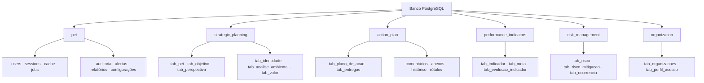

# Sistema de Planejamento Estratégico Integrado (PEI)

Plataforma web de gestão estratégica para **organizações públicas brasileiras**, construída sobre **Laravel 12 + Livewire 4**. Permite definir, executar e monitorar a estratégia institucional usando a metodologia **Balanced Scorecard (BSC)**, indicadores de desempenho (KPIs), planos de ação, entregas e gestão de riscos — alinhada ao **Guia Prático de Planejamento Estratégico Institucional (GPPEI / MGI 2025)** e à **Agenda 2030 / ODS**.

> **Referência metodológica:** `documentacao/pdf/Guia_PEI_VF.pdf`
> **Documento mestre do projeto (GPPEI, gap analysis, roadmap):** `artefatos/README.md`
> **Regras de código para quem contribui:** [`CONTRIBUTING.md`](CONTRIBUTING.md)
> **Manual do usuário:** [`documentacao/manual/MANUAL-DE-USO.md`](documentacao/manual/MANUAL-DE-USO.md) (também em PDF na mesma pasta)

---

## 📋 Sumário

- [O que o sistema entrega](#-o-que-o-sistema-entrega)
- [Agente de Inteligência Artificial](#-agente-de-inteligência-artificial)
- [Stack tecnológica](#-stack-tecnológica)
- [Requisitos de instalação](#-requisitos-de-instalação)
- [Instalação passo a passo](#-instalação-passo-a-passo)
  - [Opção A — Servidor Linux / Apache](#opção-a--servidor-linux--apache)
  - [Opção B — php artisan serve (desenvolvimento rápido)](#opção-b--php-artisan-serve-desenvolvimento-rápido)
  - [Atualizando uma instalação existente (deploy)](#atualizando-uma-instalação-existente-deploy)
  - [Versão em execução e data do último deploy](#versão-em-execução-e-data-do-último-deploy)
- [Configuração do ambiente (.env)](#-configuração-do-ambiente-env)
- [Seeders: o acesso inicial](#-seeders-o-acesso-inicial)
- [Primeiro acesso e passos iniciais](#-primeiro-acesso-e-passos-iniciais)
- [Filas e relatórios agendados](#-filas-e-relatórios-agendados)
- [Arquitetura do sistema](#-arquitetura-do-sistema)
- [Segurança e Controle de Acesso (RBAC + ABAC)](#-segurança-e-controle-de-acesso-rbac--abac)
- [Desenvolvimento](#-desenvolvimento)
- [Testes e qualidade de código](#-testes-e-qualidade-de-código)
- [Solução de problemas frequentes](#-solução-de-problemas-frequentes)
- [Migração da versão anterior (v1 → v2)](#-migração-da-versão-anterior-v1--v2)
- [Documentação relacionada](#-documentação-relacionada)
- [Licença e créditos](#-licença-e-créditos)

---

## 🎯 O que o sistema entrega

O PEI cobre o **ciclo completo de planejamento estratégico institucional**, do diagnóstico à prestação de contas, com todos os módulos integrados entre si:

| Módulo | O que entrega |
|---|---|
| **Inaugurar e Integrar (GPPEI)** | Abertura do ciclo, instâncias de governança e integração com os instrumentos de planejamento (`/pei/inaugurar`) |
| **Planejamento Estratégico (BSC)** | Ciclos PEI (com **"Salvar como"**: copia um ciclo inteiro para um novo, inclusive no mesmo período, com outra descrição), Identidade (Missão / Visão / Valores), Temas Norteadores, Perspectivas, Objetivos, Futuro Almejado, Mapa Estratégico, Cadeia de Valor e Graus de Satisfação |
| **Análises de Ambiente** | SWOT e PESTEL com interface guiada |
| **Indicadores (KPIs)** | Indicadores com metas por ano, linha de base, evolução histórica, cálculo automático de farol (semáforo) e polaridade |
| **Planos de Ação (Iniciativas)** | Planos vinculados a objetivos estratégicos, tipos de execução, responsáveis, prazos e lições aprendidas |
| **Entregas (modelo Notion)** | Quadro Kanban, Lista, Timeline e Calendário; subtarefas hierárquicas, rótulos, comentários, anexos, histórico de alterações e múltiplos responsáveis; painel "Minhas Entregas" |
| **Gestão de Riscos** | Matriz de risco 5 × 5, planos de mitigação e registro de ocorrências |
| **Monitorar e Avaliar** | Relatório de Avaliação da Estratégia (RAE) e lições aprendidas |
| **Agenda 2030 / ODS** | Os 17 Objetivos de Desenvolvimento Sustentável da ONU **mais o ODS 18 (Igualdade Étnico-Racial) adotado pelo Brasil**, como eixo transversal **opcional**: vínculo objetivo ↔ ODS e painel dedicado |
| **Relatórios e Dashboard** | Dashboard executivo com gráficos (Chart.js); relatórios em PDF (Executivo, Integrado, Identidade, Objetivos, Indicadores, Planos, Riscos, Comunicação, Relatório de Gestão), exportações em Excel e Relatório de Gestão também em Word; agendamento automático |
| **Documentos** | Acervo de documentos em PDF (nome, tipo, ano, origem, ciclo PEI e área), com arquivo em disco privado e download controlado por permissão (`/acervo-documentos`) |
| **Transparência pública** | Mapa Estratégico, Objetivos, Indicadores e Planos consultáveis **sem login**, somente leitura |
| **Organização** | Estrutura hierárquica de organizações com perfis de acesso por unidade |
| **Auditoria** | Trilha de alterações completa (quem, o quê, quando) em todas as entidades de negócio |
| **Administração** | Configurações sistêmicas, agente de IA, gestão de usuários e perfis, impersonação controlada |

Toda tela de trabalho traz uma **seção educativa** recolhível ("O que é esta tela?"), escrita para ser entendida por quem nunca fez planejamento estratégico: por que a etapa existe, os passos, um exemplo e a referência ao GPPEI. E o **rodapé de todas as telas — com ou sem login — mostra a versão, o commit e a data do último deploy** (ver [Versão em execução](#versão-em-execução-e-data-do-último-deploy)).

### Fluxo metodológico guiado

O menu segue as três fases do GPPEI — **Inaugurar e Integrar → Planejar → Monitorar e Avaliar** — e o serviço `PeiGuidanceService` orienta o gestor em etapas sequenciais, garantindo que o ciclo PEI seja construído na ordem metodológica correta:

```
Ciclo PEI → Inaugurar e Integrar → Identidade (Missão/Visão/Valores)
  → Análises (SWOT/PESTEL, Cadeia de Valor) → Perspectivas BSC
  → Objetivos Estratégicos → Graus de Satisfação
  → Indicadores (KPIs) → Planos de Ação e Entregas
  → Monitoramento (Dashboard, Riscos, RAE, Relatórios)
```

---

## 🤖 Agente de Inteligência Artificial

O sistema possui um **Agente de IA integrado e totalmente opcional**. Quando configurado, o agente atua como assistente estratégico em tempo real em diversos módulos — sugerindo conteúdo, auditando qualidade e gerando análises preditivas alinhadas à metodologia do GPPEI/MGI 2025. **Sem configuração, todos os módulos funcionam normalmente** — os botões de IA ficam ocultos ou são silenciosamente ignorados.

### Comportamento sem o Agente configurado

O sistema é **resiliente por padrão**: a classe `AiServiceFactory` retorna `null` quando nenhuma credencial está configurada, e todos os componentes que usam IA verificam esse retorno antes de acionar qualquer chamada. Nenhum processo de negócio depende do agente para ser concluído.

### Onde o Agente de IA atua

| Módulo | Tela / Rota | Função da IA | Método |
|---|---|---|---|
| **Organizações** | `/organizacoes` | Sugere sigla e subunidades para uma nova organização com base no nome informado | `suggest()` |
| **Identidade Estratégica** | `/pei` | Sugere Missão, Visão e 5 Valores completos (formato JSON estruturado) | `suggest()` |
| **Perspectivas BSC** | `/pei/perspectivas` | Sugere as 4 perspectivas BSC na ordem metodológica DOWN-TOP, baseadas na Missão e Visão | `suggest()` |
| **Temas Norteadores** | (modal de criação) | Sugere 3 Temas Norteadores de alto nível para a organização | `suggest()` |
| **Objetivos Estratégicos** | `/objetivos` | (1) Audita a qualidade SMART do objetivo sendo redigido; (2) sugere 3 objetivos para a perspectiva selecionada | `analyzeSmart()` / `suggest()` |
| **Graus de Satisfação** | `/graus-satisfacao` | Sugere uma escala de 4–5 níveis (Crítico → Excelente) com cores e faixas percentuais | `suggest()` |
| **Análise SWOT** | `/pei/swot` | Sugere Forças, Fraquezas, Oportunidades e Ameaças (3 itens cada) no formato JSON | `suggest()` |
| **Análise PESTEL** | `/pei/pestel` | Sugere 2 fatores para cada uma das 6 dimensões PESTEL (JSON estruturado) | `suggest()` |
| **Gestão de Riscos** | `/riscos` | Sugere 3 riscos potenciais com título, categoria, descrição e medida de mitigação, baseados nos objetivos da organização | `suggest()` |
| **Planos de Ação** | `/planos` | Sugere nomes e justificativas de planos alinhados ao objetivo estratégico selecionado | `suggest()` |
| **Dashboard Executivo** | `/dashboard` | Gera um resumo estratégico executivo com análise dos KPIs da organização | `summarizeStrategy()` |
| **Relatórios** | `/relatorios` | Gera um "AI Minute" — resumo executivo em Markdown com pontos de atenção e sugestões | `suggest()` |
| **Geração de PDF** | (serviço interno) | Incorpora resumo estratégico e análise preditiva de tendências de indicadores no PDF gerado | `summarizeStrategy()` / `analyzeTrends()` |

### Provedores suportados

| Provedor | Autenticação | Dados para treino | Indicado para |
|---|---|---|---|
| **Google AI Studio (Gemini)** | API Key | Sim (plano gratuito) | Prototipagem e desenvolvimento |
| **Google Vertex AI** | Project ID + Service Account JSON | Não (enterprise) | Produção em ambientes GCP |

São os dois provedores oferecidos na tela de Configurações. Existe também uma classe `OpenAiProvider` em `app/Services/AI/`, mas ela **não está ligada** à `AiServiceFactory` nem à tela — não é uma opção disponível ao administrador.

### Arquitetura da integração

```
AiServiceFactory::make()
    ├── ai_provider = 'gemini-studio' → GeminiProvider    (API Key obrigatória)
    ├── ai_provider = 'vertex-ai'     → VertexAiProvider  (Project ID + SA JSON obrigatórios)
    └── credenciais ausentes          → null              (sistema opera sem IA)

Todos os Livewire components:
    $aiService = AiServiceFactory::make();
    if (!$aiService) return;   ← guard universal: sem credenciais, sem chamada
```

### Como configurar

1. Acesse **Configurações** (`/configuracoes`) — disponível apenas para Super Administradores
2. Escolha o **Provedor** (Google AI Studio ou Vertex AI)
3. Informe as credenciais correspondentes
4. Clique em **"Testar Comunicação agora"** para validar antes de salvar
5. Clique em **"Salvar e Ativar Agente"**

As credenciais são armazenadas com **criptografia em repouso** (`Crypt::encryptString`) na tabela `pei.system_settings`.

---

## 🛠️ Stack tecnológica

| Camada | Tecnologia |
|---|---|
| **Backend** | PHP 8.2+ · Laravel 12 · Livewire 4.4 · Alpine.js 3 (embutido no Livewire 4, com os plugins `mask` e `focus`) |
| **Frontend** | Bootstrap 5.3 + Bootstrap Icons · Sass · Vite 7 · Chart.js · Livewire Blaze (sem Tailwind) |
| **Banco de dados** | PostgreSQL (arquitetura multi-schema, 6 domínios; compatível com versões antigas — ver requisitos) |
| **Autenticação** | Laravel Fortify (com 2FA) + Jetstream + Sanctum |
| **Fila / Cache / Sessão** | Driver `database` (sem dependência de Redis ou Memcached) |
| **Testes** | Pest 4 sobre PHPUnit 12 |
| **Lint** | Laravel Pint (preset Laravel) |
| **PDF** | `barryvdh/laravel-dompdf` |
| **Word** | `phpoffice/phpword` (Relatório de Gestão em .docx) |
| **Excel** | `maatwebsite/excel` |
| **Auditoria** | `owen-it/laravel-auditing` |
| **HTML helpers** | `spatie/laravel-html` |
| **Otimização de views** | `livewire/blaze` |

---

## 📦 Requisitos de instalação

Antes de começar, certifique-se de que o ambiente possui:

| Requisito | Versão mínima | Observação |
|---|---|---|
| **PHP** | 8.2 | Extensões obrigatórias: `pgsql`, `pdo_pgsql`, `intl`, `mbstring`, `gd`, `zip`, `xml` |
| **Composer** | 2.x | Gerenciador de dependências PHP |
| **Node.js** | 20 LTS | Para compilar os assets (CSS/JS) com Vite |
| **npm** | 10+ | Incluído com o Node.js 20 LTS |
| **PostgreSQL** | 9.4 | Recomendado 13+. O mínimo é 9.4 por causa de `gen_random_uuid()` (extensão `pgcrypto`); o código evita recursos mais novos (`ON CONFLICT`, `jsonb`, `FILTER`) para rodar em servidores antigos |
| **Servidor web** | Apache 2.4+ / Nginx | Ou `php artisan serve` para desenvolvimento local |
| **Git** | 2.x | O deploy é feito por `git pull`, e o rodapé lê a versão da pasta `.git` |

> **Limite de upload (menu Documentos):** o acervo aceita PDF de até 20 MB. No `php.ini` do servidor web: `upload_max_filesize = 20M` e `post_max_size = 25M`; com nginx na frente, `client_max_body_size 25m`.

### Verificando os requisitos

```bash
php -v                    # deve mostrar 8.2.x ou superior
php -m | grep pgsql       # deve listar pdo_pgsql e pgsql
composer --version        # deve mostrar 2.x
node --version            # deve mostrar v20.x ou superior
psql --version            # 9.4 ou superior (recomendado 13.x+)
```

> **Extensões PHP ausentes?** No Ubuntu/Debian: `sudo apt install php8.2-pgsql php8.2-intl php8.2-mbstring php8.2-gd php8.2-zip php8.2-xml`. No XAMPP para Windows, habilite as extensões no `php.ini` removendo o `;` antes de `extension=pgsql` e `extension=pdo_pgsql`.

---

## 🚀 Instalação passo a passo

### Preparação do banco de dados (comum a todas as opções)

O sistema usa **múltiplos schemas** dentro de um único banco PostgreSQL. O banco precisa existir antes do primeiro `migrate`, mas **todos os schemas são criados automaticamente** pelas migrations — você não precisa criá-los manualmente.

```sql
-- Execute no psql ou em qualquer cliente PostgreSQL (pgAdmin, DBeaver, etc.)
CREATE DATABASE pei_producao;   -- escolha o nome que preferir

-- Opcional: crie um usuário dedicado (recomendado para produção)
CREATE USER pei_user WITH PASSWORD 'senha_forte_aqui';
GRANT ALL PRIVILEGES ON DATABASE pei_producao TO pei_user;
```

> **Extensão pgcrypto:** se o PostgreSQL não tiver a extensão `pgcrypto` habilitada no banco, a primeira migration a ativará automaticamente. Se o usuário do banco não tiver permissão `SUPERUSER`, execute manualmente: `CREATE EXTENSION IF NOT EXISTS pgcrypto;`

---

### Opção A — Servidor Linux / Apache

**1. Clone o repositório:**

```bash
cd /var/www
git clone https://github.com/marcioaxn/full-strategic-planning.git pei
cd pei
```

> Mantenha a instalação como um clone do git: as atualizações chegam por `git pull`, e o rodapé do sistema lê da pasta `.git` a versão e a data do último deploy.

**2. Instale as dependências:**

```bash
composer install --no-dev --optimize-autoloader --no-interaction
npm ci
npm run build
```

**3. Configure as permissões:**

```bash
chown -R www-data:www-data /var/www/pei
chmod -R 755 /var/www/pei
chmod -R 775 /var/www/pei/storage /var/www/pei/bootstrap/cache
```

**4. Configure o VirtualHost do Apache** (`/etc/apache2/sites-available/pei.conf`):

```apache
<VirtualHost *:80>
    ServerName pei.sua-organizacao.gov.br
    DocumentRoot /var/www/pei/public

    <Directory /var/www/pei/public>
        AllowOverride All
        Require all granted
    </Directory>

    ErrorLog ${APACHE_LOG_DIR}/pei_error.log
    CustomLog ${APACHE_LOG_DIR}/pei_access.log combined
</VirtualHost>
```

```bash
a2ensite pei.conf
a2enmod rewrite
systemctl reload apache2
```

**5. Configure o `.env`:**

```bash
cp .env.example .env
nano .env
```

```dotenv
APP_ENV=production
APP_DEBUG=false
APP_URL=https://pei.sua-organizacao.gov.br
SESSION_DOMAIN=pei.sua-organizacao.gov.br

DB_HOST=127.0.0.1
DB_PORT=5432
DB_DATABASE=pei_producao
DB_USERNAME=pei_user
DB_PASSWORD=senha_forte_aqui
```

**6. Finalize a instalação:**

```bash
php artisan key:generate
php artisan migrate --force
php artisan db:seed --force
php artisan storage:link
```

> O `--force` é obrigatório com `APP_ENV=production`: sem ele o comando pede confirmação e, sem terminal interativo, é cancelado. O `db:seed` **não apaga dados** — só cria o acesso inicial e os cadastros básicos, e pode ser repetido (ver [Seeders: o acesso inicial](#-seeders-o-acesso-inicial)). As migrations ficam em subpastas por domínio, todas registradas no `AppServiceProvider`: o `migrate` encontra todas sozinho.

**7. Configure o worker da fila e o cron do agendador** — ver [Filas e relatórios agendados](#-filas-e-relatórios-agendados).

---

### Opção B — php artisan serve (desenvolvimento rápido)

Ideal para desenvolvimento local sem necessidade de configurar Apache ou Nginx.

```bash
git clone https://github.com/marcioaxn/full-strategic-planning.git pei
cd pei

composer install
npm ci

cp .env.example .env
```

Configure o `.env` com:

```dotenv
APP_URL=http://localhost:8000
SESSION_DOMAIN=localhost

DB_HOST=127.0.0.1
DB_PORT=5432
DB_DATABASE=pei_dev
DB_USERNAME=seu_usuario
DB_PASSWORD=sua_senha
```

```bash
php artisan key:generate
php artisan migrate
php artisan db:seed
php artisan storage:link
npm run build
php artisan serve
```

Acesse: `http://localhost:8000`

> Para desenvolvimento com hot-reload (Vite em modo dev), use `composer dev` em vez de `php artisan serve` + `npm run build`. Veja a seção [Desenvolvimento](#-desenvolvimento).

---

### Atualizando uma instalação existente (deploy)

Na pasta do projeto, nesta ordem:

```bash
php artisan down
git pull origin main
composer install --no-dev --optimize-autoloader --no-interaction
npm ci
npm run build
php artisan migrate --force
php artisan db:seed --class=PerfilAcessoSeeder --force
php artisan db:seed --class=TipoExecucaoSeeder --force
php artisan storage:link
php artisan optimize:clear
php artisan queue:restart
php artisan up
```

- Os seeders e o `storage:link` são idempotentes: podem ser repetidos sem duplicar nem apagar nada.
- `queue:restart` faz o worker da fila (Supervisor/systemd) recarregar o código novo.
- Conferência: `php artisan migrate:status` não deve listar nenhuma migration como `Pending`.
- Cada entrega gera um **chamado de implantação** em Word a partir de `documentacao/chamados/gerador/` — é ele que a equipe de infraestrutura executa, com os passos específicos daquela versão.

---

### Versão em execução e data do último deploy

O rodapé de **todas as telas — inclusive a de login e as páginas públicas** — mostra:

```
v2.0.0 · 4468184 · último deploy 03/10/2026 17:25
```

| Parte | De onde vem |
|---|---|
| `v2.0.0` | `config/versao.php` (pode ser trocado por `APP_VERSAO` no `.env`) |
| `4468184` | O commit em execução, lido de `.git/HEAD` (ou `packed-refs`) |
| `último deploy …` | O momento em que o `git pull` moveu o código, lido da última linha de `.git/logs/HEAD` |

Tudo é lido por **leitura de arquivo** em `App\Support\VersaoAplicacao` — nenhum processo `git` roda por requisição e nenhum passo extra entra no deploy. Para conferir: o código do rodapé deve ser o mesmo de `git log -1 --format=%h` no servidor. Se o rodapé disser **"deploy não identificado"**, a pasta `.git` não existe no servidor ou o usuário do servidor web não tem permissão de leitura nela.

---

## ⚙️ Configuração do ambiente (.env)

As variáveis mais importantes e seus impactos:

### Aplicação

| Variável | Exemplo | Descrição |
|---|---|---|
| `APP_NAME` | `"Sistema PEI"` | Nome exibido no layout e nos e-mails |
| `APP_ENV` | `local` / `production` | Modo da aplicação. Em produção, sempre `production` |
| `APP_DEBUG` | `false` | Em produção, **sempre `false`** — evita expor stack traces |
| `APP_URL` | `https://pei.org.gov.br` | URL completa de acesso, incluindo subdiretório se houver |
| `APP_KEY` | gerada por `key:generate` | Nunca compartilhe ou versione esta chave |
| `APP_VERSAO` | `2.0.0` | Opcional. Número exibido no rodapé; sem ele vale o de `config/versao.php` |
| `SEED_ADMIN_PASSWORD` | `"SuaSenhaForte#2026"` | Opcional. Senha do administrador inicial; sem ela a seed sorteia uma (ver [Credenciais iniciais](#credenciais-iniciais)) |

### Banco de dados

| Variável | Exemplo | Descrição |
|---|---|---|
| `DB_CONNECTION` | `pgsql` | Não altere — o sistema é exclusivo para PostgreSQL |
| `DB_HOST` | `127.0.0.1` | Host do servidor PostgreSQL |
| `DB_PORT` | `5432` | Porta padrão do PostgreSQL |
| `DB_DATABASE` | `pei_producao` | Nome do banco criado na preparação |
| `DB_USERNAME` | `pei_user` | Usuário com acesso ao banco |
| `DB_PASSWORD` | `...` | Senha do usuário do banco |

### Sessão (crítico para o Livewire)

| Variável | Exemplo | Descrição |
|---|---|---|
| `SESSION_DRIVER` | `database` | Não altere — sessões ficam no banco |
| `SESSION_LIFETIME` | `120` | Minutos de inatividade antes de expirar a sessão |
| `SESSION_DOMAIN` | `pei.org.gov.br` | **Apenas o host**, sem protocolo, porta ou subdiretório. Se errado, o Livewire gera erros 419 |

> **Por que `SESSION_DOMAIN` é tão importante?** O Livewire faz requisições AJAX ao servidor. O cookie de sessão só é enviado nessas requisições se o domínio do cookie bater com o host da requisição. Um valor incorreto causa falhas silenciosas de autenticação ou erros 419 (CSRF token mismatch).

### E-mail

| Variável | Exemplo | Descrição |
|---|---|---|
| `MAIL_MAILER` | `smtp` | Driver de envio de e-mail |
| `MAIL_HOST` | `sandbox.smtp.mailtrap.io` | Para desenvolvimento, use [Mailtrap](https://mailtrap.io) |
| `MAIL_FROM_ADDRESS` | `noreply@org.gov.br` | Remetente dos e-mails do sistema |

> Para ambientes de desenvolvimento sem e-mail configurado, defina `MAIL_MAILER=log` — os e-mails serão gravados em `storage/logs/laravel.log` em vez de enviados.

---

## 🌱 Seeders: o acesso inicial

O `db:seed` cria o mínimo necessário para o **Super Administrador conseguir entrar** e os cadastros básicos do sistema. Nenhum dado de planejamento (ciclos PEI, objetivos, indicadores, planos, riscos) é criado — tudo isso é cadastrado pela própria instituição na interface.

### Como executar

```bash
php artisan db:seed
```

É só isso. O comando roda quatro etapas, nessa ordem:

| # | Seeder | O que faz |
|---|---|---|
| 1 | `PerfilAcessoSeeder` | Garante os 5 perfis de acesso do sistema (inclusive **Consulta**, somente leitura) |
| 2 | `OrganizacaoRaizSeeder` | Garante a organização raiz da instituição |
| 3 | `SuperAdministradorSeeder` | Garante o usuário administrador e seus dois vínculos |
| 4 | `TipoExecucaoSeeder` | Garante os tipos de execução dos planos de ação |

Ao final, o próprio comando imprime as credenciais no terminal.

> **O `db:seed` não apaga nada.** As quatro etapas são idempotentes: cada uma atualiza o registro que já existe, ou cria o que falta. Rodá-lo em um banco com dados reais é seguro, e rodá-lo duas vezes não duplica registro nenhum.
>
> **Base migrada da v1** (`migracao:v1-para-v2`): rode só `--class=PerfilAcessoSeeder` e `--class=TipoExecucaoSeeder`. O administrador e a organização raiz já vieram da v1.

### Atualizando uma instalação já existente

Siga o roteiro de [Atualizando uma instalação existente (deploy)](#atualizando-uma-instalação-existente-deploy): ele já roda o `composer install` (que reconstrói o mapa de classes, onde entram seeders novas) e só as seeders de cadastro básico — `PerfilAcessoSeeder` e `TipoExecucaoSeeder`, com `--class`.

> Em ambientes XAMPP, use `php artisan optimize:clear` — **nunca** `config:cache` ou `optimize`.

### Limpeza do banco — separada da seed, e deliberada

A truncagem **não faz mais parte do `db:seed`**. Ela atendia à exigência de um cliente específico, já resolvida, e mantê-la no caminho padrão deixava qualquer banco a um comando de distância de perder tudo.

Quando a limpeza for mesmo o que você quer, há dois caminhos explícitos:

```bash
php artisan banco:zerar-dominio                    # limpeza profunda, pede confirmação
php artisan db:seed --class=TruncarBancoSeeder     # só as tabelas dos schemas de domínio
```

Ambos executam `TRUNCATE` em **todas as tabelas** de `pei`, `strategic_planning`, `action_plan`, `performance_indicators`, `risk_management` e `organization`. A operação é **irreversível**. A única tabela preservada é `migrations` — apagá-la faria o Laravel achar que o esquema não existe.

Em um banco que **já tem dados reais**, faça backup antes:

```bash
pg_dump -h 127.0.0.1 -p 5432 -U pei_user -d pei_producao -f backup_antes_da_limpeza.sql
```

A lista de tabelas é descoberta em tempo de execução no `information_schema`, a partir do `search_path` configurado em `config/database.php`. Nenhuma tabela nova precisa ser cadastrada manualmente na seeder.

### Credenciais iniciais

| Campo | Valor |
|---|---|
| **E-mail** | `admin@pei.gov.br` |
| **Senha** | definida por você, ou **sorteada e exibida no console** — veja abaixo |
| **Perfil** | Super Administrador |
| **Organização** | ORG — Organização Padrão |

**A senha inicial não fica no repositório.** Há dois caminhos, e a seed escolhe sozinha:

1. **Você define a senha** — coloque no `.env` (que está no `.gitignore`) antes de rodar a seed:
   ```dotenv
   SEED_ADMIN_PASSWORD="SuaSenhaForte#2026"
   ```
   A senha precisa atender à política do sistema: mínimo de 8 caracteres, com maiúscula,
   minúscula, número e caractere especial.

2. **Você não define nada** — a seed **sorteia** uma senha forte de 20 caracteres e a imprime no
   console, uma única vez:
   ```
   SENHA SORTEADA PARA O PRIMEIRO ACESSO — anote agora, não será exibida de novo:
     7kQ#4mZpR2xV!nB9tLwE
   ```
   Só o hash vai para o banco. **Perdeu a linha do console?** Defina `SEED_ADMIN_PASSWORD` no
   `.env` e rode `php artisan db:seed` de novo — a senha do administrador é regravada.

> ⚠️ **Troque a senha após o primeiro acesso** em qualquer ambiente que não seja sua máquina local
> de desenvolvimento. Acesse **Perfil → Alterar Senha**.

### Por que o e-mail precisa de um domínio válido

O e-mail anterior era `user_adm@user_adm.com`. O trecho depois do `@` é o **domínio**, e domínios aceitam apenas **letras, dígitos, hífen e ponto** — nunca sublinhado. Esse endereço era rejeitado pela mesma validação (`'email'`) que a tela de cadastro de usuários aplica, o que impedia salvar ou editar o próprio administrador.

Trocar apenas o e-mail, porém, não resolvia: a seeder antiga criava **somente a linha em `pei.users`**. Um Super Administrador funcional depende de **quatro** registros:

| # | Tabela | Papel |
|---|---|---|
| 1 | `pei.users` | A conta em si |
| 2 | `organization.tab_organizacoes` | A organização raiz, auto-referenciada |
| 3 | `organization.rel_users_tab_organizacoes` | Vínculo usuário ↔ organização |
| 4 | `organization.rel_users_tab_organizacoes_tab_perfil_acesso` | Vínculo usuário ↔ perfil Super Admin |

O registro **4** é o que concede o privilégio: `User::isSuperAdmin()` consulta o **perfil vinculado**, não a coluna `adm`. Sem ele o usuário até autentica, mas entra sem enxergar organização alguma e sem permissão em nenhum módulo — que era exatamente o sintoma relatado.

### Adaptando à sua instituição

A seed nasce com uma organização genérica (`ORG — Organização Padrão`) e um administrador genérico. **Ajuste os dois antes de colocar o sistema em uso**: edite as constantes no topo dos arquivos e rode `php artisan db:seed` novamente.

| Arquivo | Constantes |
|---|---|
| `database/seeders/OrganizacaoRaizSeeder.php` | `SIGLA`, `NOME` |
| `database/seeders/SuperAdministradorSeeder.php` | `EMAIL`, `NOME` (a senha vem do `.env`, em `SEED_ADMIN_PASSWORD`) |

> **Não altere `OrganizacaoRaizSeeder::COD_ORGANIZACAO`.** É o mesmo UUID usado pela migration de criação da tabela; mantê-lo evita organizações duplicadas em bancos já migrados.

A senha escolhida precisa atender à política do sistema (mínimo de 8 caracteres, com maiúscula, minúscula, número e caractere especial) — há um teste automatizado que verifica isso.

### Validando a instalação com os testes

O projeto traz uma suíte dedicada que roda **contra o banco configurado no seu `.env`** e prova, ponta a ponta, que a seed funcionou na sua instalação:

```bash
php artisan test --testsuite=Seeders
```

Ela verifica, entre outras coisas: que o truncate zera todas as tabelas e preserva `migrations`; que os 5 perfis têm os UUIDs exigidos pelas Policies; que a organização é auto-referenciada; que a senha do README confere com o hash do banco; que o e-mail passa no validador do Laravel; que `isSuperAdmin()` é verdadeiro; que o **login pela rota `/login` funciona** e abre o Dashboard sem desvio para troca de senha; e que rodar a seed duas vezes não duplica registro nenhum.

Ao terminar, a suíte **recompõe o acesso inicial**: o banco fica no mesmo estado que `php artisan db:seed` produz, com o administrador pronto para entrar. Não é preciso rodar nada depois dela.

> ⚠️ **A suíte é destrutiva** — ela executa o `TruncarBancoSeeder`, que trunca o banco. Rode-a **logo após a instalação**, antes de cadastrar dados reais, ou em um ambiente de homologação.
>
> Como proteção, se o `.env` estiver com `APP_ENV=production` a suíte é **pulada**. Para executá-la mesmo assim, depois de fazer backup:
>
> ```bash
> SEED_TEST_ALLOW_PRODUCTION=true php artisan test --testsuite=Seeders
> ```
>
> No Windows PowerShell:
>
> ```powershell
> $env:SEED_TEST_ALLOW_PRODUCTION='true'; php artisan test --testsuite=Seeders
> ```

> As demais suítes (`Unit`, `Feature`) continuam usando o banco de laboratório definido em `phpunit.xml` e **não** tocam no banco da aplicação.

---

## 🖥️ Primeiro acesso e passos iniciais

### O que fazer após o primeiro login

O sistema possui um **assistente de configuração guiado** (`PeiGuidanceService`) que orientará cada etapa. Mesmo assim, aqui está o roteiro recomendado:

1. **Trocar a senha padrão** — Menu de perfil no canto superior direito
2. **Configurar a organização** — `/organizacoes` — cadastre a unidade institucional e as subunidades antes de qualquer outro dado
3. **Cadastrar os usuários** — `/usuarios` — cada um com o perfil na unidade em que atua
4. **Iniciar o Ciclo PEI** — `/pei/ciclos` — defina o ciclo vigente (ex.: 2024–2027)
5. **Inaugurar e Integrar** — `/pei/inaugurar` — governança do ciclo e integração com os demais instrumentos
6. **Preencher a Identidade Estratégica** — `/pei` — Missão, Visão e Valores da organização
7. **Fazer as análises** — `/pei/swot`, `/pei/pestel` e `/pei/cadeia-valor`
8. **Configurar as Perspectivas BSC** — `/pei/perspectivas` — as dimensões que estruturam os objetivos
9. **Cadastrar Objetivos Estratégicos** — `/objetivos` — vinculados às perspectivas (e, se quiser, aos ODS)
10. **Criar Indicadores** — `/indicadores` — com metas anuais para cada objetivo
11. **Criar Planos de Ação** — `/planos` — detalhando como os objetivos serão atingidos, com suas entregas
12. **Acompanhar** — `/dashboard`, `/riscos`, `/monitoramento/rae` e `/relatorios`

O passo a passo de cada tela, com imagens, está no [Manual de Uso](documentacao/manual/MANUAL-DE-USO.md).

---

## ⚙️ Filas e relatórios agendados

O módulo de relatórios do PEI permite que o usuário **agende a geração automática de relatórios em PDF** com frequência diária, semanal ou mensal. Para que esses agendamentos sejam executados de fato, dois componentes de infraestrutura precisam estar em funcionamento no servidor: o **queue worker** e o **agendador de tarefas (scheduler)** do Laravel.

Esta seção explica cada um, como configurar e como verificar que estão funcionando.

---

### Como o sistema funciona internamente

```
Usuário agenda relatório (interface /relatorios)
    ↓
Registro salvo em pei.tab_relatorios_agendados
    (bln_ativo = true, dte_proxima_execucao = data escolhida)
    ↓
Cron do sistema chama php artisan schedule:run a cada minuto
    ↓
Laravel Scheduler executa reports:process-scheduled a cada hora
    ↓
Comando busca registros com dte_proxima_execucao <= agora
    ↓
PDF gerado → salvo no disco privado "relatorios" (storage/app/relatorios/relatorios/YYYY/MM/)
    — não é servido publicamente; o download passa pela Policy
    ↓
Registro criado em pei.tab_relatorios_gerados
    ↓
dte_proxima_execucao atualizada para a próxima recorrência
```

> **Em resumo:** sem o cron do sistema chamando `schedule:run`, nenhum relatório agendado será gerado — independente do que estiver configurado no sistema.

---

### Componente 1 — Queue Worker (processador de filas)

O sistema usa o driver de fila `database`, o que significa que os jobs ficam na tabela `pei.jobs` do PostgreSQL até serem processados. O queue worker é o processo que consome essa fila continuamente.

**Para que serve:** processar qualquer tarefa em background despachada pelo sistema (geração sob demanda, exportações pesadas, notificações, etc.).

**Verificar se está configurado no `.env`:**

```dotenv
QUEUE_CONNECTION=database   # já é o padrão — não altere
```

#### Em desenvolvimento (`composer dev`)

O `composer dev` já sobe o queue worker automaticamente junto com o servidor:

```bash
composer dev
# Inicia em paralelo: php artisan serve + php artisan queue:listen --tries=1 + npm run dev
```

#### Em produção — via Supervisor (recomendado)

O queue worker precisa rodar continuamente como um processo daemon. O **Supervisor** é o gerenciador de processos padrão para isso em servidores Linux.

**1. Instale o Supervisor:**

```bash
sudo apt install supervisor
```

**2. Crie o arquivo de configuração** (`/etc/supervisor/conf.d/pei-worker.conf`):

```ini
[program:pei-worker]
process_name=%(program_name)s_%(process_num)02d
command=php /var/www/pei/artisan queue:work database --sleep=3 --tries=3 --max-time=3600
directory=/var/www/pei
autostart=true
autorestart=true
stopasgroup=true
killasgroup=true
user=www-data
numprocs=1
redirect_stderr=true
stdout_logfile=/var/www/pei/storage/logs/worker.log
stopwaitsecs=3600
```

> Ajuste `/var/www/pei` para o caminho real da instalação e `www-data` para o usuário que roda o Apache/Nginx.

**3. Ative e inicie:**

```bash
sudo supervisorctl reread
sudo supervisorctl update
sudo supervisorctl start pei-worker:*
```

**4. Verificar status:**

```bash
sudo supervisorctl status pei-worker:*
```

#### Em produção — via systemd (alternativa)

Caso prefira usar o systemd nativo do Linux sem instalar o Supervisor, crie o arquivo `/etc/systemd/system/pei-worker.service`:

```ini
[Unit]
Description=PEI Queue Worker
After=network.target

[Service]
User=www-data
WorkingDirectory=/var/www/pei
ExecStart=/usr/bin/php /var/www/pei/artisan queue:work database --sleep=3 --tries=3 --max-time=3600
Restart=always
RestartSec=5

[Install]
WantedBy=multi-user.target
```

```bash
sudo systemctl enable pei-worker
sudo systemctl start pei-worker
sudo systemctl status pei-worker
```

---

### Componente 2 — Scheduler (agendador de tarefas)

O scheduler do Laravel é responsável por disparar o comando `reports:process-scheduled` **a cada hora**, que por sua vez verifica quais relatórios estão com `dte_proxima_execucao <= agora` e os gera.

**O scheduler do Laravel precisa ser invocado pelo cron do sistema operacional a cada minuto.** Essa é a única linha de cron que você precisa configurar — o restante (qual comando roda, em qual frequência) é gerenciado dentro do próprio Laravel.

#### Configurar o cron do sistema operacional

```bash
# Abra o crontab do usuário que executa o projeto (ex: www-data)
sudo crontab -u www-data -e
```

Adicione a seguinte linha:

```cron
* * * * * cd /var/www/pei && php artisan schedule:run >> /dev/null 2>&1
```

> Substitua `/var/www/pei` pelo caminho real da instalação.

#### Verificar o que está agendado

```bash
php artisan schedule:list
```

O resultado deve incluir:

```
reports:process-scheduled    Hourly   Runs in background   Without overlapping
```

#### Testar o scheduler manualmente

```bash
# Executa o scheduler agora, sem esperar o próximo minuto do cron
php artisan schedule:run

# Ou executa o comando de relatórios diretamente (útil para depuração)
php artisan reports:process-scheduled
```

---

### Verificando que tudo funciona

Após configurar o Supervisor (ou systemd) e o cron, faça este checklist:

| O que verificar | Como verificar |
|---|---|
| Queue worker em execução | `sudo supervisorctl status pei-worker:*` |
| Comando registrado no scheduler | `php artisan schedule:list` |
| Cron do sistema ativo | `sudo crontab -u www-data -l` |
| Jobs com falha na fila | `php artisan queue:failed` |
| Log do scheduler de relatórios | `tail -f storage/logs/reports-scheduler.log` |
| Log geral do sistema | `tail -f storage/logs/laravel.log` |

#### Após a execução do scheduler, verificar no banco:

```sql
-- Relatórios agendados ativos e suas próximas execuções
SELECT cod_agendamento, dsc_tipo_relatorio, dsc_frequencia, dte_proxima_execucao
FROM pei.tab_relatorios_agendados
WHERE bln_ativo = true
ORDER BY dte_proxima_execucao;

-- Relatórios já gerados
SELECT dsc_tipo_relatorio, dsc_caminho_arquivo, created_at
FROM pei.tab_relatorios_gerados
ORDER BY created_at DESC
LIMIT 10;
```

---

### Reprocessar jobs com falha

Se um relatório não foi gerado por falha (erro de memória, banco temporariamente indisponível, etc.), os jobs ficam registrados na tabela `pei.failed_jobs`. Para reprocessar:

```bash
# Listar jobs com falha
php artisan queue:failed

# Reenviar um job específico pelo ID
php artisan queue:retry <id>

# Reenviar todos os jobs com falha de uma vez
php artisan queue:retry all

# Limpar jobs com falha antigos (após confirmação de que não são mais necessários)
php artisan queue:flush
```

---

## 🏛️ Arquitetura do sistema

### Multi-schema PostgreSQL

O projeto adota **Domain-Driven Design (DDD)** tanto na estrutura de código quanto no banco. Em vez de um único schema `public`, os dados são segregados em **6 schemas PostgreSQL** por domínio de negócio:


```mermaid
graph TD
    DB[Banco PostgreSQL] --> PEI[pei]
    DB --> SP[strategic_planning]
    DB --> AP[action_plan]
    DB --> PI[performance_indicators]
    DB --> RM[risk_management]
    DB --> ORG[organization]

    PEI --> U1[users · sessions · cache · jobs]
    PEI --> U2[auditoria · alertas · relatórios · configurações]
    SP --> S1[tab_pei · tab_objetivo · tab_perspectiva]
    SP --> S2[tab_identidade · tab_analise_ambiental · tab_valor]
    AP --> A1[tab_plano_de_acao · tab_entregas]
    AP --> A2[comentários · anexos · histórico · rótulos]
    PI --> P1[tab_indicador · tab_meta · tab_evolucao_indicador]
    RM --> R1[tab_risco · tab_risco_mitigacao · tab_ocorrencia]
    ORG --> O1[tab_organizacoes · tab_perfil_acesso]
```

| Schema | Propósito |
|---|---|
| `pei` | Usuários, sessões, cache, filas, tokens de acesso, auditoria, relatórios, alertas estratégicos, configurações sistêmicas e status |
| `strategic_planning` | Ciclos PEI, perspectivas BSC, objetivos, identidade (missão/visão/valores), cadeia de valor e análise ambiental (SWOT/PESTEL) |
| `action_plan` | Planos de ação, entregas (Kanban/Lista/Timeline/Calendário), rótulos, comentários, histórico de alterações e anexos |
| `performance_indicators` | Indicadores/KPIs, metas por ano, linha de base e evolução histórica |
| `risk_management` | Riscos, planos de mitigação e ocorrências registradas |
| `organization` | Organizações hierárquicas e perfis de acesso granulares |

> ⚠️ **Importante para desenvolvedores:** todos os Models declaram `$table` com o prefixo de schema explícito (ex.: `'strategic_planning.tab_pei'`). **Nunca assuma que uma tabela está em `public`** — esse schema não é utilizado pelo sistema.

### Estrutura de pastas

```text
app/
├── Livewire/                   # Componentes Livewire por domínio
│   ├── StrategicPlanning/      # Ciclos PEI, Inaugurar, Identidade, Valores, Temas, Perspectivas,
│   │                           #   Objetivos, Futuro Almejado, Mapa, SWOT, PESTEL, Cadeia de Valor, RAE
│   ├── ActionPlan/             # Planos de Ação, responsáveis e lições aprendidas
│   ├── Deliverables/           # Entregas (Kanban / Lista / Timeline / Calendário) e Minhas Entregas
│   ├── PerformanceIndicators/  # Indicadores e Evolução
│   ├── RiskManagement/         # Riscos, Matriz, Mitigações e Ocorrências
│   ├── Agenda2030/             # Painel ODS
│   ├── Documentos/             # Acervo de documentos em PDF
│   ├── Organization/           # Organizações
│   ├── UserManagement/         # Usuários
│   ├── Reports/                # Relatórios e histórico
│   ├── Audit/                  # Auditoria
│   ├── Admin/                  # Configurações do sistema e perfis
│   ├── Ajuda/                  # Papéis e responsabilidades
│   ├── Dashboard/              # Dashboard executivo
│   └── Shared/                 # Seletores (organização, PEI, ano) e componentes comuns
├── Models/                     # Eloquent com schema qualificado explícito
├── Services/                   # PeiGuidanceService · IndicadorCalculoService · NotificationService
│                               # Reports/ (ReportGenerationService, AcabamentoPdf, Relatório de Gestão)
│                               # StrategicPlanning/CopiarPeiService ("Salvar como")
│                               # Authorization/CapacidadeResolver · AI/ (provedores de IA)
├── Policies/                   # Organization · User · PlanoDeAcao · Entrega · Indicador · Risco
│                               # Documento · RelatorioGerado
├── Support/                    # CorLegivel (contraste de texto) · VersaoAplicacao (rodapé de versão)
└── Observers/                  # EntregaObserver (recálculo automático de indicadores)

resources/views/livewire/       # Views Blade organizadas por domínio
resources/views/relatorios/     # Modelos dos PDFs (design comum em partials/estilos.blade.php)
database/
├── migrations/                 # Organizadas em subpastas por domínio
└── seeders/                    # PerfilAcesso · OrganizacaoRaiz · SuperAdministrador · TipoExecucao
                                # + TruncarBanco (destrutivo, só com --class)
```

### Stack de middleware (rotas protegidas)

```
auth:sanctum → jetstream.auth_session → verified → ExigePerfilDeAcesso
```

- `ExigePerfilDeAcesso` manda para `/acesso-pendente` quem entrou mas ainda não tem perfil em nenhuma unidade.
- `CheckPasswordChange` (anexado ao grupo `web`) redireciona para a troca de senha obrigatória quando `trocarsenha = true`.
- `TransparenciaPublica` protege as rotas públicas (Mapa, Objetivos, Indicadores e Planos): só `GET`/`HEAD`, com limite de taxa — o cidadão consulta sem login, mas nada pode ser escrito.

### Rotas principais

**Públicas (sem login, somente leitura):**

| URL | Componente | Descrição |
|---|---|---|
| `/` | `LandingPage` | Página inicial |
| `/pei/mapa` | `MapaEstrategico` | Mapa estratégico visual |
| `/objetivos` · `/objetivos/{id}/detalhes` | `ListarObjetivos` · `DetalharObjetivo` | Objetivos estratégicos |
| `/indicadores` · `/indicadores/{id}/detalhes` | `ListarIndicadores` · `DetalharIndicador` | Indicadores / KPIs |
| `/planos` · `/planos/{id}/detalhes` | `ListarPlanos` · `DetalharPlano` | Planos de Ação |

**Autenticadas** (lista completa: `php artisan route:list --except-vendor`):

| URL | Componente | Descrição |
|---|---|---|
| `/dashboard` | `Dashboard\Index` | Dashboard executivo |
| `/pei/ciclos` | `ListarPeis` | Ciclos PEI (inclui "Salvar como") |
| `/pei/inaugurar` | `InaugurarIntegrar` | Inaugurar e Integrar |
| `/pei` | `MissaoVisao` | Identidade estratégica |
| `/pei/valores` | `ListarValores` | Valores |
| `/temas-norteadores` | `GerenciarTemasNorteadores` | Temas norteadores |
| `/pei/perspectivas` | `ListarPerspectivas` | Perspectivas BSC |
| `/pei/swot` · `/pei/pestel` | `AnaliseSWOT` · `AnalisePESTEL` | Análises de ambiente |
| `/pei/cadeia-valor` | `CadeiaDeValor` | Cadeia de valor |
| `/objetivos/{id}/futuro` | `GerenciarFuturoAlmejado` | Futuro almejado do objetivo |
| `/graus-satisfacao` | `ListarGrausSatisfacao` | Graus de satisfação |
| `/indicadores/{id}/evolucao` | `LancarEvolucao` | Lançamento de evolução |
| `/entregas` · `/minhas-entregas` | `DeliverablesBoard` · `MinhasEntregas` | Entregas |
| `/riscos` · `/riscos/matriz` | `ListarRiscos` · `MatrizRiscos` | Gestão de Riscos |
| `/monitoramento/rae` | `GerenciarRae` | Relatório de Avaliação da Estratégia |
| `/licoes-aprendidas` | `LicoesAprendidas` | Lições aprendidas |
| `/agenda2030` | `Agenda2030\PainelODS` | Painel ODS |
| `/relatorios` · `/relatorios/historico` | `ListarRelatorios` · `HistoricoRelatorios` | Relatórios |
| `/acervo-documentos` | `Documentos\ListarDocumentos` | Acervo de documentos em PDF |
| `/organizacoes` · `/usuarios` | `ListarOrganizacoes` · `ListarUsuarios` | Organizações e usuários |
| `/admin/perfis` | `GestaoPerfis` | Perfis de acesso e impersonação |
| `/auditoria` | `ListarLogs` | Trilha de auditoria |
| `/configuracoes` | `ConfiguracaoSistema` | Configurações do sistema e agente de IA |

---

## 🔐 Segurança e Controle de Acesso (RBAC + ABAC)

A autorização do sistema combina **RBAC** (Role-Based Access Control — *o que o perfil do usuário pode fazer*) com **ABAC** (Attribute-Based Access Control — *sob quais condições/atributos isso vale*), centralizada na camada de **Gates e Policies** do Laravel. A fonte única da verdade é o **banco de dados** — nunca a sessão do navegador.

> **Princípio inquebrável:** a `Session` não é fonte de permissão. Ela guarda apenas uma preferência de navegação (qual organização/PEI o usuário está vendo agora). Toda decisão de acesso deriva do perfil vinculado ao usuário no banco (`perfisAcesso()`), resolvido através de `CapacidadeResolver` e validado contra o escopo real de organizações do usuário.

### RBAC — 5 perfis fixos, que valem na unidade do vínculo

Os perfis (`App\Models\PerfilAcesso`) são registros fixos vinculados ao usuário via a tabela `organization.rel_users_tab_organizacoes_tab_perfil_acesso` (usuário × organização × perfil × plano de ação, quando aplicável). **O perfil vale na unidade em que foi dado** — permissões de unidades diferentes não se somam:

| Perfil | Papel | Onde vale |
|---|---|---|
| **Super Admin** | Acesso irrestrito a todos os módulos e organizações | Todas as unidades |
| **Administrador da Unidade** | Gerencia dados e planos da unidade; cria, edita e exclui; designa gestores das iniciativas | A unidade e as subordinadas |
| **Gestor(a) Responsável** | Lê o planejamento e atualiza as iniciativas (planos, entregas, evolução) a que está vinculado; não cria iniciativa nem exclui | Só a própria unidade |
| **Gestor(a) Substituto(a)** | Mesmo papel do Responsável, nas iniciativas em que é substituto | Só a própria unidade |
| **Consulta** | Somente leitura e exportação de relatórios; não cadastra, não altera, não exclui | A unidade e as subordinadas |

`App\Services\Authorization\CapacidadeResolver` traduz perfil → capacidade por módulo através de uma matriz estática (módulo × perfil × habilidade), que **nega por padrão**:

```php
CapacidadeResolver::podeNoModulo(User $user, string $modulo, string $ability, ?string $codOrganizacao = null): bool
```

Sem `$codOrganizacao`, vale a organização selecionada no topo. Os Gates são registrados em `AppServiceProvider` — um por habilidade de `CapacidadeResolver::ABILITIES` (`acessar`, `criar`, `editar`, `excluir`, `exportar`) — e aceitam a organização da ação:

```php
Gate::allows('modulo.editar', 'riscos');               // na organização selecionada
Gate::allows('modulo.editar', ['riscos', $codOrg]);    // na organização do registro
Gate::allows('editar-institucional');                  // Super Admin ou Admin da unidade raiz
```

O Gate `editar-institucional` protege o que é da instituição inteira e não tem `cod_organizacao`: perspectivas, objetivos, graus de satisfação, cadeia de valor, Inaugurar e Integrar e futuro almejado.

Módulos da matriz: `planejamento-estrategico`, `planos-de-acao`, `entregas`, `indicadores`, `riscos`, `organizacoes`, `usuarios`, `relatorios`, `graus-satisfacao`, `documentos`, além dos restritos a Super Admin (`auditoria`, `admin.perfis`, `admin.configuracoes`). Rota ou módulo novo entra na matriz no mesmo commit.

### ABAC — escopo de organização centralizado

`App\Concerns\ResolveEscopoOrganizacional` (trait aplicada em `User`) resolve "quais organizações o usuário pode ver/operar", eliminando a duplicação de `session('organizacao_selecionada_id')` espalhada por componentes e Policies:

| Método | Função |
|---|---|
| `organizacaoIdsPermitidas()` | Todas as organizações (Super Admin) ou as dos **vínculos de perfil** do usuário (e subordinadas, para Administrador e Consulta) |
| `podeAcessarOrganizacao($codOrganizacao)` | Verifica se uma organização específica está no escopo do usuário — para o Super Admin, se ela ainda existe |
| `organizacaoSelecionadaId()` | Organização selecionada na sessão, **já validada** contra o escopo real. Seleção fora do escopo ou de unidade excluída nunca é aceita: quem não é Super Admin cai na primeira unidade do seu escopo |
| `aplicarEscopoOrganizacional($query, $coluna)` | Aplica `whereIn` a uma query respeitando o escopo (Super Admin não sofre filtro) |

### Hooks globais — estado do usuário e auditoria de negações

Registrados em `AppServiceProvider::registrarGatesDeAutorizacao()`:

- **`Gate::before`** — veto total para usuário inativo (`ativo = false`), antes de qualquer outra checagem.
- **`Gate::after`** — toda negação de acesso é registrada no canal de log dedicado `auditoria` (`config/logging.php`, `storage/logs/auditoria-*.log`), com usuário, habilidade e apenas classe + chave primária do model envolvido (nunca o conteúdo do registro).

### Policies por domínio

| Policy | Model | Regra |
|---|---|---|
| `OrganizationPolicy` | `Organization` | RBAC (`modulo.*`) — criar/excluir restritos a Super Admin |
| `UserPolicy` | `User` | Super Admin gerencia; usuário só vê o próprio perfil; ninguém se autoexclui |
| `PlanoDeAcaoPolicy` | `ActionPlan\PlanoDeAcao` | RBAC + ABAC (organização do plano) |
| `IndicadorPolicy` | `PerformanceIndicators\Indicador` | RBAC + ABAC (organização vinculada, sem depender de sessão bruta) |
| `RiscoPolicy` | `RiskManagement\Risco` | RBAC + ABAC (organização do risco **e** responsável pelo monitoramento) |
| `EntregaPolicy` | `ActionPlan\Entrega` | RBAC + ABAC (organização do plano de ação vinculado) |
| `DocumentoPolicy` | `Documento` | RBAC + ABAC — envio e exclusão por Super Admin e Administrador da Unidade; o arquivo só é entregue a quem pode ver o registro |
| `RelatorioGeradoPolicy` | `Reports\RelatorioGerado` | Download de relatório gerado só por quem tem acesso a ele |

Módulos sem Model 1:1 (Planejamento Estratégico, Relatórios, Auditoria, Admin) são protegidos diretamente nos componentes Livewire via `$this->authorize('modulo.<ability>', '<nomPath>')`, sem Policy artificial.

### Outras medidas de segurança do sistema

| Medida | Onde | Detalhe |
|---|---|---|
| **Senha forte obrigatória** | `app/Actions/Fortify/PasswordValidationRules.php` | Mínimo 8 caracteres, maiúscula, minúscula, número e caractere especial — aplicada em cadastro, troca de senha e reset |
| **Troca de senha forçada** | `app/Http/Middleware/CheckPasswordChange.php` | Redireciona todo usuário com `trocarsenha = true` para a troca, com lista mínima de exceções (logout, o próprio formulário) |
| **Auditoria de mutações** | `owen-it/laravel-auditing` | Trilha completa (quem, o quê, quando, valor antes/depois) em todas as entidades de negócio, consultável em `/auditoria` (restrito a Super Admin) |
| **Auditoria de negações de acesso** | Canal de log `auditoria` (`Gate::after`) | Complementar à auditoria de mutações — registra tentativas negadas pelo Gate, não apenas alterações persistidas |
| **Credenciais de IA cifradas em repouso** | `pei.system_settings` | API Keys e Service Account JSON armazenados com `Crypt::encryptString` |
| **Impersonação controlada** | `App\Http\Controllers\ImpersonateController` | Restrita a Super Admin; bloqueia impersonação aninhada e autoimpersonação; troca de usuário pelo guard `web` sem derrubar a sessão |
| **Transparência somente leitura** | `App\Http\Middleware\TransparenciaPublica` | Rotas públicas aceitam só `GET`/`HEAD`, com limite de taxa |
| **Arquivos privados** | Discos `local` e `relatorios` | Documentos do acervo e relatórios gerados não ficam em `public/`; o download passa pela Policy |
| **Hardening de sessão** | `.env` / `config/session.php` | `SESSION_DOMAIN` restrito ao host, `SESSION_SECURE_COOKIE` em produção — ver [Configuração do ambiente](#-configuração-do-ambiente-env) |

### 📖 Evolução recente (setembro e outubro de 2026)

- **Permissão por unidade (03/10/2026):** o perfil passou a valer só na unidade do vínculo (e nas subordinadas, para Administrador e Consulta); fecharam-se vazamentos entre perfis (soma de perfis de unidades diferentes, Substituto se promovendo, diretório de usuários aberto). Novo perfil **Consulta** e Gate `editar-institucional`.
- **Sessão resiliente:** unidade ou ciclo PEI excluído que ainda esteja selecionado na sessão não gera mais erro 500 — a seleção é descartada e o usuário cai num estado válido. Testado em todas as telas, para os 5 perfis.
- **Documentos e "Salvar como" do PEI:** acervo de PDFs por unidade e cópia integral de um ciclo PEI.
- **Relatórios em PDF:** sem páginas em branco nem quebras forçadas desnecessárias, texto da IA formatado (Markdown), números no padrão brasileiro e cores com contraste mínimo de 4,5:1.
- **Telas:** seções educativas em todas as telas de trabalho, contraste revisado nos temas claro e escuro, ODS 18 incluído.
- **Rodapé de versão** em todas as telas, com commit e data do último deploy.
- **Compatibilidade:** piso do PHP em 8.2 e SQL compatível com PostgreSQL antigo.

Detalhes técnicos de cada mudança estão nos commits e em `documentacao/`.

---

## 💻 Desenvolvimento

### Iniciar o ambiente de desenvolvimento completo

```bash
composer dev
```

Este comando inicia em paralelo:
- **Laravel server** (`php artisan serve`) na porta 8000
- **Queue worker** (`php artisan queue:listen`) para processamento de filas
- **Vite dev server** com hot-reload de CSS e JS

### Comandos essenciais

```bash
# Servidor e build
composer dev                             # Ambiente de dev completo (server + queue + Vite)
npm run build                            # Compilar assets para produção

# Banco de dados
php artisan migrate --path=database/migrations/Dominio/arquivo.php  # Migration específica (preferível em dev)
php artisan migrate                      # Todas as pendentes (instalação nova / deploy)
php artisan db:seed --class=PerfilAcessoSeeder  # Uma etapa da seed, isolada
php artisan db:seed                      # Acesso inicial completo — idempotente, não apaga dados

# Cache e otimização
php artisan optimize:clear               # Limpar todos os caches (obrigatório após alterações de config)
php artisan route:list                   # Inspecionar rotas registradas

# Qualidade
vendor/bin/pint --dirty                  # Lint apenas dos arquivos modificados
php -l app/Livewire/MeuComponente.php    # Validar sintaxe de um arquivo PHP

# Testes
php -d memory_limit=1G artisan test      # Suítes Unit e Feature (banco de laboratório do phpunit.xml)
php artisan test --filter=NomeTeste      # Teste filtrado por nome
php artisan test --testsuite=Seeders     # Valida a seed no banco do .env — DESTRUTIVO, veja a seção Seeders
```

> ⚠️ **XAMPP com OPcache (Apache):** **nunca** rode `php artisan config:cache` ou `php artisan optimize` nesse ambiente. Esses comandos podem deixar a aplicação servindo uma configuração sem `APP_KEY`, causando erro 500 global. Se isso ocorrer, reinicie o Apache para limpar o OPcache.

### Livewire 4 — notas de compatibilidade

O projeto roda **Livewire 4.4**. As principais diferenças em relação à série 3.x que afetam desenvolvedores:

| Aspecto | Livewire 3.x | Livewire 4.0 |
|---|---|---|
| **Alpine.js** | Embutido, mas importação separada era comum | Embutido e gerenciado pelo Livewire; **não importe `alpinejs` separadamente** |
| **`wire:model`** | Atualização em tempo real por padrão | **Lazy por padrão** (só atualiza ao sair do campo); use `wire:model.live` para comportamento anterior |
| **URL do JS** | `/livewire/livewire.js` | `/livewire-{nonce}/livewire.js` (nonce derivado do `APP_KEY`) |
| **`asset_url` no config** | Podia ser configurado manualmente | **Deve ser `null`** — nunca hardcode o caminho do JS |
| **Evento pós-init** | `livewire:load` | `livewire:initialized` (o `livewire:load` foi removido) |
| **Hook de commit** | `Livewire.hook('message.processed', ...)` | `Livewire.hook('commit', ({ succeed }) => ...)` |

> **Alpine.js e plugins:** Para registrar plugins (`@alpinejs/mask`, `@alpinejs/focus` etc.), use o evento `livewire:init` — o `window.Alpine` já está disponível nesse momento, antes de o Alpine inicializar os componentes.

### Livewire Blaze — otimização de views em produção

O pacote [`livewire/blaze`](https://github.com/livewire/blaze) melhora a performance de renderização **inlining** os componentes Blade nas views que os utilizam, eliminando o overhead de carregamento e compilação de cada componente separado.

**Nenhuma alteração no código é necessária.** O Blaze é registrado automaticamente via package auto-discovery e atua durante o cache de views:

```bash
# Ativar as otimizações do Blaze (executar após cada deploy em produção)
php artisan view:cache

# Limpar o cache de views (necessário após alterações em componentes Blade)
php artisan view:clear
```

> Em desenvolvimento (com `composer dev`), o Blaze não interfere no ciclo de hot-reload do Vite. O `view:cache` só deve ser rodado em produção — em desenvolvimento, o Laravel re-compila as views automaticamente.

### Convenções de código

- **Idioma**: variáveis, comentários e mensagens de usuário em **Português do Brasil**
- **Componentes Livewire**: PHP em `app/Livewire/<Domínio>/`, view em `resources/views/livewire/`, nome kebab-case no Blade
- **Models**: sempre declarar `$table` com prefixo de schema (`strategic_planning.tab_pei`)
- **Chaves primárias**: UUID `cod_<entidade>` com `gen_random_uuid()` como default, `HasUuids`, `$incrementing = false`, `$keyType = 'string'`
- **SQL compatível com PostgreSQL antigo**: proibidos em runtime `ON CONFLICT` (inclusive `upsert()`/`insertOrIgnore()`), `jsonb`, `FILTER (WHERE …)`, `GENERATED AS IDENTITY` e `IF NOT EXISTS` em índice ou coluna
- **Autorização**: todo método `public` de componente Livewire autoriza por dentro — ele é um endpoint HTTP
- **Regras completas**: [`CONTRIBUTING.md`](CONTRIBUTING.md)
- **Soft delete**: usar `deleted_at` nas tabelas de negócio
- **UI**: Bootstrap 5 + Bootstrap Icons, seguindo o padrão visual do sistema (tema claro + dark mode)
- **Commits**: PT-BR, com prefixo `feat | fix | refactor | chore | docs`
- **Migrations**: sempre novas — **jamais** altere uma migration já aplicada em banco compartilhado

### Protocolo de edição de código

1. Ler o arquivo-alvo do disco antes de qualquer edição
2. Confirmar dependências reais: rotas, componentes Livewire referenciados, includes Blade, Models
3. Após alterar qualquer arquivo PHP, validar sintaxe: `php -l caminho/do/arquivo.php`
4. Rodar o lint no que mudou: `vendor/bin/pint --dirty`

---

## 🧪 Testes e qualidade de código

```bash
# Executar as suítes Unit e Feature (banco de laboratório definido em phpunit.xml)
# O memory_limit maior é necessário: os testes de exportação geram Excel/Word em memória
php -d memory_limit=1G artisan test

# Executar apenas um teste específico
php artisan test --filter=NomeTeste

# Validar a seed de acesso inicial no banco do .env — DESTRUTIVO
# (trunca as tabelas de domínio; ver a seção "Seeders: o acesso inicial")
php artisan test --testsuite=Seeders

# Alternativa via Pest diretamente
vendor/bin/pest

# Verificar e corrigir estilo de código (PSR-12)
vendor/bin/pint

# Apenas arquivos modificados (mais rápido durante o desenvolvimento)
vendor/bin/pint --dirty
```

O banco de laboratório é o `projeto_base_test`, na porta definida em `phpunit.xml`. Se o PostgreSQL local escutar em outra porta, defina a variável antes de rodar (ela prevalece sobre o `phpunit.xml`): `DB_PORT=5434 php artisan test` (no PowerShell: `$env:DB_PORT='5434'; php artisan test`).

Além dos testes de cada funcionalidade, há testes que travam classes de erro inteiras: todas as telas abertas pelos 5 perfis com unidade ou ciclo excluído na sessão (`TelasComRegistroExcluidoNaSessaoTest`), classes citadas nas views que precisam existir (`ClassesCitadasNasViewsExistemTest`) e dependências de runtime que precisam aceitar PHP 8.2 (`DependenciasDeRuntimeAceitamPhp82Test`).

---

## 🔧 Solução de problemas frequentes

### Erro 419 — CSRF token mismatch

**Causa:** `SESSION_DOMAIN` incorreto no `.env`.
**Solução:** Confirme que `SESSION_DOMAIN` contém **apenas o host**, sem protocolo (`http://`), porta (`:8000`) ou caminho (`/fs-v1/public`). Exemplo correto: `SESSION_DOMAIN=localhost`.

### Livewire não funciona (requisições AJAX falhando)

**Causa:** `APP_URL` não corresponde ao endereço pelo qual o navegador acessa o sistema.
**Solução:** Certifique-se de que `APP_URL` está exatamente igual à URL que aparece na barra de endereços, incluindo subdiretório. Exemplo: `APP_URL=http://192.168.1.10/fs-v1/public`.
Após corrigir o `.env`, execute: `php artisan optimize:clear`.

### Ícones Bootstrap Icons não aparecem (404 nas fontes)

**Causa:** A variável `base` no `vite.config.js` não corresponde ao caminho de deploy.
**Solução:** Verifique se `base` está configurada com o caminho correto para o ambiente (ex.: `base: '/fs-v1/public/build/'` para XAMPP com subdiretório). Execute `npm run build` após qualquer alteração no `vite.config.js`.

### Erro 500 — MissingAppKey

**Causa:** No XAMPP, o OPcache do Apache pode servir um `.env` ou config em cache sem `APP_KEY`.
**Solução:** Reinicie o Apache no painel do XAMPP. **Nunca** use `php artisan config:cache` ou `optimize` em ambientes XAMPP.

### Caractere estranho () no início das respostas JSON

**Causa:** Um arquivo PHP (normalmente em `config/`) foi salvo com BOM UTF-8.
**Solução:** Abra o arquivo no editor e salve-o sem BOM. Em VSCode: canto inferior direito → `UTF-8` → "Save with Encoding" → `UTF-8` (sem BOM). Após corrigir, execute `php artisan optimize:clear`.

### Migrations falham com erro de schema

**Causa:** O banco PostgreSQL não existe ou o usuário não tem permissões suficientes.
**Solução:** Verifique que o banco foi criado conforme a seção de [Preparação do banco](#preparação-do-banco-de-dados-comum-a-todas-as-opções) e que as credenciais no `.env` estão corretas.

### "Detected multiple instances of Alpine running" no console

**Causa:** O Alpine.js está sendo importado separadamente no `app.js` além de já estar embutido no Livewire 4.
**Solução:** Remova qualquer `import Alpine from 'alpinejs'` do `app.js`. No Livewire 4, use o evento `livewire:init` para registrar plugins via `window.Alpine.plugin(...)`. Execute `npm run build` após a remoção.

### `SIDEBAR_SCROLL_KEY has already been declared` com `wire:navigate`

**Causa:** Scripts inline com `const` em partials de layout (ex.: sidebar) são re-executados no scope global a cada navegação SPA do Livewire — `const` não pode ser redeclarado.
**Solução:** Envolva o conteúdo do `<script>` em um IIFE `(function() { ... })()` e proteja os `addEventListener` com uma flag de guarda (ex.: `window._sidebarListenersInit`) para evitar duplicação.

### Rodapé mostra "deploy não identificado"

**Causa:** a pasta `.git` não existe no servidor (instalação por cópia de arquivos) ou o usuário do servidor web não consegue lê-la.
**Solução:** instale e atualize por `git clone` / `git pull` e dê permissão de leitura em `.git` ao usuário do Apache/PHP-FPM. Ver [Versão em execução](#versão-em-execução-e-data-do-último-deploy).

### Envio de PDF no menu Documentos falha

**Causa:** o `php.ini` do servidor web ainda está no padrão (2 MB por arquivo, 8 MB por requisição).
**Solução:** `upload_max_filesize = 20M` e `post_max_size = 25M` (e `client_max_body_size 25m` no nginx); reinicie o PHP-FPM ou o Apache.

### Testes param com "Allowed memory size … exhausted"

**Causa:** o limite padrão de 128 MB do PHP não comporta os testes de exportação.
**Solução:** `php -d memory_limit=1G artisan test`.

### `pg_dump` / `psql` não encontrado no Windows

**Causa:** O PostgreSQL não está no `PATH` do sistema.
**Solução:** Adicione ao `PATH`: `C:\Program Files\PostgreSQL\<versao>\bin`. Ou use o caminho completo: `"C:\Program Files\PostgreSQL\16\bin\pg_dump.exe"`.

---

## 🔄 Migração da versão anterior (v1 → v2)

> **Esta seção é exclusiva para organizações que já utilizavam a versão anterior** do sistema ([`marcioaxn/planejamento-estrategico`](https://github.com/marcioaxn/planejamento-estrategico), construído em Laravel 8 com dados no schema `pei`). Se você está instalando pela primeira vez, pode ignorar esta seção.

**Você não precisa redigitar nenhum dado.** A migração é feita por um **único comando Artisan**, que opera **no mesmo banco PostgreSQL**, preservando todos os identificadores (UUIDs) originais — vínculos entre registros continuam válidos.

### Como funciona

O comando executa fases auditáveis e **reversíveis até a etapa final**:

| Fase | Ação | Reversível? |
|---|---|---|
| 0 — Pré-checagem | Verifica versão do PostgreSQL (≥ 9.4), solicita confirmação de backup e inspeciona o estado do banco | — |
| 1 — Quarentena | Renomeia `pei` → `legacy_pei` (preserva 100% do legado sob outro nome) | ✅ |
| 2 — Construção | Cria os 6 schemas e tabelas da v2 via `php artisan migrate` | ✅ |
| 3 — Transferência | Copia os dados de `legacy_pei` → v2, **preservando UUIDs** | ✅ (legado intacto) |
| 4 — Validação | Compara contagens de registros origem × destino | — |
| 5 — Descarte | Remove o schema legado **somente sob confirmação explícita** | ⚠️ irreversível |

### Execução

```bash
# 1. OBRIGATÓRIO — backup completo antes de qualquer coisa
pg_dump -U <usuario> -F c -b -f backup_antes_migracao.dump <banco>

# 2. Simulação — não grava nada, apenas mostra o relatório de contagens
php artisan migracao:v1-para-v2 --dry-run

# 3. Execução real
php artisan migracao:v1-para-v2

# 4. Após validar que tudo está correto, descarte o legado (opcional e irreversível)
php artisan migracao:v1-para-v2 --descartar-legado
```

> O comando é um **assistente interativo**: exibe pré-visualização dos volumes antes de gravar e faz apenas perguntas de seleção — nunca campos de texto livre. Use `--force` para execução não-interativa (automação/CI). Flags adicionais: `--migrar-auditoria`, `--status-entrega-padrao="..."`.

### O que muda e o que não migra

| Item | Comportamento |
|---|---|
| **UUIDs** | Preservados 1:1 — todas as FKs continuam válidas |
| **Senhas** | Hashes bcrypt migrados como estão — compatíveis com a v2 |
| **Entregas** | Campos sem equivalente direto na v2 são preservados em `json_propriedades` — nada se perde |
| **Auditoria** | Não é migrada por decisão de projeto — permanece disponível no backup |
| **Módulos novos da v2** | Riscos, Temas Norteadores, Agenda 2030 — nascem vazios, pois não existiam na v1 |

📖 **Documentação de apoio:**
- **Runbook do executor** (passo a passo para analistas de infraestrutura): [runbook-migracao-v1-para-v2.md](documentacao/runbook-migracao-v1-para-v2.md)
- **Mapa De→Para campo a campo**: [migracao-legado-v1-para-v2-mapa-de-para.md](documentacao/migracao-legado-v1-para-v2-mapa-de-para.md)

---

## 📚 Documentação relacionada

Sempre que uma mudança relevante acontece no sistema, os documentos abaixo são revisados na mesma rodada de trabalho.

| Documento | Localização |
|---|---|
| Manual de uso (com imagens; também em PDF) | [MANUAL-DE-USO.md](documentacao/manual/MANUAL-DE-USO.md) |
| Regras de código e contribuição | [CONTRIBUTING.md](CONTRIBUTING.md) |
| Documentação técnica completa (v2) | [documentacao-tecnica-planejamento-estrategico-v2.md](documentacao/harness/documentacao-tecnica-planejamento-estrategico-v2.md) |
| Manual operacional (versão anterior, Markdown) | [manual-operacional-planejamento-estrategico-v1.md](documentacao/harness/manual-operacional-planejamento-estrategico-v1.md) |
| Dicionário de dados PostgreSQL | [dicionario-dados-postgresql-planejamento-estrategico.md](documentacao/harness/dicionario-dados-postgresql-planejamento-estrategico.md) — ⚠️ desatualizado: descreve 56 tabelas e o banco tem 72; para colunas, consulte o banco |
| Documento mestre: GPPEI, gap analysis e roadmap | [artefatos/README.md](artefatos/README.md) |
| Estudos de melhoria (índice) | [00-INDICE-AGREGACAO-POR-TEMAS.md](documentacao/melhorias/00-INDICE-AGREGACAO-POR-TEMAS.md) |
| Agenda 2030 / ODS — vínculo no objetivo | [05-vinculo-ods-no-objetivo.md](documentacao/melhorias/05-vinculo-ods-no-objetivo.md) |
| Gerador do chamado de implantação (.docx) | [documentacao/chamados/gerador/](documentacao/chamados/gerador/LEIA-ME.md) |
| Guia de transição completa v1 → v2 | [guia-transicao-completa-v1-para-v2.md](documentacao/guia-transicao-completa-v1-para-v2.md) |
| Guia GPPEI — MGI 2025 (PDF) | [Guia_PEI_VF.pdf](documentacao/pdf/Guia_PEI_VF.pdf) |
| Guia de Projetos — MGI (PDF) | [guia-pratico-de-projetos.pdf](documentacao/pdf/guia-pratico-de-projetos.pdf) |

---

## 📜 Licença e créditos

Software proprietário, desenvolvido e customizado para atender às necessidades específicas de gestão estratégica de organizações públicas brasileiras. O starter kit de base é open-source sob licença MIT.

- **Projeto base:** [Starter Kit Laravel Jetstream Livewire Bootstrap](https://github.com/marcioaxn/starter-kit-laravel-jetstream-livewire-bootstrap)
- **Autor:** Marcio Alessandro Xavier Neto
- **Referência metodológica:** Guia Prático de Planejamento Estratégico Institucional — GPPEI / Ministério da Gestão e da Inovação em Serviços Públicos (MGI), 2025
