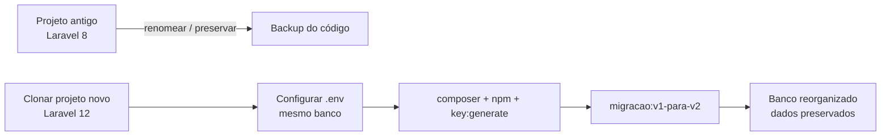

# Guia de Transição Completa — Versão Anterior (v1) → Sistema de Planejamento Estratégico (v2)

**Para quem é este documento:** organizações e usuários que já utilizavam a **versão anterior** do sistema (repositório `planejamento-estrategico`, construída em Laravel 8, com os dados no schema `pei`) e precisam migrar para a **versão atual** (repositório [`full-strategic-planning`](https://github.com/marcioaxn/full-strategic-planning), Laravel 12).

**Promessa deste guia:** se você seguir os passos **na ordem apresentada**, ninguém precisará redigitar dados. Todo o conteúdo já cadastrado (organizações, usuários, PEI, objetivos, indicadores, planos, entregas, etc.) é transferido automaticamente, **preservando os identificadores originais (UUIDs)** — ou seja, todos os vínculos entre registros continuam válidos.

> **Leitura complementar (técnica):**
> - Runbook do executor (resumo operacional): `runbook-migracao-v1-para-v2.md`
> - Mapa De→Para campo a campo: `migracao-legado-v1-para-v2-mapa-de-para.md`
>
> Este guia é o **documento principal** e abrange tanto o **código-fonte** quanto o **banco de dados**. Os dois acima detalham aspectos específicos.

---

## Sumário

1. [Visão geral da transição](#1-visão-geral-da-transição)
2. [Antes de começar: pré-requisitos e premissas](#2-antes-de-começar-pré-requisitos-e-premissas)
3. [Planejamento da janela de manutenção](#3-planejamento-da-janela-de-manutenção)
4. [Passo 1 — Backup do banco de dados (obrigatório)](#4-passo-1--backup-do-banco-de-dados-obrigatório)
5. [Passo 2 — Preservar o código antigo](#5-passo-2--preservar-o-código-antigo)
6. [Passo 3 — Obter o código novo (clone)](#6-passo-3--obter-o-código-novo-clone)
7. [Passo 4 — Configurar o arquivo `.env`](#7-passo-4--configurar-o-arquivo-env)
8. [Passo 5 — Instalar dependências (Composer e NPM)](#8-passo-5--instalar-dependências-composer-e-npm)
9. [Passo 6 — Gerar a chave da aplicação e compilar os assets](#9-passo-6--gerar-a-chave-da-aplicação-e-compilar-os-assets)
10. [Passo 7 — Simular a migração (dry-run)](#10-passo-7--simular-a-migração-dry-run)
11. [Passo 8 — Executar a migração de dados](#11-passo-8--executar-a-migração-de-dados)
12. [Passo 9 — Criar usuário Super Administrador (opcional)](#12-passo-9--criar-usuário-super-administrador-opcional)
13. [Passo 10 — Compilar os assets via migração (Fase 6)](#13-passo-10--compilar-os-assets-via-migração-fase-6)
14. [Passo 11 — Validar a aplicação](#14-passo-11--validar-a-aplicação)
15. [Passo 12 — Colocar em produção (go-live)](#15-passo-12--colocar-em-produção-go-live)
16. [Passo 13 — Descarte do legado (somente após estabilização)](#16-passo-13--descarte-do-legado-somente-após-estabilização)
17. [Plano de rollback (como voltar atrás)](#17-plano-de-rollback-como-voltar-atrás)
18. [Checklist final](#18-checklist-final)
19. [Solução de problemas (troubleshooting)](#19-solução-de-problemas-troubleshooting)
20. [Glossário](#20-glossário)

---

## 1. Visão geral da transição

A transição envolve **duas frentes que acontecem no mesmo banco de dados**:

1. **Código-fonte:** o projeto antigo (Laravel 8) é aposentado e substituído pelo projeto novo (Laravel 12). Não se atualiza o código antigo "por cima" — instala-se o novo lado a lado e aponta-se para o mesmo banco.
2. **Banco de dados:** um único comando Artisan do projeto novo (`migracao:v1-para-v2`) reorganiza a estrutura e transfere os dados, preservando o que já existe.



**Princípio de ouro:** o **banco de dados é o mesmo** durante todo o processo. O projeto novo apenas passa a enxergá-lo de uma forma reorganizada (6 schemas de domínio em vez de um único schema `pei`). O comando de migração cuida dessa reorganização sem perder dados, e mantém o legado em **quarentena** (renomeado, não apagado) até você confirmar que está tudo certo.

---

## 2. Antes de começar: pré-requisitos e premissas

### 2.1 Ambiente de servidor

| Requisito | Versão mínima | Observação |
|---|---|---|
| **PHP** | **8.2** | A v1 rodava em PHP 7.x/8.0. **É muito provável que o PHP do servidor precise ser atualizado.** |
| Extensões PHP | `pgsql`, `pdo_pgsql`, `mbstring`, `intl`, `gd`, `zip`, `xml`, `openssl` | Sem `pgsql`/`pdo_pgsql` o sistema não conecta ao banco. |
| **Composer** | 2.x | Gerenciador de dependências PHP. |
| **Node.js** | 20 LTS | Necessário para compilar os assets (CSS/JS). |
| **PostgreSQL** | **9.4** (recomendado 13+) | A v2 usa `jsonb` e `gen_random_uuid`. Abaixo de 9.4 a migração é abortada automaticamente. |

> **Atenção ao PostgreSQL entre 9.4 e 12:** nessas versões, `gen_random_uuid()` depende da extensão `pgcrypto`. **O assistente de migração detecta automaticamente** se ela está ausente e **pergunta se deseja criá-la** (basta responder *Sim*). Se preferir, crie manualmente uma única vez, conectado ao banco:
> ```sql
> CREATE EXTENSION IF NOT EXISTS pgcrypto;
> ```
> No PostgreSQL 13+ a função é nativa e este passo é dispensável.

### 2.2 Premissas da migração

- O comando roda **no mesmo banco** que contém a v1 (não há cópia entre servidores).
- O usuário do banco precisa de permissão para **DDL** (`CREATE SCHEMA`, `ALTER SCHEMA`, `ALTER TABLE`).
- Os identificadores (UUID) da v1 são gerados por código e serão **preservados** — chaves estrangeiras permanecem íntegras.
- **A auditoria histórica (`audits` / `tab_audit`) não é migrada** (decisão de projeto). Ela permanece disponível apenas no backup.
- Módulos novos da v2 (Gestão de Riscos, Temas Norteadores, Agenda 2030/ODS) **nascem vazios**, pois não existiam na v1.

### 2.3 Acessos que você precisa ter em mãos

- Acesso ao **servidor** (terminal/SSH ou console local) onde o sistema roda.
- **Credenciais do banco de dados** (host, porta, nome do banco, usuário e senha) — estão no `.env` do projeto antigo.
- Permissão para **reiniciar o servidor web** (Apache/Nginx) ao final.

---

## 3. Planejamento da janela de manutenção

A migração deve ser feita em uma **janela de manutenção**, com o sistema fora do ar para os usuários, evitando que alguém grave dados durante o processo.

Recomendações:

1. **Comunique os usuários** com antecedência sobre o horário de indisponibilidade.
2. Escolha um horário de **baixo uso** (fora do expediente, por exemplo).
3. Garanta que **ninguém está logado e gravando** durante a migração.
4. Reserve um tempo confortável: o processo costuma levar **30 a 90 minutos**, dependendo do volume de dados e da familiaridade da equipe.
5. Tenha o **plano de rollback** (Seção 15) à mão antes de começar.

> Se quiser exibir uma página de manutenção durante o processo, o Laravel oferece `php artisan down` (e `php artisan up` ao final). Use no projeto **antigo** se ele ainda estiver servindo, ou simplesmente pare o serviço web durante a janela.

---

## 4. Passo 1 — Backup do banco de dados (obrigatório)

**Este é o passo mais importante de todo o guia. Não pule.** Enquanto você tiver um backup íntegro, qualquer imprevisto é reversível.

Gere um backup completo com `pg_dump` (ajuste usuário, host, porta e nome do banco aos valores reais do seu `.env` antigo):

```bash
pg_dump -U SEU_USUARIO -h 127.0.0.1 -p 5432 -F c -b -v -f backup_v1_antes_migracao.dump NOME_DO_BANCO
```

- `-F c` gera um arquivo compactado (formato custom), ideal para restauração seletiva.
- `-b` inclui objetos grandes (blobs), se houver.

**Verifique** que o arquivo `backup_v1_antes_migracao.dump` foi criado e tem tamanho coerente (não está vazio). **Guarde uma cópia em local seguro**, separado do servidor.

> Dica: registre também a data/hora e a versão do PostgreSQL (`SELECT version();`) junto ao backup.

---

## 5. Passo 2 — Preservar o código antigo

Não vamos apagar o projeto antigo — vamos **aposentá-lo**, mantendo-o disponível como rede de segurança. A forma mais simples é **renomear a pasta** do projeto antigo.

Supondo que o projeto antigo esteja em `/var/www/planejamento-estrategico` (Linux) ou `C:\projetos\planejamento-estrategico` (Windows):

**Linux/macOS:**
```bash
mv /var/www/planejamento-estrategico /var/www/planejamento-estrategico-LEGADO
```

**Windows (PowerShell):**
```powershell
Rename-Item "C:\projetos\planejamento-estrategico" "planejamento-estrategico-LEGADO"
```

Com isso:
- O código antigo continua intacto em `...-LEGADO` (útil para consultar o `.env` e para rollback).
- O caminho original fica livre para receber o projeto novo (se você quiser reaproveitar exatamente o mesmo diretório no servidor web).

> **Não delete** a pasta `...-LEGADO` agora. Só remova depois que a v2 estiver estabilizada em produção (ver Seção 14).

---

## 6. Passo 3 — Obter o código novo (clone)

Clone o repositório da versão nova. Escolha o diretório de destino conforme a sua infraestrutura (pode ser o mesmo caminho que o antigo ocupava, agora livre).

```bash
git clone https://github.com/marcioaxn/full-strategic-planning.git planejamento-estrategico
cd planejamento-estrategico
```

> Se o seu servidor web (Apache/Nginx) aponta para um caminho específico (ex.: `DocumentRoot`), garanta que o projeto novo fique nesse caminho ou ajuste a configuração do servidor web para apontar para a pasta **`public/`** do projeto novo.

---

## 7. Passo 4 — Configurar o arquivo `.env`

O `.env` guarda as configurações sensíveis (banco, e-mail, etc.). **Aqui mora o ponto de maior atenção da transição**, porque alguns nomes de variáveis **mudaram entre o Laravel 8 e o Laravel 12**. Por isso, **não basta copiar o `.env` antigo por cima** — é preciso fazer as devidas adaptações.

### 7.1 Estratégia recomendada

Como você vem da v1, **já possui um `.env` em `...-LEGADO/.env`**. O caminho mais seguro é partir dele:

1. Copie o `.env` do projeto antigo para o projeto novo:

   **Linux/macOS:**
   ```bash
   cp ../planejamento-estrategico-LEGADO/.env .env
   ```
   **Windows (PowerShell):**
   ```powershell
   Copy-Item "..\planejamento-estrategico-LEGADO\.env" .env
   ```

   > Se preferir criar do zero, use o **modelo da seção 7.4** como base.

2. Garanta que os dados do **banco** apontem para o **mesmo banco da v1** (não altere host/porta/nome/usuário, pois é o mesmo banco):

   ```env
   DB_CONNECTION=pgsql
   DB_HOST=127.0.0.1
   DB_PORT=5432
   DB_DATABASE=NOME_DO_BANCO_DA_V1     # << exatamente o mesmo banco da v1
   DB_USERNAME=SEU_USUARIO
   DB_PASSWORD=SUA_SENHA
   ```

3. Ajuste também a identidade da aplicação:
   ```env
   APP_NAME="Planejamento Estratégico"
   APP_ENV=production          # em produção; use "local" apenas em desenvolvimento
   APP_DEBUG=false             # em produção SEMPRE false
   APP_URL=https://seu-dominio-ou-ip/caminho
   ```

### 7.2 Variáveis que mudaram de nome (Laravel 8 → 12)

Se você optar por copiar o `.env` antigo, **renomeie/ajuste** estas chaves, pois os nomes antigos não têm mais efeito na v2:

| Laravel 8 (antigo) | Laravel 12 (novo) | Observação |
|---|---|---|
| `CACHE_DRIVER` | `CACHE_STORE` | a v2 usa `database` por padrão |
| `FILESYSTEM_DRIVER` | `FILESYSTEM_DISK` | — |
| `BROADCAST_DRIVER` | `BROADCAST_CONNECTION` | — |
| `MAIL_ENCRYPTION` | `MAIL_SCHEME` | revise a seção de e-mail |
| (não existia) | `SESSION_DRIVER=database` | a v2 usa sessão em banco |
| (não existia) | `QUEUE_CONNECTION=database` | a v2 usa fila em banco |

> **Regra prática:** quando em dúvida, use os **nomes de variável do modelo da seção 7.4** e apenas preencha o **valor** com o que vinha do antigo.

### 7.3 Sobre a chave da aplicação (`APP_KEY`)

- **Não copie** a `APP_KEY` do projeto antigo. Você vai gerar uma nova no próximo passo.
- As senhas dos usuários usam **bcrypt** e **não dependem** da `APP_KEY` — portanto, gerar uma chave nova **não invalida os logins**.
- Sessões e tokens antigos serão recriados (as respectivas tabelas são reconstruídas pela v2), então não há nada a preservar aqui.

### 7.4 Modelo de `.env` (para criar do zero, se necessário)

Caso prefira não partir do `.env` antigo, crie um arquivo `.env` na raiz do projeto novo com o conteúdo abaixo e ajuste os valores marcados:

```env
APP_NAME="Planejamento Estratégico"
APP_ENV=production
APP_KEY=
APP_DEBUG=false
APP_URL=https://seu-dominio-ou-ip/caminho

APP_LOCALE=en
APP_FALLBACK_LOCALE=en
APP_FAKER_LOCALE=en_US

BCRYPT_ROUNDS=12

LOG_CHANNEL=stack
LOG_LEVEL=error

DB_CONNECTION=pgsql
DB_HOST=127.0.0.1
DB_PORT=5432
DB_DATABASE=NOME_DO_BANCO_DA_V1
DB_USERNAME=SEU_USUARIO
DB_PASSWORD=SUA_SENHA

SESSION_DRIVER=database
SESSION_LIFETIME=120
QUEUE_CONNECTION=database
CACHE_STORE=database
FILESYSTEM_DISK=local
BROADCAST_CONNECTION=log

MAIL_MAILER=log
MAIL_HOST=127.0.0.1
MAIL_PORT=2525
MAIL_FROM_ADDRESS="nao-responder@seu-dominio"
MAIL_FROM_NAME="${APP_NAME}"

VITE_APP_NAME="${APP_NAME}"
```

> O `APP_KEY` fica **vazio de propósito** — ele é preenchido automaticamente pelo `php artisan key:generate` (Passo 6).

---

## 8. Passo 5 — Instalar dependências (Composer e NPM)

Com o `.env` configurado, instale as bibliotecas do projeto novo.

### 8.1 Dependências PHP (Composer)

**Em produção** (recomendado — sem pacotes de desenvolvimento, autoloader otimizado):
```bash
composer install --no-dev --optimize-autoloader
```

**Em ambiente de desenvolvimento/homologação** (inclui ferramentas de teste):
```bash
composer install
```

### 8.2 Dependências de front-end (NPM)

```bash
npm install
```

> Estes comandos baixam arquivos da internet. Em servidores sem acesso externo, providencie o cache do Composer/NPM previamente ou execute a build em uma máquina com acesso e transfira a pasta `vendor/` e os assets compilados.

---

## 9. Passo 6 — Gerar a chave da aplicação e compilar os assets

### 9.1 Gerar a `APP_KEY`

```bash
php artisan key:generate
```

Isso preenche a variável `APP_KEY` no `.env`. **É obrigatório** — sem ela, a aplicação web responde com erro 500.

### 9.2 Compilar os assets (CSS/JS)

```bash
npm run build
```

Isso gera os arquivos otimizados de interface (Vite). Os assets **não dependem do banco**, então este passo pode ser feito a qualquer momento após o `npm install`.

> **Importante:** **não execute `php artisan migrate` manualmente.** A criação das tabelas da v2 é feita **automaticamente** pelo comando de migração (Passo 8, Fase 2). Rodar `migrate` por fora pode atrapalhar a sequência de quarentena.

---

## 10. Passo 7 — Simular a migração (dry-run)

Antes de tocar nos dados, rode a **simulação**. Ela lê o banco e produz um relatório de contagens **sem gravar absolutamente nada**. Serve para detectar surpresas (tabelas com nomes inesperados, por exemplo) com total segurança.

```bash
php artisan migracao:v1-para-v2 --dry-run
```

Analise a **pré-visualização** (tabela "Destino × Origem × Registros × Situação") e o bloco **"Decisões aplicadas"**, que mostra de forma transparente o que será feito (UUIDs preservados, entregas em `json_propriedades`, status padrão, auditoria dentro/fora):

- Situação **`OK`** → a tabela foi reconhecida e seria migrada normalmente; confira se o número de registros faz sentido.
- Situação **`IGNORADA` / `(não encontrada)`** → alguma tabela legada tem nome diferente do esperado. **Anote e acione o suporte técnico antes de prosseguir** — não execute a migração real até esclarecer.

> Se o `--dry-run` apresentar erro de conexão, revise o `.env` (Passo 4). Se acusar versão incompatível do PostgreSQL, revise a Seção 2.1.

---

## 11. Passo 8 — Executar a migração de dados

Com o backup feito (Passo 1) e o dry-run conferido (Passo 7), execute a migração real:

```bash
php artisan migracao:v1-para-v2
```

O comando executa, em sequência, **6 fases auditáveis**, seguidas de duas etapas opcionais (criação de Super Administrador e compilação de assets):

| Fase | O que faz | Reversível? |
|---|---|---|
| **0 — Pré-checagem** | Verifica versão do PostgreSQL, confirma o backup e o estado do banco | — |
| **1 — Quarentena** | Renomeia o schema antigo: `pei` → `legacy_pei`. **Nada é apagado** — apenas renomeado | ✅ |
| **2 — Construção** | Cria os 6 schemas e tabelas da v2 (executa o `migrate` internamente) | ✅ |
| **3 — Transferência** | Copia os dados de `legacy_*` para a v2, **preservando os UUIDs** | ✅ (legado intacto) |
| **4 — Validação** | Compara as contagens de origem e destino e exibe um relatório | — |
| **5 — Descarte** | Remove os schemas `legacy_*` — somente se confirmado (ver Passo 13) | ❌ irreversível |
| **6 — Frontend** | Executa `npm install` + `npm run build` automaticamente (ver Passo 10) | — |

### Perguntas do assistente

O comando é um **assistente interativo**. A maioria das perguntas é respondida por **seleção** (Sim/Não). A exceção é a criação do Super Administrador (Passo 9), que solicita nome e e-mail por digitação:

| Pergunta | Quando aparece | Tipo | Resposta segura |
|---|---|---|---|
| Backup completo foi feito? | sempre (Fase 0) | Seleção | **Sim** (você já fez no Passo 1) |
| Criar a extensão `pgcrypto` agora? | só se faltar `gen_random_uuid` (PG < 13) | Seleção | **Sim** |
| Prosseguir mesmo com tabelas não encontradas? | só se o preview detectar | Seleção | **Não** — cancele e acione o suporte |
| Prosseguir com a gravação? | após o preview de volumes | Seleção | **Sim** (se conferiu o preview) |
| Deseja criar um novo usuário Super Administrador? | após a Fase 4 | Seleção | **Sim** (recomendado — ver Passo 9) |
| Nome completo do usuário | só se confirmou a criação acima | Digitação | Nome do administrador |
| E-mail do usuário | só se confirmou a criação acima | Digitação | E-mail válido e único |
| O que fazer com o legado? | antes da Fase 6 | Seleção | **Manter como rede de segurança** |

### Opções (flags) disponíveis

| Opção | Para que serve |
|---|---|
| `--dry-run` | Simula sem gravar e mostra os volumes (usado no Passo 7) |
| `--force` | Não faz perguntas (assume as opções seguras) — para automação/reprodutibilidade |
| `--pular-backup` | Pula a confirmação de backup — **não recomendado** |
| `--descartar-legado` | Remove os schemas `legacy_*` ao final — **irreversível** (ver Passo 13) |
| `--migrar-auditoria` | Inclui `audits`/`tab_audit` na migração — padrão é **não** migrar |
| `--status-entrega-padrao="..."` | Define o status para entregas legadas não reconhecidas — padrão `"Não Iniciado"`; um valor inválido aborta com a lista correta |
| `--pular-criar-super-admin` | Pula a oferta de criação de Super Administrador (ver Passo 9) |
| `--pular-npm` | Pula a Fase 6 — útil se os assets já estão compilados (ver Passo 10) |

> **Se algo falhar:** o comando **interrompe na primeira falha** e informa a fase. O legado **não é destruído** — ele continua preservado em `legacy_pei`. Corrija a causa indicada e execute novamente. Em último caso, restaure o backup (Seção 17).

---

## 12. Passo 9 — Criar usuário Super Administrador (opcional)

Logo após a Fase 4 (validação dos dados), o assistente oferece a criação de um novo usuário com perfil **Super Administrador** e uma senha forte gerada automaticamente. Esta etapa é **opcional**, mas **fortemente recomendada** nas seguintes situações:

- Nenhum usuário legado era administrador na v1 (`adm = 1`).
- O responsável pela implantação precisa de um acesso de emergência com credencial própria.
- Você quer garantir um acesso administrativo separado dos usuários já migrados.

> **Se a migração identificou um administrador legado** (usuário com `adm = 1` na v1), o acesso é preservado automaticamente e o perfil Super Administrador já é atribuído. Mesmo assim, você pode criar um usuário adicional nesta etapa.

### O que o assistente faz nesta etapa

```
▶ Criar usuário Super Administrador
  → Senha gerada (anote agora — não será exibida novamente):

       🔑  K7#mN@p3X!qB

  Deseja criar um novo usuário Super Administrador com esta senha? (yes/no) [yes]:
  Nome completo do usuário:
  E-mail do usuário:
  ✓ Usuário Super Administrador criado: fulano@gov.br
  Guarde a senha com segurança — ela não pode ser recuperada depois.
```

### Como é gerada a senha

A senha é exibida **antes** da confirmação — você já sabe o que vai receber antes de decidir prosseguir.

| Critério | Detalhe |
|---|---|
| Comprimento | 12 caracteres |
| Composição obrigatória | 3 maiúsculas + 3 minúsculas + 3 dígitos + 3 símbolos (`@#$%&*!?`) |
| Entropia | `random_int()` do PHP — gerador criptograficamente seguro (CSPRNG) |
| Caracteres excluídos | `0`, `1`, `I`, `O`, `l` — evitados para facilitar a transcrição manual sem erro de leitura |
| Armazenamento | bcrypt com 12 rounds (`BCRYPT_ROUNDS` do `.env`) — nunca em texto puro |
| Troca obrigatória no 1º login | **Não** — a senha já é do conhecimento do operador |

> **Anote a senha imediatamente.** Ela não pode ser recuperada depois — apenas redefinida pela tela de administração em **/usuarios**.

### Validações realizadas automaticamente

O assistente cancela a criação com mensagem clara se:

- Nome ou e-mail estiverem vazios.
- O e-mail for inválido (formato incorreto).
- O e-mail já estiver cadastrado no banco.

### Como pular esta etapa

Responda **no** à pergunta de confirmação, ou use a flag:

```bash
php artisan migracao:v1-para-v2 --pular-criar-super-admin
```

Em modo `--force` (automação), esta etapa é pulada silenciosamente.

---

## 13. Passo 10 — Compilar os assets via migração (Fase 6)

Após o descarte do legado (ou a opção de mantê-lo), o assistente executa automaticamente a **Fase 6 — Frontend**: roda `npm install` e `npm run build` dentro do projeto, compilando os assets CSS/JS necessários para a interface funcionar.

> **Relação com o Passo 6:** o Passo 6 pediu que você rodasse `npm install` e `npm run build` manualmente antes da migração. A Fase 6 repete esse processo automaticamente **ao final da migração** — o que garante que os assets estejam atualizados com o estado final do projeto, mesmo em servidores que já tinham uma versão antiga compilada.

### O que acontece nesta fase

```
▶ Fase 6 — Frontend (npm)
  → Executando npm install (instalando dependências de frontend)...
  ✓ npm install concluído — dependências instaladas.
  → Executando npm run build (compilando assets CSS/JS)...
  ✓ npm run build concluído — assets compilados e prontos.
```

### Requisito: Node.js no PATH

A Fase 6 exige que o **Node.js** (comando `npm`) esteja instalado e acessível no PATH do servidor. O `--dry-run` verifica isso e avisa se o `npm` não for encontrado.

### Como pular esta fase

Se os assets já estão compilados e atualizados, use a flag:

```bash
php artisan migracao:v1-para-v2 --pular-npm
```

Nesse caso, compile manualmente quando for conveniente:

```bash
npm install && npm run build
```

---

## 14. Passo 11 — Validar a aplicação

Antes de liberar para os usuários, confirme que tudo está correto:

1. **Relatório de validação:** ao final da Fase 4, a coluna **OK** deve estar marcada (`✓`) em todas as linhas com status `OK`. Se houver divergência de contagem, investigue antes de seguir.

2. **Limpe os caches** (garante que a aplicação leia a configuração atual):
   ```bash
   php artisan optimize:clear
   ```

3. **Acesse o sistema** e confira visualmente os dados migrados:
   - Organizações e usuários
   - Ciclo PEI, Missão/Visão/Valores
   - Objetivos e Perspectivas (Mapa Estratégico)
   - Indicadores, metas e evoluções
   - Planos de Ação e Entregas

4. **Teste o login** com um usuário conhecido. As senhas foram preservadas. Se o sistema solicitar troca de senha no primeiro acesso, isso é **comportamento esperado** (flag `trocarsenha`).

5. **Entregas:** confira que as entregas aparecem no novo quadro (Kanban/Lista/Timeline). Os campos que não existiam na v2 (unidade de medida, item entregue, quantidade prevista) foram **preservados** dentro das propriedades da entrega (`json_propriedades`) — não se perderam.

6. **Permissões e Super Administrador:** na v2, ter acesso total (Super Admin) é determinado pelo **perfil de acesso** vinculado ao usuário (perfil "Super Administrador"), e **não** mais pelo campo `adm`. A migração sincroniza o campo `adm` automaticamente como espelho desse perfil. Após migrar:
   - Confirme em **/usuarios** que cada usuário tem o **perfil correto** vinculado à sua organização.
   - Garanta que **pelo menos um** usuário tenha o perfil **"Super Administrador"**. Se a migração avisar que nenhum super admin foi encontrado, atribua o perfil a um usuário pela própria tela de Usuários — caso contrário o sistema ficará sem administrador com acesso total.

> Enquanto a validação não estiver concluída, **não descarte o legado**. Ele é a sua rede de segurança.

---

## 15. Passo 12 — Colocar em produção (go-live)

1. **Ajuste o servidor web** (Apache/Nginx) para servir a pasta **`public/`** do projeto novo.
2. **Permissões de pastas** (Linux): garanta que o servidor web pode escrever em `storage/` e `bootstrap/cache/`:
   ```bash
   chmod -R 775 storage bootstrap/cache
   chown -R www-data:www-data storage bootstrap/cache   # ajuste o usuário do seu servidor
   ```
3. **Otimização (opcional, em produção dedicada):**
   ```bash
   php artisan config:cache
   php artisan route:cache
   php artisan view:cache
   ```
   > ⚠️ **Em ambientes com Apache + OPcache (ex.: XAMPP):** evite `config:cache`/`optimize`. Se já tiver rodado e a aplicação web apresentar erro 500 `MissingAppKey` (mesmo com a `APP_KEY` presente), **reinicie o serviço Apache** para limpar o OPcache. Em servidores de produção dedicados, lembre-se de **reiniciar o PHP-FPM/serviço web** após qualquer cache de configuração.
4. **Reinicie o serviço web** e remova a página de manutenção (`php artisan up`, se aplicável).
5. Faça um **smoke test** final acessando as principais telas como usuário real.

---

## 16. Passo 13 — Descarte do legado (somente após estabilização)

O schema `legacy_pei` (e, se aplicável, `legacy_public`) permanece no banco como rede de segurança. **Mantenha-o por alguns dias/semanas**, até ter certeza de que a v2 opera sem problemas em produção.

Quando estiver plenamente confiante:

```bash
php artisan migracao:v1-para-v2 --descartar-legado
```

Isso remove **definitivamente** os schemas de quarentena. **É irreversível** — se um dia precisar dos dados originais, recorra ao backup do Passo 1.

Da mesma forma, só então remova a pasta `...-LEGADO` do código antigo, se desejar liberar espaço.

---

## 17. Plano de rollback (como voltar atrás)

Se em qualquer momento for preciso retornar ao estado anterior:

### Cenário A — A migração falhou no meio (legado ainda em `legacy_pei`)

O legado está intacto. Para voltar a usar a v1:

1. Pare o serviço web apontando para a v2.
2. No banco, desfaça a quarentena e remova os schemas da v2 (execute conectado ao banco):
   ```sql
   DROP SCHEMA IF EXISTS strategic_planning CASCADE;
   DROP SCHEMA IF EXISTS action_plan CASCADE;
   DROP SCHEMA IF EXISTS performance_indicators CASCADE;
   DROP SCHEMA IF EXISTS risk_management CASCADE;
   DROP SCHEMA IF EXISTS organization CASCADE;
   ALTER SCHEMA legacy_pei RENAME TO pei;
   ```
3. Volte a apontar o servidor web para a pasta `...-LEGADO` (código antigo).

### Cenário B — Reversão total (forma mais simples e garantida)

Restaure o backup do Passo 1 em um banco limpo:

```bash
# (Opcional) recriar o banco do zero
dropdb -U SEU_USUARIO NOME_DO_BANCO
createdb -U SEU_USUARIO NOME_DO_BANCO

# Restaurar o dump
pg_restore -U SEU_USUARIO -d NOME_DO_BANCO -v backup_v1_antes_migracao.dump
```

Em seguida, volte a servir o código antigo (`...-LEGADO`). O estado original retorna integralmente.

> Por isso o Passo 1 é inegociável: **com o backup, nenhum erro é permanente.**

---

## 18. Checklist final

Marque cada item à medida que concluir:

- [ ] PHP 8.2+ e extensões instaladas no servidor
- [ ] PostgreSQL ≥ 9.4 (e `pgcrypto` habilitado, se versão < 13)
- [ ] Node.js instalado e `npm` acessível no PATH (necessário para a Fase 6)
- [ ] Usuários comunicados; janela de manutenção iniciada
- [ ] **Backup do banco** gerado e validado (Passo 1)
- [ ] Projeto antigo renomeado para `...-LEGADO` (Passo 2)
- [ ] Projeto novo clonado (Passo 3)
- [ ] `.env` configurado apontando para o **mesmo banco**, com variáveis adaptadas (Passo 4)
- [ ] `composer install` e `npm install` executados (Passo 5)
- [ ] `php artisan key:generate` e `npm run build` executados (Passo 6)
- [ ] `--dry-run` executado e relatório conferido (Passo 7)
- [ ] Migração real executada com sucesso — todas as fases concluídas (Passo 8)
- [ ] Usuário Super Administrador criado (ou administrador legado confirmado) e senha anotada (Passo 9)
- [ ] Assets compilados pela Fase 6 (ou `npm run build` executado manualmente com `--pular-npm`) (Passo 10)
- [ ] Dados validados na aplicação; login testado — incluindo o Super Administrador (Passo 11)
- [ ] Servidor web apontando para `public/` do projeto novo; caches/otimização aplicados (Passo 12)
- [ ] Sistema liberado aos usuários
- [ ] (Dias depois) Legado descartado após estabilização (Passo 13)

---

## 19. Solução de problemas (troubleshooting)

| Sintoma | Causa provável | Solução |
|---|---|---|
| Erro 500 em todas as páginas, log com `MissingAppKey` | `APP_KEY` ausente ou OPcache servindo config antigo | Confirme a `APP_KEY` no `.env`; rode `php artisan optimize:clear`; **reinicie o Apache/PHP-FPM** |
| `could not find driver` ou falha de conexão | Extensão `pgsql`/`pdo_pgsql` ausente, ou `.env` incorreto | Habilite as extensões no `php.ini`; revise `DB_*` no `.env` |
| Migração aborta com "versão incompatível" | PostgreSQL < 9.4 | Atualize o PostgreSQL (Seção 2.1) |
| Erro relativo a `gen_random_uuid()` | PG entre 9.4 e 12 sem `pgcrypto` | `CREATE EXTENSION IF NOT EXISTS pgcrypto;` |
| `--dry-run` mostra tabelas como "origem não encontrada" | Estrutura legada com nomes diferentes do esperado | **Não execute a migração real**; acione o suporte técnico |
| Tela em branco / assets sem estilo | Fase 6 falhou ou `--pular-npm` foi usado sem build manual | Rode `npm install && npm run build` manualmente |
| Fase 6 falha com "npm não encontrado" | Node.js não instalado ou não está no PATH | Instale o Node.js 20 LTS e certifique-se de que `npm` é acessível no terminal |
| Permissão negada ao gravar logs/cache | Permissões de `storage/` e `bootstrap/cache/` | Ajuste permissões/propriedade (Passo 12.2) |
| Login não funciona | Usuário com `trocarsenha` ativo | É esperado: o sistema redireciona para a troca de senha no 1º acesso |
| Criação de Super Admin falha com "e-mail já existe" | E-mail informado já está cadastrado no banco | Use um e-mail diferente ou localize o usuário existente em **/usuarios** e eleve seu perfil |
| Senha do Super Admin perdida | A senha não é armazenada em texto puro | Redefina-a pela tela de administração em **/usuarios** (editar usuário → nova senha) |

---

## 20. Glossário

- **v1 / legado:** versão anterior do sistema (Laravel 8, repositório `planejamento-estrategico`), com dados no schema `pei`.
- **v2:** versão atual (Laravel 12, repositório `full-strategic-planning`), com 6 schemas de domínio.
- **Schema (PostgreSQL):** agrupamento lógico de tabelas dentro de um banco. A v1 usava um schema (`pei`); a v2 usa seis.
- **Quarentena:** etapa em que o schema antigo é **renomeado** (não apagado) para `legacy_pei`, preservando os dados originais durante a migração.
- **UUID:** identificador único de cada registro. São preservados na migração, mantendo todos os vínculos.
- **Dry-run:** execução de simulação que não grava nada, apenas relata o que seria feito.
- **`json_propriedades`:** campo flexível (JSONB) das entregas na v2, onde campos sem equivalente direto da v1 são preservados.
- **Super Administrador:** perfil de acesso com todos os privilégios do sistema na v2. Na v1 era determinado pelo campo `users.adm = 1`; na v2 é determinado pelo perfil vinculado ao usuário. A migração faz a ponte automaticamente e oferece a criação de um novo usuário com esse perfil (Passo 9).
- **Fase 6 — Frontend:** etapa automática ao final da migração que executa `npm install` + `npm run build`, compilando os assets de interface. Pode ser pulada com `--pular-npm` (Passo 10).
- **CSPRNG:** gerador de números pseudoaleatórios criptograficamente seguro. Usado para gerar a senha do Super Administrador — garante que a senha não seja previsível nem reproduzível.

---

> **Resumo em uma frase:** faça o backup, preserve o código antigo, clone o novo, configure o `.env` para o mesmo banco, instale as dependências, gere a chave, simule, migre, crie o Super Administrador, compile os assets (Fase 6) e valide — só então descarte o legado. Seguindo esta ordem, a transição é segura, reversível e **sem redigitação de dados**.
