# Manual de Uso — Sistema PEI (Planejamento Estratégico Integrado)

> Versão de 03/10/2026. Telas capturadas no ambiente de desenvolvimento, ciclo **2023-2027**, ano de
> referência **2026**, organização **MIDR**, com o perfil **Super Administrador**. Outros perfis veem
> menos botões — ver [Papéis e responsabilidades](#76-papéis-e-responsabilidades). As telas de
> **Documentos** e **Salvar como** foram capturadas com dados de demonstração, marcados **[TESTE]**.

## Sumário

1. [Como o sistema está organizado](#1-como-o-sistema-está-organizado)
2. [Entrar e se localizar](#2-entrar-e-se-localizar)
3. [Módulo 01 — Inaugurar e Integrar](#3-módulo-01--inaugurar-e-integrar)
4. [Módulo 02 — Planejar](#4-módulo-02--planejar)
5. [**Agenda 2030 e ODS — o que cada tela significa**](#5-agenda-2030-e-ods--o-que-cada-tela-significa)
6. [Módulo 03 — Monitorar e Avaliar](#6-módulo-03--monitorar-e-avaliar)
7. [Administração](#7-administração)
8. [Documentos (acervo em PDF)](#8-documentos-acervo-em-pdf)
9. [Portal da Transparência (sem login)](#9-portal-da-transparência-sem-login)
10. [Como ler os números e as cores](#10-como-ler-os-números-e-as-cores)

---

## 1. Como o sistema está organizado

O sistema segue o **Guia Prático de Planejamento Estratégico (GPPEI/MGI 2025)**, que divide o trabalho em
três módulos. O menu lateral segue a mesma ordem:

| Módulo do GPPEI | O que se faz | Menu |
|---|---|---|
| **01 — Inaugurar e Integrar** | Abrir o ciclo, montar a equipe, alinhar com PPA/LOA e declarar a aderência à Agenda 2030 | *Inaugurar e Integrar* |
| **02 — Planejar** | Cadeia de valor, análise de cenário (PESTEL/SWOT), missão, visão, valores, perspectivas, objetivos, indicadores e iniciativas | *Planejar* |
| **03 — Monitorar e Avaliar** | Lançar resultados, acompanhar entregas e riscos, fazer a RAE, gerar relatórios | *Monitorar e Avaliar* |

Além dos módulos há:

- **Meu Espaço**: suas entregas.
- **Administração**: organizações, usuários, perfis, IA e auditoria.
- **Recursos**: o acervo de **Documentos** em PDF, o Guia GPPEI e a ajuda de papéis.
- **Portal da Transparência**: a parte pública, sem login.

No rodapé do menu, **CICLO PEI 100%** indica quanto das etapas do ciclo já foi preenchido. Os ícones
abaixo da barra são as etapas.

---

## 2. Entrar e se localizar

### 2.1 Login

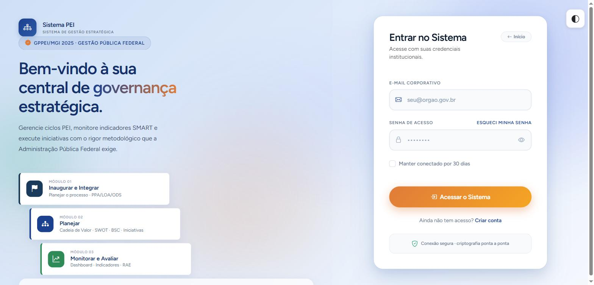

Informe o **e-mail corporativo** e a **senha**. A opção **Manter conectado por 30 dias** evita novo login
no mesmo navegador. **Esqueci minha senha** envia um link de redefinição por e-mail. Se a autenticação em
dois fatores estiver ativa no seu perfil, o sistema pede o código depois da senha.

### 2.2 Os três seletores do topo — leia antes de qualquer tela

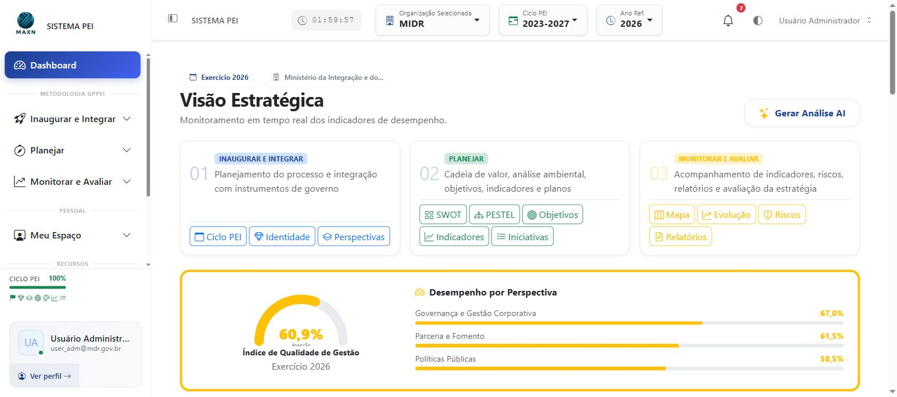

Toda tela do sistema mostra os dados do recorte escolhido no topo:

| Seletor | O que define |
|---|---|
| **Organização Selecionada** | De qual unidade são os dados. Quem administra uma unidade vê a sua e as que estão abaixo dela. |
| **Ciclo PEI** | Qual plano estratégico (ex.: 2023-2027). Objetivos, indicadores, riscos e relatórios são do ciclo. |
| **Ano Ref.** | O ano usado para metas, resultados e atingimento. |

> Se uma tela parecer "vazia", confira primeiro os três seletores. É a causa mais comum.

Ainda no topo:

- **Relógio**: tempo restante da sessão. Ao zerar, o sistema pede novo login.
- **Sino**: notificações.
- **Meia-lua**: alterna o tema claro e o escuro.
- **Seu nome**: abre perfil e saída.

### 2.3 Dashboard

O painel inicial resume o ciclo e o ano:

- **Índice de Qualidade de Gestão e atingimento por perspectiva**, com a cor do farol de cada uma (ver [seção 10](#10-como-ler-os-números-e-as-cores)). São números **do ciclo inteiro, da instituição toda**: não mudam com a unidade selecionada no topo, porque perspectivas e objetivos são da instituição.
- **Evolução mensal**, que considera só meses com resultado lançado. Mês sem lançamento fica em branco, não em zero.
- **Alertas** e **atalhos**.
- **Gerar Análise (IA)**: pede ao agente de IA um comentário sobre os números. Só funciona se a IA estiver configurada ([7.4](#74-configuração-do-agente-de-ia)).

---

## 3. Módulo 01 — Inaugurar e Integrar

### 3.1 Ciclos do PEI

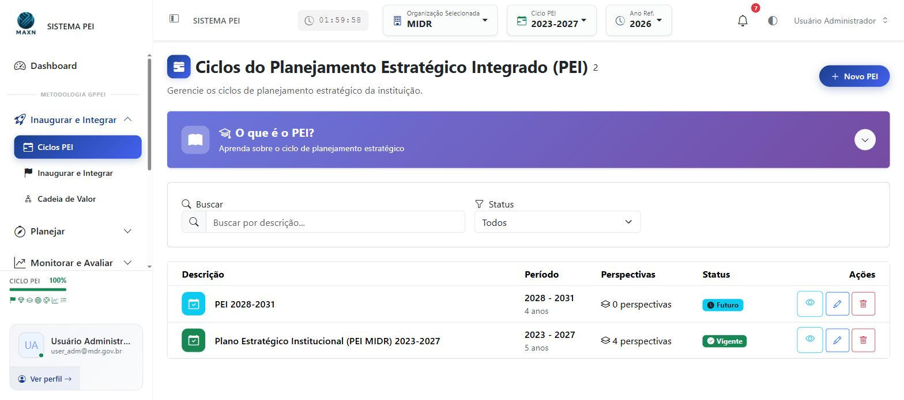

Lista os ciclos de planejamento (ex.: 2023-2027).

- **Novo Ciclo**, **Editar**, **Salvar como** e **Excluir** aparecem só para o **Super Administrador**.
- **Detalhar** abre a ficha do ciclo, com atalhos para cada etapa. O atalho já seleciona o ciclo e o ano antes de abrir a tela.

**Salvar como** (ícone de duas folhas, em verde) cria um PEI novo **com tudo o que está preso ao ciclo
escolhido**. Serve para revisar o plano, simular um cenário ou abrir o ciclo seguinte sem redigitar nada.

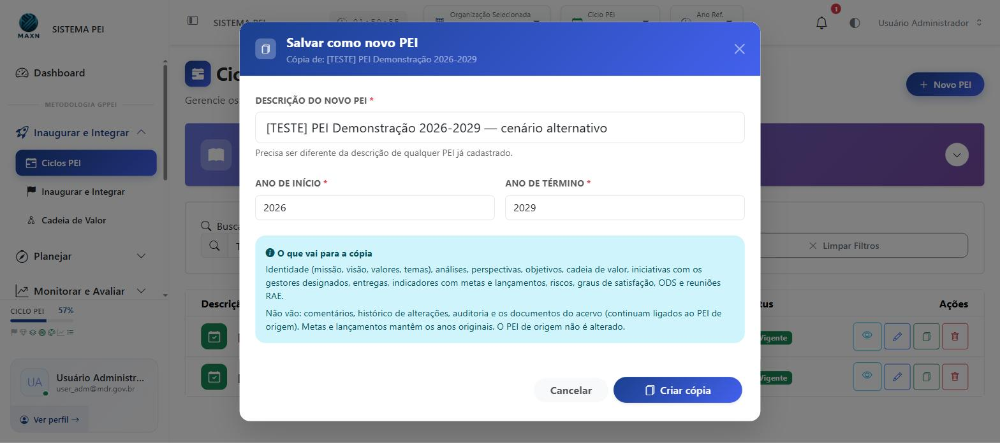

- **Descrição do novo PEI** é obrigatória e precisa ser diferente da de qualquer PEI cadastrado. É ela que
  distingue os dois ciclos no seletor do topo e nos relatórios.
- **Ano de início e de término** já vêm iguais aos do ciclo de origem. Podem ficar iguais: dois PEIs no
  mesmo período são permitidos.
- **Vão para a cópia:** missão, visão, valores, temas, análises (PESTEL, SWOT, cenários, partes
  interessadas), perspectivas, objetivos (com a hierarquia e os ODS), cadeia de valor, iniciativas com a
  unidade e os gestores designados, entregas, indicadores com metas, linha de base e lançamentos, riscos com
  mitigações e ocorrências, graus de satisfação e reuniões RAE.
- **Não vão:** comentários, histórico de alterações, auditoria e os documentos do acervo, que continuam
  ligados ao PEI de origem.
- Metas e lançamentos mantêm os anos originais. Se o período da cópia for outro, ajuste as metas no novo PEI.
- O PEI de origem não muda. A cópia sai inteira ou não sai: se algo falhar, nada é gravado.

Depois de copiar, escolha o novo PEI no seletor **Ciclo PEI** do topo para trabalhar nele.

### 3.2 Inaugurar e Integrar (abas)

A tela tem quatro abas.

**Planejar o processo** — equipe de planejamento, diretrizes da Alta Direção, patrocinador e observações.
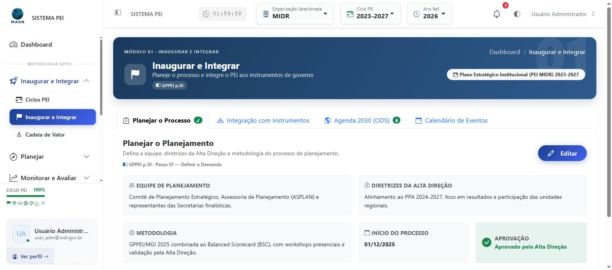

**Integração com instrumentos** — liga o PEI a PPA, LOA, planos setoriais etc. Cada vínculo tem uma
**intensidade** (Alta, Média, Baixa) e uma descrição.
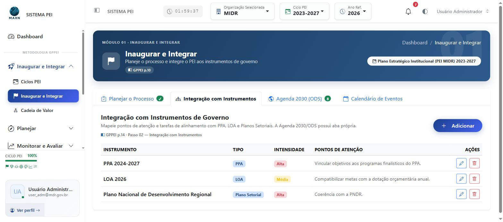

**Agenda 2030** — onde a organização **declara** a quais ODS o ciclo se propõe a contribuir. Explicado em
detalhe na [seção 5](#5-agenda-2030-e-ods--o-que-cada-tela-significa).
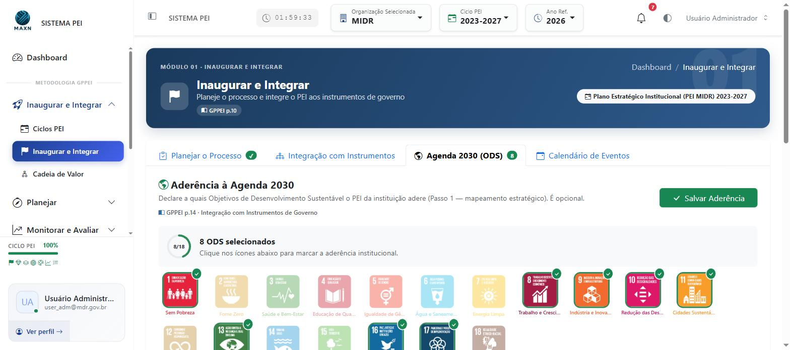

**Calendário** — oficinas e reuniões do processo de planejamento (data, local, participantes).
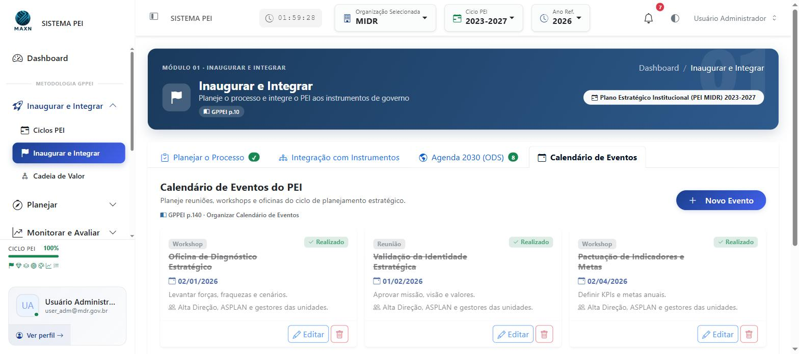

---

## 4. Módulo 02 — Planejar

### 4.1 Cadeia de Valor

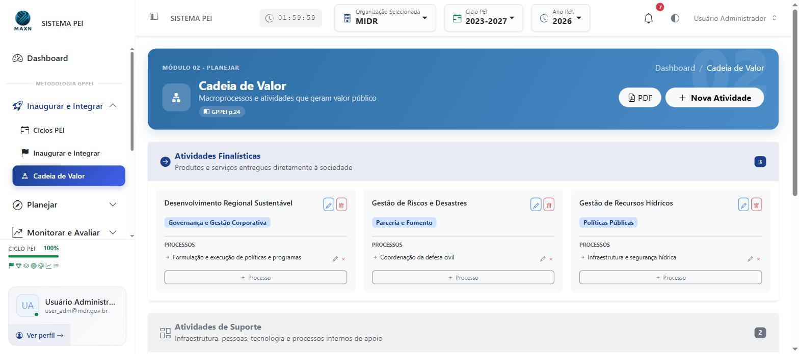

Macroprocessos finalísticos e de suporte da organização: o que ela entrega à sociedade e o que sustenta
essa entrega. É o ponto de partida do GPPEI (p. 24).

### 4.2 Identidade Estratégica (Missão e Visão)

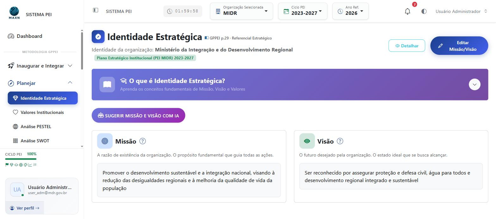

- **Missão**: por que a organização existe.
- **Visão**: aonde quer chegar no fim do ciclo.

O texto pode ser gerado com apoio da IA e sempre é revisado antes de salvar.

### 4.3 Valores Institucionais

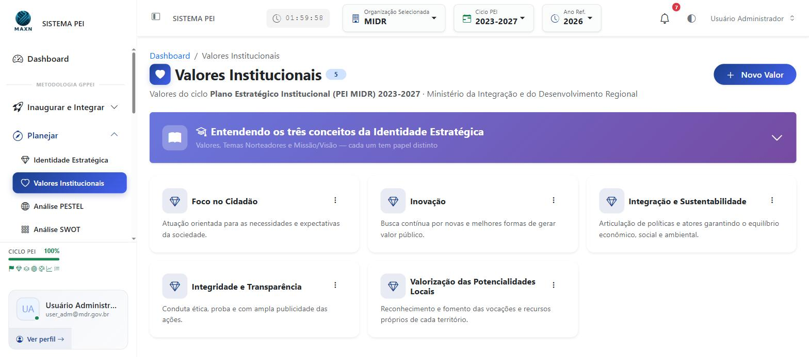

Princípios que orientam a conduta. **Novo Valor** cria, o lápis edita, a lixeira exclui e **Detalhar**
mostra o valor com a sua explicação.

### 4.4 Temas Norteadores

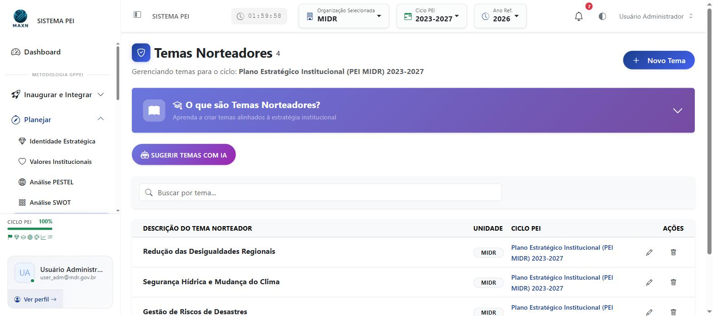

Grandes temas que atravessam o plano (ex.: "Segurança Hídrica e Mudança do Clima"). Aparecem no Mapa
Estratégico e no Portal.

### 4.5 Análise PESTEL e Análise SWOT

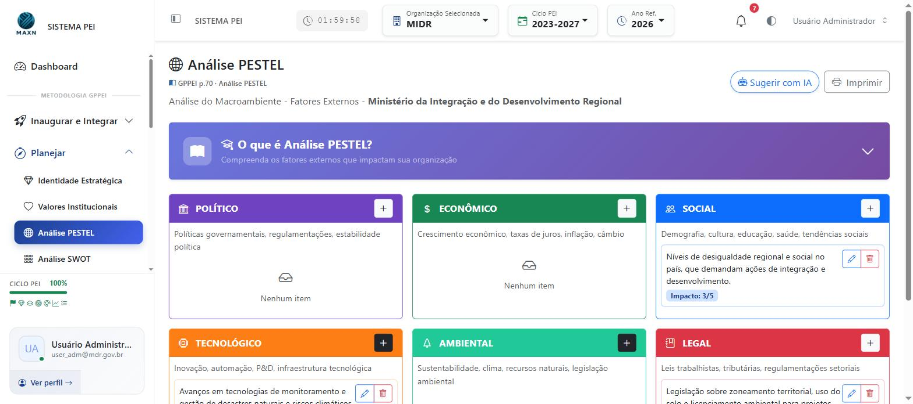

**PESTEL** organiza os fatores externos: Político, Econômico, Social, Tecnológico, Ambiental e Legal.

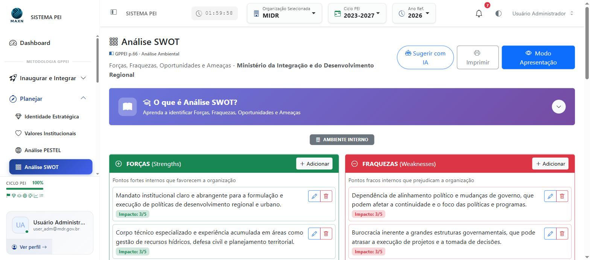

**SWOT** cruza forças e fraquezas (internas) com oportunidades e ameaças (externas). Cada item tem
impacto. Itens podem ser criados, editados e excluídos em cada quadrante.

### 4.6 Perspectivas BSC

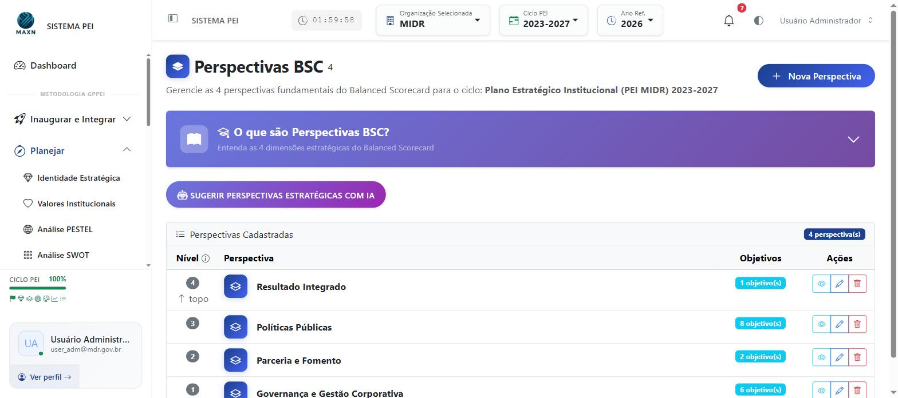

As camadas do Mapa Estratégico, no modelo BSC (ex.: Resultado Integrado, Políticas Públicas, Parceria e
Fomento, Gestão). A **ordem** define a altura no mapa. Os **pesos** de indicadores e iniciativas definem
como o atingimento da perspectiva é calculado ([seção 10](#10-como-ler-os-números-e-as-cores)).

### 4.7 Objetivos Estratégicos

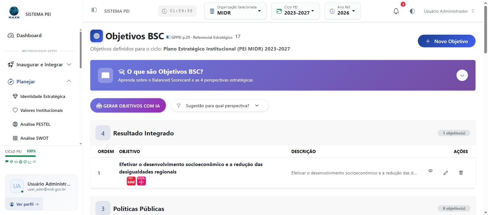

Cada objetivo pertence a uma perspectiva. No cadastro há o campo **Agenda 2030 — ODS**, onde se marcam
**até 3 ODS** para os quais o objetivo contribui. O campo é opcional.

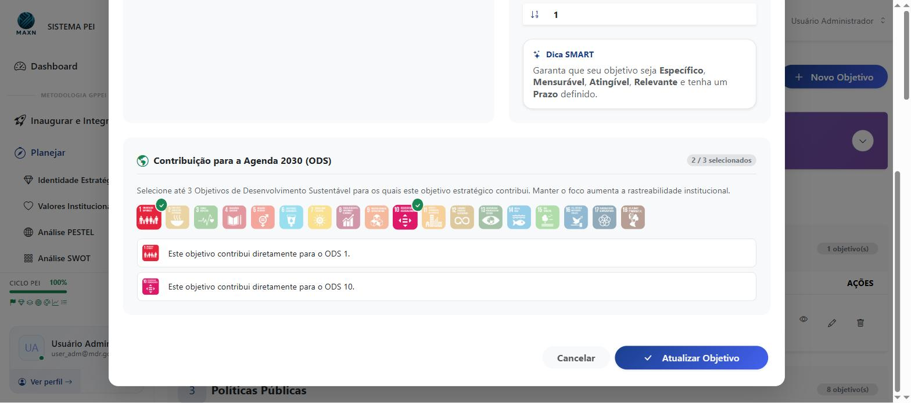

A ficha do objetivo (ícone de olho) mostra os indicadores, as iniciativas, o atingimento no ano, os ODS
vinculados e os comentários da equipe.

### 4.8 Mapa Estratégico

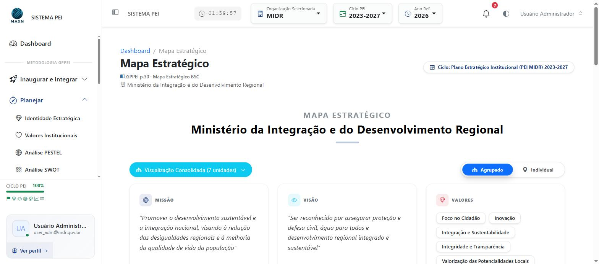
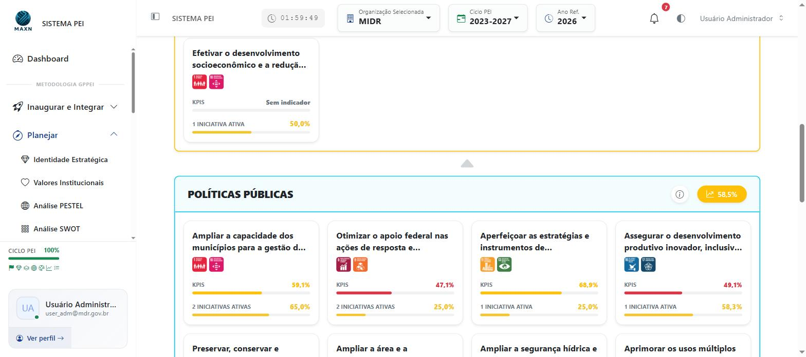

É o plano em uma página: missão, visão, valores, temas e, abaixo, as perspectivas com seus objetivos.

- O selo de cada perspectiva mostra o **atingimento** no ano.
- O **(i)** mostra a memória de cálculo.
- Cada objetivo mostra os indicadores e as iniciativas. **"Sem indicador"** significa que ainda não há o que medir. Isso não é desempenho zero.

### 4.9 Graus de Satisfação (a régua do farol)

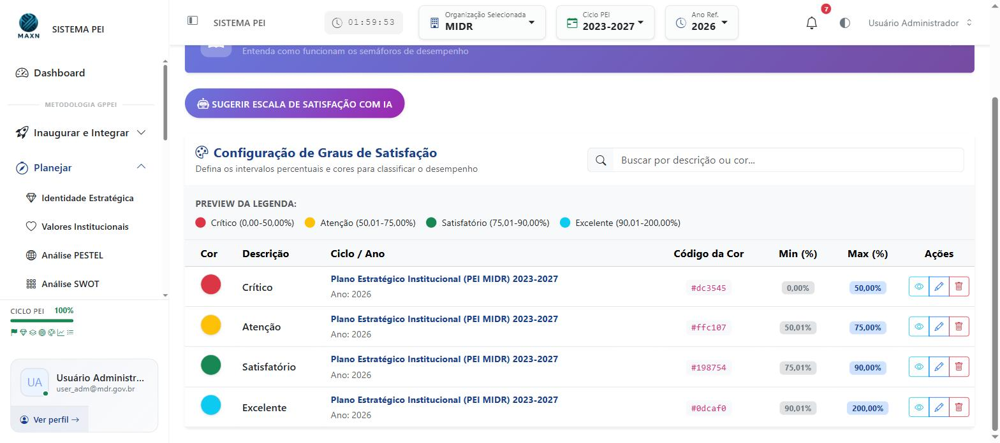

Define as faixas de cor usadas em todo o sistema (ex.: Crítico 0–50%, Atenção 50–75%, Satisfatório
75–90%, Excelente acima de 90%). **Detalhar** uma faixa lista os indicadores que estão nela no ano. A
mesma régua pinta o Dashboard, o Mapa, as fichas e o Portal, então um número tem sempre a mesma cor em
todo lugar.

**Cadastrar ou editar uma faixa:**

1. Informe nome, cor, ciclo e, se quiser, o ano.
2. Digite os percentuais mínimo e máximo como se escreve normalmente, com vírgula (ex.: **29,99**). O
   campo aceita apagar e reescrever como qualquer texto.
3. As faixas de um mesmo ciclo e ano **não podem se cruzar**, porque um mesmo resultado teria duas cores.
   Encostar no limite é permitido (0–50 e 50–75); cruzar não (0–60 e 50–75). O sistema avisa qual faixa
   está em conflito.

Só o Super Administrador ou o Administrador da unidade raiz alteram a régua: ela vale para a instituição
inteira.

---

## 5. Agenda 2030 e ODS — o que cada tela significa

### 5.1 A ideia em uma frase

> O sistema registra **duas coisas diferentes**: o que a organização **diz** que vai apoiar (a
> *aderência declarada*) e o que a estratégia **de fato** apoia (os *objetivos vinculados a cada ODS*).
> O Painel ODS mostra as duas lado a lado e avisa quando não batem.

A Agenda 2030 da ONU tem 17 Objetivos de Desenvolvimento Sustentável. O Brasil adotou um 18º (igualdade
étnico-racial). O vínculo com os ODS é **opcional**: nenhum ciclo é obrigado a cobrir todos, e um objetivo
sem ODS é válido.

### 5.2 Onde cada informação nasce

| Informação | Onde se registra | Quem registra | Significado |
|---|---|---|---|
| **Aderência declarada** | Inaugurar e Integrar → aba **Agenda 2030** | Equipe de planejamento, no início do ciclo | "Nosso PEI se propõe a contribuir para os ODS 6, 11 e 13." É a **intenção**. Para cada ODS marcado pode-se descrever *como* contribui e a *intensidade* (Alta/Média/Baixa). |
| **Cobertura efetiva** | Cadastro do **Objetivo Estratégico** → campo ODS (até 3) | Quem cadastra os objetivos | "Este objetivo contribui para o ODS 6." É a **estratégia de fato** ligada ao ODS. |
| **Desempenho** | Lançamento de resultados dos indicadores | Gestores | O atingimento do objetivo, que passa a valer como o "quanto estamos entregando" para aquele ODS. |

### 5.3 Tela 1 — Declarar a aderência (Inaugurar e Integrar → Agenda 2030)

1. Clique nos ícones dos ODS aos quais o ciclo pretende contribuir. O ícone fica aceso e o contador mostra "N ODS selecionados".
2. Em **Detalhamento da Aderência**, descreva opcionalmente como a instituição contribui e escolha a intensidade.
3. Clique em **Salvar Aderência**.

### 5.4 Tela 2 — Vincular objetivos aos ODS (Planejar → Objetivos)

No cadastro ou edição do objetivo, marque até 3 ODS. No Mapa e nas listas, os ícones coloridos dos ODS
aparecem sob o nome do objetivo.

### 5.5 Tela 3 — Painel Agenda 2030 (menu Planejar → Agenda 2030 (ODS), ou "Abrir Painel" no Dashboard)

Esta tela **não cria nada**. Ela lê os dois vínculos acima e os cruza.

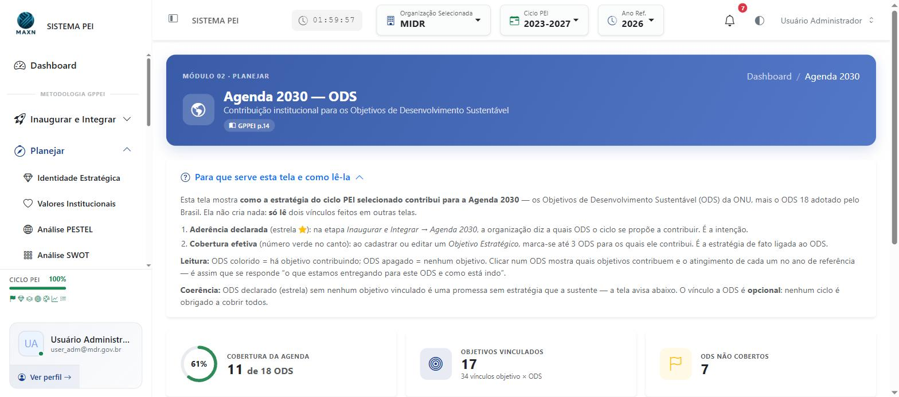

O quadro **"Para que serve esta tela e como lê-la"** (abre e fecha no topo) resume a leitura para quem vê a
tela pela primeira vez.

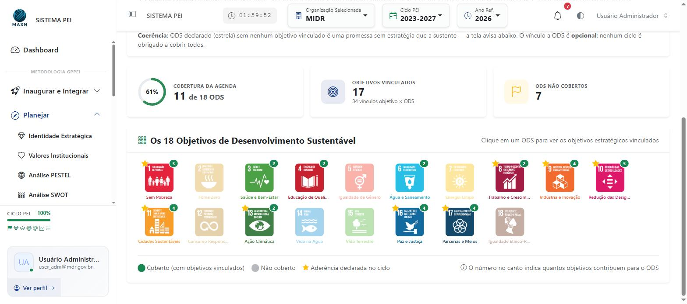

**Como ler a grade:**

| O que aparece | Significa |
|---|---|
| **ODS colorido** | Pelo menos um objetivo do ciclo contribui para ele. |
| **ODS apagado (cinza)** | Nenhum objetivo vinculado. |
| **Número verde no canto** | Quantos objetivos contribuem para esse ODS. |
| **Estrela** | O ODS foi **declarado** na aderência (tela 1). |
| **Contadores do topo** | ODS cobertos (ex.: "12 de 18 ODS", o total vem do cadastro de ODS), total de vínculos objetivo × ODS (um objetivo pode contar em até 3 ODS) e ODS ainda sem objetivo. |
| **Alerta de coerência** | ODS **declarado** (estrela) **sem nenhum objetivo** vinculado. É uma promessa sem estratégia que a sustente: ou se vincula um objetivo, ou se revê a declaração. |

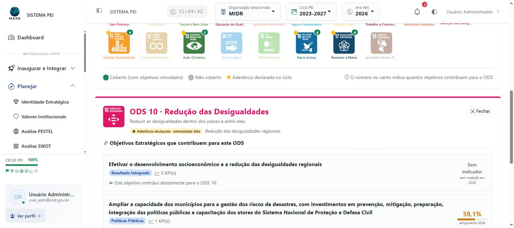

**Clicar num ODS** abre o detalhe:

- Se ele foi declarado, aparecem a intensidade e o texto de contribuição.
- Abaixo vêm os **objetivos que contribuem**, cada um com o **atingimento no ano de referência**, na cor do farol.
- Objetivo sem indicador aparece como **"Sem indicador"**, e não como 0%.

É assim que se responde, numa reunião, à pergunta *"o que estamos entregando para este ODS e como está indo?"*.

### 5.6 Roteiro para apresentar a tela a um gestor (2 minutos)

1. "Aqui estão os ODS da Agenda 2030. Os coloridos são os que a nossa estratégia apoia de fato, porque há objetivo estratégico vinculado. Os cinza não têm objetivo."
2. "A estrela marca o que declaramos, na abertura do ciclo, que iríamos apoiar."
3. "Se há estrela num ODS cinza, o sistema avisa: declaramos e não temos objetivo que sustente. É o ponto de atenção."
4. Clique num ODS colorido: "Estes são os objetivos que contribuem e como cada um está no ano, com a mesma régua de cores do resto do sistema."
5. "Tudo isso é opcional e não altera o cálculo do desempenho. É uma leitura transversal da estratégia."

### 5.7 Perguntas frequentes

- **O painel está todo cinza.** Nenhum objetivo do ciclo selecionado tem ODS. Vincule em *Planejar → Objetivos*. Confira também o seletor de ciclo no topo.
- **Declarei e o ODS continua cinza.** A declaração é intenção, e a cor vem dos objetivos. Esse é exatamente o caso do alerta de coerência.
- **Por que no máximo 3 ODS por objetivo?** Para que o vínculo diga algo: um objetivo marcado em todos os ODS não informa nada.
- **O ODS muda o atingimento?** Não. O atingimento vem dos indicadores e das iniciativas. O ODS é só uma forma de agrupar e ler.

---

## 6. Módulo 03 — Monitorar e Avaliar

### 6.1 Indicadores (KPIs)

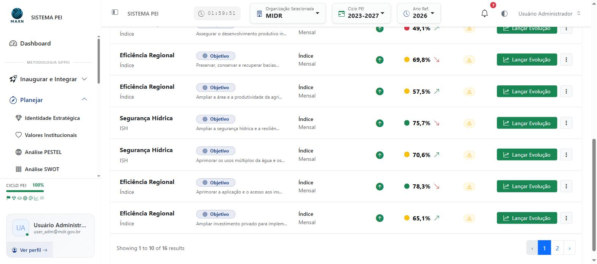

Cada linha traz:

- o vínculo (objetivo ou iniciativa), a unidade e a periodicidade;
- a **polaridade** (seta para cima: quanto maior, melhor; para baixo: quanto menor, melhor);
- a **performance** no ano, com a cor do farol e a tendência;
- os alertas.

**Lançar Evolução** registra o resultado do período. O menu **⋮** dá acesso a ficha, metas, linha de base,
edição e exclusão.

**Ficha técnica** — descrição, fórmula, fonte, vínculo, gráfico previsto × realizado e detalhamento mensal.
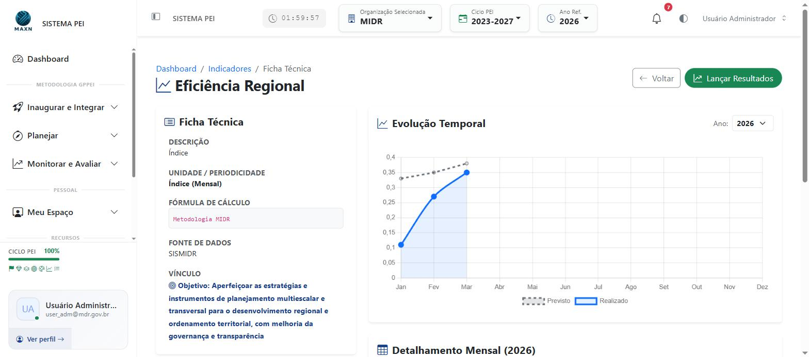

**Lançamento de resultados** — escolha mês e ano, informe **valor previsto** e **valor realizado** (use
vírgula para decimais) e escreva a análise do desempenho. À direita fica o histórico recente com o
atingimento de cada mês.
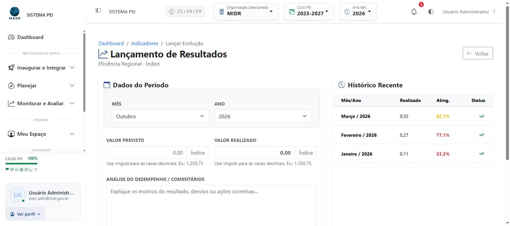

### 6.2 Iniciativas (carteira de projetos e ações)

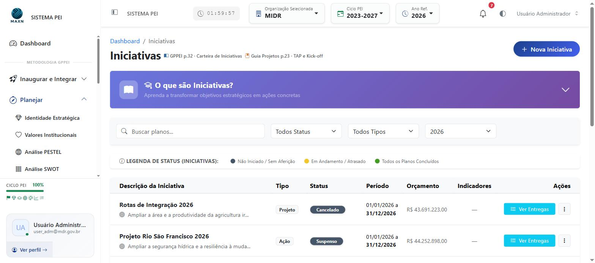

As iniciativas transformam objetivos em entrega. A lista mostra as iniciativas da unidade selecionada (e das
subordinadas) **no ciclo selecionado no topo**. Os filtros são status, tipo e ano. **Ver Entregas** abre o
quadro de entregas, e o menu **⋮** abre ficha, edição, gestores e exclusão.

**Ficha da iniciativa** — objetivo, tipo, organização, período, orçamento e vínculos com PPA/LOA, status de
execução e a **Equipe Responsável**. Nela aparecem os **gestores da iniciativa** (Gestor Responsável e
Substituto) e as pessoas que respondem por alguma entrega.
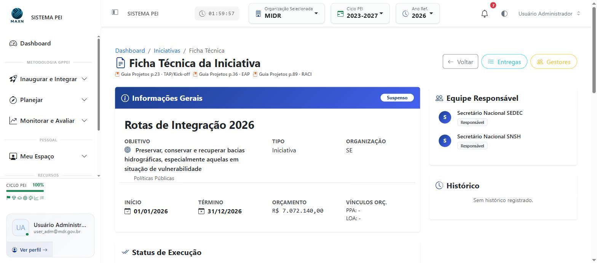

**Entregas** — quadro em Kanban, Lista, Calendário ou Gantt. Cada entrega tem status, prioridade, prazo e
responsáveis. O **Progresso Consolidado** é calculado a partir dos status das entregas.
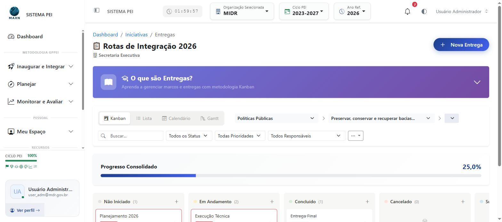

**Gestores e Responsáveis** — o **Administrador da unidade** designa aqui o Gestor Responsável e o
Substituto da iniciativa, escolhendo entre as pessoas da própria unidade. Os Gestores veem a tela, mas não
designam nem se promovem. Abaixo ficam a **Matriz RACI** e o **Plano de Comunicação**.
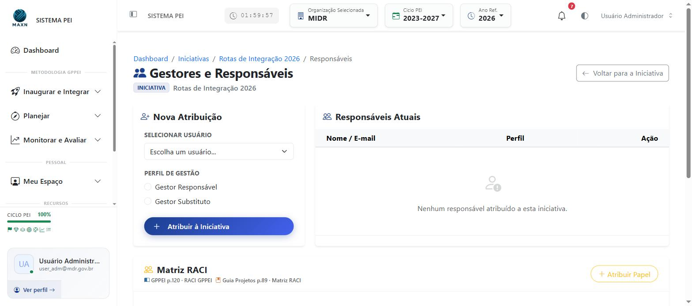

> "Gestor Responsável" é um vínculo **com uma iniciativa específica**, não um crachá geral. Ver [7.6](#76-papéis-e-responsabilidades).

**Quem faz o quê nas iniciativas:**

- **Criar e excluir:** o Administrador da unidade cria a iniciativa e designa os gestores. Excluir a
  iniciativa leva junto as entregas, os indicadores e os vínculos de gestor dela.
- **Atualizar:** o Gestor Responsável atualiza a iniciativa, as entregas (inclusive excluindo) e os
  indicadores dela. O Substituto também, mas sem excluir entregas.

### 6.3 Minhas Entregas

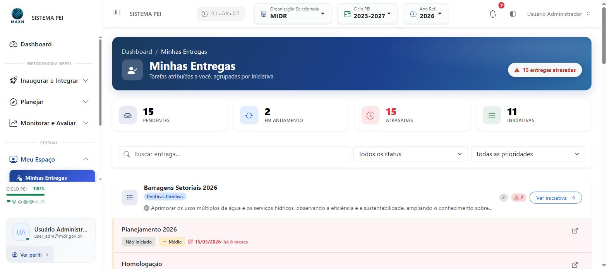

As entregas atribuídas a você, agrupadas por iniciativa, com contadores de pendentes, em andamento e
atrasadas. Entrega com prazo vencido fica destacada em vermelho, com a indicação "há N meses".

### 6.4 Gestão de Riscos

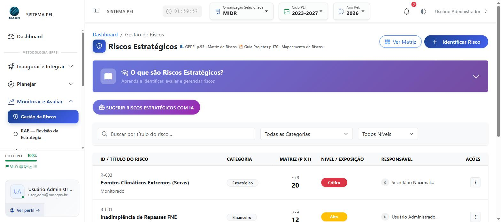

Cada risco tem categoria, probabilidade × impacto (P × I), nível de exposição e responsável.
**Identificar Risco** cria um risco novo. **Sugerir riscos com IA** propõe riscos a partir da estratégia,
e as sugestões sempre são revisadas antes de salvar.

**Matriz 5×5** — posiciona cada risco por probabilidade e impacto. As cores vão do verde (baixo) ao
vermelho (crítico).
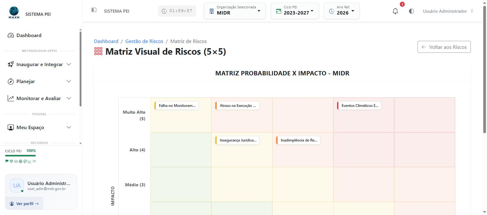

**Planos de mitigação** — ações por risco responsável,
prazo, custo estimado e status. O tipo é **Prevenção** (antes de o risco ocorrer) ou **Contingência** (se ele ocorrer). O prazo vencido aparece em vermelho. No mesmo menu do risco ficam as
**ocorrências** (quando o risco se materializou).
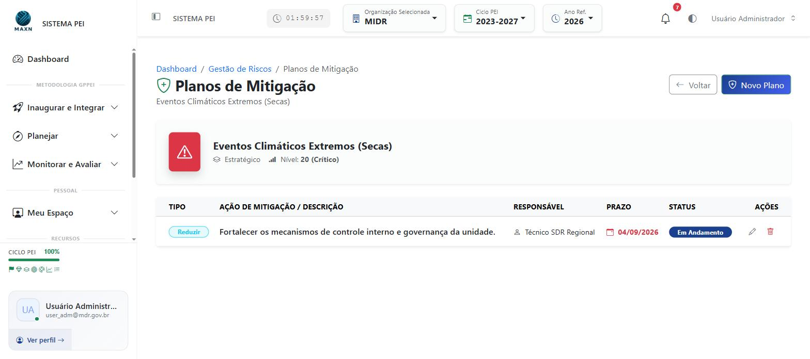

### 6.5 RAE — Revisão e Avaliação da Estratégia

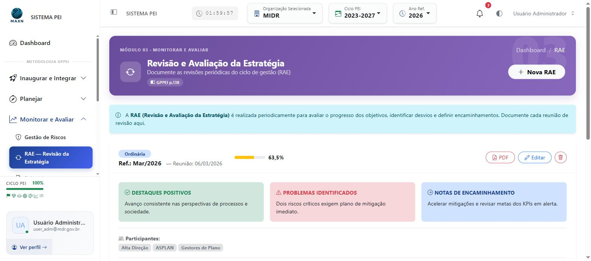

O registro das reuniões periódicas de revisão (GPPEI p. 138). Cada RAE guarda:

- o tipo e a referência;
- o atingimento do momento;
- destaques positivos, problemas e encaminhamentos;
- os participantes.

**PDF** gera a ata da revisão.

### 6.6 Lições Aprendidas

Registro de aprendizados, problemas e boas práticas por iniciativa, com filtro "Todas as Iniciativas" e o
botão **Nova Lição**.

### 6.7 Relatórios

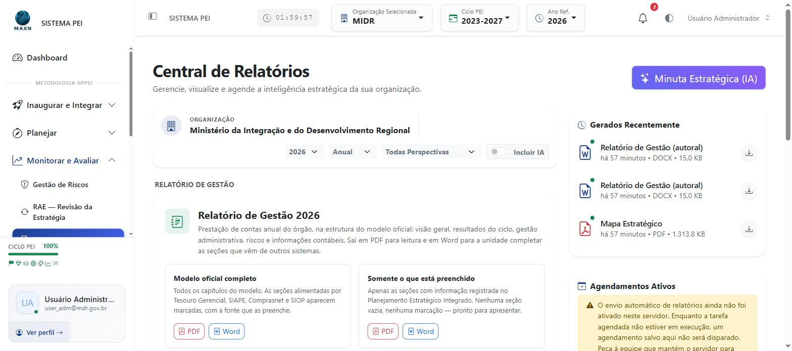

No topo ficam os filtros de ano, período e perspectiva, mais a opção **Incluir IA**.

**Relatório de Gestão** (prestação de contas anual), em duas versões, ambas em PDF ou Word:

| Versão | Conteúdo |
|---|---|
| **Modelo oficial completo** | Todos os capítulos. Seções de outros sistemas (Tesouro Gerencial, SIAPE, Comprasnet, SIOP) aparecem marcadas com a fonte. |
| **Somente o que está preenchido** | Só o que existe no sistema, pronto para apresentar. |

**Catálogo de relatórios:**

- Relatório Estratégico Integrado
- Relatório Executivo
- Mapa Estratégico
- Objetivos Estratégicos (BSC)
- Indicadores
- Iniciativas
- Gestão de Riscos

São gerados em PDF e, quando aplicável, em Excel.

**Minuta Estratégica (IA)** — rascunho de texto estratégico pela IA, para revisão.

**Gerados recentemente** e **Agendamentos** ficam à direita.

> O envio automático agendado só funciona se a tarefa agendada do servidor estiver ativa. A própria tela avisa quando não está.

**Histórico** — os relatórios que você gerou, com data, tipo, formato e filtros:

- **Baixar arquivo** devolve o documento exatamente como foi gerado.
- **Gerar de novo** refaz com os dados de hoje.

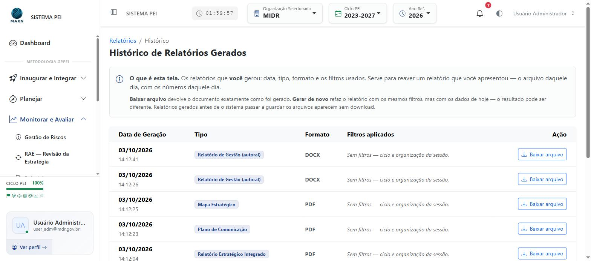

---

## 7. Administração

### 7.1 Organizações

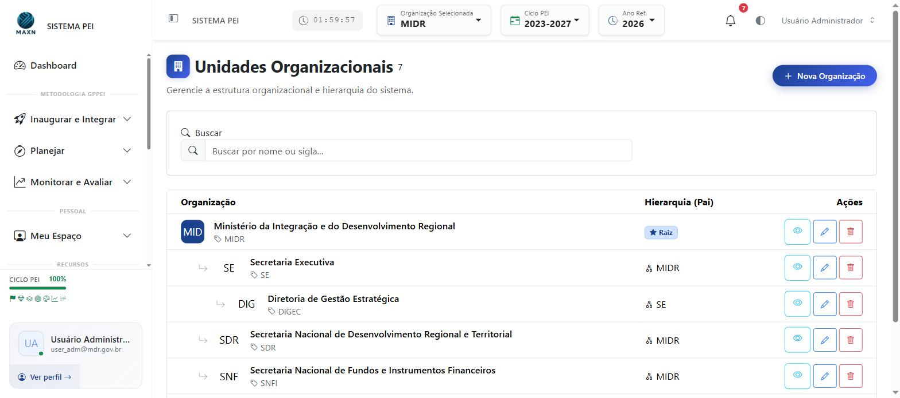

A árvore de unidades (raiz e subordinadas). **Nova Organização**, olho (detalhe: usuários, subunidades,
iniciativas e indicadores da unidade), lápis (editar) e lixeira (excluir).

### 7.2 Usuários

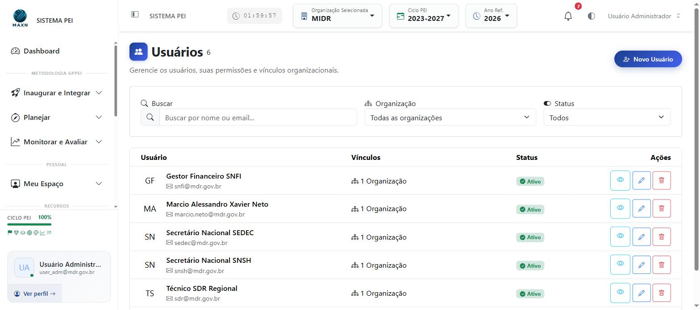

A lista traz busca, filtro por organização e por status (Ativo/Inativo). O Super Administrador vê todos e
é quem cria, edita e exclui usuários. O Administrador da Unidade consulta só os usuários da própria unidade
e das abaixo dela. Gestores e Consulta não acessam o diretório.

Para cada usuário define-se o vínculo — **unidade + perfil**. O vínculo de Gestor com uma iniciativa
específica não é feito aqui, e sim em **Iniciativas → Gestores e Responsáveis** (ver [6.2](#62-iniciativas-carteira-de-projetos-e-ações)).
Editar o usuário preserva esses vínculos de iniciativa.

O detalhe do usuário mostra entregas, última atividade e, para quem tem acesso à auditoria, o histórico de
ações.

**Conta criada pelo autocadastro** ("Criar conta" no login) nasce sem perfil: troca a senha no primeiro
acesso e depois vê só a página "Acesso aguardando liberação". Nenhuma tela restrita abre até um
administrador vinculá-la a uma unidade com um perfil.

### 7.3 Perfis de Acesso

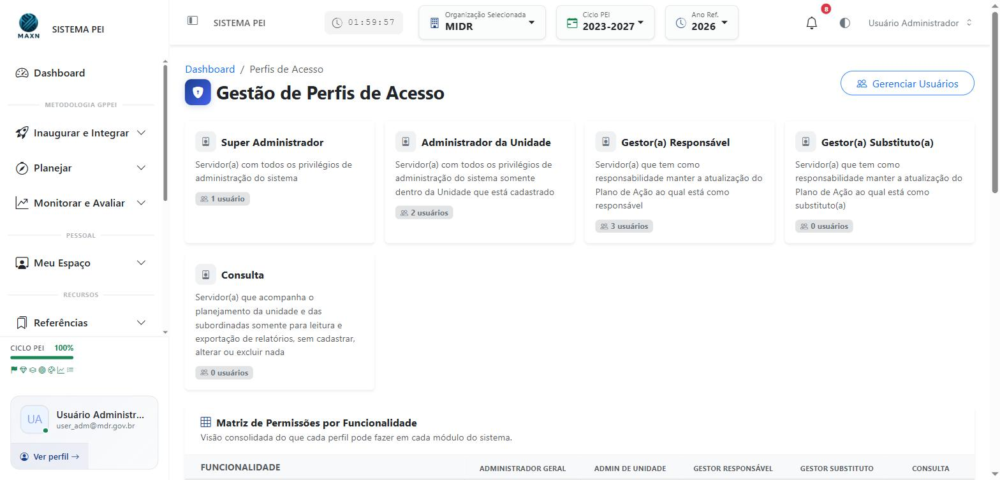

Os cinco perfis, com quantos usuários há em cada um, e a **Matriz de Permissões por Funcionalidade**. A
matriz é lida da mesma regra que o sistema aplica, então o que a tela mostra é o que de fato vale.

| Perfil | Alcance |
|---|---|
| **Super Administrador** | Tudo, em todas as unidades. Único que cria ciclos PEI e usuários. |
| **Administrador da Unidade** | Tudo, na sua unidade e nas subordinadas: cria iniciativas, designa os gestores delas, cuida da missão, valores, análises, riscos e RAE da unidade. |
| **Gestor(a) Responsável** | Lê o planejamento da unidade. Edita **as iniciativas às quais está vinculado**: entregas, indicadores e evolução. Não cria iniciativa nem designa gestores. |
| **Gestor(a) Substituto(a)** | Como o Responsável, sem excluir entregas. |
| **Consulta** | Abre as telas da unidade e das subordinadas e exporta relatórios. Não cadastra, não altera e não exclui nada. |

**Três regras completam a tabela:**

1. **Cada perfil vale na unidade em que foi dado.** Ser Administrador numa unidade não dá poder nenhum em
   outra, nem para quem também tem outro perfil nela. Administrador e Consulta valem também nas unidades
   abaixo; Gestores, só na própria.
2. **O que é da instituição inteira** — perspectivas, objetivos estratégicos, graus de satisfação, cadeia
   de valor e a abertura do ciclo — só o Super Administrador ou o Administrador da **unidade raiz**
   alteram.
3. Botões que o perfil não pode usar **não aparecem**. Se alguém tentar a ação por fora da tela, o sistema
   recusa.

### 7.4 Configuração do Agente de IA

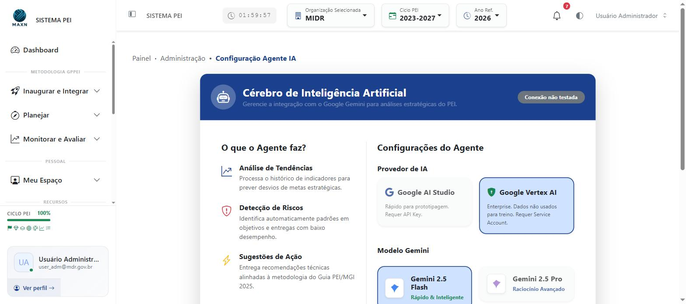

Escolha do provedor (Google AI Studio ou Vertex AI), do modelo e das credenciais. O selo do topo diz se a
conexão foi testada. As credenciais ficam cifradas no banco.

### 7.5 Auditoria

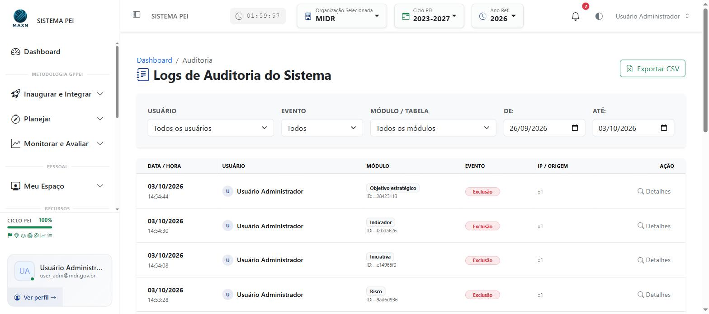

Quem fez o quê e quando. Os filtros são usuário, evento (Criação/Alteração/Exclusão), módulo e período.
**Detalhes** mostra os valores antes e depois. **Exportar CSV** baixa o recorte filtrado.

### 7.6 Papéis e responsabilidades

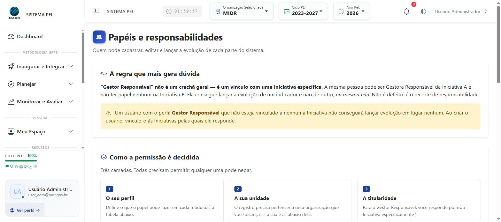

Explica a regra que mais gera dúvida: o Gestor Responsável só age nas iniciativas às quais está
vinculado. A permissão passa por três camadas, **perfil**, **unidade** e **titularidade**, e qualquer uma
pode negar.

### 7.7 Guia GPPEI e Perfil

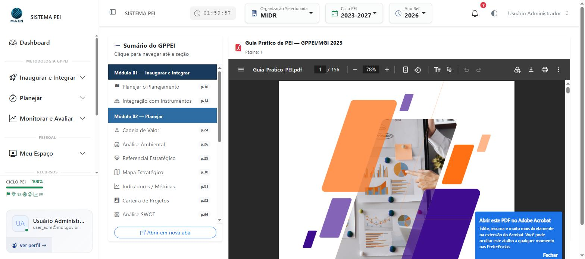

O Guia Prático do MGI embutido, com sumário clicável. As telas do sistema citam a página do guia (ex.:
"GPPEI p.93").

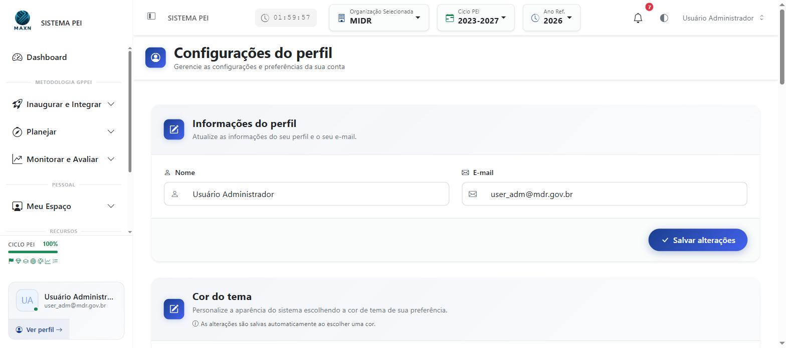

No **Perfil** se trocam nome, e-mail, cor do tema, senha e autenticação em dois fatores, e se encerram as
sessões em outros navegadores.

---

## 8. Documentos (acervo em PDF)

Menu **Recursos → Documentos**. Guarda em um só lugar os PDFs do planejamento: decretos, portarias,
relatórios de gestão, atas, notas técnicas e afins.

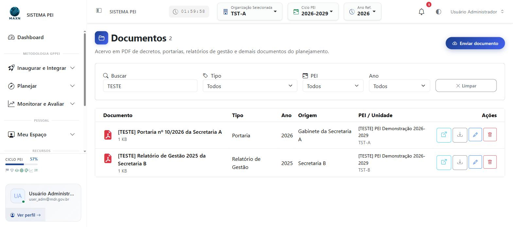

- **Buscar** procura no nome, no número, na origem e na descrição. **Tipo**, **PEI** e **Ano** filtram a
  lista.
- Em cada linha: **Abrir PDF em nova aba**, **Baixar arquivo** (com o nome original) e, se houver, o
  **link oficial**, por exemplo a publicação no Diário Oficial. **Editar** e **Excluir** aparecem só para
  quem pode alterar aquele documento.

### 8.1 Enviar um documento

**Enviar documento** abre o formulário.

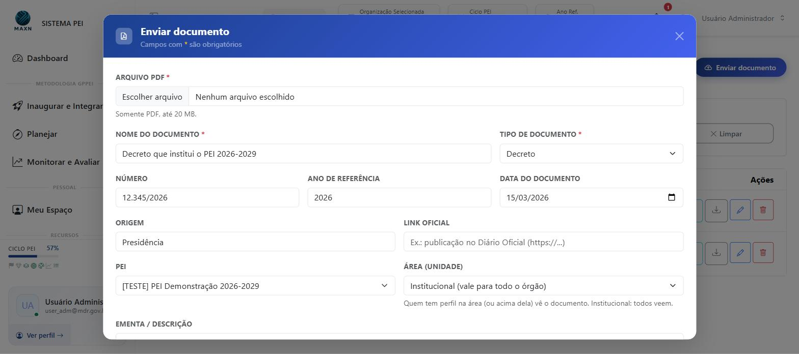

| Campo | Obrigatório | Para que serve |
|---|---|---|
| **Arquivo PDF** | Sim | Só PDF, até 20 MB. O sistema confere o conteúdo do arquivo, não só a extensão. |
| **Nome do documento** | Sim | Como ele aparece na lista. |
| **Tipo de documento** | Sim | Escolhido em uma lista agrupada: atos normativos (lei, decreto, portaria, portaria conjunta, instrução normativa, resolução…), planejamento e gestão, relatórios e prestação de contas, instrumentos e expedientes, referência e orientação. Há **Outro** para o que não se encaixar. |
| **Número** | Não | O número do ato. Ex.: 123/2026. |
| **Ano de referência** | Não | O ano a que o documento se refere. Ex.: o Relatório de Gestão 2025. |
| **Data do documento** | Não | A data de assinatura ou de publicação. |
| **Origem** | Não | O órgão ou a unidade que emitiu. |
| **Link oficial** | Não | Endereço da publicação oficial, começando por https://. |
| **PEI** | Não | O ciclo a que o documento se liga. Vem sugerido o ciclo selecionado no topo. |
| **Área (unidade)** | Não | A unidade dona do documento. **Institucional** vale para o órgão inteiro. |
| **Ementa / descrição** | Não | Do que trata o documento. |

Na edição, o arquivo só é trocado se você escolher outro PDF. Excluir tira o documento do acervo para todos,
e a exclusão fica registrada na auditoria.

### 8.2 Quem vê e quem envia

| Perfil | Vê | Envia, edita e exclui |
|---|---|---|
| **Super Administrador** | Todos | Todos, inclusive os institucionais |
| **Administrador da Unidade** | Os institucionais, os da sua unidade e os das subordinadas | Os da sua unidade e das subordinadas. Institucional só o Administrador da **unidade raiz** |
| **Gestor(a) Responsável e Substituto(a)** | Os institucionais e os da sua unidade | Nada |
| **Consulta** | Os institucionais, os da sua unidade e os das subordinadas | Nada |

O PDF de outra unidade não abre nem pelo endereço direto: o sistema recusa.

---

## 9. Portal da Transparência (sem login)

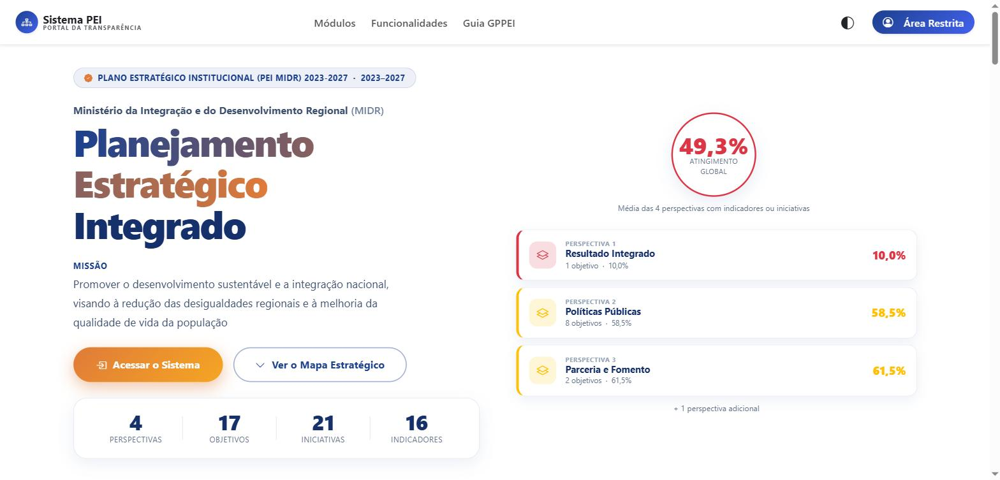

A página inicial pública apresenta:

- o ciclo vigente e a missão;
- o **atingimento global** e o de cada perspectiva;
- as contagens de perspectivas, objetivos, iniciativas e indicadores.

Os números são calculados **pela mesma regra do Dashboard e do Mapa interno**: o cidadão vê o mesmo
número que a gestão.

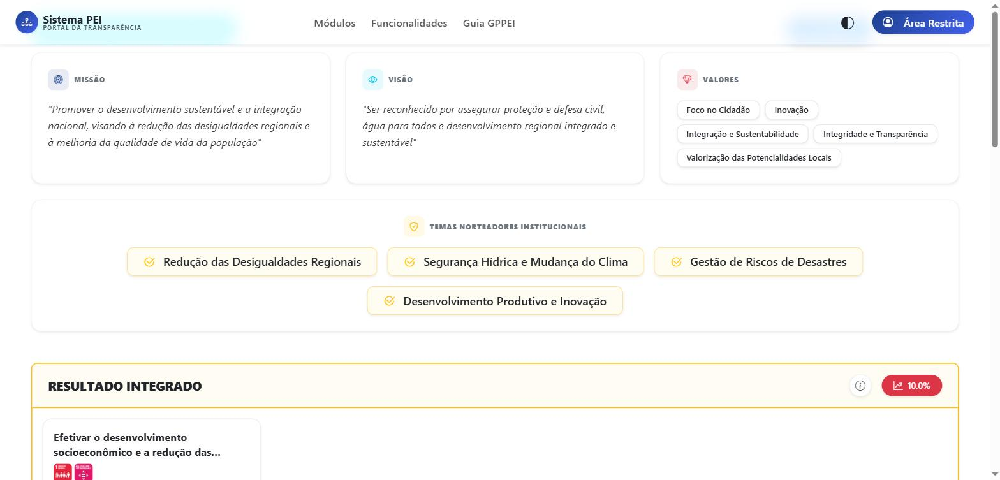
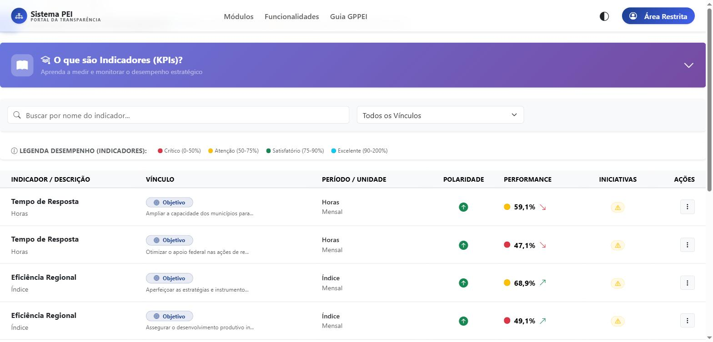
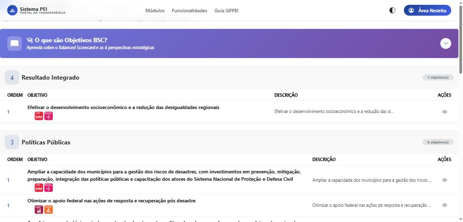

O visitante navega pelo mapa, pelos objetivos, pelos indicadores e pelas iniciativas, e abre as fichas.

**O visitante não pode:**

- criar, editar ou excluir nada;
- usar a IA;
- ver nomes de servidores no histórico.

**Área Restrita** leva ao login.

---

## 10. Como ler os números e as cores

**Atingimento de um indicador** = realizado ÷ meta do período, respeitando a polaridade. Quando "menor é
melhor", a conta se inverte. Indicador **informativo** não entra em média.

**Atingimento de um objetivo e de uma perspectiva** é uma combinação de duas médias, com os **pesos**
definidos na perspectiva:

- a média dos indicadores;
- o progresso das iniciativas, calculado pelas entregas do ano: concluída vale 1, em andamento 0,5, suspensa 0,25, demais 0.

É a mesma conta no Dashboard, no Mapa, nas fichas, nos relatórios e no Portal.

**Cores (farol)** vêm da régua de *Graus de Satisfação* do ciclo ([4.9](#49-graus-de-satisfação-a-régua-do-farol)).
**Cinza** e **"Sem indicador"** significam *sem medição*, não *desempenho ruim*.

**Formato**: números no padrão brasileiro (vírgula decimal, ponto de milhar), datas em dd/mm/aaaa.
