# Manual de Uso — Sistema PEI

> Planejamento Estratégico Integrado · versão 2.1.0

# PARTE I — PRIMEIROS PASSOS

## 1. Apresentação

### 1.1 O que é o Sistema PEI

O **Sistema PEI** é a ferramenta de **Planejamento Estratégico Integrado** do órgão. Nele a
instituição registra o seu plano estratégico — missão, visão, valores, objetivos, indicadores,
iniciativas e entregas — e acompanha, ao longo dos anos, se o plano está dando resultado.

Em vez de planilhas soltas e apresentações que envelhecem na gaveta, tudo fica num só lugar:

- o que a instituição **quer alcançar** (objetivos estratégicos organizados em perspectivas);
- **como vai medir** se alcançou (indicadores, metas anuais e lançamentos mensais);
- **o que vai fazer** para chegar lá (iniciativas e suas entregas, com prazos e responsáveis);
- **o que pode atrapalhar** (riscos, com mitigação e ocorrências);
- **como está indo** (painel, mapa estratégico com farol, relatórios e a revisão periódica da
  estratégia).

O sistema também mantém um **Portal da Transparência**, aberto ao cidadão sem login, que mostra o
mapa estratégico e os resultados em modo somente leitura (ver capítulo 35).

### 1.2 A metodologia: o GPPEI/MGI 2025

O sistema segue o guia de planejamento estratégico publicado pelo Ministério da Gestão e da
Inovação em Serviços Públicos em 2025, chamado no sistema de **GPPEI/MGI 2025**. O guia completo
está disponível dentro do próprio sistema, em **Referências → Guia GPPEI** (ver capítulo 28), e
muitas telas indicam a página do guia que trata do assunto (por exemplo, "GPPEI p. 32").

O guia organiza o trabalho em **três módulos**, e o menu lateral do sistema segue a mesma ordem:

| Módulo do GPPEI | O que se faz nele | Onde fica no sistema |
|---|---|---|
| **01 — Inaugurar e Integrar** | Abrir o ciclo de planejamento, montar a equipe, planejar o processo e alinhar o plano a outros instrumentos de governo (PPA, LOA, Agenda 2030, planos setoriais). | Menu **Inaugurar e Integrar** |
| **02 — Planejar** | Cadeia de valor, análise do ambiente (PESTEL e SWOT), missão, visão e valores, perspectivas, objetivos, mapa estratégico, indicadores, iniciativas e entregas. | Menu **Planejar** |
| **03 — Monitorar e Avaliar** | Lançar resultados, acompanhar riscos, fazer a Revisão e Avaliação da Estratégia (RAE), registrar lições aprendidas e gerar relatórios. | Menu **Monitorar e Avaliar** |

Além dos três módulos, o menu traz o **Meu Espaço** (as suas entregas), os **Recursos**
(acervo de documentos e guias de referência) e a **Administração** (unidades, usuários, perfis,
configurações e auditoria).

### 1.3 Para quem é este manual

Este manual é para quem vai **usar** o sistema no dia a dia:

- a **equipe de planejamento** que conduz o ciclo e cadastra o plano;
- os **gestores de iniciativas**, que atualizam entregas e lançam a evolução dos indicadores;
- os **pontos focais das unidades**, que acompanham o planejamento da sua área;
- a **alta gestão**, que consulta o painel, o mapa e os relatórios.

Não é preciso conhecer tecnologia nem ser especialista em planejamento. Cada tela tem, no próprio
sistema, uma seção educativa "O que é…" que explica o conceito (ver seção 3.8), e o glossário do
capítulo 39 traduz os termos técnicos.

### 1.4 Como ler este manual

- **Caminho de menu** é escrito com setas: **Planejar → Objetivos Estratégicos** significa abrir o
  grupo **Planejar** no menu lateral e clicar em **Objetivos Estratégicos**.
- **Nomes de botões, menus e campos** aparecem em **negrito**, exatamente como na tela.
- Cada tela é explicada sempre na mesma ordem: **Para que serve**, **Como chegar**, **Quem pode**,
  **O que aparece na tela**, **Passo a passo**, **Campos do formulário**, **Regras e validações**,
  **Dicas** e **Cuidados**.
- **Figuras** mostram a tela real com dados de demonstração da **Agência Federal de Exemplo (AFE)**
  e de suas unidades **SPG** (Secretaria de Planejamento e Gestão), **DTI** (Diretoria de
  Tecnologia, subordinada à SPG) e **DAC** (Diretoria de Atendimento). Os nomes de pessoas são
  fictícios: Carla Ribeiro (Administradora da SPG), Rafael Lima (Gestor Responsável), Juliana Costa
  (Gestora Substituta) e Paulo Nogueira (Consulta).
- **"Ver seção N.M"** indica onde outro assunto é explicado em detalhe.
- O que você vê depende do seu **perfil de acesso**. Se um botão descrito aqui não aparece para
  você, o seu perfil não tem aquela permissão (ver capítulo 4).

> **Antes de tudo:** quase todas as telas mostram os dados da **unidade**, do **ciclo** e do
> **ano** escolhidos no topo da tela. Quando uma tela parecer vazia, confira primeiro esses três
> seletores (ver seções 3.3 a 3.5).

---

## 2. Acesso ao sistema

### 2.1 Como recebo o meu acesso

**Para que serve:** saber como a conta é criada evita procurar um "Criar conta" que não existe.

O sistema **não tem autocadastro**: não existe opção "Criar conta" na tela de entrada. As contas são
criadas por um **Super Administrador**, na tela **Administração → Usuários** (ver capítulo 30), que
também define a sua **unidade** e o seu **perfil**. O acesso inicial chega de uma de duas formas,
conforme a escolha de quem cadastrou:

1. **Link de boas-vindas por e-mail** — você recebe uma mensagem com o assunto "Bem-vindo ao
   Sistema de Planejamento Estratégico Integrado (PEI)" e um link para cadastrar a sua senha. O link
   vale por **60 minutos**. Esta forma só funciona se o envio de e-mail estiver configurado no seu
   órgão.
2. **Senha inicial definida pelo administrador** — o administrador informa a senha a você por outro
   meio. Nesse caso, normalmente o cadastro exige a **troca da senha no primeiro acesso** (ver
   seção 2.4).

Se o link expirou ou você não recebeu nada, procure o administrador do sistema no seu órgão.

### 2.2 Entrar no sistema (login)

**Para que serve:** identificar você para que o sistema mostre apenas o que o seu perfil e a sua
unidade permitem.

**Como chegar:** abra o endereço do sistema no navegador e clique em **Área Restrita** no portal
público, ou acesse diretamente a página de entrada.

A Figura a seguir mostra a página de entrada. À esquerda fica a apresentação do sistema (os três
módulos do GPPEI); à direita, o quadro **Entrar no Sistema**.

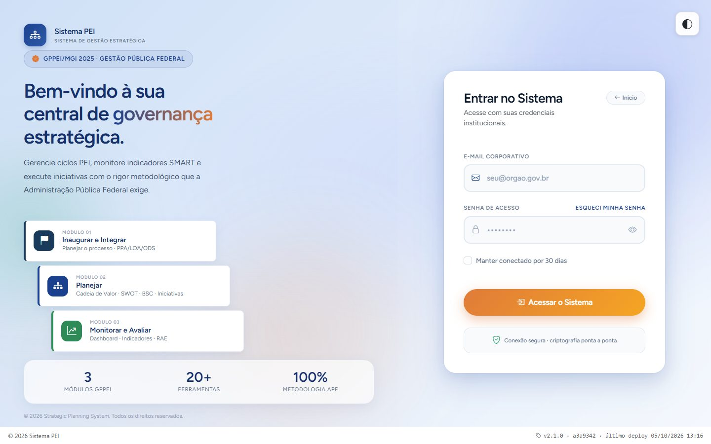
*Figura 1 — Tela de entrada do Sistema PEI.*

O que aparece na tela:

| Elemento | O que é |
|---|---|
| **E-mail Corporativo** | O seu e-mail institucional, o mesmo cadastrado pelo administrador. |
| **Senha de Acesso** | A sua senha. O ícone de **olho** no fim do campo mostra ou oculta o que você digitou. |
| **Esqueci minha senha** | Abre a página para pedir um link de redefinição de senha (ver seção 2.5). |
| **Manter conectado por 30 dias** | Se marcado, o navegador lembra o seu login. Use só em computador de uso pessoal. |
| **Acessar o Sistema** | Envia os dados. Enquanto confere, o botão mostra "Validando credenciais...". |
| **Início** | Volta para a página inicial pública (Portal da Transparência). |
| Botão de **meio círculo** (canto superior direito) | Alterna entre tema claro e escuro. |
| Rodapé | Mostra a versão do sistema em uso e a data do último deploy (ver seção 3.9). |

**Passo a passo:**

1. Digite o seu **E-mail Corporativo**.
2. Digite a **Senha de Acesso**.
3. Se estiver no seu computador pessoal e quiser evitar novo login, marque **Manter conectado por 30
   dias**.
4. Clique em **Acessar o Sistema**.
5. Se a sua conta tiver a **autenticação em dois fatores** ativada (ver capítulo 34), o sistema pede
   em seguida o **código** gerado pelo seu aplicativo autenticador. Sem o celular, use **Usar um
   código de recuperação** e digite um dos códigos de recuperação que você guardou.
6. Você chega ao **Dashboard** (ver capítulo 5). Se a sua conta exigir troca de senha, o sistema
   leva antes à tela **Troca de Senha** (seção 2.4).

**Regras e validações (mensagens que podem aparecer):**

| Mensagem | O que significa | O que fazer |
|---|---|---|
| "Estas credenciais não correspondem aos nossos registros." | E-mail ou senha errados. | Confira o e-mail e a senha (atenção a maiúsculas). Se não lembrar, use **Esqueci minha senha**. |
| "Sua conta está inativa. Entre em contato com o administrador." | A conta foi desativada (ver seção 37.7). | Procure o administrador do sistema. |
| "Muitas tentativas de login. Tente novamente em N segundos." | Foram feitas mais de 5 tentativas em um minuto com o mesmo e-mail, no mesmo computador. | Aguarde o tempo indicado. |

**Cuidados:**

- Não marque **Manter conectado por 30 dias** em computador compartilhado.
- Mesmo com essa opção marcada, o contador de sessão do topo continua valendo enquanto a tela está
  aberta: ao zerar, o sistema encerra a sessão (seção 2.3).

### 2.3 Sessão e tempo de inatividade

**Para que serve:** proteger os dados quando alguém se afasta do computador com o sistema aberto.

No topo da tela, à esquerda dos seletores, há um **relógio** com o **tempo restante da sessão** no
formato horas:minutos:segundos (por exemplo, **01:59:59**). O tempo total é definido pela equipe de
TI do órgão; na instalação padrão, são **2 horas**.

Como o contador funciona:

- **Qualquer atividade renova o tempo**: clicar, digitar, rolar a página ou navegar entre telas. A
  renovação acontece no máximo a cada 30 segundos de atividade.
- O número fica **amarelo** quando faltam **5 minutos** ou menos e **vermelho** quando faltam **2
  minutos** ou menos.
- Faltando 2 minutos, aparece o aviso **"Sua sessão expirará em breve!"** com a orientação
  "Qualquer interação renovará o tempo automaticamente."
- Ao **zerar**, o sistema encerra a sessão e leva você de volta à tela de entrada.
- Se a sessão expirar por outro motivo (por exemplo, o computador hibernou), a próxima ação na tela
  também leva à tela de entrada.

> O relógio aparece em telas largas (computador). No celular ou em janela estreita, ele fica oculto,
> mas a sessão expira do mesmo jeito.

**Cuidado:** um formulário preenchido e não salvo é perdido se a sessão expirar. Em textos longos,
salve com frequência.

### 2.4 Troca de senha obrigatória no primeiro acesso

**Para que serve:** garantir que só você conheça a sua senha quando ela foi definida por outra
pessoa.

Quando o administrador marca, no cadastro, **Exigir Troca de Senha → Sim — no próximo acesso**, o
sistema, logo depois do login, abre a tela **Troca de Senha** ("Você precisa definir uma nova senha
para continuar acessando o sistema."). Enquanto a senha não for trocada, **nenhuma outra tela
abre**: qualquer endereço digitado leva de volta a esta tela.

**Campos do formulário:**

| Campo | Obrigatório | O que informar | Exemplo |
|---|---|---|---|
| **Senha Atual** | Sim | A senha que você recebeu do administrador. | — |
| **Nova Senha** | Sim | A nova senha. Abaixo do campo, uma lista mostra a **força da senha** e marca cada requisito atendido enquanto você digita. | Planej@2026 |
| **Confirmar Nova Senha** | Sim | A mesma nova senha, repetida. | Planej@2026 |

Requisitos da nova senha (os mesmos em todo o sistema):

- mínimo de **8 caracteres**;
- ao menos **uma letra maiúscula**, **uma minúscula**, **um número** e **um caractere especial**
  (como @, #, !);
- **diferente** da senha atual.

**Passo a passo:**

1. Digite a **Senha Atual**.
2. Digite a **Nova Senha** e observe a lista de requisitos até todos ficarem marcados.
3. Repita a senha em **Confirmar Nova Senha**.
4. Clique em **Atualizar Senha** (o botão só fica disponível quando os requisitos são atendidos).
5. O sistema grava a nova senha, **encerra a sessão** e volta à tela de entrada com a mensagem
   "Senha alterada com sucesso! Faça login com a nova senha."
6. Entre de novo, agora com a nova senha.

Se preferir trocar depois, use **Sair e trocar depois**: a sessão é encerrada, e a troca será pedida
no próximo login.

**Mensagens de validação:**

| Mensagem | Causa |
|---|---|
| "A senha atual está incorreta." | A senha atual digitada não confere. |
| "A nova senha deve ter no mínimo 8 caracteres." | Senha curta. |
| "A senha deve conter letra maiúscula, letra minúscula, número e caractere especial." | Falta algum tipo de caractere. |
| "A nova senha deve ser diferente da senha atual." | A nova senha é igual à atual. |
| "A confirmação da nova senha não confere." | Os dois campos de nova senha estão diferentes. |

### 2.5 Esqueci a minha senha

**Para que serve:** criar uma nova senha sem depender do administrador — **desde que o envio de
e-mail esteja configurado no seu órgão**.

**Passo a passo:**

1. Na tela de entrada, clique em **Esqueci minha senha**.
2. Informe o seu **e-mail** e clique em **Enviar link de redefinição de senha**.
3. Se tudo der certo, aparece "Enviamos por e-mail o link para redefinir sua senha."
4. Abra o e-mail e clique no link. Ele vale por **60 minutos**.
5. Defina a nova senha (mesmos requisitos da seção 2.4) e confirme.
6. Entre com a nova senha.

**Mensagens possíveis:**

| Mensagem | O que significa |
|---|---|
| "Não encontramos um usuário com este e-mail." | O e-mail digitado não está cadastrado. Confira a grafia. |
| "Aguarde antes de tentar novamente." | Um novo pedido só pode ser feito depois de 60 segundos do anterior. |
| "Este link de redefinição de senha é inválido." | O link expirou ou já foi usado. Peça um novo. |

**Se o e-mail não chegar:** confira a caixa de spam. Se mesmo assim nada chegar, o envio de e-mail
pode estar desligado no servidor do seu órgão: procure o **administrador do sistema**, que pode
definir uma nova senha inicial para você na tela de Usuários.

### 2.6 Conta sem perfil de acesso ("Acesso aguardando liberação")

**Para que serve:** impedir que uma conta sem permissão definida enxergue dados restritos.

Toda conta precisa de pelo menos um **vínculo**: uma **unidade** combinada com um **perfil** (ver
capítulo 4). Se você entrar com uma conta que ainda não tem nenhum vínculo, o sistema mostra apenas
a página **Acesso aguardando liberação**, com o texto: "Sua conta foi criada, mas ainda não tem um
perfil de acesso. Um administrador precisa vincular você a uma unidade e definir o seu perfil (por
exemplo, Gestor de uma iniciativa ou Consulta)."

Nessa situação:

- nenhuma tela da área restrita abre; qualquer endereço leva de volta a essa página;
- o único botão disponível é **Sair**;
- peça ao administrador do sistema que faça o vínculo; depois disso, **entre de novo** e as telas da
  sua unidade aparecerão.

> Se a conta também estiver com troca de senha pendente, a troca é pedida primeiro (seção 2.4) e,
> depois dela, aparece a página de acesso pendente.

### 2.7 Sair do sistema

Há três formas de encerrar a sessão:

1. No canto superior direito, clique no **seu nome** e depois em **Sair**.
2. No celular, abra o menu (ícone de três linhas no topo) e use o botão **Sair**, no rodapé do menu.
3. Deixe o contador de sessão zerar (seção 2.3).

**Dica:** sempre use **Sair** ao terminar em computador compartilhado. Fechar apenas a aba não
encerra a sessão imediatamente.

---

## 3. Conhecendo a tela

### 3.1 Visão geral da tela

Todas as telas da área restrita têm a mesma moldura:

- à **esquerda**, o **menu lateral**, com a barra de progresso do ciclo e o cartão do usuário;
- no **topo**, a barra com o relógio de sessão, os **três seletores** (unidade, ciclo e ano), o
  **sino** de notificações, o botão de **tema** e o **seu nome**;
- no **centro**, o conteúdo da tela escolhida;
- no **rodapé**, a versão do sistema.

A figura abaixo mostra a moldura completa, com o **Dashboard** aberto para o Super Administrador.

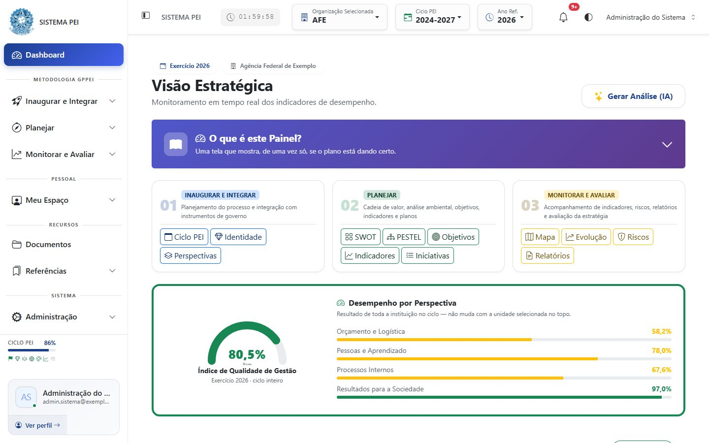
*Figura 2 — Moldura do sistema: menu lateral, barra superior e conteúdo.*

Na figura, de cima para baixo e da esquerda para a direita:

- **Brasão e "SISTEMA PEI"** (topo do menu): clicar leva ao **Dashboard**.
- **Dashboard**: item em destaque (fundo azul) porque é a tela aberta.
- **Separadores** em letras pequenas (**METODOLOGIA GPPEI**, **PESSOAL**, **RECURSOS**, **SISTEMA**)
  agrupam os itens do menu.
- **Inaugurar e Integrar**, **Planejar**, **Monitorar e Avaliar**, **Meu Espaço**, **Referências** e
  **Administração**: grupos que se abrem ao clicar (a seta **˅** indica que há subitens).
- **Documentos**: item direto, sem subitens.
- **CICLO PEI 86%** e a fileira de ícones: barra de progresso do ciclo (seção 3.7).
- **Cartão do usuário** (rodapé do menu): iniciais, nome, e-mail e o link **Ver perfil →**.
- **Ícone de painel** (à esquerda de "SISTEMA PEI", no topo): recolhe ou expande o menu lateral.
- **01:59:59**: tempo restante da sessão (seção 2.3).
- **Organização Selecionada AFE**, **Ciclo PEI 2024-2027** e **Ano Ref. 2026**: os três seletores
  (seções 3.3 a 3.5).
- **Sino** com o número **9+**: notificações (seção 3.6).
- **Meio círculo**: tema claro, escuro ou automático (seção 3.8).
- **Administração do Sistema ˄˅**: o seu nome; abre o menu da conta (seção 3.2).

### 3.2 O menu lateral

**Para que serve:** levar a qualquer tela do sistema, na ordem dos módulos do GPPEI.

O menu mostra **apenas os itens que o seu perfil pode abrir**. Um Gestor, por exemplo, não vê
**Usuários** nem **Auditoria**. Grupos que ficariam vazios para o seu perfil não aparecem.

Itens do menu e o que cada um abre (o capítulo indicado explica a tela):

| Grupo | Item | Capítulo |
|---|---|---|
| — | **Dashboard** | 5 |
| Inaugurar e Integrar | **Ciclos PEI** (só Super Administrador) | 6 |
| | **Inaugurar e Integrar** | 7 |
| | **Cadeia de Valor** | 8 |
| Planejar | **Identidade Estratégica** | 9 |
| | **Valores Institucionais** | 10 |
| | **Análise PESTEL** | 12 |
| | **Análise SWOT** | 13 |
| | **Temas Norteadores** | 11 |
| | **Perspectivas BSC** | 14 |
| | **Objetivos Estratégicos** | 15 |
| | **Agenda 2030 (ODS)** | 18 |
| | **Graus de Satisfação** | 17 |
| | **Indicadores** | 19 |
| | **Iniciativas** | 20 |
| | **Gerenciar Entregas** | 21 |
| | **Mapa Estratégico** | 16 |
| Monitorar e Avaliar | **Gestão de Riscos** | 23 |
| | **RAE — Revisão da Estratégia** | 24 |
| | **Relatórios** e **Histórico de Relatórios** | 26 |
| | **Lições Aprendidas** | 25 |
| Meu Espaço | **Minhas Entregas** | 22 |
| — | **Documentos** | 27 |
| Referências | **Guia GPPEI** e **Guia de Projetos** | 28 |
| Administração | **Organizações** | 29 |
| | **Usuários** | 30 |
| | **Papéis e Responsabilidades** | 4 |
| | **Perfis de Acesso**, **Configurações**, **Auditoria** (só Super Administrador) | 31, 32, 33 |

**Como usar:**

1. Clique no nome do grupo (por exemplo, **Planejar**) para abri-lo. Abrir um grupo fecha o que
   estava aberto.
2. Clique no item desejado. O item da tela aberta fica destacado em azul, e o grupo dele já vem
   aberto.
3. Para ganhar espaço, clique no **ícone de painel** no topo da tela: o menu fica só com os ícones.
   Passe o mouse sobre um ícone para ver o nome. Clique de novo para expandir. O sistema lembra a
   sua escolha neste navegador.

**No celular ou em janela estreita**, o menu lateral fica escondido. Toque no ícone de **três
linhas** no canto superior esquerdo: o menu abre por cima da tela, com o seu nome, os **três
seletores** (que no celular só aparecem aqui), todos os itens e, no rodapé, os botões **Gerenciar
perfil** e **Sair**.

**Menu da conta:** clicar no **seu nome**, no canto superior direito, abre **Gerenciar conta** com
as opções **Perfil** (seus dados, senha e autenticação em dois fatores — capítulo 34) e **Sair**. O
link **Ver perfil →**, no cartão do rodapé do menu, leva à mesma tela de perfil.

### 3.3 Seletor de unidade ("Organização Selecionada")

**Para que serve:** escolher **de qual unidade** são os dados mostrados nas telas. Iniciativas,
entregas, riscos, identidade estratégica, análises e relatórios são registrados por unidade.

**Quem pode:** todos os perfis. A lista mostra apenas as unidades que você pode ver:

- **Super Administrador**: todas as unidades;
- **Administrador da Unidade** e **Consulta**: a unidade do vínculo **e todas as subordinadas** a
  ela;
- **Gestor(a) Responsável** e **Gestor(a) Substituto(a)**: apenas a unidade do vínculo.

Clique no seletor **Organização Selecionada** para abrir a lista **UNIDADES ORGANIZACIONAIS**, como
na figura.

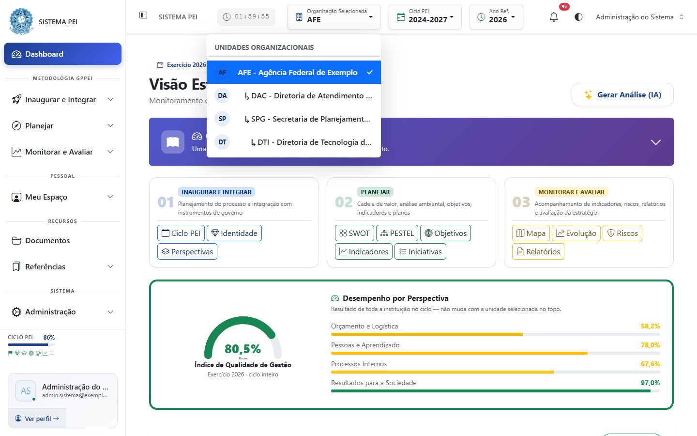
*Figura 3 — Seletor de unidade aberto.*

O que aparece:

- Cada linha tem um **círculo com as duas primeiras letras da sigla** (AF, DA, SP, DT) e o nome
  completo no formato **SIGLA - Nome**.
- O sinal **↳** e o recuo mostram a hierarquia: na figura, **DAC** e **SPG** estão abaixo da **AFE**,
  e **DTI** está abaixo da **SPG**.
- A unidade em uso fica com **fundo azul** e um **visto (✓)**.
- No botão do seletor aparece só a **sigla** da unidade em uso (na figura, **AFE**).

**Passo a passo:**

1. Clique em **Organização Selecionada**.
2. Clique na unidade desejada.
3. A tela é recarregada com os dados da nova unidade. A escolha vale para todas as telas até você
   trocar de novo ou sair do sistema.

**Regras:**

- Se você não escolher nenhuma, o sistema seleciona automaticamente a **primeira unidade do seu
  escopo** (o Super Administrador começa pela unidade raiz).
- Algumas informações são **da instituição inteira** e **não mudam** com a unidade: perspectivas,
  objetivos estratégicos, graus de satisfação, cadeia de valor e o Índice de Qualidade de Gestão do
  Dashboard. A tela avisa quando é o caso.
- Várias telas consideram a unidade selecionada **e as subordinadas** (por exemplo, a lista de
  riscos). Outras consideram só a unidade exata. Cada capítulo informa a regra da sua tela.

### 3.4 Seletor de ciclo ("Ciclo PEI")

**Para que serve:** escolher **qual plano estratégico** está sendo visto. Um ciclo PEI cobre um
período de anos (por exemplo, 2024-2027) e tem as próprias perspectivas, objetivos, indicadores,
iniciativas, riscos e régua de cores.

Clique em **Ciclo PEI** para abrir a lista **CICLOS DE PLANEJAMENTO**.

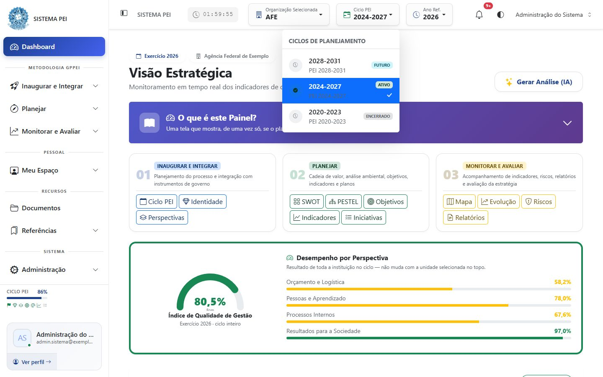
*Figura 4 — Seletor de ciclo aberto.*

O que aparece em cada linha:

- o **período** em destaque (por exemplo, **2028-2031**) e, abaixo, o **nome do ciclo** (PEI
  2028-2031);
- um selo de situação, calculado pelo ano de hoje:
  - **ATIVO** (verde): o ano atual está dentro do período do ciclo;
  - **FUTURO** (azul): o ciclo ainda não começou;
  - **ENCERRADO** (cinza): o período já terminou;
- o ciclo em uso fica com **fundo azul** e um **visto (✓)**.

Os ciclos aparecem do mais recente para o mais antigo.

**Passo a passo:**

1. Clique em **Ciclo PEI**.
2. Clique no ciclo desejado.
3. A tela é recarregada com os dados do novo ciclo.

**Regras:**

- No primeiro acesso, o sistema seleciona o ciclo **ATIVO**.
- **O ano acompanha o ciclo:** se o ano de referência em uso não pertence ao ciclo escolhido, o
  sistema muda o ano automaticamente — para o ano atual, se ele estiver dentro do ciclo, ou para o
  primeiro ano do ciclo.
- Só o **Super Administrador** cria, altera e exclui ciclos (capítulo 6).

### 3.5 Seletor de ano ("Ano Ref.")

**Para que serve:** escolher o **ano de referência** — o exercício usado para metas, resultados,
atingimento, farol e progresso das iniciativas.

Clique em **Ano Ref.** para abrir a lista **SELECIONAR ANO DE REFERÊNCIA**.

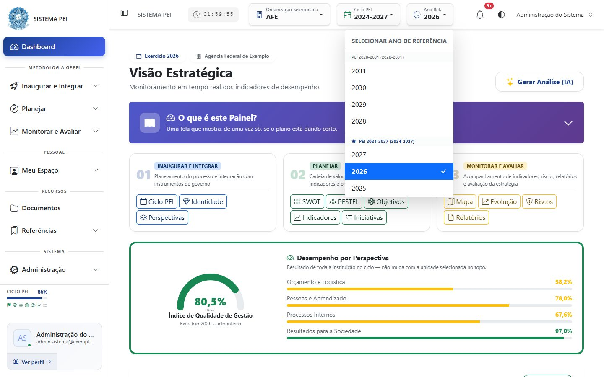
*Figura 5 — Seletor de ano aberto.*

O que aparece:

- os anos ficam **agrupados por ciclo**, com o nome e o período do ciclo como título de cada grupo
  (na figura, **PEI 2028-2031 (2028-2031)** e **PEI 2024-2027 (2024-2027)**);
- o grupo do **ciclo em uso** tem uma **estrela** e o título em azul;
- dentro de cada grupo, os anos vêm do mais recente para o mais antigo;
- o ano em uso fica com **fundo azul** e um **visto (✓)**;
- a lista tem barra de rolagem: role para ver os demais anos e ciclos.

**Passo a passo:**

1. Clique em **Ano Ref.**
2. Clique no ano desejado.
3. A tela é recarregada com os dados do ano.

**Regra importante — o ciclo acompanha o ano:** se você escolher um ano que **não pertence** ao
ciclo em uso, o sistema troca o ciclo automaticamente para aquele que contém o ano. Exemplo: com o
ciclo 2024-2027 em uso, escolher **2029** muda o ciclo para **PEI 2028-2031**.

**Dica:** para ver o ano fechado de um exercício anterior (por exemplo, 2025), escolha esse ano.
Para anos que já passaram, os cálculos consideram os 12 meses; para o ano corrente, consideram de
janeiro até o mês atual (ver capítulo 36).

### 3.6 O sino: Alertas e Atividade

**Para que serve:** avisar o que mudou e o que merece atenção, sem precisar abrir tela por tela.

O **sino** fica no canto superior direito. O número vermelho sobre ele soma os **alertas não lidos**
e as **atividades novas** (acima de 9, mostra **9+**). Os contadores se atualizam sozinhos a cada
minuto. Clique no sino para abrir o painel, que tem duas abas.

#### 3.6.1 Aba Alertas

A aba **Alertas** mostra os **Alertas Estratégicos** dirigidos a você, na unidade selecionada (e os
gerais, sem unidade). A figura mostra a aba aberta, sem alertas.

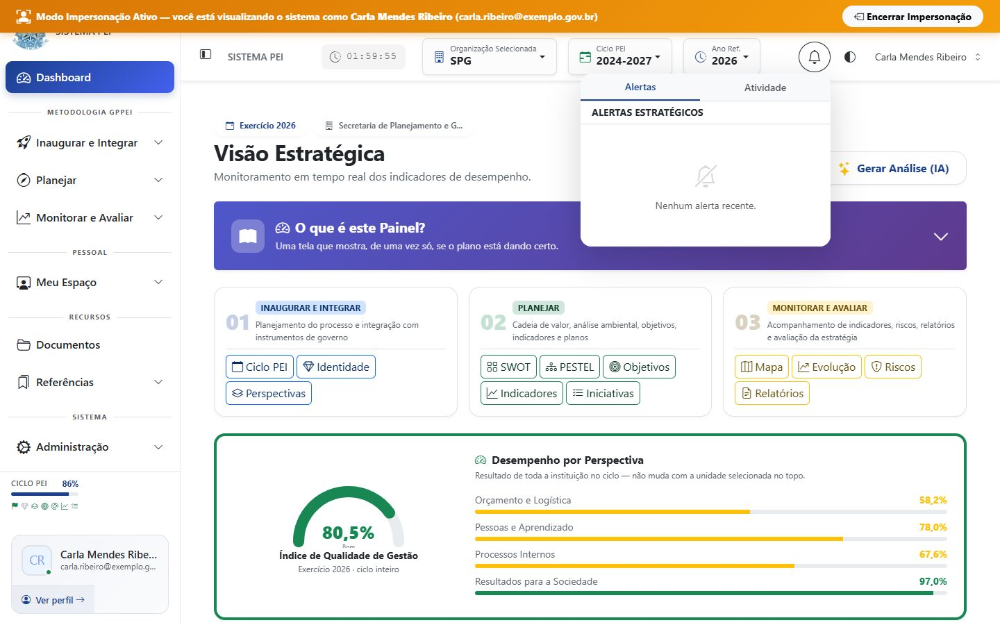
*Figura 6 — Sino aberto na aba Alertas.*

Nesta figura, a faixa laranja no alto ("**Modo Impersonação Ativo** — você está visualizando o
sistema como Carla Mendes Ribeiro…") indica que o Super Administrador está vendo o sistema como a
usuária Carla (ver capítulo 31). Fora dessa situação, a faixa não aparece.

O que aparece na aba:

- o título **ALERTAS ESTRATÉGICOS** e, se houver alertas não lidos, o link **Marcar como lidas**;
- até **5 alertas mais recentes**, cada um com ícone, título, mensagem e há quanto tempo foi criado;
- alertas não lidos aparecem com fundo azulado;
- sem alertas, aparece "Nenhum alerta recente."

De onde vêm os alertas:

- **Tendência desfavorável** de um indicador: ao lançar a evolução de um indicador (capítulo 19), se
  os últimos lançamentos mostram tendência contrária à polaridade, o sistema cria o alerta
  "Tendência Desfavorável: *nome do indicador*", com a orientação "Avalie ação corretiva." Para não
  repetir, um mesmo indicador não gera novo alerta enquanto houver um não lido nas últimas 24 horas.
- **Confirmações de ações suas** em algumas telas (por exemplo, "Identidade Estratégica Salva!",
  "Tema Norteador Criado!", "Risco Removido", "Grau Removido"), que ficam registradas aqui além do
  aviso na tela.

**Passo a passo — marcar alertas como lidos:** abra o sino, fique na aba **Alertas** e clique em
**Marcar como lidas**. Só os alertas da unidade selecionada (e os gerais) são marcados; os de outras
unidades continuam como estão.

#### 3.6.2 Aba Atividade

A aba **Atividade** responde à pergunta "**o que outras pessoas fizeram** no sistema?". Ela é lida da
trilha de auditoria e **nunca mostra as suas próprias ações**.

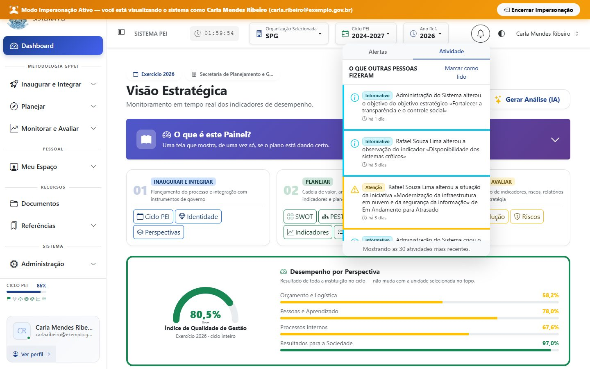
*Figura 7 — Sino aberto na aba Atividade.*

O que aparece:

- o título **O QUE OUTRAS PESSOAS FIZERAM** e o link **Marcar como lido**;
- uma linha por atividade, com uma **frase em linguagem comum** (por exemplo, "Rafael Souza Lima
  alterou a situação da iniciativa «Modernização da infraestrutura em nuvem…» de Em Andamento para
  Atrasado") e há quanto tempo aconteceu (passe o mouse sobre o tempo para ver a data e a hora
  exatas);
- uma **faixa colorida à esquerda** e um **selo** com o nível de importância:

| Selo | Cor | Quando aparece |
|---|---|---|
| **Informativo** | Azul-claro | Criações e alterações comuns. |
| **Atenção** | Amarelo | Alterações que mudam um compromisso: prazo, situação, meta, previsto, realizado, peso, linha de base, faixas de satisfação, probabilidade e impacto de risco, estratégia de resposta. |
| **Crítico** | Vermelho | Exclusões e restaurações, e mudanças de perfil ou de situação (ativo/inativo) de uma conta. |

- atividades **novas** (desde a última vez que você abriu a aba) aparecem com fundo azulado;
- várias edições da mesma pessoa no mesmo registro, num intervalo de 10 minutos, viram uma linha só;
- quando a linha tem link, clicar nela leva ao registro;
- no máximo **30 atividades** são mostradas. No fim da lista aparece "Mostrando as 30 atividades
  mais recentes." — ou, para o Super Administrador, o link **Ver mais na Auditoria**.

**Quem vê o quê:** o Super Administrador vê tudo. Os demais perfis veem as atividades das unidades
do seu escopo e as alterações do que é da instituição inteira (perspectivas, objetivos etc.).
Alterações em **contas de usuário** só aparecem para o Administrador da unidade e para o Super
Administrador.

**O contador da aba:** o número azul ao lado de **Atividade** mostra quantas atividades novas
existem desde a última vez que você abriu a aba (acima de 99, mostra **99+**). **Abrir a aba já zera
o contador.** Se você nunca abriu a aba, contam-se as atividades dos últimos 7 dias. O link **Marcar
como lido** também zera o contador.

### 3.7 Barra de progresso do ciclo (no menu lateral)

**Para que serve:** mostrar, de relance, quanto do planejamento do ciclo já foi montado para a
unidade selecionada.

No rodapé do menu lateral aparece **CICLO PEI** com um percentual (na Figura da seção 3.1, **86%**),
uma barra e uma fileira de **sete ícones**, um por etapa. Passe o mouse sobre um ícone para ver o nome
da etapa e se ela está **Concluído** ou **Pendente**. Ícone **verde** = concluída; **cinza** =
pendente. A barra fica **verde** ao chegar a 100%.

| Ícone | Etapa | Considerada concluída quando… |
|---|---|---|
| Bandeira | **Inaugurar** | o campo de equipe da tela Inaugurar e Integrar está preenchido no ciclo. |
| Diamante | **Identidade** | a unidade selecionada tem missão e visão cadastradas no ciclo. |
| Camadas | **Perspectivas** | o ciclo tem ao menos uma perspectiva. |
| Alvo | **Objetivos** | o ciclo tem ao menos um objetivo estratégico. |
| Paleta | **Graus** | o ciclo tem ao menos uma faixa de grau de satisfação. |
| Gráfico | **Indicadores** | o ciclo tem ao menos um indicador. |
| Lista | **Iniciativas** | a unidade selecionada tem ao menos uma iniciativa no ciclo. |

O percentual é a proporção de etapas concluídas (por exemplo, 6 de 7 = 86%). Sem unidade ou ciclo
selecionados, aparece "Selecione organização e PEI".

**Cuidado:** a barra indica que **existe** cadastro em cada etapa, não que ele está completo ou
bom. Um ciclo com um único indicador já conta a etapa "Indicadores" como concluída.

### 3.8 Tema claro e escuro, e seções educativas

#### 3.8.1 Tema claro, escuro ou automático

O botão de **meio círculo**, ao lado do sino, alterna o tema a cada clique, nesta ordem: **claro**
(ícone de sol) → **escuro** (ícone de lua) → **automático** (meio círculo, segue a configuração do
seu computador). A escolha fica gravada neste navegador. A **cor de destaque** do sistema (azul,
verde etc.) é outra preferência, ajustada em **Perfil** (capítulo 34).

#### 3.8.2 Seções educativas "O que é…"

Quase toda tela tem, logo abaixo do título, uma faixa roxa com um livro aberto e uma pergunta, como
"**O que é este Painel?**" ou "**O que são os Valores Institucionais?**". Ela vem **fechada**; clique
nela (ou na seta **˅** à direita) para abrir.

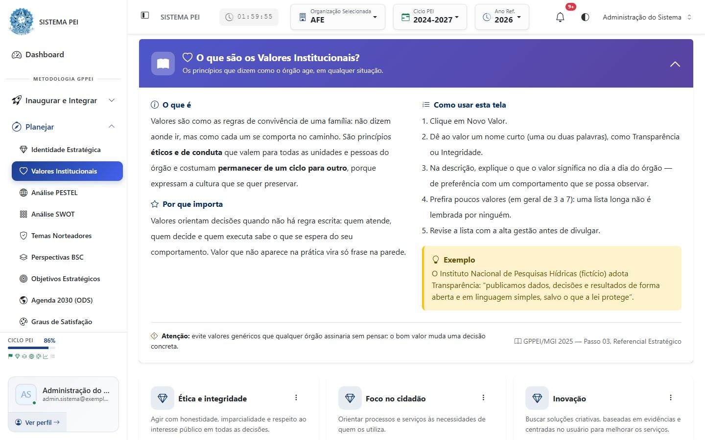
*Figura 8 — Seção educativa aberta na tela de Valores Institucionais.*

Quando aberta, a seção traz, sempre na mesma organização:

- **O que é** — o conceito em linguagem simples, muitas vezes com uma comparação do dia a dia;
- **Por que importa** — o motivo de negócio daquela etapa;
- **Como usar esta tela** — passos numerados;
- **Exemplo** (quadro amarelo) — um caso de um órgão fictício;
- **Atenção** — o erro mais comum naquela etapa;
- **Referência** (canto inferior direito) — a página ou o passo do GPPEI que trata do assunto (na
  figura, "GPPEI/MGI 2025 — Passo 03, Referencial Estratégico").

Clique de novo no título (seta **˄**) para fechar. A seção não altera nenhum dado: é só leitura.

### 3.9 Rodapé com a versão do sistema

No pé de todas as telas — inclusive na tela de entrada e no portal público — o rodapé mostra
"© *ano* Sistema PEI" à esquerda e, à direita, a **versão em execução**, por exemplo
**v2.1.0 · a3a9342 · último deploy 05/10/2026 13:16**.

Ao relatar um problema ao suporte, informe essa linha: ela diz exatamente qual versão estava em uso.

### 3.10 Avisos, confirmações e mensagens

O sistema se comunica de quatro formas:

| Forma | Como é | Exemplo |
|---|---|---|
| **Aviso flutuante** | Cartão no canto da tela, com ícone, título, mensagem e uma barra que encolhe. Some sozinho em cerca de **7 segundos**; parar o mouse sobre ele pausa a contagem; o **X** fecha na hora. | "Entrega Removida — A entrega foi movida para a lixeira, de onde pode ser restaurada." |
| **Faixa no topo** | Faixa colorida acima do conteúdo, para avisos importantes. | "Você está agora visualizando o sistema como Carla Mendes Ribeiro." |
| **Janela de confirmação** | Janela no centro da tela antes de ações que apagam ou mudam muito. Mostra o que será afetado e pede confirmação. | Excluir uma iniciativa: a janela lista o que vai junto. |
| **Mensagem no campo** | Texto vermelho logo abaixo do campo com problema, ao salvar um formulário. | "A soma dos pesos deve ser exatamente 100%." |

**Dicas:**

- Leia a janela de confirmação até o fim antes de confirmar: ela informa o que será excluído junto
  (ver capítulo 37).
- Se o formulário não salva e nenhum aviso aparece no topo, role a janela: a mensagem pode estar no
  campo com problema, fora da área visível.
- Se a sessão expirou enquanto você estava parado, a próxima ação leva à tela de entrada (seção 2.3).

---

## 4. Perfis e permissões

### 4.1 Para que servem os perfis

**Para que serve:** cada pessoa enxerga e altera apenas o que lhe cabe. Isso protege o plano de
alterações indevidas e deixa claro quem responde por cada informação.

A permissão de cada pessoa é formada por **vínculos**. Um vínculo é a combinação de **uma unidade**
com **um perfil**. A mesma pessoa pode ter vários vínculos: por exemplo, ser Consulta na AFE e
Gestor(a) Responsável de uma iniciativa da DAC.

### 4.2 Os cinco perfis

| Perfil | Para quem | Em que unidades vale |
|---|---|---|
| **Super Administrador** | A equipe que administra o sistema como um todo. | Todas, sem restrição. |
| **Administrador da Unidade** | Quem conduz o planejamento de uma unidade (por exemplo, a equipe de planejamento da SPG). | Na unidade do vínculo **e nas subordinadas**. |
| **Gestor(a) Responsável** | Quem responde por uma ou mais **iniciativas específicas**. | Só na unidade do vínculo, e só nas iniciativas pelas quais responde. |
| **Gestor(a) Substituto(a)** | Quem cobre o Gestor Responsável numa iniciativa. | Igual ao Gestor Responsável, com menos permissões. |
| **Consulta** | Quem acompanha sem alterar (alta gestão, controle interno, pontos focais). | Na unidade do vínculo **e nas subordinadas**. Só lê e exporta. |

Exemplos com os usuários de demonstração:

- **Carla Ribeiro**, Administradora da **SPG**, trabalha na SPG e também na **DTI** (subordinada à
  SPG), mas não na DAC.
- **Paulo Nogueira**, Consulta na **AFE** (a unidade raiz), lê todas as unidades, porque todas estão
  abaixo da AFE.
- **Rafael Lima**, Gestor Responsável, tem vínculos com iniciativas da SPG, da DTI e da DAC; em cada
  uma, age só na iniciativa a que foi designado.
- **Juliana Costa**, Gestora Substituta, cobre três iniciativas (duas da SPG e uma da DAC).

### 4.3 Como a permissão é decidida: três camadas

A tela **Administração → Papéis e Responsabilidades** explica a regra e mostra a tabela de
permissões. A figura mostra o início dessa tela.

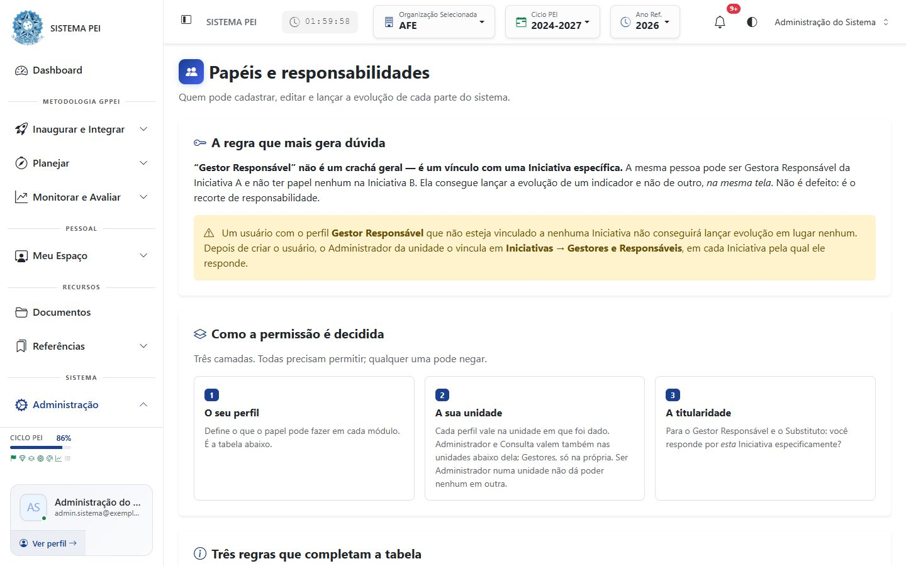
*Figura 9 — Tela Papéis e responsabilidades.*

O que aparece na tela:

- **A regra que mais gera dúvida** — "Gestor Responsável" não é um crachá geral: é um vínculo com uma
  iniciativa específica. A mesma pessoa pode lançar a evolução de um indicador e não de outro, na
  mesma tela. O quadro amarelo lembra que um Gestor sem nenhuma iniciativa vinculada não consegue
  lançar nada: o Administrador da unidade precisa vinculá-lo em **Iniciativas → Gestores e
  Responsáveis**.
- **Como a permissão é decidida** — três camadas, e **qualquer uma pode negar**:
  1. **O seu perfil**: o que o papel pode fazer em cada módulo (a tabela da seção 4.4);
  2. **A sua unidade**: cada perfil vale na unidade em que foi dado; Administrador e Consulta valem
     também nas unidades abaixo; Gestores, só na própria. Ser Administrador numa unidade **não dá
     poder nenhum em outra**;
  3. **A titularidade**: para os Gestores, a pergunta final é "você responde por **esta**
     iniciativa?".
- **Três regras que completam a tabela** (rolando a tela) — o que é da instituição inteira, o perfil
  Consulta e a criação de contas (detalhadas na seção 4.5).
- **O que cada perfil pode** — a tabela de permissões, gerada a partir da mesma configuração que o
  sistema aplica. O que está ali é o que o sistema faz.
- **O que cada permissão significa** — legenda das palavras usadas na tabela.

**Como chegar:** **Administração → Papéis e Responsabilidades**. **Quem pode:** todos os perfis.

### 4.4 Tabela de permissões por módulo

Legenda das permissões (as mesmas palavras usadas na tela):

| Permissão | Significado |
|---|---|
| **acessar** | Abrir a tela e consultar. |
| **criar** | Cadastrar novo registro. |
| **editar** | Alterar registro existente e lançar evolução. |
| **excluir** | Excluir registro. |
| **exportar** | Exportar em PDF ou Excel. |

Permissões de cada perfil, por módulo. O **Super Administrador** tem todas as permissões em todos os
módulos e não aparece repetido em cada linha.

| Módulo (telas que ele cobre) | Administrador da Unidade | Gestor(a) Responsável | Gestor(a) Substituto(a) | Consulta |
|---|---|---|---|---|
| **Planejamento Estratégico** (Inaugurar e Integrar, Cadeia de Valor, Identidade, Valores, PESTEL, SWOT, Temas, Perspectivas, Objetivos, Agenda 2030, Mapa, RAE) | acessar, criar, editar, excluir, exportar | acessar, exportar | acessar | acessar, exportar |
| **Iniciativas** (Iniciativas, Lições Aprendidas) | acessar, criar, editar, excluir, exportar | acessar, editar¹, exportar | acessar, editar¹ | acessar, exportar |
| **Entregas** (Gerenciar Entregas, Minhas Entregas) | acessar, criar, editar, excluir, exportar | acessar, criar¹, editar¹, excluir¹, exportar | acessar, criar¹, editar¹ | acessar, exportar |
| **Indicadores** (Indicadores e lançamento de evolução) | acessar, criar, editar, excluir, exportar | acessar, criar, editar¹, exportar | acessar, editar¹ | acessar, exportar |
| **Gestão de Riscos** | acessar, criar, editar, excluir, exportar | acessar, criar, editar², exportar | acessar, editar² | acessar, exportar |
| **Organizações** | acessar, editar³ | acessar | acessar | acessar |
| **Usuários** | acessar⁴ | — | — | — |
| **Relatórios** | acessar, exportar | acessar, exportar | acessar, exportar | acessar, exportar |
| **Graus de Satisfação** | acessar, criar⁵, editar⁵, excluir⁵ | acessar | acessar | acessar |
| **Documentos** (acervo em PDF) | acessar, criar, editar, excluir⁶ | acessar | acessar | acessar |
| **Auditoria** | — | — | — | — |
| **Perfis de Acesso** | — | — | — | — |
| **Configurações do Sistema** | — | — | — | — |

Notas da tabela (regras que o sistema aplica além do perfil):

1. **Só na iniciativa pela qual a pessoa responde.** O Gestor edita a **sua** iniciativa, cria e
   altera entregas **dela** e lança a evolução dos indicadores **dela**. O Gestor Substituto não
   exclui entregas. Nenhum Gestor cria iniciativa, exclui iniciativa nem designa gestores.
2. **Riscos:** além do Administrador, edita o risco a pessoa indicada como **responsável pelo
   monitoramento** daquele risco. Excluir é só do Administrador.
3. **Organizações:** o Administrador edita a sua unidade e as subordinadas; **criar e excluir
   unidades é só do Super Administrador**.
4. **Usuários:** o Administrador **consulta** os usuários da sua unidade e das subordinadas. **Criar,
   alterar e excluir contas é só do Super Administrador.**
5. **Graus de Satisfação:** a régua vale para o ciclo inteiro; alterá-la exige ser Super
   Administrador ou Administrador da **unidade raiz** (seção 4.5).
6. **Documentos:** documento sem unidade é institucional e segue a mesma regra da nota 5.

Telas fora da tabela:

- **Ciclos PEI** (criar, editar e excluir ciclos): só o **Super Administrador**.
- **Dashboard**, **Guia GPPEI**, **Guia de Projetos**, **Papéis e Responsabilidades** e **Perfil**:
  todos os perfis.
- **Designar gestores de uma iniciativa** (Responsável e Substituto): Administrador da unidade da
  iniciativa (ou de uma superior) e Super Administrador.
- **Assumir a identidade de outro usuário**: só o Super Administrador (capítulo 31).

### 4.5 Regras que completam a tabela

1. **O que é da instituição inteira** — perspectivas, objetivos estratégicos, futuro almejado,
   graus de satisfação, cadeia de valor e a abertura do ciclo (Inaugurar e Integrar) — **só o Super
   Administrador ou o Administrador da unidade raiz** alteram. Uma mudança ali vale para todas as
   unidades. Exemplo: Carla, Administradora da SPG, **não** altera perspectivas; quem é
   Administrador da **AFE** altera.
2. **Consulta** abre as telas da unidade (e das abaixo dela) e exporta relatórios, mas **não
   cadastra, não altera e não exclui nada**.
3. **Contas são criadas só por quem tem permissão**, na tela de Usuários. Não há autocadastro. Conta
   sem vínculo não entra na área restrita (seção 2.6).
4. **Botões que o perfil não pode usar não aparecem.** Se alguém tentar a ação por outro caminho, o
   sistema recusa.
5. **O vínculo de Gestor nasce na iniciativa**, não no cadastro do usuário: o Administrador designa
   o Gestor em **Iniciativas → Gestores e Responsáveis** (capítulo 20). Uma pessoa tem **um só papel
   de gestão** em cada iniciativa (ver seção 37.6).

### 4.6 Unidade e subordinadas, na prática

| Situação | O que acontece |
|---|---|
| Carla (Administradora da SPG) seleciona **DTI** no topo. | Pode tudo o que o Administrador pode, porque a DTI é subordinada à SPG. |
| Carla seleciona **DAC**. | A DAC não aparece na lista dela: não está no seu escopo. |
| Rafael (Gestor) abre **Iniciativas** com a **SPG** selecionada. | Vê as iniciativas da SPG; edita apenas as duas de que é Gestor Responsável lá. |
| Paulo (Consulta na AFE) abre qualquer unidade. | Vê tudo, exporta relatórios, mas nenhum botão de cadastro ou alteração aparece. |
| Juliana (Substituta) tenta excluir uma entrega da iniciativa que cobre. | O botão de exclusão não aparece: o Substituto não exclui entregas. |

### 4.7 Perguntas frequentes sobre permissões

**Sou Gestor Responsável e não consigo lançar a evolução de um indicador. Por quê?**
Você só lança nos indicadores das iniciativas às quais está vinculado. Peça ao Administrador da
unidade que confira o seu vínculo em **Iniciativas → Gestores e Responsáveis**.

**Sou Administrador e não consigo alterar uma perspectiva.**
Perspectivas são da instituição inteira: só o Super Administrador ou o Administrador da unidade raiz
as alteram.

**Por que não vejo o menu Administração inteiro?**
Os itens aparecem conforme o perfil. Perfis de Acesso, Configurações e Auditoria são exclusivos do
Super Administrador; Usuários, do Administrador da Unidade e do Super Administrador.

---

## 5. Painel (Dashboard)

### 5.1 Para que serve

O **Dashboard** é a primeira tela depois do login. Ele mostra, de uma vez só, **se o plano está
dando certo**: a nota geral do ciclo (o Índice de Qualidade de Gestão), o desempenho de cada
perspectiva, a cobertura da Agenda 2030, a execução das iniciativas, os riscos, a evolução mês a mês
e os prazos que estão vencendo. Funciona como o boletim do órgão: serve para celebrar o que vai bem
e, sobretudo, para **corrigir o rumo a tempo**.

**Como chegar:** é a tela inicial. A qualquer momento, clique em **Dashboard** no topo do menu
lateral ou no brasão "SISTEMA PEI".

**Quem pode:** todos os perfis. Os números seguem a unidade, o ciclo e o ano escolhidos no topo,
com as exceções indicadas em cada bloco.

### 5.2 Cabeçalho, atalhos dos módulos e Índice de Qualidade de Gestão

A figura mostra a parte de cima do Dashboard, com a unidade **AFE**, o ciclo **2024-2027** e o ano
**2026** selecionados.

*Figura 10 — Dashboard: cabeçalho, atalhos dos módulos e Índice de Qualidade de Gestão.*

O que aparece, de cima para baixo:

**Cabeçalho**

- Selo **Exercício 2026** — o ano de referência escolhido no topo.
- Selo com o **nome da unidade** selecionada (na figura, "Agência Federal de Exemplo"; nomes longos
  aparecem abreviados).
- Título **Visão Estratégica** e a frase "Monitoramento em tempo real dos indicadores de desempenho."
- Botão **Gerar Análise (IA)** — pede ao agente de inteligência artificial um comentário sobre os
  números (seção 5.5).

**Seção educativa "O que é este Painel?"** — clique para abrir (seção 3.8.2).

**Atalhos dos três módulos do GPPEI** — três cartões, um por módulo, com botões que levam direto
às telas:

| Cartão | Botões |
|---|---|
| **01 Inaugurar e Integrar** — "Planejamento do processo e integração com instrumentos de governo" | **Ciclo PEI**, **Identidade**, **Perspectivas** |
| **02 Planejar** — "Cadeia de valor, análise ambiental, objetivos, indicadores e planos" | **SWOT**, **PESTEL**, **Objetivos**, **Indicadores**, **Iniciativas** |
| **03 Monitorar e Avaliar** — "Acompanhamento de indicadores, riscos, relatórios e avaliação da estratégia" | **Mapa**, **Evolução** (abre Indicadores), **Riscos**, **Relatórios** |

> O botão **Ciclo PEI** aparece para todos, mas a tela de ciclos só abre para o Super
> Administrador. Os demais perfis recebem uma mensagem de acesso negado.

**Índice de Qualidade de Gestão e Desempenho por Perspectiva** — o quadro com borda colorida:

- À esquerda, um **medidor em meio círculo** com o **IQG** do ano, na cor da faixa de
  satisfação em que o valor cai, com o nome da faixa logo abaixo (na figura, **80,5%** em verde,
  faixa "Bom"). Abaixo: "**Índice de Qualidade de Gestão** — Exercício 2026 · ciclo inteiro".
- À direita, **Desempenho por Perspectiva**: uma barra por perspectiva, da base do mapa (nível 1)
  para o topo, com o percentual de atingimento, cada uma na **cor da sua faixa** (na figura,
  Orçamento e Logística 58,2%, Pessoas e Aprendizado 78,0% e Processos Internos 67,6% em amarelo;
  Resultados para a Sociedade 97,0% em verde).
- O aviso "**Resultado de toda a instituição no ciclo — não muda com a unidade selecionada no topo.**"
  Perspectivas e objetivos são da instituição inteira; por isso o IQG é o mesmo, qualquer que seja a
  unidade escolhida.
- A **borda** do quadro tem a cor da faixa do IQG.

Se nenhuma perspectiva tiver medição no ano, este quadro **não aparece**. Perspectiva sem medição
fica fora da lista e fora da média (ver capítulo 36, que explica a conta do IQG e dos pesos).

### 5.3 Agenda 2030, Mentor Estratégico e cartões de números

Rolando a tela, aparecem os blocos da figura a seguir.

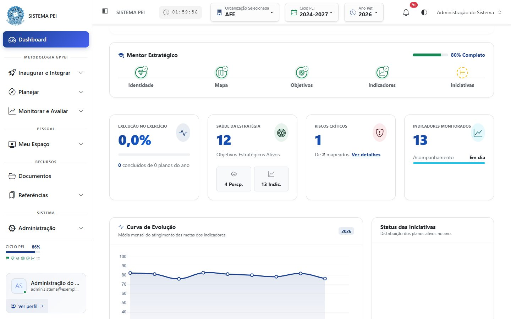
*Figura 11 — Dashboard: Mentor Estratégico, cartões de números e gráficos.*

**Agenda 2030 — Contribuição aos ODS** (logo abaixo do IQG; na figura, acima da área visível)

- Selo **N / total cobertos** (por exemplo, "5 / 18 cobertos") — quantos ODS têm ao menos um objetivo estratégico do ciclo vinculado,
  sobre o total de ODS cadastrados no sistema.
- Uma fileira com o ícone de cada ODS: **coloridos** os cobertos, **apagados** os sem objetivo
  vinculado. Passe o mouse para ver "ODS N — coberto" ou "sem objetivos vinculados". Clicar em
  qualquer ícone abre o painel da Agenda 2030.
- Botão **Abrir Painel** — abre **Planejar → Agenda 2030 (ODS)** (capítulo 18).
- Se nenhum objetivo estiver vinculado, aparece: "Nenhum objetivo deste ciclo está vinculado a um ODS
  ainda. O vínculo é opcional e pode ser feito ao criar ou editar objetivos."

O vínculo com os ODS é **opcional**: um ciclo sem ODS não está errado.

**Mentor Estratégico — o checklist do ciclo**

Mostra cinco etapas do planejamento, cada uma num círculo: **Identidade**, **Mapa**, **Objetivos**,
**Indicadores** e **Iniciativas**. Etapa com **visto verde** está feita; etapa com **ícone amarelo
tracejado** está pendente. À direita, a barra e o percentual (na figura, **80% Completo**: 4 de 5 —
só **Iniciativas** está pendente, porque as iniciativas da demonstração pertencem às unidades
subordinadas, e não à própria AFE).

| Etapa | Feita quando… |
|---|---|
| **Identidade** | a unidade selecionada tem missão e visão cadastradas. |
| **Mapa** | o ciclo tem ao menos uma perspectiva. |
| **Objetivos** | o ciclo tem ao menos um objetivo estratégico. |
| **Indicadores** | o ciclo tem ao menos um indicador. |
| **Iniciativas** | a unidade selecionada tem ao menos uma iniciativa no ciclo. |

Quando as cinco estão feitas, o Mentor se recolhe e aparece o botão **Planejamento Completo
(Mostrar/Ocultar)**, que o abre e fecha. Para o checklist completo, de sete etapas, veja a barra de
progresso do menu lateral (seção 3.7).

**Cartões de números** — quatro cartões:

| Cartão | O que mostra | Recorte | Clique leva a |
|---|---|---|---|
| **Execução no Exercício** | A média do progresso das iniciativas vigentes no ano, calculada pelas entregas com prazo no ano. Abaixo: "**N** concluídos de **M** planos do ano". | Unidade selecionada (exata) | **Iniciativas** |
| **Saúde da Estratégia** | Quantidade de **Objetivos Estratégicos Ativos** do ciclo e, em dois quadros, o número de perspectivas (**Persp.**) e de indicadores (**Indic.**). | Ciclo inteiro | — |
| **Riscos Críticos** | Quantos riscos têm nível **Crítico** (probabilidade × impacto ≥ 16). O número fica **vermelho** se houver algum e **verde** se for zero. Abaixo: "De **N** mapeados. **Ver detalhes**". | Unidade selecionada (exata) e ciclo | **Gestão de Riscos** |
| **Indicadores Monitorados** | Quantidade de indicadores do ciclo. | Ciclo inteiro | — |

Como o progresso de uma iniciativa é calculado: cada entrega com prazo no ano vale conforme a
situação — **Concluído** 100%, **Em Andamento** 50%, **Suspenso** 25%, **Não Iniciado** 0%;
entregas **Canceladas** ficam fora. Se as entregas têm peso, a média é ponderada pelo peso (ver
capítulo 36). Uma iniciativa conta como "concluída" no ano quando chega a 100%.

Na figura, com a **AFE** selecionada: **Execução no Exercício 0,0%** ("0 concluídos de 0 planos do
ano"), porque a AFE não tem iniciativas próprias — elas estão na SPG, na DTI e na DAC, e este cartão
não soma as subordinadas; **Saúde da Estratégia 12** objetivos, com **4 Persp.** e **13 Indic.**;
**Riscos Críticos 1**, "De **2** mapeados"; **Indicadores Monitorados 13**.

**Cuidados:**

- No cartão **Indicadores Monitorados**, a linha "**Acompanhamento — Em dia**" e a barra cheia são
  fixas: **não** indicam se os lançamentos estão em dia. Para saber isso, use a tela **Indicadores**.
- O cartão **Riscos Críticos** conta só os riscos da unidade selecionada, sem as subordinadas. A tela
  **Gestão de Riscos** inclui as subordinadas; por isso os totais podem ser diferentes.

### 5.4 Gráficos, alertas e RAE

Abaixo dos cartões ficam os gráficos (a figura da seção 5.3 mostra o início deles) e, mais abaixo,
os blocos de acompanhamento.

**Curva de Evolução** — "Média mensal do atingimento das metas dos indicadores."

- Uma linha com um ponto por mês do ano escolhido (o selo à direita mostra o ano). No ano corrente,
  a linha vai até o mês atual.
- Cada ponto é a média do atingimento de todos os lançamentos de indicadores daquele mês, no ciclo.
  Para um desvio isolado não distorcer a média, cada lançamento conta no máximo **100%**.
- **Mês sem lançamento fica em branco**, não em zero: a linha não desenha uma queda que não
  aconteceu.
- Indicadores **informativos** (polaridade "Não Aplicável") não entram.
- Passe o mouse sobre um ponto para ver o valor.

**Status das Iniciativas** — "Distribuição dos planos ativos no ano."

- Gráfico de rosca com as iniciativas da unidade selecionada vigentes no ano, separadas pela situação
  calculada no ano: **Concluído** (verde), **Em Andamento** (amarelo), **Não Iniciado** (cinza-azulado)
  e **Sem Entregas** (cinza — iniciativa sem entrega com prazo no ano). Só aparecem as situações que
  têm ao menos uma iniciativa. Sem nenhuma iniciativa na unidade exata (caso da AFE na figura da
  seção 5.3), o quadro fica em branco.

**Riscos por Severidade** — "Matriz de risco (Impacto x Probabilidade)."

- Rosca com os riscos da unidade selecionada no ciclo, por nível: **Crítico** (vermelho, 16 ou mais),
  **Alto** (laranja, 10 a 15), **Médio** (amarelo, 5 a 9) e **Baixo** (verde, até 4). O nível é
  probabilidade × impacto (capítulo 23).

**Performance por Perspectiva** — "Atingimento consolidado dos indicadores e planos de cada
perspectiva do BSC."

- Barras horizontais, uma por perspectiva, na cor da faixa de satisfação. Este gráfico considera a
  **unidade selecionada e as subordinadas**: os indicadores e iniciativas dessas unidades.
- Perspectiva sem nenhuma medição aparece com o rótulo "**(sem medição)**" e sem barra — nunca como
  0%.

**Indicadores em Alerta**

- Os **três indicadores do ciclo com menor atingimento** no ano, cada um com um ponto na cor do farol,
  o nome do indicador, o objetivo a que pertence e o percentual (vermelho abaixo de 50%, amarelo nos
  demais).
- Botão **Ver todos** — abre **Indicadores**.
- Sem indicadores, aparece "Nenhum indicador em alerta."

**Revisão e Avaliação da Estratégia**

- Mostra a última RAE registrada para a unidade e o ciclo: o mês e o ano de referência, o tipo de
  reunião e, se registrado, o **Progresso registrado** em barra (verde a partir de 70%, amarelo
  abaixo).
- Sem RAE, aparece "Nenhuma RAE registrada para este ciclo PEI." e o botão **Registrar Primeira RAE**.
- Botão **Gerenciar RAE** — abre **Monitorar e Avaliar → RAE — Revisão da Estratégia** (capítulo
  24).

**Alertas de Prazos** (só aparece quando há algum)

- Até **6 entregas** da unidade selecionada, no ciclo, ainda não concluídas e não arquivadas, com
  prazo **vencido** ou vencendo nos **próximos 7 dias**. O número de alertas aparece no título.
- Entrega **vencida**: fundo vermelho-claro, ícone vermelho e "Vencido há …". Entrega a vencer: fundo
  amarelo-claro e "Vence em …".
- Clicar numa entrega abre o quadro de entregas da iniciativa dela (capítulo 21).
- Botão **Minhas Entregas** — abre a lista das suas entregas (capítulo 22).

### 5.5 Análise por inteligência artificial

**Para que serve:** obter, em texto, uma leitura dos números do painel — o que vai bem, o que
preocupa e onde agir —, como ponto de partida para a discussão da equipe.

**Quem pode:** todos os perfis. **Pré-requisito:** o agente de IA precisa estar **configurado e
ligado** pelo Super Administrador em **Administração → Configurações** (capítulo 32).

**Passo a passo:**

1. Confira no topo a unidade, o ciclo e o ano.
2. Clique em **Gerar Análise (IA)**, no canto superior direito do Dashboard.
3. Enquanto a análise é preparada, o botão mostra "**Analisando...**".
4. O texto aparece num quadro com borda amarela, intitulado **INSIGHT ESTRATÉGICO**, logo abaixo do
   Mentor Estratégico.
5. Para fechar o quadro, clique no **X** no canto dele. Para uma nova análise, clique de novo no
   botão.

**Cuidados:**

- Se a IA não estiver configurada ou estiver desligada, o botão **não mostra nada** — nem análise nem
  mensagem de erro. Procure o Super Administrador.
- Cada pessoa pode fazer no máximo 20 pedidos à IA por minuto (somando todas as telas). Acima disso,
  o pedido também não traz resultado.
- A análise é gerada por um serviço externo de IA a partir dos números do painel: **use-a como apoio,
  não como conclusão**. Os números precisam ser interpretados pela equipe, como lembra a seção
  educativa da tela.

### 5.6 Dicas e perguntas frequentes do Dashboard

**Mudei a unidade no topo e o IQG não mudou. Está errado?**
Não. O IQG e o "Desempenho por Perspectiva" são do ciclo inteiro, da instituição toda — a tela avisa
isso. Já os cartões de execução e de riscos, a rosca de iniciativas, o gráfico de perspectivas e os
alertas de prazo mudam com a unidade.

**O quadro do IQG sumiu.**
Ele só aparece quando ao menos uma perspectiva tem medição no ano. Confira o ano de referência: num
ano sem lançamentos (por exemplo, um ano futuro), não há o que mostrar.

**A Curva de Evolução tem buracos.**
São meses sem nenhum lançamento de resultado. O sistema deixa em branco para não sugerir uma queda
que não aconteceu.

**O Mentor diz que falta a Identidade, mas a barra do menu diz outra coisa.**
O Mentor confere se a unidade tem missão e visão cadastradas; a barra do menu confere isso no ciclo
selecionado. Cadastre a identidade da unidade no ciclo em **Planejar → Identidade Estratégica**
(capítulo 9).

---

# PARTE II — MÓDULO 01: INAUGURAR E INTEGRAR

O Guia de Planejamento Estratégico Integrado (GPPEI/MGI 2025) abre o trabalho com o **Módulo 01 — Inaugurar e Integrar**. Ele tem dois passos:

- **Passo 01 — Definir a demanda e planejar o planejamento:** decidir por que o plano será feito, quem participa, com que método e em que prazo.
- **Passo 02 — Fazer a integração com outros instrumentos:** conferir os planos de governo com que o PEI precisa "conversar": Plano Plurianual (PPA), Orçamento (LOA), Estratégia Nacional de Longo Prazo, Agenda 2030 e planos setoriais.

No sistema, o Módulo 01 fica no menu lateral **Inaugurar e Integrar** e tem três telas:

| Tela | O que faz | Onde está explicada |
|---|---|---|
| **Ciclos PEI** | Cria e mantém os períodos de planejamento (por exemplo, "PEI 2024-2027"). | Capítulo 6 |
| **Inaugurar e Integrar** | Registra o planejamento do processo, a integração com instrumentos, a aderência à Agenda 2030 e o calendário de eventos. | Capítulo 7 |
| **Cadeia de Valor** | Mapeia os macroprocessos da organização. | Capítulo 8 |

Tudo o que você cadastra nas telas seguintes fica preso a um ciclo. Por isso o ciclo vem primeiro.

---

## 6. Ciclos do PEI

### 6.1 Para que serve

O **Ciclo PEI** é o período de vigência do planejamento: por exemplo, de 2024 a 2027. Identidade estratégica, perspectivas, objetivos, indicadores, iniciativas, riscos e análises pertencem a um ciclo.

Ter ciclos separados permite três coisas:

- guardar o histórico de planos já encerrados, como o "PEI 2020-2023";
- trabalhar no plano vigente;
- preparar o próximo plano, como o "PEI 2028-2031", sem mexer no atual.

Na fila de etapas do sistema, o ciclo é o 1º passo. Sem ele, nenhuma outra tela de planejamento tem onde gravar.

### 6.2 Como chegar

- Menu lateral **Inaugurar e Integrar → Ciclos PEI**.
- Atalho no **Dashboard**: botão **Ciclo PEI**, no cartão do Módulo 01 (ver capítulo 5). Ele leva à mesma tela, que só abre para o Super Administrador.
- Quando nenhum ciclo está disponível, telas como **Inaugurar e Integrar** e **Valores Institucionais** mostram o botão **Ir para Ciclos PEI** ou **Gerenciar Ciclos PEI**.

### 6.3 Quem pode

| Ação | Quem pode |
|---|---|
| Ver a lista de ciclos, criar, editar, usar **Salvar como** e excluir | Somente o **Super Administrador** |
| Ver o detalhe de um ciclo | Qualquer perfil com acesso ao Planejamento Estratégico, mas só o Super Administrador tem o caminho até ele (pela lista) |
| Escolher o ciclo em que vai trabalhar (seletor **Ciclo PEI** no topo) | Todos os usuários |

O item **Ciclos PEI** só aparece no menu do Super Administrador. Se outro perfil abrir o endereço da tela, recebe a mensagem "Apenas Super Administradores podem gerenciar PEIs."

### 6.4 A lista de ciclos

A tela mostra todos os ciclos cadastrados, do início mais recente para o mais antigo. São exibidos 10 por página.

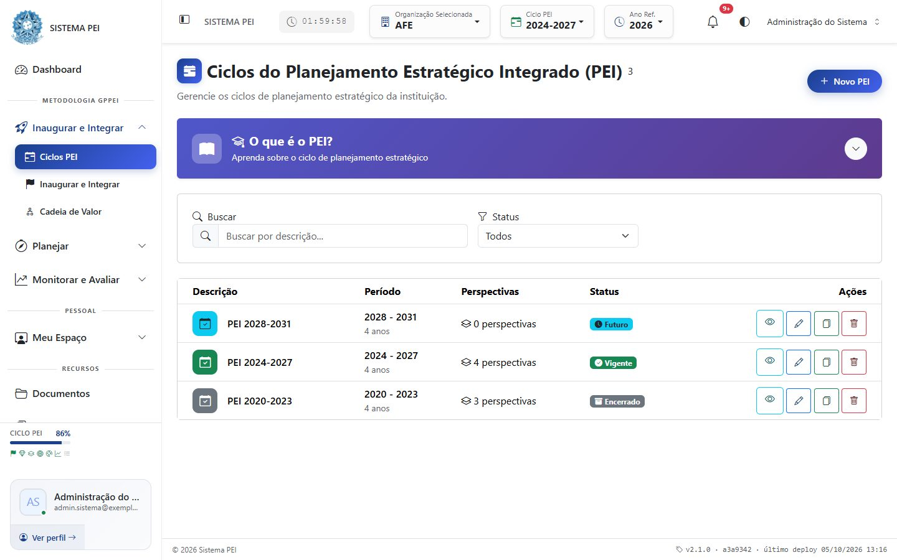
*Figura 12 — Lista de ciclos do PEI.*

O que aparece na tela, de cima para baixo:

- **Título e contador:** "Ciclos do Planejamento Estratégico Integrado (PEI)". O número ao lado (na figura, **3**) é o total de ciclos encontrados com os filtros atuais.
- **Novo PEI** (botão azul, à direita): abre o formulário de um novo ciclo (ver 6.5).
- **O que é o PEI?** (faixa roxa): seção educativa que abre ao clicar na seta. Traz a definição do PEI e a sequência sugerida de implantação. A sequência começa por Ciclo, segue com Identidade, Perspectivas BSC e Objetivos, e termina com Indicadores, Iniciativas e Monitoramento.
- **Buscar:** filtra pela descrição do ciclo enquanto você digita. Maiúsculas e minúsculas não fazem diferença.
- **Status:** filtra por situação:
  - **Todos**;
  - **Ativo (Vigente)**: o ano atual está dentro do período;
  - **Futuro**: o ciclo ainda não começou;
  - **Encerrado**: o ciclo já terminou.
- **Limpar Filtros:** aparece só quando há busca ou status preenchido e volta tudo ao padrão.

Colunas da tabela:

| Coluna | O que mostra |
|---|---|
| **Descrição** | Nome do ciclo, com um ícone de calendário colorido: verde = vigente, azul-claro = futuro, cinza = encerrado. O nome é um link para o detalhe do ciclo. |
| **Período** | Ano de início e de término, com a duração em anos logo abaixo. Na figura, "2024 - 2027" tem 4 anos. |
| **Perspectivas** | Quantas perspectivas BSC o ciclo tem. Na figura: 0 no PEI 2028-2031, 4 no PEI 2024-2027 e 3 no PEI 2020-2023. |
| **Status** | Selo **Futuro** (azul-claro), **Vigente** (verde) ou **Encerrado** (cinza). A situação é calculada pelo ano do relógio do servidor, não pelo ano escolhido no topo. |
| **Ações** | Quatro botões, explicados abaixo. |

Os botões da coluna **Ações**, da esquerda para a direita:

| Ícone | Nome (aparece ao passar o mouse) | O que faz |
|---|---|---|
| Olho (azul-claro) | **Detalhar** | Abre o detalhe do ciclo (ver 6.7). |
| Lápis (azul) | **Editar** | Abre o formulário com os dados do ciclo (ver 6.5). |
| Duas folhas (verde) | **Salvar como** | Cria uma cópia completa do ciclo com novo nome (ver 6.6). |
| Lixeira (vermelho) | **Excluir** | Abre a confirmação de exclusão (ver 6.8). |

Se nenhum ciclo for encontrado, a tabela mostra "Nenhum PEI encontrado" e o botão **Criar PEI**.

### 6.5 Criar ou editar um ciclo

O mesmo formulário serve para criar e para editar. O título muda: **Novo Ciclo PEI** ou **Editar Ciclo PEI**.

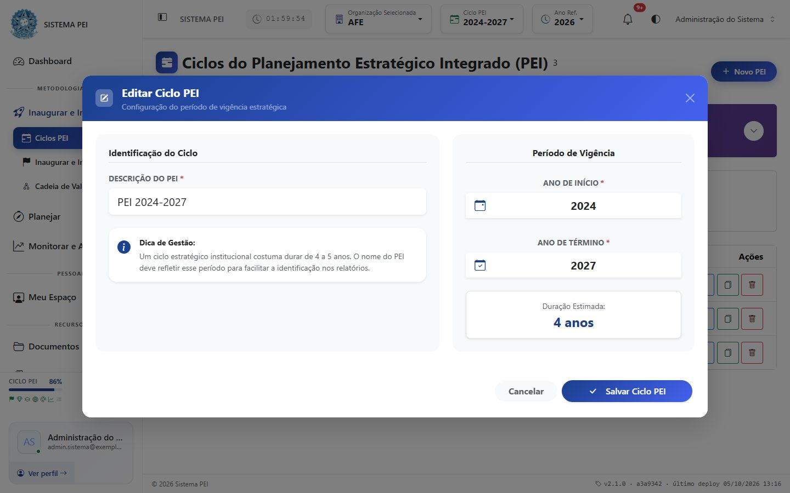
*Figura 13 — Formulário de edição do ciclo.*

O formulário tem duas colunas:

- **Identificação do Ciclo** (esquerda): o campo **Descrição do PEI** e a caixa **Dica de Gestão**. A dica lembra que um ciclo costuma durar de 4 a 5 anos e que o nome deve mostrar esse período.
- **Período de Vigência** (direita): **Ano de Início**, **Ano de Término** e o quadro **Duração Estimada**. A duração é recalculada enquanto você digita. Na figura, 2024 a 2027 dá **4 anos**.

#### 6.5.1 Passo a passo — criar um ciclo

1. Abra **Inaugurar e Integrar → Ciclos PEI**.
2. Clique em **Novo PEI**.
3. Preencha **Descrição do PEI**, por exemplo "PEI 2028-2031".
4. Confira os anos. Em um ciclo novo, o sistema já sugere como início o ano atual e como término quatro anos depois.
5. Clique em **Salvar Ciclo PEI**.
6. Aparece a janela **Ciclo PEI Registrado!**. Ela convida a seguir para a definição da Identidade e das Perspectivas. Clique em **Continuar**.

#### 6.5.2 Passo a passo — editar um ciclo

1. Na lista, clique no lápis (**Editar**) da linha do ciclo. Outra opção: no detalhe do ciclo, clique em **Editar PEI**.
2. Altere a descrição ou os anos.
3. Clique em **Salvar Ciclo PEI**. A mensagem confirma que o ciclo foi atualizado e que todos os vínculos foram preservados.

Para fechar sem salvar, use **Cancelar**, o **X** do cabeçalho ou clique fora da janela.

#### 6.5.3 Campos do formulário

| Campo | Obrigatório | O que informar | Exemplo |
|---|---|---|---|
| **Descrição do PEI** | Sim | Nome que identifica o ciclo na lista, no seletor do topo e nos relatórios. Até 255 caracteres. | PEI 2028-2031 |
| **Ano de Início** | Sim | Primeiro ano de vigência, entre 2000 e 2100. | 2028 |
| **Ano de Término** | Sim | Último ano de vigência, entre 2000 e 2100, igual ou maior que o início. | 2031 |

#### 6.5.4 Regras e validações

- Se o término for menor que o início, aparece a mensagem "O ano de término deve ser maior ou igual ao ano de início."
- Anos fora do intervalo de 2000 a 2100 são recusados.
- Ao criar ou editar um ciclo, o sistema **não** confere se a descrição já existe. Essa conferência só acontece no **Salvar como**. Para não confundir ciclos, use sempre descrições diferentes.
- Em caso de falha técnica, aparece a janela "Não foi possível salvar" com o botão **Tentar Novamente**.

#### 6.5.5 Cuidados

- **Mudar os anos não ajusta nada automaticamente.** Metas anuais, lançamentos de evolução e prazos que já existem continuam com os anos em que foram gravados. Se você encurtar ou deslocar o período, revise as metas dos indicadores (capítulo 19).
- O ano escolhido no seletor **Ano Ref.** do topo precisa estar dentro do período do ciclo. Senão, as telas aparecem vazias. O sistema faz esse ajuste sozinho quando você troca de ciclo (ver 6.9).

### 6.6 Salvar como (copiar um ciclo)

O **Salvar como** cria um ciclo novo com **tudo o que está preso ao ciclo de origem**. Use-o para:

- abrir o ciclo seguinte aproveitando o atual;
- fazer uma revisão do plano sem perder a versão original;
- simular um cenário.

Assim, ninguém precisa redigitar missão, objetivos, indicadores e iniciativas.

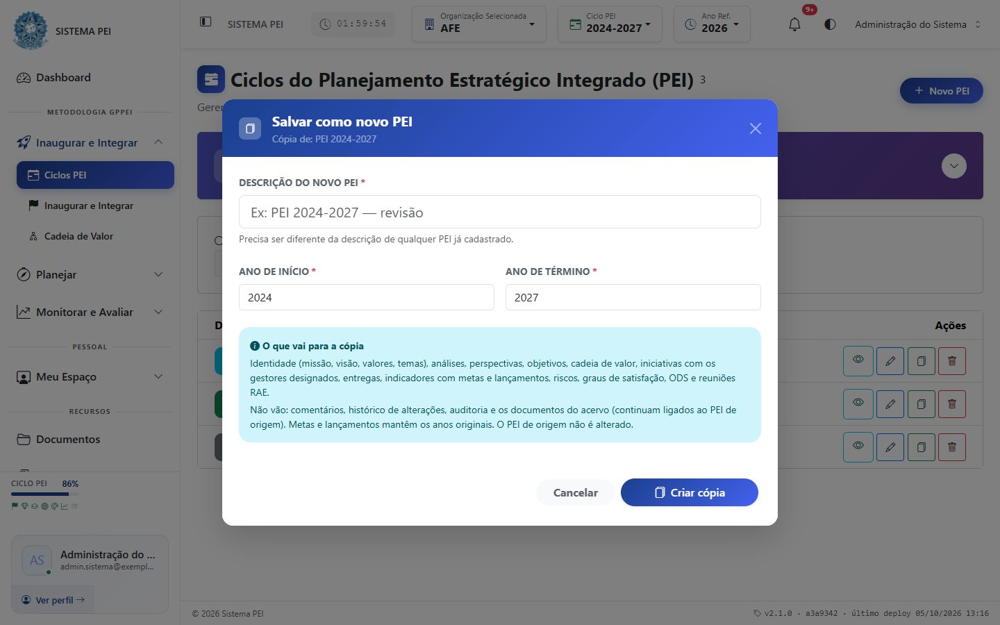
*Figura 14 — Janela Salvar como novo PEI.*

A janela mostra no cabeçalho **Salvar como novo PEI** e, logo abaixo, a origem ("Cópia de: PEI 2024-2027"). Os campos:

| Campo | Obrigatório | O que informar | Exemplo |
|---|---|---|---|
| **Descrição do novo PEI** | Sim | Nome da cópia. Deve ser diferente do nome de qualquer ciclo já cadastrado. | PEI 2024-2027 — revisão |
| **Ano de início** | Sim | Já vem com o ano de início do ciclo de origem. Entre 2000 e 2100. | 2024 |
| **Ano de término** | Sim | Já vem com o ano de término do ciclo de origem. Igual ou maior que o início. | 2027 |

A caixa azul **O que vai para a cópia** resume o conteúdo copiado. O detalhe completo está nas tabelas abaixo.

#### 6.6.1 Passo a passo

1. Na lista de ciclos, clique no ícone de duas folhas (**Salvar como**) do ciclo que servirá de base.
2. Digite a **Descrição do novo PEI**.
3. Mantenha ou ajuste os anos.
4. Clique em **Criar cópia**. Enquanto a cópia é feita, o botão mostra "Copiando…". Em ciclos grandes, isso pode levar alguns segundos.
5. A janela de sucesso informa que a cópia foi criada. Clique em **Continuar**.
6. Para trabalhar no novo ciclo, escolha-o no seletor **Ciclo PEI** do topo (ver 6.9).

#### 6.6.2 O que é copiado

Cada registro copiado ganha uma identificação nova. As ligações internas são refeitas para apontar para as cópias: o objetivo copiado fica na perspectiva copiada, a entrega copiada fica na iniciativa copiada, e assim por diante. O que fica fora do ciclo é mantido como está: unidades, usuários, tipos de execução e a lista de ODS.

| Grupo | O que vai para o novo ciclo |
|---|---|
| Identidade e diagnóstico | Missão e visão, valores, temas norteadores, graus de satisfação (faixas do farol), análises PESTEL e SWOT, cenários prospectivos, partes interessadas, estratégias TOWS |
| Módulo 01 | Planejamento do processo, integrações com instrumentos, eventos do calendário e aderência aos ODS (com contribuição e intensidade) |
| Mapa estratégico | Perspectivas, objetivos (com a hierarquia de desdobramento), futuro almejado, vínculos dos objetivos com ODS, cadeia de valor (atividades e processos) |
| Iniciativas e entregas | Iniciativas com as unidades e os **gestores designados**, entregas (com as subentregas), etiquetas, responsáveis, matriz RACI, plano de comunicação, lições aprendidas e anexos das entregas (os arquivos são **duplicados**) |
| Indicadores | Indicadores dos objetivos e das iniciativas, com unidades vinculadas, linha de base, metas por ano, lançamentos de evolução e os arquivos de evidência (também duplicados) |
| Riscos | Riscos, vínculos com objetivos, planos de mitigação e ocorrências |
| RAE | Reuniões de Revisão e Avaliação da Estratégia, encaminhamentos e causas-raiz |

#### 6.6.3 O que não é copiado

- **Comentários**, **histórico de alterações das entregas** e **auditoria**. São registros de conversa e de rastro, não de planejamento.
- **Documentos do acervo.** Eles continuam ligados ao ciclo de origem.
- **Itens que estavam excluídos** (por exemplo, entregas na lixeira) no ciclo de origem.
- **Ligações com outro ciclo.** Se um registro apontava para algo fora do ciclo de origem, essa ligação fica vazia na cópia.

#### 6.6.4 Regras e validações

- Descrição em branco: "Informe a descrição do novo PEI."
- Descrição igual à de outro ciclo: "Já existe um PEI com esta descrição. Use uma descrição diferente." A comparação ignora maiúsculas, minúsculas e espaços nas pontas.
- Término menor que o início: "O ano de término deve ser maior ou igual ao ano de início."
- **O período pode ser o mesmo da origem.** Dois ciclos no mesmo período são permitidos. O que os distingue é a descrição.
- **A cópia sai inteira ou não sai.** Se algo falhar no meio, nada é gravado e aparece a mensagem: "Não foi possível copiar o PEI. Nada foi gravado: o ciclo de origem continua como estava."
- **O ciclo de origem nunca é alterado.**

#### 6.6.5 Cuidados

- **Metas e lançamentos mantêm os anos originais.** Se a cópia for para outro período (por exemplo, de 2024-2027 para 2028-2031), as metas continuam com os anos de 2024 a 2027. Ajuste as metas no novo ciclo.
- **Dois ciclos com o mesmo período aparecem iguais no botão do topo**, que mostra só os anos. Ao abrir o seletor, a descrição aparece embaixo de cada período. Confira-a antes de trabalhar.
- Quando há dois ciclos vigentes, o sistema escolhe o **original**, não a cópia, para quem entra sem ter escolhido um ciclo. Isso vale também para o Portal da Transparência e para os relatórios agendados.

### 6.7 Detalhe do ciclo

O detalhe dá uma visão geral do ciclo e atalhos para as principais telas, já abertas nesse ciclo.

**Como chegar:** na lista de ciclos, clique no nome do ciclo ou no ícone de olho (**Detalhar**).

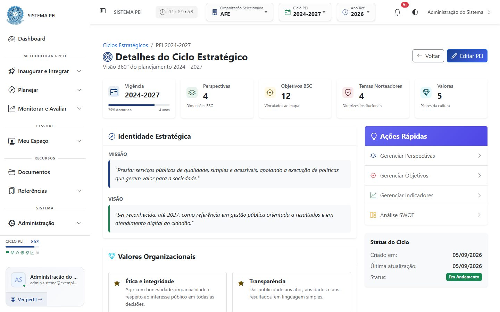
*Figura 15 — Detalhe do ciclo PEI 2024-2027.*

O que aparece na tela:

- **Trilha de navegação:** "Ciclos Estratégicos / PEI 2024-2027". O primeiro item volta para a lista.
- **Voltar** e **Editar PEI** (este só para o Super Administrador). **Editar PEI** abre a lista de ciclos já com o formulário de edição deste ciclo.
- **Cinco cartões de resumo:**
  - **Vigência**: o período, com uma barra que mostra quanto do ciclo já passou. Na figura, 75% decorrido de 4 anos.
  - **Perspectivas**: as dimensões BSC.
  - **Objetivos BSC**: os objetivos vinculados ao mapa.
  - **Temas Norteadores**.
  - **Valores**: os pilares da cultura.
- **Identidade Estratégica:** a **Missão** (com barra azul) e a **Visão** (com barra verde). Se não houver identidade, aparece "Nenhuma identidade estratégica definida" e o botão **Definir Missão e Visão**.
- **Valores Organizacionais:** cada valor com nome e descrição resumida. Se não houver valores, aparece o link **Gerenciar Valores**.
- **Ações Rápidas:** **Gerenciar Perspectivas**, **Gerenciar Objetivos**, **Gerenciar Indicadores** e **Análise SWOT**.
- **Status do Ciclo:** datas de criação e de última atualização. O selo **Em Andamento** aparece quando o ano atual está no período; fora dele, aparece **Inativo**.

**Importante:** os atalhos do detalhe (as **Ações Rápidas**, **Definir Missão e Visão** e **Gerenciar Valores**) **trocam o ciclo selecionado no topo** para o ciclo deste detalhe antes de abrir a tela. Assim, você edita exatamente o ciclo que está vendo. Durante a troca, aparece no canto inferior o aviso "Abrindo no ciclo selecionado…". Se o ano de referência do topo estiver fora do período, ele também é ajustado.

### 6.8 Excluir um ciclo

#### 6.8.1 Passo a passo

1. Na lista, clique na lixeira (**Excluir**) do ciclo.
2. A janela **Excluir PEI** pergunta "Tem certeza que deseja excluir este ciclo do PEI?". Ela mostra quantos registros principais serão afetados: **Perspectivas**, **Objetivos**, **Indicadores** e **Iniciativas**.
3. Clique em **Excluir PEI** para confirmar, ou em **Cancelar**.
4. A lista mostra a mensagem "PEI excluído com sucesso!".

#### 6.8.2 O que vai junto

Excluir um ciclo exclui **tudo o que pertence a ele**, não só os itens contados na janela:

- perspectivas, objetivos, futuro almejado e comentários dos objetivos;
- iniciativas com suas entregas, indicadores próprios e designações de gestores;
- indicadores dos objetivos;
- identidade (missão e visão), valores, temas norteadores, graus de satisfação;
- análises PESTEL e SWOT, estratégias TOWS, partes interessadas, cenários;
- cadeia de valor (atividades e processos);
- planejamento do processo, integrações com instrumentos e calendário de eventos;
- reuniões RAE e seus encaminhamentos;
- riscos, com mitigações e ocorrências.

**Não vão junto** os **documentos do acervo**. O documento existe por si e apenas cita o ciclo.

#### 6.8.3 Exclusão lógica

A exclusão é **lógica**: os registros são marcados como excluídos e somem de todas as telas, relatórios e do Portal da Transparência, mas continuam guardados no banco de dados.

Ainda assim, **pela tela não há como desfazer**: o sistema não tem lixeira de ciclos nem botão de restaurar. Por isso a janela avisa que a ação é irreversível. Recuperar um ciclo excluído exige intervenção da equipe técnica.

#### 6.8.4 Cuidados

- Antes de excluir, confira se não é melhor manter o ciclo como histórico. Um ciclo **Encerrado** não atrapalha o trabalho e preserva a memória do planejamento.
- Se você estava trabalhando no ciclo excluído, o seletor do topo passa sozinho para o ciclo vigente na próxima tela aberta.

### 6.9 O ciclo selecionado no topo

O seletor **Ciclo PEI**, no topo da tela ao lado do seletor de unidade e do ano, define **em qual ciclo todas as telas trabalham**:

- Identidade, valores, temas, PESTEL e SWOT;
- perspectivas, objetivos e mapa estratégico;
- graus de satisfação e Agenda 2030;
- indicadores, iniciativas, entregas, riscos e RAE;
- Dashboard e relatórios;
- a tela **Inaugurar e Integrar**, cujo cabeçalho mostra o nome do ciclo em um selo (por exemplo, **PEI 2024-2027**).

O que você cria em uma dessas telas é gravado no ciclo escolhido no topo. O que você vê é o conteúdo desse ciclo. A apresentação do seletor está na seção 3 ("Conhecendo a tela").

Como o seletor funciona:

1. Clique no botão **Ciclo PEI**. Ele mostra o período do ciclo atual, por exemplo **2024-2027**.
2. A lista mostra cada ciclo com o período em destaque e a descrição embaixo. O ícone verde de "visto" marca o ciclo vigente; o ícone de relógio, os demais.
3. Clique no ciclo desejado. A página atual é recarregada com o conteúdo desse ciclo.

Regras automáticas:

- **Primeiro acesso:** se você nunca escolheu um ciclo, o sistema escolhe o vigente. Se houver mais de um vigente, escolhe o de início mais recente e, no empate, o original. Se nenhum for vigente, escolhe o primeiro da lista.
- **Ano de referência:** ao trocar de ciclo, se o **Ano Ref.** estiver fora do novo período, ele muda para o ano atual (quando o ano atual está dentro do ciclo) ou para o ano de início do ciclo.
- **Ciclo excluído:** se o ciclo guardado na sua sessão for excluído, o seletor volta para o ciclo vigente.
- A escolha vale para a **sua sessão**. Cada usuário tem a própria seleção, e a sua não muda a de ninguém.

### 6.10 Perguntas frequentes

**Não vejo o item Ciclos PEI no menu.**
Ele é exclusivo do Super Administrador. Os demais perfis só escolhem o ciclo no seletor do topo.

**Criei um ciclo novo, mas as telas continuam mostrando o antigo.**
Criar um ciclo não troca a seleção. Escolha o novo ciclo no seletor **Ciclo PEI** do topo.

**Posso ter dois ciclos com o mesmo período?**
Sim. Esse é o caso típico do **Salvar como** feito para revisão. A descrição precisa ser diferente.

**Copiei o ciclo para o período seguinte e as metas ficaram nos anos antigos. É erro?**
Não. A cópia mantém os anos de metas e lançamentos de propósito. Ajuste as metas no novo ciclo (capítulo 19).

---

## 7. Inaugurar e Integrar

### 7.1 Para que serve

É o "planejar o planejamento": combinar **quem**, **como** e **quando** antes de começar.

Pelo GPPEI (p. 10–21), sem o envolvimento da Alta Direção o plano vira uma peça burocrática de pouca relevância. Sem integração com os demais instrumentos, o órgão pode planejar algo que contradiz o PPA ou que não tem orçamento.

A seção educativa da tela usa uma comparação: antes de uma viagem, a família decide para onde vai, quem dirige e quanto pode gastar. Aqui o órgão faz o mesmo.

A tela tem quatro abas, uma para cada parte do Módulo 01:

| Aba | Passo do GPPEI | Pergunta que responde |
|---|---|---|
| **Planejar o Processo** | Passo 01 — Definir a demanda e planejar o planejamento (p. 10) | Quem conduz, com que diretrizes, com que método e em que prazo? |
| **Integração com Instrumentos** | Passo 02 — Integração com instrumentos (p. 14) | Com quais planos de governo o PEI precisa estar alinhado? |
| **Agenda 2030 (ODS)** | Passo 02 — Agenda 2030 como instrumento a integrar (p. 14) | Com quais ODS a instituição se compromete a contribuir? |
| **Calendário de Eventos** | Organizar o calendário de eventos (p. 140) | Quando acontecem as oficinas, reuniões e aprovações? |

Preencher a aba **Planejar o Processo** (pelo menos a equipe) marca a etapa **Inaugurar e Integrar** como concluída no checklist do ciclo. Esse checklist aparece no Dashboard e na barra de progresso do ciclo no menu (ver capítulos 3 e 5).

### 7.2 Como chegar

- Menu lateral **Inaugurar e Integrar → Inaugurar e Integrar**.
- No **Painel Agenda 2030**, o aviso de ODS declarados sem objetivo vinculado tem um link para esta tela (ver capítulo 18).

### 7.3 Quem pode

O conteúdo desta tela **não pertence a uma unidade: vale para a instituição inteira**. Por isso a edição é restrita.

| Ação | Quem pode |
|---|---|
| Ver as quatro abas | Todos os perfis com acesso ao Planejamento Estratégico: Super Administrador, Administrador da Unidade, Gestor(a) Responsável, Gestor(a) Substituto(a) e Consulta |
| Preencher, editar, adicionar, marcar ODS, salvar e excluir | **Super Administrador** ou **Administrador da unidade raiz** (na base de demonstração, o Administrador da AFE) |

Exemplo: carla.ribeiro é Administradora da **SPG**, que é uma unidade subordinada à AFE. Ela **vê** as abas, mas **não** vê os botões **Editar**, **Adicionar**, **Novo Evento** nem **Salvar Aderência**. Na aba Agenda 2030, os ícones dos ODS aparecem desativados para ela. O mesmo vale para rafael.lima, juliana.costa e paulo.nogueira.

Os botões só aparecem para quem pode usá-los, e o sistema confere a permissão de novo a cada gravação.

### 7.4 O que aparece no alto da tela

- **Cabeçalho do módulo** "MÓDULO 01 · INAUGURAR E INTEGRAR", com:
  - o subtítulo "Planeje o processo e integre o PEI aos instrumentos de governo";
  - o selo **GPPEI p.10**, que abre o Guia GPPEI nessa página;
  - a trilha **Dashboard / Inaugurar e Integrar**;
  - à direita, o selo com o **ciclo em que você está trabalhando** (por exemplo, **PEI 2024-2027**).
- **O que é Inaugurar e Integrar?** (faixa roxa): seção educativa que abre na seta. Traz o porquê, os passos de cada aba, um exemplo fictício, uma dica e a referência "GPPEI p. 10–21 e 140–146".
- **As quatro abas.** Duas delas mostram um indicador:
  - **Planejar o Processo** mostra um ✓ verde quando já foi preenchida;
  - **Agenda 2030 (ODS)** mostra quantos ODS estão marcados.

Se não houver ciclo selecionado, a tela mostra "Nenhum ciclo PEI ativo" e o botão **Ir para Ciclos PEI**.

Em cada aba, o link pequeno **GPPEI p.N** abre o Guia na página da metodologia correspondente, em outra aba do navegador.

### 7.5 Aba Planejar o Processo

#### 7.5.1 Para que serve

Registra a **demanda e as regras do processo de planejamento**: quem compõe a equipe, o que a Alta Direção espera, qual metodologia será usada, o período previsto e se a Alta Direção já aprovou.

É o registro formal do Passo 01 do GPPEI. Ele deixa documentado o "contrato" entre a equipe de planejamento e a direção, para que o processo não dependa da memória de ninguém.

#### 7.5.2 O que aparece na tela

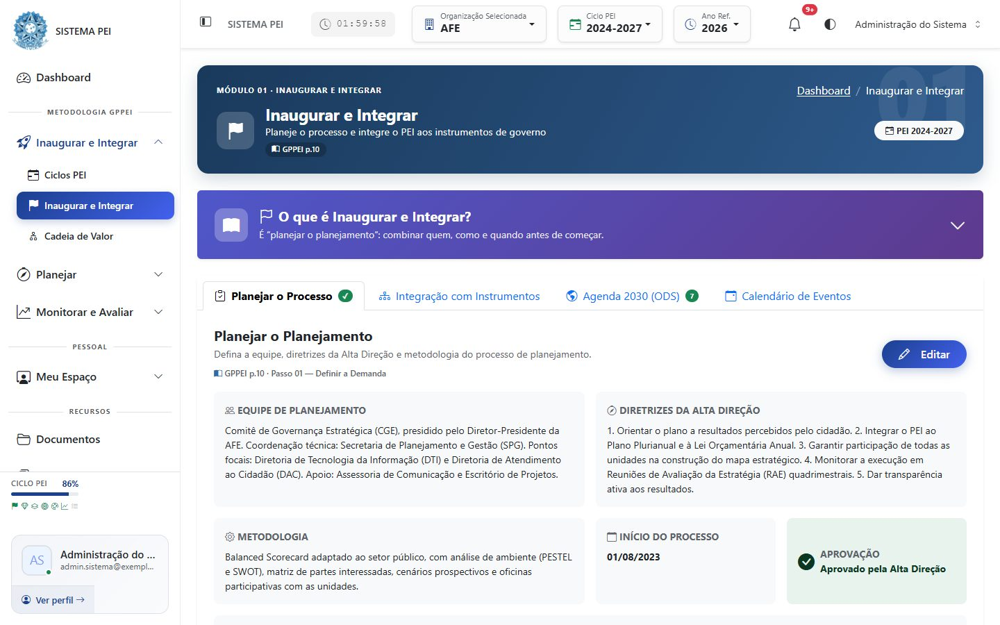
*Figura 16 — Aba Planejar o Processo preenchida.*

No alto da aba ficam o título **Planejar o Planejamento**, uma breve explicação e o link **GPPEI p.10 · Passo 01 — Definir a Demanda**. À direita está o botão **Editar**. Se a aba ainda estiver vazia, o botão se chama **Preencher**.

O conteúdo aparece em cartões:

| Cartão | O que mostra |
|---|---|
| **Equipe de Planejamento** | Quem conduz o processo. Na figura: o Comitê de Governança Estratégica (CGE), presidido pelo Diretor-Presidente da AFE; a coordenação técnica da SPG; e os pontos focais da DTI e da DAC. |
| **Diretrizes da Alta Direção** | As orientações da direção. Na figura: orientar o plano a resultados, integrar ao PPA e à LOA, garantir participação das unidades, monitorar em RAE quadrimestrais e dar transparência. |
| **Metodologia** | O método escolhido. Na figura: Balanced Scorecard adaptado ao setor público, PESTEL, SWOT, partes interessadas, cenários e oficinas. |
| **Início do Processo** | Data em que o processo começou (01/08/2023 na figura). |
| **Aprovação** | Verde, com o ícone de "visto" e "Aprovado pela Alta Direção", quando aprovado. Cinza, com relógio e "Aguardando aprovação", quando não. |
| **Observações** | Só aparece quando preenchido. |

Quando a aba ainda não foi preenchida, aparece a mensagem "Planejamento do processo ainda não preenchido."

#### 7.5.3 Passo a passo — preencher ou editar

1. Na aba **Planejar o Processo**, clique em **Preencher** (primeira vez) ou **Editar**.
2. Na janela **Planejar o Planejamento**, preencha os campos (tabela abaixo).
3. Clique em **Salvar**.
4. A janela **Sucesso!** confirma: "Planejamento do Processo registrado com sucesso." Clique em **Continuar**.

Existe um único registro desta aba por ciclo. Editar substitui o conteúdo anterior.

#### 7.5.4 Campos do formulário

| Campo | Obrigatório | O que informar e por quê | Exemplo |
|---|---|---|---|
| **Equipe de Planejamento** | Sim (até 1.000 caracteres) | Membros, cargos e responsabilidades. Quem coordena, quem dá apoio técnico, quem são os pontos focais das unidades. O GPPEI pede uma equipe definida para que o processo tenha dono. | Comitê de Governança Estratégica; coordenação técnica da SPG; pontos focais da DTI e da DAC. |
| **Diretrizes da Alta Direção** | Não | Expectativas e orientações da direção para o plano. É o registro da "demanda" do Passo 01. | Plano orientado a resultados para o cidadão; integração com PPA e LOA. |
| **Metodologia a Adotar** | Não | Método e ferramentas que serão usados. | GPPEI/MGI 2025, BSC, oficinas presenciais. |
| **Data de Início** | Não | Quando o processo de planejamento começa. | 01/08/2023 |
| **Data Fim Prevista** | Não | Quando o processo deve terminar. Deve ser igual ou posterior ao início. | 31/01/2024 |
| **Aprovado pela Alta Direção** | Não (chave liga/desliga) | Ligue quando a direção aprovar formalmente o processo. Isso muda o cartão **Aprovação** para verde. | Ligado |
| **Observações** | Não | Notas adicionais. | Processo participativo, com consulta às unidades. |

#### 7.5.5 Regras e validações

- Equipe em branco: "Informe a equipe de planejamento."
- Data fim antes do início: "A data fim deve ser igual ou posterior à data de início."

#### 7.5.6 Dicas

- Seção educativa: evite que a adesão da direção seja só formal. Use **Diretrizes da Alta Direção** para registrar o que a direção de fato pediu.
- Ligue **Aprovado pela Alta Direção** só depois da aprovação real, por exemplo em reunião do comitê. O cartão verde é a evidência visível para todos os perfis.

### 7.6 Aba Integração com Instrumentos

#### 7.6.1 Para que serve

Mapeia os **instrumentos de governo com que o PEI precisa estar alinhado**. Para cada um, registra:

- a força da relação (**intensidade**);
- os **pontos de atenção**;
- as **tarefas** necessárias para garantir o alinhamento.

O Passo 02 do GPPEI lista como instrumentos relevantes:

- o **Plano Plurianual (PPA)**;
- o **Orçamento (LOA)**;
- a **Estratégia Nacional de Longo Prazo**;
- a **Agenda 2030**;
- os **planos setoriais**.

O objetivo é evitar um plano que contradiga o PPA ou que não tenha orçamento. A Agenda 2030 tem aba própria (ver 7.7).

#### 7.6.2 O que aparece na tela

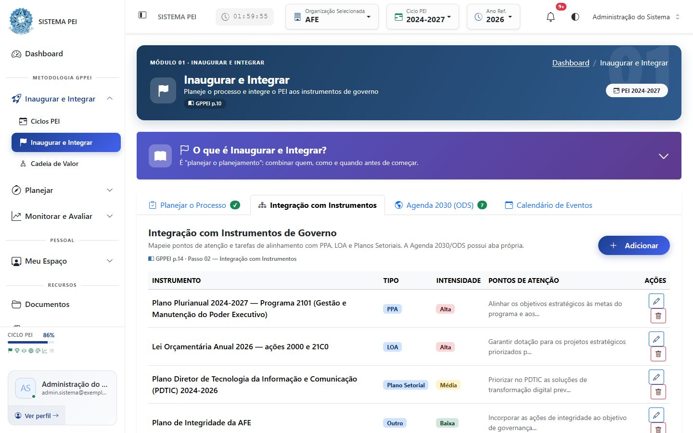
*Figura 17 — Aba Integração com Instrumentos.*

No alto ficam o título **Integração com Instrumentos de Governo**, a explicação, o link **GPPEI p.14 · Passo 02 — Integração com Instrumentos** e o botão **Adicionar**.

A tabela tem as colunas:

| Coluna | O que mostra |
|---|---|
| **Instrumento** | Nome do instrumento. Na figura: "Plano Plurianual 2024-2027 — Programa 2101…", "Lei Orçamentária Anual 2026 — ações 2000 e 21C0", "Plano Diretor de Tecnologia da Informação e Comunicação (PDTIC) 2024-2026" e "Plano de Integridade da AFE". |
| **Tipo** | Selo azul: **PPA**, **LOA**, **Plano Setorial** ou **Outro**. |
| **Intensidade** | Selo colorido: **Alta** (vermelho), **Média** (amarelo) ou **Baixa** (verde). |
| **Pontos de Atenção** | Os primeiros 60 caracteres do texto, com reticências. O texto completo aparece ao editar. |
| **Ações** | Lápis (editar) e lixeira (excluir). |

O campo **Tarefas de Integração** não aparece na tabela. Para vê-lo, abra o registro no lápis.

Sem registros, a aba mostra "Nenhuma integração registrada."

#### 7.6.3 Passo a passo

**Adicionar:**

1. Clique em **Adicionar**.
2. Na janela **Nova Integração**, preencha os campos.
3. Clique em **Salvar**. A mensagem "Integração com instrumento salva." confirma a gravação.

**Editar:**

1. Clique no lápis da linha.
2. Altere os campos na janela **Editar Integração**.
3. Clique em **Salvar**.

**Excluir:**

1. Clique na lixeira da linha.
2. Na janela **Confirmar Exclusão**, clique em **Excluir**. Aparece o aviso "Registro excluído."

#### 7.6.4 Campos do formulário

| Campo | Obrigatório | O que informar e por quê | Exemplo |
|---|---|---|---|
| **Instrumento** | Sim (até 100 caracteres) | Nome e, se houver, a vigência ou o programa/ação. | PPA 2024-2027 — Programa 2101 |
| **Tipo** | Sim (vem com **PPA**) | **PPA**, **LOA**, **Plano Setorial** ou **Outro**. Use **Outro** para a Estratégia Nacional de Longo Prazo, planos de integridade e demais instrumentos. | Plano Setorial |
| **Intensidade** | Sim (vem com **Média**) | Quanto o PEI depende desse instrumento ou interfere nele: **Alta**, **Média** ou **Baixa**. Ajuda a priorizar onde o alinhamento é mais crítico. | Alta |
| **Pontos de Atenção** | Não | O que a equipe deve observar ao integrar este instrumento. | Alinhar os objetivos estratégicos às metas do programa. |
| **Tarefas de Integração** | Não | Ações concretas para garantir o alinhamento. | Revisar com a área de orçamento a dotação dos projetos priorizados. |

#### 7.6.5 Regras e cuidados

- Nome em branco: "Informe o nome do instrumento."
- Dica da seção educativa: ao integrar, **não copie mecanicamente** os elementos do outro instrumento. Registre como o PEI se relaciona com ele.
- A exclusão é lógica, mas não há como desfazê-la pela tela. A janela de confirmação avisa que a ação é irreversível.

### 7.7 Aba Agenda 2030 (ODS)

#### 7.7.1 Para que serve

É onde a instituição **declara a quais Objetivos de Desenvolvimento Sustentável (ODS) o ciclo se propõe a contribuir**: o mapeamento estratégico inicial. A Agenda 2030 é um dos instrumentos que o GPPEI manda integrar (Passo 02).

A declaração é **opcional**. O sistema nunca obriga a marcar ODS.

Esta aba é o primeiro de três pontos da Agenda 2030 no sistema:

1. **Aqui** a instituição declara a aderência.
2. Em **Objetivos Estratégicos** cada objetivo é vinculado aos ODS (capítulo 15).
3. O **Painel Agenda 2030** compara o declarado com o vinculado (capítulo 18). Ele avisa, por exemplo, quando um ODS foi declarado aqui mas nenhum objetivo está ligado a ele.

#### 7.7.2 O que aparece na tela

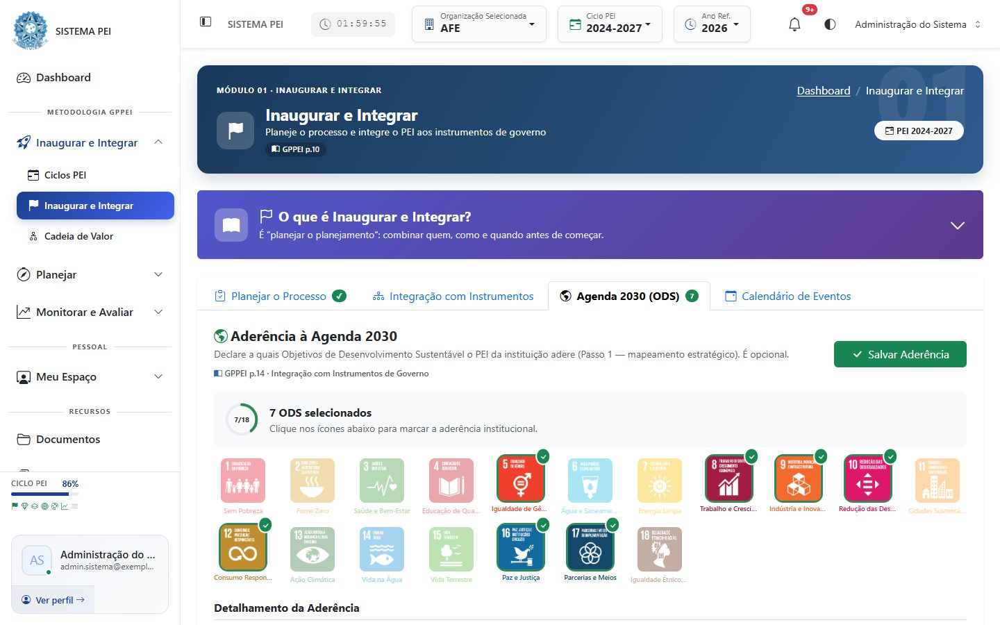
*Figura 18 — Aba Agenda 2030 (ODS) com sete ODS marcados.*

- **Título e botão:** **Aderência à Agenda 2030**, com o link **GPPEI p.14** e o botão verde **Salvar Aderência**.
- **Resumo:** um anel de progresso mostra quantos ODS estão marcados sobre o total cadastrado no sistema. Na figura, **7/18**: a base inclui o ODS 18, Igualdade Étnico-Racial. Ao lado aparece "7 ODS selecionados".
- **Grade de ODS:** um ícone colorido por ODS, com o nome abreviado embaixo.
  - ODS **marcado**: ícone em cor plena, levemente elevado, com contorno verde e um ✓ verde no canto.
  - ODS **não marcado**: ícone esmaecido.
  - Na figura estão marcados os ODS 5, 8, 9, 10, 12, 16 e 17.
  - Passe o mouse sobre um ícone para ver o número e o nome completo.
- **Detalhamento da Aderência** (abaixo da grade, visível ao rolar a tela): uma linha por ODS marcado, com dois campos:
  - **Como a instituição contribui para este ODS? (opcional)**: texto livre, até 2.000 caracteres;
  - **Intensidade**: **Alta**, **Média** ou **Baixa**. Vem com Média.
- Um segundo botão **Salvar Aderência** fica no fim do detalhamento.

Sem nenhum ODS marcado, aparece "Nenhum ODS selecionado." e o lembrete de que a aderência é opcional.

#### 7.7.3 Passo a passo

1. Clique no ícone de cada ODS com que a instituição contribui. Clicar de novo desmarca.
2. No **Detalhamento da Aderência**, descreva a contribuição e escolha a intensidade de cada ODS marcado.
3. Clique em **Salvar Aderência**. A mensagem "Aderência à Agenda 2030 atualizada com sucesso." confirma.

#### 7.7.4 Cuidados

- **Nada é gravado até você clicar em Salvar Aderência.** Marcar e desmarcar ícones só muda a tela. Se você sair da aba ou trocar de ciclo antes de salvar, as mudanças se perdem.
- **Desmarcar um ODS e salvar apaga** a contribuição e a intensidade que estavam registradas para ele.
- A declaração é do **ciclo selecionado no topo**. Cada ciclo tem a sua. O **Salvar como** copia a declaração para o novo ciclo.

### 7.8 Aba Calendário de Eventos

#### 7.8.1 Para que serve

Organiza os **eventos do processo de planejamento**: oficinas, workshops, reuniões, apresentações à direção, capacitações e reuniões de RAE. O GPPEI (p. 140) recomenda organizar esse calendário para que o processo tenha ritmo e para que todos saibam quando participar.

#### 7.8.2 O que aparece na tela

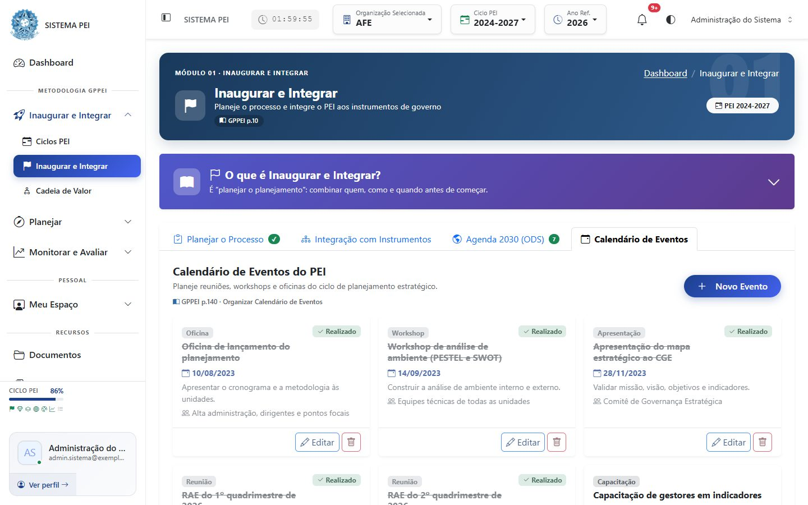
*Figura 19 — Aba Calendário de Eventos.*

No alto ficam o título **Calendário de Eventos do PEI**, o link **GPPEI p.140 · Organizar Calendário de Eventos** e o botão **Novo Evento**.

Os eventos aparecem em cartões, em ordem de data, três por linha em telas largas. Cada cartão mostra:

- o **tipo** em um selo cinza (Oficina, Workshop, Apresentação, Reunião, Capacitação…);
- o **título**;
- a **data**, com ícone de calendário;
- o **objetivo**, resumido em 80 caracteres;
- os **participantes**, resumidos em 60 caracteres, com ícone de pessoas;
- os botões **Editar** e lixeira no rodapé.

Os cartões mudam de aparência conforme a situação:

| Situação | Como aparece |
|---|---|
| **Realizado** | Selo verde "✓ Realizado", título riscado e cartão esmaecido. Na figura: "Oficina de lançamento do planejamento" (10/08/2023), "Workshop de análise de ambiente (PESTEL e SWOT)" (14/09/2023) e "Apresentação do mapa estratégico ao CGE" (28/11/2023). |
| **Atrasado** | A data já passou e o evento não foi marcado como realizado. Aparecem borda vermelha, selo vermelho "Atrasado", a data em vermelho e há quanto tempo a data passou. Sinaliza que o evento não aconteceu ou que ninguém registrou. |
| **Previsto** | Data futura, sem marcação. Cartão normal, data em azul. Exemplo: "Capacitação de gestores em indicadores". |

Sem eventos, aparece "Nenhum evento cadastrado."

#### 7.8.3 Passo a passo

**Criar:**

1. Clique em **Novo Evento**.
2. Preencha os campos.
3. Clique em **Salvar**. A mensagem "Evento registrado no calendário." confirma.

**Marcar como realizado:**

1. Clique em **Editar** no cartão.
2. Ligue **Evento já realizado**.
3. Clique em **Salvar**.

**Excluir:**

1. Clique na lixeira do cartão.
2. Confirme em **Excluir**.

#### 7.8.4 Campos do formulário

| Campo | Obrigatório | O que informar | Exemplo |
|---|---|---|---|
| **Título** | Sim (até 200 caracteres) | Nome do evento. | Workshop de Análise SWOT |
| **Data** | Sim | Dia do evento. | 14/09/2023 |
| **Tipo de Evento** | Sim (vem com **Reunião**) | **Reunião**, **Workshop**, **Oficina**, **Apresentação**, **Capacitação** ou **Outro**. | Workshop |
| **Objetivo** | Não | O que se espera do evento. | Construir a análise de ambiente interno e externo. |
| **Participantes** | Não | Quem participa. | Equipes técnicas de todas as unidades |
| **Evento já realizado** | Não (chave liga/desliga) | Ligue depois que o evento acontecer. | Ligado |

#### 7.8.5 Regras e validações

- Título em branco: "Informe o título do evento."
- Data em branco: "Informe a data do evento."

#### 7.8.6 Dica

Atualize a chave **Evento já realizado** logo após cada evento. Assim o selo **Atrasado** passa a indicar só o que realmente ficou pendente.

### 7.9 Perguntas frequentes

**Sou Administradora da minha unidade e não vejo o botão Editar. Por quê?**
O conteúdo desta tela vale para a instituição inteira. Por isso só o Super Administrador e o Administrador da unidade **raiz** podem alterá-lo. Administradores de unidades subordinadas, como a SPG, apenas consultam.

**Preenchi a aba Planejar o Processo de outro ciclo por engano.**
A tela grava sempre no ciclo do seletor do topo, cujo nome aparece no selo do cabeçalho. Escolha o ciclo correto no topo e preencha de novo. Depois, corrija o outro ciclo.

**Preciso marcar ODS para usar o sistema?**
Não. A Agenda 2030 é um eixo opcional.

**Onde informo a Estratégia Nacional de Longo Prazo?**
Na aba **Integração com Instrumentos**, com o tipo **Outro**.

# PARTE III — MÓDULO 02: PLANEJAR

O Módulo 02 é onde a estratégia ganha forma. Aqui a organização descreve o que entrega à sociedade
(Cadeia de Valor), diz por que existe e aonde quer chegar (Identidade Estratégica e Valores), lê o
ambiente (PESTEL e SWOT), escolhe as prioridades do ciclo (Temas Norteadores) e monta o plano em
camadas (Perspectivas BSC e Objetivos Estratégicos). O resultado aparece numa página só: o **Mapa
Estratégico**. Duas telas de apoio fecham o módulo: **Graus de Satisfação** (a régua de cores do farol)
e **Agenda 2030 (ODS)** (a leitura da estratégia pelos Objetivos de Desenvolvimento Sustentável).

Antes de começar, guarde duas ideias que valem para todos os capítulos desta parte.

**1. Tudo o que você vê depende dos três seletores do topo.** A **Organização Selecionada** (unidade),
o **Ciclo PEI** e o **Ano Ref.** decidem quais registros aparecem e de qual ano são os percentuais.
Se uma tela parecer vazia, confira primeiro os seletores (ver capítulo 3).

**2. Há dois tipos de registro: os da unidade e os da instituição.**

| Tipo | Telas | Quem altera |
|---|---|---|
| **Da unidade** — cada unidade tem os seus, no ciclo selecionado | Identidade Estratégica, Valores Institucionais, Temas Norteadores, Análise PESTEL, itens da Análise SWOT, Cenários Prospectivos e Matriz TOWS | **Super Administrador** e **Administrador da Unidade** — na unidade em que tem o vínculo e nas unidades subordinadas a ela |
| **Da instituição** — valem para todas as unidades do ciclo | Cadeia de Valor, Partes Interessadas (na tela SWOT), Perspectivas BSC, Objetivos Estratégicos, Futuro Almejado e Graus de Satisfação | **Super Administrador** e **Administrador da unidade raiz** (na base de demonstração, a AFE) |

Os perfis **Gestor(a) Responsável**, **Gestor(a) Substituto(a)** e **Consulta** apenas **consultam** as
telas deste módulo. Exemplo com os usuários de demonstração: carla.ribeiro é Administradora da SPG.
Ela altera a missão, os valores, os temas, a PESTEL e a SWOT da SPG e também da DTI (subordinada à SPG).
Ela **não** altera os da DAC, e também **não** altera perspectivas, objetivos ou a Cadeia de Valor,
porque esses registros pertencem à instituição inteira e a SPG não é a unidade raiz. Já rafael.lima
(Gestor Responsável), juliana.costa (Gestora Substituta) e paulo.nogueira (Consulta) veem tudo, mas
não encontram os botões de incluir, editar ou excluir.

> **Sobre os botões que não aparecem.** O sistema só mostra o botão que você pode usar. Se um colega vê
> **Nova Perspectiva** e você não, a diferença está no perfil, não num erro da tela.

---

## 8. Cadeia de Valor

### 8.1 Para que serve

A Cadeia de Valor é um retrato de tudo o que a organização entrega à sociedade e de como faz isso.
Ela separa as atividades **finalísticas** (o que chega diretamente ao cidadão), as **de suporte**
(pessoas, tecnologia, orçamento, contratos) e os **valores públicos** (o resultado que a cadeia
entrega à sociedade). Cada atividade pode ser detalhada em processos, no formato entrada →
transformação → saída. O GPPEI trata a Cadeia de Valor como ponto de partida do planejamento
(p. 24): conhecer o que se faz ajuda a achar gargalos, pontos fortes e pontos fracos antes de
escrever os objetivos.

### 8.2 Como chegar

Menu lateral **Inaugurar e Integrar → Cadeia de Valor**. O endereço é `/pei/cadeia-valor`.

> O item fica no menu do Módulo 01, mas o cabeçalho da tela mostra **MÓDULO 02 · PLANEJAR**. As duas
> indicações levam à mesma tela.

### 8.3 Quem pode

| Ação | Perfis |
|---|---|
| Ver a Cadeia de Valor | Todos os perfis com vínculo |
| Gerar o **PDF** | Todos os perfis com vínculo |
| Incluir, editar e excluir atividades e processos | Super Administrador e Administrador da unidade raiz |

A Cadeia de Valor é **da instituição**: vale para todas as unidades do ciclo selecionado, e por isso
o seletor de unidade não muda o que aparece nesta tela.

### 8.4 O que aparece na tela

A tela abre com o cabeçalho azul, a seção educativa e um bloco para cada tipo de atividade.

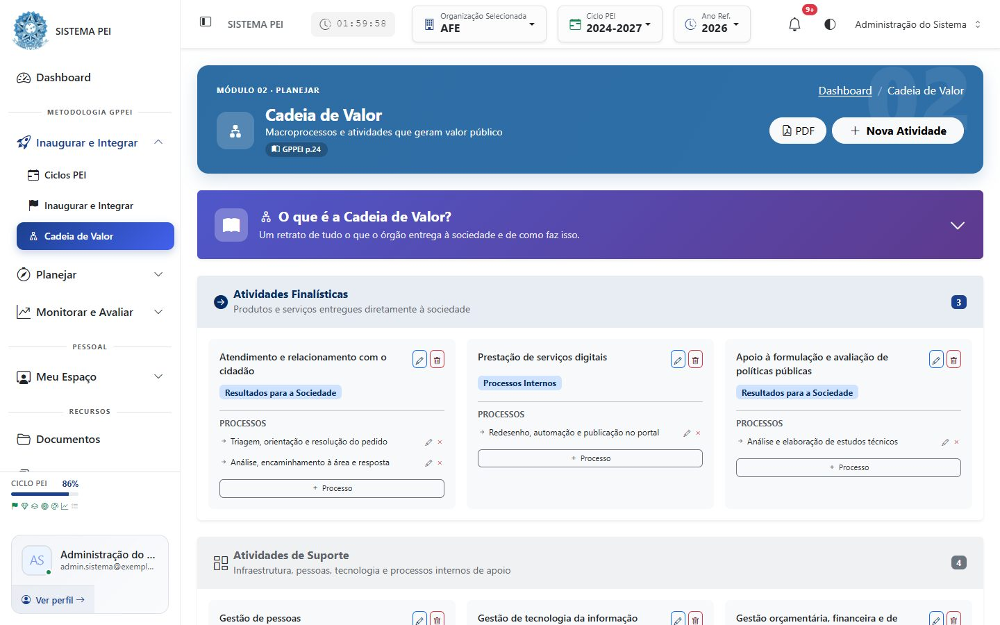
*Figura 20 — Cadeia de Valor com as atividades finalísticas.*

Na figura, o ciclo **2024-2027** está selecionado. Os elementos são:

- **Cabeçalho azul**: título **Cadeia de Valor**, o selo **GPPEI p.24** (abre o Guia na página citada)
  e, à direita, os botões **PDF** e **Nova Atividade**. Quem não pode incluir não vê **Nova Atividade**.
- **O que é a Cadeia de Valor?**: seção educativa recolhida. A seta à direita abre a explicação, o
  passo a passo, um exemplo fictício e a referência no GPPEI.
- **Blocos por tipo**: **Atividades Finalísticas** (azul, com o texto "Produtos e serviços entregues
  diretamente à sociedade"), **Atividades de Suporte** (cinza, "Infraestrutura, pessoas, tecnologia e
  processos internos de apoio") e **Valores Públicos** (verde, "O que a cadeia de valor entrega à
  sociedade como resultado"). O número no canto direito de cada bloco é a quantidade de atividades.
  Na figura, há 3 finalísticas e 4 de suporte.
- **Cartão da atividade**: mostra a descrição (ex.: "Atendimento e relacionamento com o cidadão"), a
  perspectiva BSC ligada a ela num selo azul (ex.: "Resultados para a Sociedade"), a lista
  **PROCESSOS** e o botão **+ Processo**. O lápis azul edita a atividade e a lixeira vermelha a exclui.
- **Linha de processo**: cada processo aparece pela sua transformação (ex.: "Triagem, orientação e
  resolução do pedido"), com um lápis pequeno para editar e um **x** vermelho para excluir.

Quando um tipo não tem atividade, o bloco mostra "Nenhum item cadastrado em …". Se nenhum ciclo estiver
selecionado, a tela pede: "Selecione um ciclo PEI para gerenciar a Cadeia de Valor."

### 8.5 Passo a passo

#### 8.5.1 Incluir uma atividade

1. Clique em **Nova Atividade** no cabeçalho.
2. Na janela **Nova Atividade**, escreva a **Descrição**.
3. Escolha o **Tipo** (Finalística, Suporte ou Valores públicos).
4. Se quiser, ligue a atividade a uma **Perspectiva BSC** do ciclo.
5. Informe a **Ordem** em que ela deve aparecer dentro do bloco.
6. Clique em **Salvar**. O aviso "Atividade salva!" confirma a gravação.

A janela de edição é a mesma, com o título **Editar Atividade**:

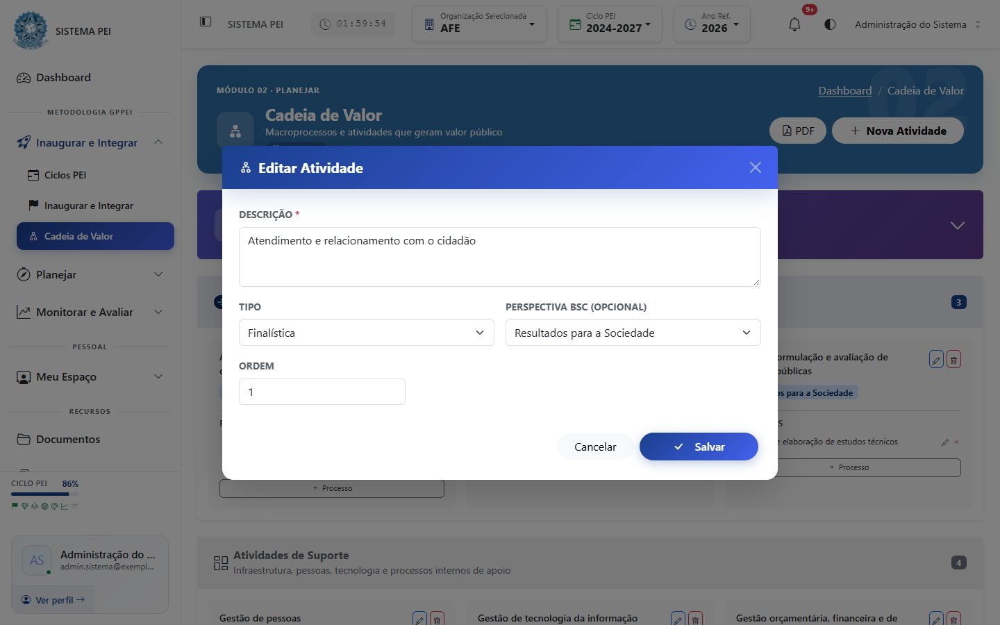
*Figura 21 — Janela Editar Atividade.*

Na figura, a atividade "Atendimento e relacionamento com o cidadão" é do tipo **Finalística**, está
ligada à perspectiva **Resultados para a Sociedade** e tem ordem **1**. **Cancelar** fecha a janela sem
gravar. Clicar fora da janela também a fecha sem gravar.

#### 8.5.2 Editar ou excluir uma atividade

1. No cartão da atividade, clique no **lápis azul** para editar, ou na **lixeira vermelha** para excluir.
2. Na exclusão, a janela **Confirmar Exclusão** avisa "Esta ação é irreversível". Clique em **Excluir**
   para confirmar ou em **Cancelar** para desistir.

> **Cuidado:** excluir uma atividade leva junto os processos dela.

#### 8.5.3 Incluir, editar ou excluir um processo

1. No cartão da atividade, clique em **+ Processo**.
2. Na janela **Novo Processo**, preencha **Entradas**, **Transformação/Processo** e **Saídas**.
3. Clique em **Salvar**. O aviso "Processo salvo!" confirma.
4. Para editar, clique no lápis pequeno ao lado do processo; para excluir, no **x** vermelho e depois em
   **Excluir** na confirmação.

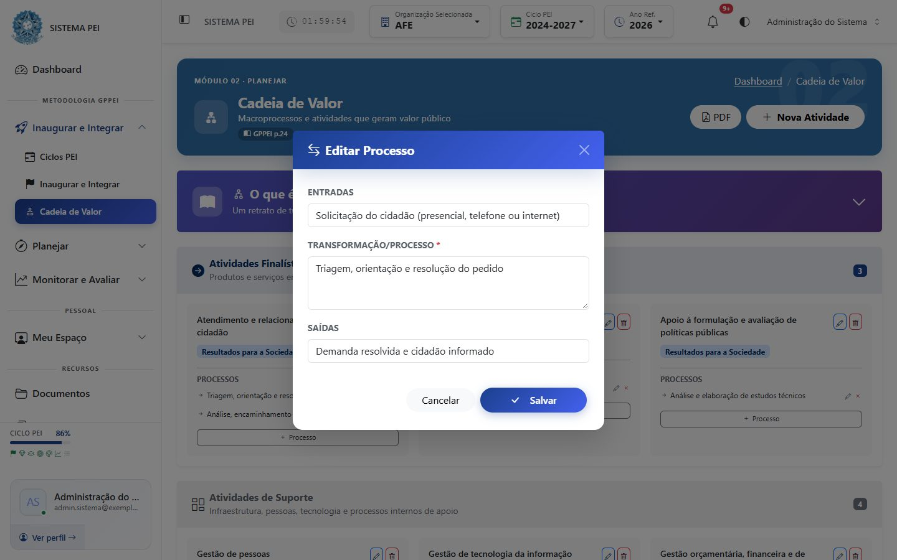
*Figura 22 — Janela Editar Processo.*

Na figura, o processo tem como **Entradas** "Solicitação do cidadão (presencial, telefone ou internet)",
como **Transformação/Processo** "Triagem, orientação e resolução do pedido" e como **Saídas** "Demanda
resolvida e cidadão informado". No cartão da atividade aparece só a transformação; as entradas e as
saídas ficam visíveis ao abrir a edição do processo e no PDF.

#### 8.5.4 Gerar o PDF

1. Clique em **PDF** no cabeçalho.
2. O navegador baixa o arquivo `Cadeia_de_Valor_AAAA_MM_DD.pdf`, em formato paisagem, com as atividades
   agrupadas por tipo e os processos de cada uma.

### 8.6 Campos do formulário

**Atividade**

| Campo | Obrigatório | O que informar | Exemplo |
|---|---|---|---|
| Descrição | Sim | O que a atividade faz, em poucas palavras (até 500 caracteres) | Atendimento e relacionamento com o cidadão |
| Tipo | Sim (vem preenchido com Finalística) | Finalística, Suporte ou Valores públicos | Finalística |
| Perspectiva BSC (opcional) | Não | A perspectiva do ciclo à qual a atividade se relaciona; "Nenhuma" deixa sem vínculo | Resultados para a Sociedade |
| Ordem | Não | Posição dentro do bloco, de 0 a 9999 | 1 |

**Processo**

| Campo | Obrigatório | O que informar | Exemplo |
|---|---|---|---|
| Entradas | Não | Recursos e insumos que o processo recebe | Solicitação do cidadão |
| Transformação/Processo | Sim | O que é feito com as entradas (até 500 caracteres) | Triagem, orientação e resolução do pedido |
| Saídas | Não | Produto ou resultado gerado | Demanda resolvida e cidadão informado |

### 8.7 Regras e validações

- Sem descrição, o sistema mostra "Informe a descrição da atividade."
- Ordem fora de 0 a 9999 gera "Informe a ordem como um número de 0 a 9999."
- Processo sem transformação gera "Informe a transformação/processo."
- Só aparecem no campo **Perspectiva BSC** as perspectivas do ciclo selecionado. Se a perspectiva ligada
  for excluída depois, a atividade continua existindo e passa a ficar "sem perspectiva".
- Cada ciclo tem a sua própria Cadeia de Valor. Trocar o **Ciclo PEI** no topo troca o conteúdo da tela.

### 8.8 Dicas e cuidados

- **Dica:** não tente fazer um diagrama em que "caiba tudo", mas também não o simplifique a ponto de
  perder as ligações entre as partes.
- **Dica:** use a **Ordem** para contar a história da esquerda para a direita: primeiro o que entra na
  organização, por último o que chega ao cidadão.
- **Cuidado:** a exclusão não pode ser desfeita pela tela. Na dúvida, edite em vez de excluir.

---

## 9. Identidade Estratégica

### 9.1 Para que serve

A Identidade Estratégica registra a **Missão** (por que a organização existe) e a **Visão** (aonde quer
chegar até o fim do ciclo). São as duas respostas que dão direção comum a todas as áreas; sem elas,
cada unidade puxa para um lado. No GPPEI, fazem parte do Referencial Estratégico (p. 29). Os valores
completam a identidade, mas têm tela própria (ver capítulo 10).

### 9.2 Como chegar

Menu lateral **Planejar → Identidade Estratégica**. O endereço é `/pei`.

### 9.3 Quem pode

| Ação | Perfis |
|---|---|
| Ver a missão e a visão | Todos os perfis com vínculo |
| Editar a missão e a visão, e pedir sugestão à IA | Super Administrador e Administrador da Unidade (na unidade selecionada) |
| Ver o **Histórico de Alterações** no detalhe | Apenas quem tem acesso à Auditoria (Super Administrador) |

A identidade é **da unidade**: cada unidade tem a sua missão e a sua visão em cada ciclo. Mude a
**Organização Selecionada** no topo para ver a de outra unidade.

### 9.4 O que aparece na tela

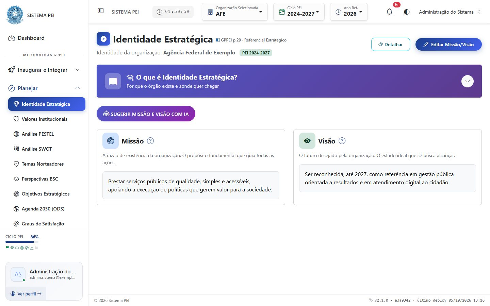
*Figura 23 — Identidade Estratégica da AFE.*

Na figura, a unidade selecionada é a AFE, no ciclo 2024-2027. Os elementos são:

- **Título** com o selo **GPPEI p.29 · Referencial Estratégico** e a linha "Identidade da organização:
  Agência Federal de Exemplo", seguida do selo verde do ciclo (**PEI 2024-2027**). Se não
  houver ciclo, o selo fica vermelho: **Sem Ciclo PEI Ativo**.
- **Editar Missão/Visão** (botão azul, à direita): abre os campos para edição. Só aparece para quem
  pode editar.
- **Detalhar** (botão claro, ao lado de **Editar Missão/Visão**): aparece quando a unidade já tem
  identidade gravada e abre a página de detalhe (ver 9.5.3).
- **O que é Identidade Estratégica?**: seção educativa recolhida, com a definição, as características
  e um exemplo de missão e de visão.
- **SUGERIR MISSÃO E VISÃO COM IA**: botão roxo do Mentor de IA (ver 9.5.2).
- **Cartões Missão e Visão**: cada um traz uma explicação curta, o ícone **?** com a definição resumida e
  o texto gravado. Na figura, a missão da AFE é "Prestar serviços públicos de qualidade, simples e
  acessíveis, apoiando a execução de políticas que gerem valor para a sociedade." e a visão, "Ser
  reconhecida, até 2027, como referência em gestão pública orientada a resultados e em atendimento
  digital ao cidadão." Sem texto, aparecem "Missão não definida." e "Visão não definida."

Sem unidade selecionada, a tela mostra "Nenhuma organização selecionada" e pede que se escolha uma no
menu superior.

### 9.5 Passo a passo

#### 9.5.1 Escrever ou alterar a missão e a visão

1. Confira, no topo, a unidade e o ciclo.
2. Clique em **Editar Missão/Visão**. Os cartões viram caixas de texto.
3. Escreva a missão e a visão.
4. Clique em **Salvar Alterações**. A mensagem "Identidade estratégica atualizada com sucesso!" confirma,
   e o Mentor do sistema mostra um aviso com o próximo passo sugerido do ciclo.
5. Para desistir, clique em **Cancelar**: o texto volta a ser o que estava gravado.

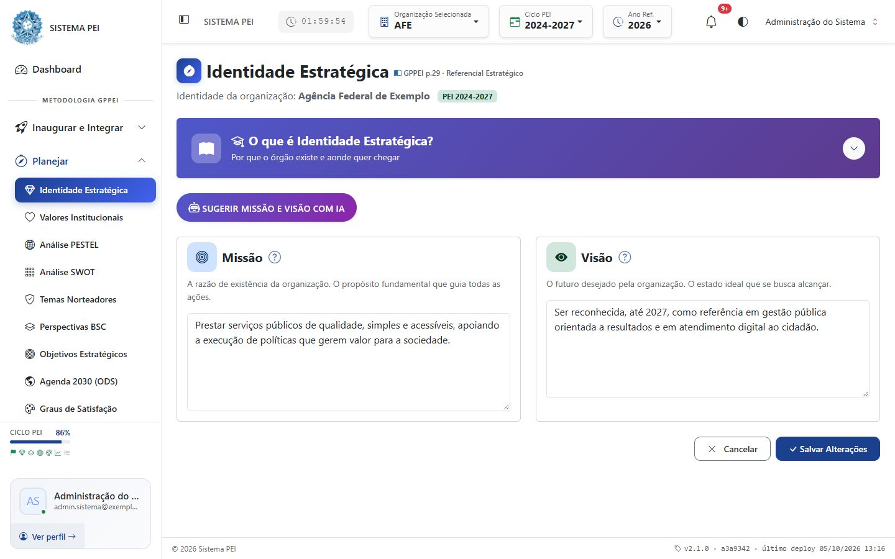
*Figura 24 — Missão e visão em modo de edição.*

Na figura, os cartões viraram caixas de texto com a missão e a visão da AFE prontas para alteração; os
botões **Detalhar** e **Editar Missão/Visão** do topo somem enquanto se edita. Os botões **Cancelar** e
**Salvar Alterações** ficam abaixo, à direita. Uma caixa vazia mostra o texto de exemplo "Descreva a
missão da organização..." (ou "...a visão...").

#### 9.5.2 Pedir uma sugestão à IA

O Mentor de IA lê o **nome da unidade selecionada** e propõe uma missão e uma visão. É um ponto de
partida para a conversa da equipe, não um texto pronto.

1. Clique em **SUGERIR MISSÃO E VISÃO COM IA**. Enquanto a IA trabalha, o botão mostra "Inspirando novas
   ideias...".
2. Aparece o quadro **Identidade Sugerida pelo Mentor IA**, com **Sugestão de Missão** e **Sugestão de
   Visão**.
3. Para usar a sugestão, clique em **Aplicar Missão e Visão**. Para descartá-la, feche o quadro no **x**.

> **Cuidado:** **Aplicar Missão e Visão** grava a sugestão **imediatamente**, no lugar da missão e da
> visão que já existiam, sem pedir confirmação. Se a unidade já tem texto aprovado, copie a sugestão
> que interessa e cole no modo de edição (9.5.1), em vez de aplicar.

> **A IA depende de configuração.** O botão só aparece quando a IA está ligada em **Configurações**
> (ver capítulo 32). Se você clicar e nada acontecer, o agente de IA não está configurado ou o limite de
> 20 pedidos por minuto por usuário foi atingido. Nesse caso, procure o Super Administrador. Se a IA
> responder num formato que o sistema não entende, aparece "Falha ao processar sugestões."

#### 9.5.3 Ver o detalhe da identidade

Clique em **Detalhar**. A página **Identidade Estratégica Detalhada** reúne a identidade da unidade num
só lugar.

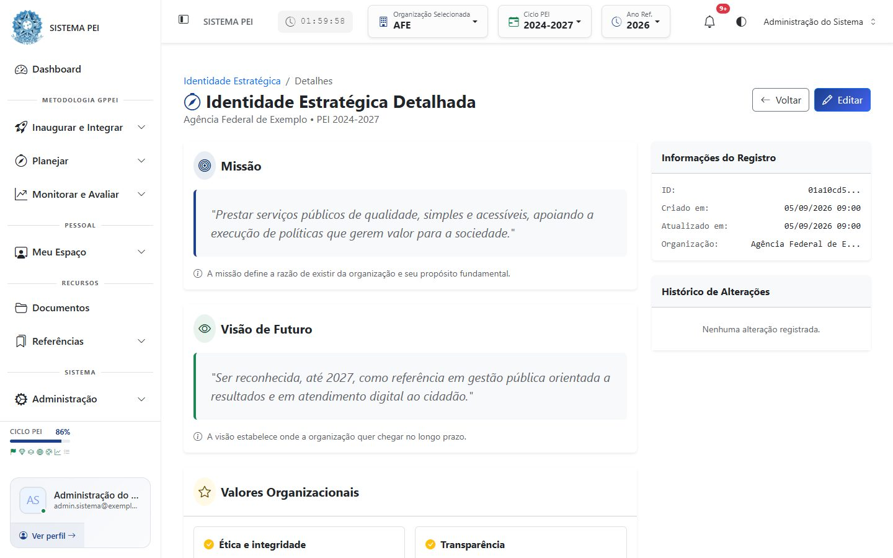
*Figura 25 — Identidade Estratégica Detalhada da AFE.*

Na figura, a unidade é a **Agência Federal de Exemplo**, ciclo **PEI 2024-2027**. A página mostra:

- **Missão**, em destaque, com a nota "A missão define a razão de existir da organização e seu
  propósito fundamental."
- **Visão de Futuro**, com a nota "A visão estabelece onde a organização quer chegar no longo prazo."
- **Valores Organizacionais**: os valores cadastrados para a mesma unidade e o mesmo ciclo (ex.: "Ética e
  integridade", "Transparência"). Sem valores, aparece "Nenhum valor cadastrado para esta identidade."
- **Informações do Registro**: identificador, datas de criação e de atualização e a organização.
- **Histórico de Alterações**: as cinco últimas mudanças de missão e visão, com autor e data. Só o
  Super Administrador vê este quadro; com mais de cinco mudanças, aparece o link **Ver histórico
  completo na Auditoria**.
- **Voltar** e **Editar**: os dois levam de volta à tela **Identidade Estratégica**. Para editar, clique
  depois em **Editar Missão/Visão** (o botão **Editar** do detalhe não abre a edição sozinho).

### 9.6 Campos do formulário

| Campo | Obrigatório | O que informar | Exemplo |
|---|---|---|---|
| Missão | Não | Por que a unidade existe, em linguagem simples (até 5.000 caracteres) | Prestar serviços públicos de qualidade, simples e acessíveis, apoiando a execução de políticas que gerem valor para a sociedade. |
| Visão | Não | Aonde a unidade quer chegar, com prazo (até 5.000 caracteres) | Ser reconhecida, até 2027, como referência em gestão pública orientada a resultados e em atendimento digital ao cidadão. |

### 9.7 Regras e validações

- Sem ciclo PEI selecionado, o sistema não deixa editar: "Não há um Ciclo PEI ativo. Não é possível
  editar a Identidade Estratégica."
- A identidade é gravada para a dupla **unidade + ciclo**. Mudar o ciclo no topo mostra a identidade
  daquele ciclo (ou os campos vazios, se ainda não houver).
- O assistente do ciclo só considera a etapa **Identidade** concluída quando há missão **e** visão com
  mais de 10 caracteres cada. Enquanto isso não acontece, **Nova Perspectiva** e **Novo Objetivo**
  levam de volta a esta tela (ver 14.7 e 15.7).

### 9.8 Dicas e cuidados

- **Dica:** uma boa identidade é memorável, clara e sem jargão. Envolva a equipe na redação.
- **Dica:** a missão fala do presente ("por que existimos"); a visão, do futuro ("onde queremos estar
  em 2027").
- **Cuidado:** missão e visão aparecem no **Mapa Estratégico** e no **Portal da Transparência**. Revise o
  texto antes de salvar.

---

## 10. Valores Institucionais

### 10.1 Para que serve

Valores são os princípios éticos e de conduta que dizem **como** a organização age em qualquer
situação. Eles orientam decisões quando não há regra escrita e costumam permanecer de um ciclo para
outro, porque expressam a cultura que se quer preservar (GPPEI/MGI 2025, Passo 03 — Referencial
Estratégico). No sistema, os valores completam a Identidade Estratégica e aparecem no Mapa Estratégico.

### 10.2 Como chegar

Menu lateral **Planejar → Valores Institucionais**. O endereço é `/pei/valores`.

### 10.3 Quem pode

| Ação | Perfis |
|---|---|
| Ver os valores e o detalhe de cada um | Todos os perfis com vínculo |
| Incluir, editar e excluir valores | Super Administrador e Administrador da Unidade (na unidade selecionada) |

Os valores são **da unidade**: cada unidade cadastra os seus em cada ciclo.

### 10.4 O que aparece na tela

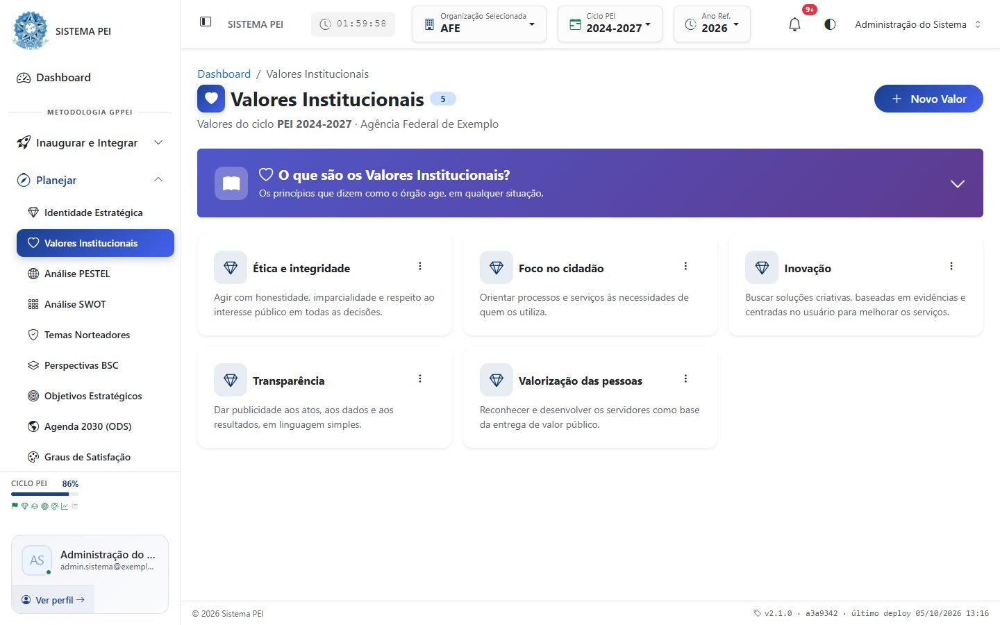
*Figura 26 — Valores Institucionais da AFE.*

Na figura, a unidade é a AFE e o ciclo é o PEI 2024-2027. Os elementos são:

- **Título** com o contador de valores (na figura, **5**) e a linha "Valores do ciclo PEI 2024-2027 ·
  Agência Federal de Exemplo".
- **Novo Valor**: botão azul à direita, visível para quem pode incluir.
- **O que são os Valores Institucionais?**: seção educativa recolhida.
- **Cartões de valores**, em ordem alfabética: cada um tem o ícone de diamante, o nome em negrito e a
  descrição (ou "Sem descrição."). Na figura: "Ética e integridade", "Foco no cidadão", "Inovação",
  "Transparência" e "Valorização das pessoas". O menu de três pontos no canto do cartão oferece
  **Detalhar**, **Editar** e **Excluir**, conforme o perfil.
- Quando a unidade ainda não tem valores, a área mostra "Nenhum valor cadastrado" e o botão
  **Adicionar o primeiro valor**.

A tela também avisa quando falta contexto: "Nenhum ciclo PEI ativo" (com o botão **Gerenciar Ciclos
PEI**) ou "Selecione uma organização".

### 10.5 Passo a passo

#### 10.5.1 Incluir um valor

1. Clique em **Novo Valor** (ou em **Adicionar o primeiro valor**).
2. Na janela **Novo Valor Institucional**, escreva o **Nome do Valor** e, se quiser, a **Descrição**.
3. Clique em **Salvar**. A mensagem "Valor salvo com sucesso!" confirma.

#### 10.5.2 Editar um valor

1. No cartão do valor, abra o menu de três pontos e clique em **Editar**.
2. Altere o nome ou a descrição na janela **Editar Valor**.
3. Clique em **Salvar**.

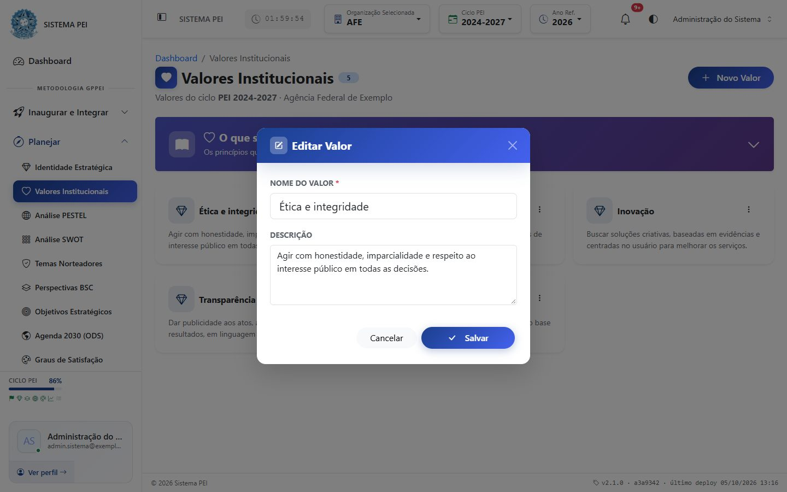
*Figura 27 — Janela Editar Valor na AFE.*

Na figura, com a AFE selecionada (5 valores no contador), a janela mostra o valor "Ética e integridade"
com a descrição "Agir com honestidade, imparcialidade e respeito ao interesse público em todas as
decisões." Ao fundo, aparecem os outros cartões, como "Transparência" e "Inovação".

#### 10.5.3 Excluir um valor

1. No menu de três pontos do cartão, clique em **Excluir**.
2. Confirme na pergunta "Excluir o valor '…'? Esta ação é irreversível."
3. A mensagem "Valor excluído com sucesso!" confirma.

#### 10.5.4 Ver o detalhe de um valor

No menu de três pontos, clique em **Detalhar**.

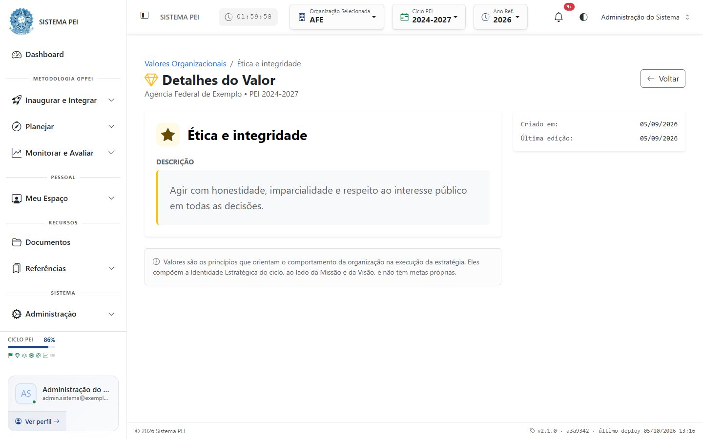
*Figura 28 — Detalhes do Valor "Ética e integridade".*

A página mostra o caminho "Valores Organizacionais / Ética e integridade", a unidade e o ciclo
("Agência Federal de Exemplo • PEI 2024-2027"), o nome do valor com a estrela, a **Descrição**, um
lembrete de que valores não têm metas próprias e, à direita, as datas **Criado em** e **Última
edição**. O botão **Voltar** retorna à lista. Esta página não tem botão de edição: para alterar, volte
à lista e use **Editar**.

### 10.6 Campos do formulário

| Campo | Obrigatório | O que informar | Exemplo |
|---|---|---|---|
| Nome do Valor | Sim | Uma ou duas palavras (até 255 caracteres) | Transparência |
| Descrição | Não | O que o valor significa no dia a dia, de preferência com um comportamento observável (até 1.000 caracteres) | Dar publicidade aos atos, dados e resultados, em linguagem simples. |

### 10.7 Regras e validações

- Sem ciclo ou sem unidade selecionados, o sistema recusa a gravação: "Selecione um Ciclo PEI e uma
  organização antes de salvar."
- O nome é obrigatório; o sistema marca o campo se ele ficar vazio.
- Os valores aparecem em ordem alfabética.
- Um valor cadastrado na AFE não aparece na SPG nem na DTI: cada unidade tem a sua lista.

### 10.8 Dicas e cuidados

- **Dica:** prefira poucos valores (em geral de 3 a 7). Uma lista longa não é lembrada por ninguém.
- **Dica:** evite valores genéricos que qualquer órgão assinaria sem pensar; o bom valor muda uma
  decisão concreta.
- **Cuidado:** a exclusão não pode ser desfeita pela tela.

---

## 11. Temas Norteadores

### 11.1 Para que serve

Temas Norteadores são as grandes prioridades transversais do ciclo: eixos que atravessam perspectivas,
objetivos e iniciativas e concentram o esforço no que é mais crítico **neste período** (ex.:
"Transformação digital", "Governança e integridade"). Eles nascem do diagnóstico (PESTEL e SWOT) e
garantem que as demais peças do plano "falem a mesma língua". Os temas aparecem no Mapa Estratégico, no
quadro **Temas Norteadores Institucionais**.

### 11.2 Como chegar

Menu lateral **Planejar → Temas Norteadores**. O endereço é `/temas-norteadores`.

### 11.3 Quem pode

| Ação | Perfis |
|---|---|
| Ver e buscar temas | Todos os perfis com vínculo |
| Incluir, editar, excluir e pedir sugestões à IA | Super Administrador e Administrador da Unidade (na unidade selecionada) |

Os temas são **da unidade**: a lista mostra os temas da unidade selecionada no ciclo selecionado.

### 11.4 O que aparece na tela

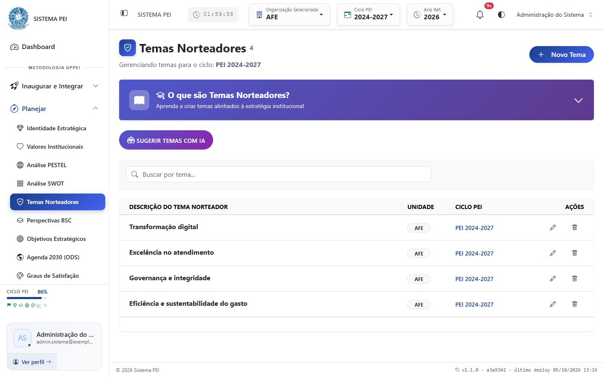
*Figura 29 — Temas Norteadores da AFE.*

Na figura, a unidade é a AFE, com 4 temas. Os elementos são:

- **Título** com o contador e a linha "Gerenciando temas para o ciclo: PEI 2024-2027".
- **Novo Tema**: botão azul à direita.
- **O que são Temas Norteadores?**: seção educativa recolhida, com os critérios "Clareza e Direção" e
  "Alinhamento Estratégico" e exemplos de tema ruim e bom.
- **SUGERIR TEMAS COM IA**: botão do Mentor de IA (ver 11.5.4).
- **Buscar por tema...**: campo de busca; a lista filtra enquanto você digita.
- **Tabela**: colunas **DESCRIÇÃO DO TEMA NORTEADOR**, **UNIDADE** (sigla), **CICLO PEI** e **AÇÕES**
  (lápis para editar e lixeira para excluir). Na figura: "Transformação digital", "Excelência no
  atendimento", "Governança e integridade" e "Eficiência e sustentabilidade do gasto", todos da AFE no
  PEI 2024-2027. Sem temas, aparece "Nenhum tema norteador encontrado.".
  A tabela mostra 10 temas por página, com a navegação de páginas no rodapé.

> O número ao lado do título conta os temas **da página que está na tela**, no máximo 10.

### 11.5 Passo a passo

#### 11.5.1 Incluir um tema

1. Clique em **Novo Tema**.
2. Na janela **Novo Tema Norteador**, escreva a **Descrição do Tema**.
3. Confira a **Unidade Organizacional** (vem preenchida com a unidade selecionada no topo).
4. Clique em **Salvar Tema**. O Mentor do sistema confirma com "Tema Norteador Criado!".

#### 11.5.2 Editar um tema

1. Clique no lápis da linha do tema.
2. Altere o texto na janela **Editar Tema Norteador**.
3. Clique em **Atualizar**.

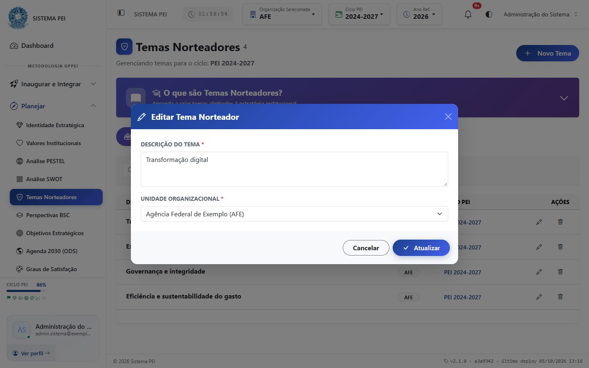
*Figura 30 — Janela Editar Tema Norteador na AFE.*

Na figura, com a AFE selecionada (4 temas), a janela mostra o tema "Transformação digital" e a unidade
"Agência Federal de Exemplo (AFE)". **Cancelar** e o **x** fecham sem gravar.

#### 11.5.3 Excluir um tema

1. Clique na lixeira da linha.
2. A janela **Excluir Tema Norteador** avisa que a ação é irreversível e que o tema sai do
   planejamento. Clique em **Excluir** para confirmar ou em **Cancelar**.

#### 11.5.4 Pedir sugestões à IA

O Mentor de IA lê o **nome da unidade selecionada** e propõe **três temas**. Nenhum tema é gravado até
você escolher.

1. Clique em **SUGERIR TEMAS COM IA**. Enquanto a IA trabalha, o botão mostra "Analisando contexto
   organizacional...".
2. Aparece o quadro **Sugestões do Mentor IA**, com um tema por linha.
3. Clique em **Adicionar** na linha do tema que interessa. Ele é gravado na unidade selecionada e sai da
   lista de sugestões. Os temas que você não adicionar não são gravados.
4. Feche o quadro no **x** para descartar as sugestões restantes.

O botão **SUGERIR TEMAS COM IA** fica acima da busca (ver a figura de 11.4); o quadro de sugestões surge
logo abaixo dele depois que a IA responde.

> **A IA depende de configuração.** O botão só aparece quando a IA está ligada em **Configurações**
> (ver capítulo 32). Se nada acontecer ao clicar, o agente de IA não está configurado ou o limite de 20
> pedidos por minuto foi atingido. Se a resposta vier num formato inválido, aparece "Falha ao processar
> sugestões. Tente novamente."

### 11.6 Campos do formulário

| Campo | Obrigatório | O que informar | Exemplo |
|---|---|---|---|
| Descrição do Tema | Sim | A prioridade, de forma clara e direcionadora (de 5 a 1.000 caracteres) | Promover a transformação digital e a inovação nos serviços |
| Unidade Organizacional | Sim | A unidade dona do tema; a lista traz só as unidades do seu escopo | Secretaria de Planejamento e Gestão (SPG) |

### 11.7 Regras e validações

- A descrição precisa ter **pelo menos 5 caracteres**.
- Só se escolhe uma unidade do seu escopo, e o seu perfil precisa permitir gravar naquela unidade.
- Sem ciclo ativo, a tela mostra "Nenhum Ciclo PEI Ativo" e não permite gerenciar temas.

### 11.8 Dicas e cuidados

- **Dica:** poucos temas (3 a 5) dão mais foco do que uma lista longa.
- **Cuidado:** se, na janela, você escolher uma **unidade diferente** da selecionada no topo, o tema é
  gravado nela e **some da lista atual**. Para vê-lo, troque a unidade no topo.
- **Cuidado:** o Mapa Estratégico mostra os temas da unidade selecionada. Os temas da AFE aparecem no
  mapa da AFE, mas não no mapa da SPG.

---

## 12. Análise PESTEL

### 12.1 Para que serve

A PESTEL organiza os fatores **externos** que podem afetar a organização em seis dimensões:
**P**olítica, **E**conômica, **S**ocial, **T**ecnológica, **A**mbiental (ecológica) e **L**egal. Ela
ajuda a enxergar o macroambiente antes de decidir a estratégia e alimenta as oportunidades e as ameaças
da SWOT (GPPEI p. 70).

### 12.2 Como chegar

Menu lateral **Planejar → Análise PESTEL**. O endereço é `/pei/pestel`.

### 12.3 Quem pode

| Ação | Perfis |
|---|---|
| Ver a análise e imprimir | Todos os perfis com vínculo |
| Incluir, editar, excluir fatores e pedir sugestões à IA | Super Administrador e Administrador da Unidade (na unidade selecionada) |

A PESTEL é **da unidade**: cada unidade faz a sua em cada ciclo.

### 12.4 O que aparece na tela

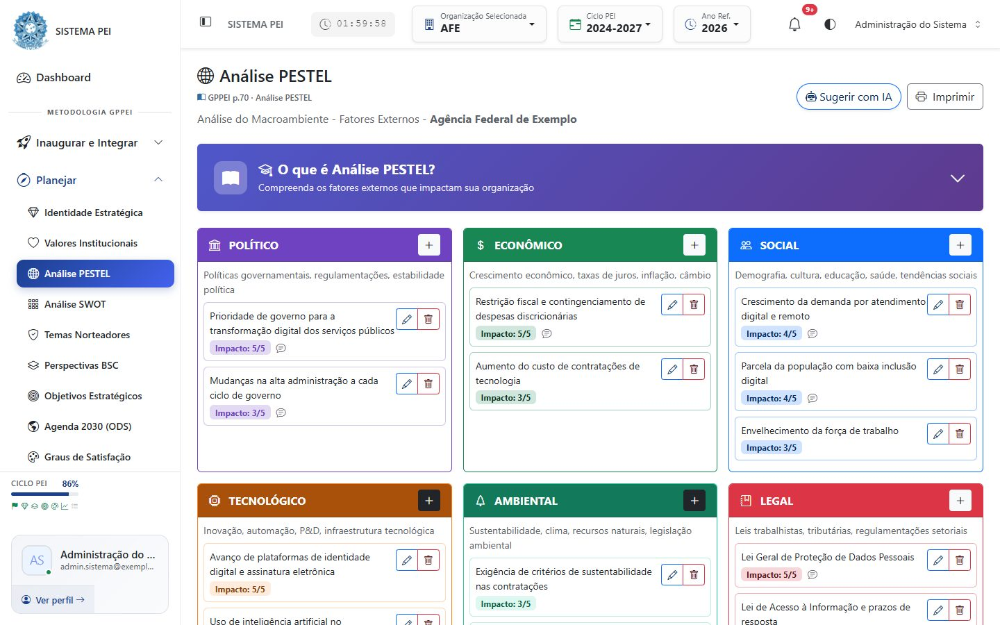
*Figura 31 — Análise PESTEL da AFE.*

Na figura, a unidade é a AFE. Os elementos são:

- **Título** com o selo **GPPEI p.70 · Análise PESTEL** e a linha "Análise do Macroambiente - Fatores
  Externos - Agência Federal de Exemplo".
- **Sugerir com IA** e **Imprimir**: botões à direita (ver 12.5.4 e 12.5.5).
- **O que é Análise PESTEL?**: seção educativa recolhida, com o significado de cada letra e exemplos.
- **Seis quadros coloridos**, um por dimensão, cada um com uma frase de ajuda:
  - **POLÍTICO** (roxo): políticas governamentais, regulamentações, estabilidade política;
  - **ECONÔMICO** (verde): crescimento econômico, taxas de juros, inflação, câmbio;
  - **SOCIAL** (azul): demografia, cultura, educação, saúde, tendências sociais;
  - **TECNOLÓGICO** (laranja): inovação, automação, P&D, infraestrutura tecnológica;
  - **AMBIENTAL** (verde-escuro): sustentabilidade, clima, recursos naturais, legislação ambiental;
  - **LEGAL** (vermelho): leis trabalhistas, tributárias, regulamentações setoriais.
- **Botão +** no canto de cada quadro: inclui um fator naquela dimensão.
- **Cartão do fator**: descrição, selo **Impacto: N/5**, ícone de balão quando há observação (passe o
  mouse para ler) e os botões de lápis e lixeira. Na figura, por exemplo, **POLÍTICO** tem "Prioridade de
  governo para a transformação digital dos serviços públicos" (Impacto 5/5) e "Mudanças na alta
  administração a cada ciclo de governo" (3/5); **ECONÔMICO** tem "Restrição fiscal e contingenciamento
  de despesas discricionárias" (5/5); **LEGAL** tem "Lei Geral de Proteção de Dados Pessoais" (5/5).
  Dimensão sem fatores mostra "Nenhum item".

### 12.5 Passo a passo

#### 12.5.1 Incluir um fator

1. Clique no **+** do quadro da dimensão (ex.: **POLÍTICO**).
2. Na janela **Adicionar Fator Político**, escreva a **Descrição**.
3. Ajuste o **Nível de Impacto** na régua (1 – Muito Baixo a 5 – Muito Alto). O número ao lado mostra o
   valor escolhido.
4. Se quiser, escreva **Observações**.
5. Clique em **Salvar**. A mensagem "Item adicionado com sucesso!" confirma.

#### 12.5.2 Editar um fator

1. Clique no lápis do cartão.
2. Altere os campos na janela **Editar Fator …**.
3. Clique em **Atualizar**. A mensagem "Item atualizado com sucesso!" confirma.

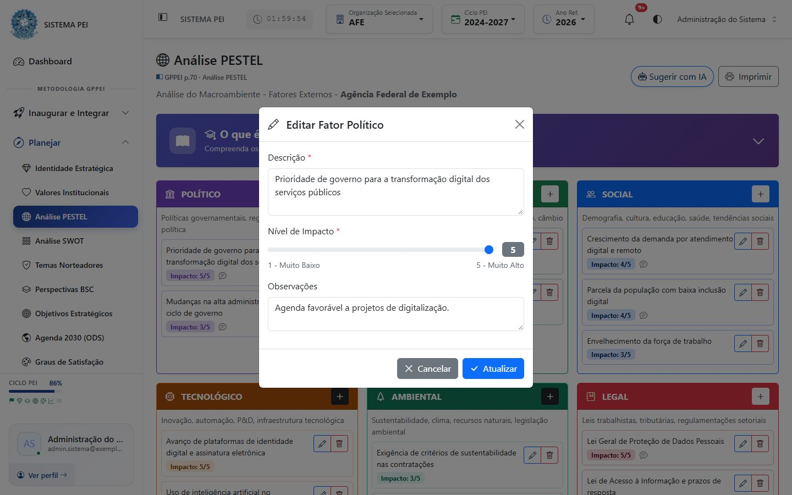
*Figura 32 — Janela Editar Fator Político na AFE.*

Na figura, com a AFE selecionada, o fator "Prioridade de governo para a transformação digital dos
serviços públicos" tem impacto **5** e a observação "Agenda favorável a projetos de digitalização." Ao
fundo, outros quadros já preenchidos mostram, por exemplo, em **SOCIAL**, "Crescimento da demanda por
atendimento digital e remoto" (Impacto 4/5) e, em **LEGAL**, "Lei Geral de Proteção de Dados Pessoais"
(Impacto 5/5).

#### 12.5.3 Excluir um fator

1. Clique na lixeira do cartão.
2. Confirme em "Tem certeza que deseja excluir este item?".
3. A mensagem "Item removido com sucesso!" confirma.

#### 12.5.4 Pedir sugestões à IA

O Mentor de IA lê o **nome da unidade selecionada** e sugere **dois fatores para cada uma das seis
dimensões**. Nenhum fator é gravado até você escolher.

1. Clique em **Sugerir com IA**.
2. Aparece o quadro **Sugestões do Mentor IA (PESTEL)**, com uma coluna por dimensão. Enquanto a IA
   trabalha, aparece "Analisando tendências globais...".
3. Clique na sugestão que interessa (o ícone **+** fica à direita). Ela é gravada como fator daquela
   dimensão, com **impacto 3**, e sai da lista. Depois, edite o fator para ajustar o impacto e
   acrescentar observações.
4. Feche o quadro no **x** para descartar o restante.

O botão **Sugerir com IA** fica à direita do título, ao lado de **Imprimir** (ver a figura de 12.4); o
quadro de sugestões surge acima dos seis quadros depois que a IA responde.

> **A IA depende de configuração.** O botão só aparece com a IA ligada em **Configurações** (ver
> capítulo 32). Se nada acontecer, o agente não está configurado ou o limite de 20 pedidos por minuto foi
> atingido. Em caso de falha, aparece "Não foi possível gerar sugestões."

#### 12.5.5 Imprimir

Clique em **Imprimir**. O navegador abre a janela de impressão com uma versão limpa da análise (sem menu
nem botões) e um cabeçalho com o nome da unidade e o ciclo. Para gerar um PDF, escolha "Salvar como PDF"
na impressora.

### 12.6 Campos do formulário

| Campo | Obrigatório | O que informar | Exemplo |
|---|---|---|---|
| Descrição | Sim | O fator externo, de forma objetiva (até 500 caracteres) | Lei Geral de Proteção de Dados Pessoais |
| Nível de Impacto | Sim (vem em 3) | De 1 (muito baixo) a 5 (muito alto) | 5 |
| Observações | Não | Contexto, fonte ou efeito esperado (até 1.000 caracteres) | Exige adequação de sistemas e contratos. |

A dimensão não aparece como campo: ela vem do quadro em que você clicou no **+**.

### 12.7 Regras e validações

- Sem ciclo, a tela avisa "Nenhum PEI ativo encontrado. Configure um PEI antes de realizar a análise
  PESTEL."; sem unidade, "Selecione uma organização no menu superior para visualizar ou cadastrar a
  análise PESTEL."
- Os fatores aparecem na ordem em que foram cadastrados.
- Um fator só pode ser editado ou excluído na unidade e no ciclo a que pertence.

### 12.8 Dicas e cuidados

- **Dica:** escreva o fator como um fato do ambiente ("Corte de orçamento federal"), não como uma ação
  da organização.
- **Dica:** use o impacto para priorizar. Fatores com impacto 4 ou 5 merecem aparecer na SWOT como
  oportunidade ou ameaça.
- **Cuidado:** a exclusão não pode ser desfeita pela tela.

---

## 13. Análise SWOT

### 13.1 Para que serve

A SWOT cruza o ambiente **interno** (forças e fraquezas) com o **externo** (oportunidades e ameaças).
No sistema, a mesma tela reúne quatro ferramentas do diagnóstico: os quatro quadrantes da **SWOT**, as
**Partes Interessadas** (quem afeta ou é afetado pela estratégia), os **Cenários Prospectivos** (futuros
possíveis) e a **Matriz TOWS** (estratégias que nascem do cruzamento da SWOT). É a ponte entre o
diagnóstico e os objetivos (GPPEI p. 66, 89 e 26).

### 13.2 Como chegar

Menu lateral **Planejar → Análise SWOT**. O endereço é `/pei/swot`.

### 13.3 Quem pode

| Ação | Perfis |
|---|---|
| Ver tudo, imprimir e usar o **Modo Apresentação** | Todos os perfis com vínculo |
| Incluir, editar e excluir itens SWOT, cenários e estratégias TOWS; pedir sugestões à IA | Super Administrador e Administrador da Unidade (na unidade selecionada) |
| Incluir, editar e excluir **Partes Interessadas** | Super Administrador e Administrador da unidade raiz |

Itens SWOT, cenários e estratégias TOWS são **da unidade**. As Partes Interessadas são **da
instituição**: a mesma lista aparece em todas as unidades do ciclo.

### 13.4 O que aparece na tela

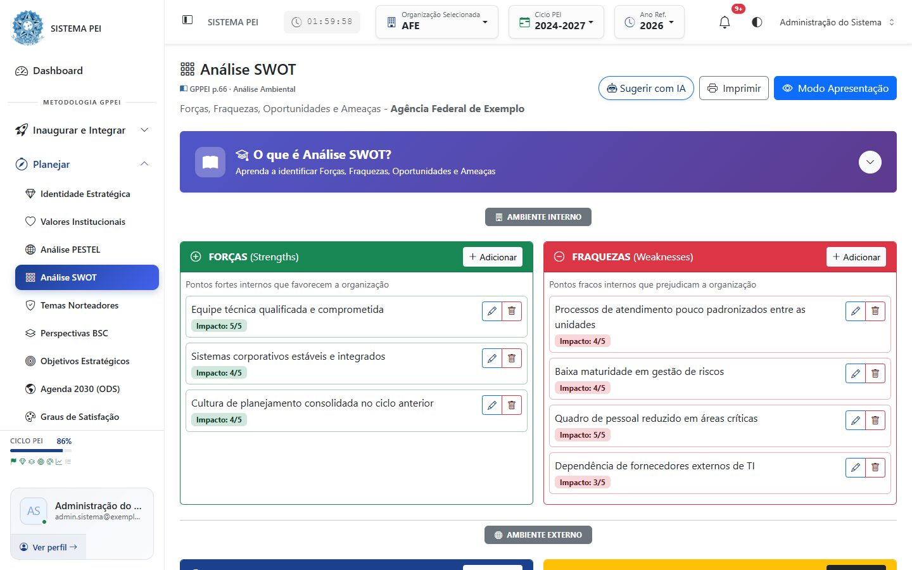
*Figura 33 — Análise SWOT da AFE em modo de edição.*

Na figura, a unidade é a AFE. Os elementos são:

- **Título** com o selo **GPPEI p.66 · Análise Ambiental** e a linha "Forças, Fraquezas, Oportunidades e
  Ameaças - Agência Federal de Exemplo".
- **Sugerir com IA**, **Imprimir** e **Modo Apresentação**: botões à direita.
- **O que é Análise SWOT?**: seção educativa recolhida, com exemplos e dicas.
- **AMBIENTE INTERNO**: quadros **FORÇAS (Strengths)** (verde, "Pontos fortes internos que favorecem a
  organização") e **FRAQUEZAS (Weaknesses)** (vermelho, "Pontos fracos internos que prejudicam a
  organização").
- **AMBIENTE EXTERNO**: quadros **OPORTUNIDADES (Opportunities)** (azul, "Fatores externos favoráveis à
  organização") e **AMEAÇAS (Threats)** (amarelo, "Fatores externos desfavoráveis à organização").
- **+ Adicionar** no cabeçalho de cada quadro. Sem itens, o quadro mostra "Nenhuma força cadastrada" (ou
  fraqueza, oportunidade, ameaça).
- **Cartão do item**: descrição, selo **Impacto: N/5**, ícone de balão quando há observação, lápis e
  lixeira. Na figura, **FORÇAS** tem três itens (ex.: "Equipe técnica qualificada e comprometida",
  Impacto 5/5) e **FRAQUEZAS** tem quatro (ex.: "Quadro de pessoal reduzido em áreas críticas", 5/5). Os
  quadros do ambiente externo começam no rodapé da imagem.

Rolando a página para baixo, aparecem, nesta ordem, os quadros **Partes Interessadas (Stakeholders)**,
**Cenários Prospectivos** e **Matriz TOWS — Estratégias Derivadas** (ver 13.5.6 a 13.5.8).

### 13.5 Passo a passo

#### 13.5.1 Incluir um item SWOT

1. Clique em **+ Adicionar** no quadro desejado (ex.: **FORÇAS**).
2. Na janela **Adicionar Força**, escreva a **Descrição**.
3. Ajuste o **Nível de Impacto** (1 a 5).
4. Se quiser, ajuste a **Classificação GUT** (ver 13.5.2) e escreva **Observações**.
5. Clique em **Salvar**. O aviso "Item adicionado com sucesso!" confirma.

#### 13.5.2 Editar um item e usar a Classificação GUT

1. Clique no lápis do cartão.
2. Altere os campos na janela **Editar …** e clique em **Atualizar**. O aviso "Item atualizado com
   sucesso!" confirma.

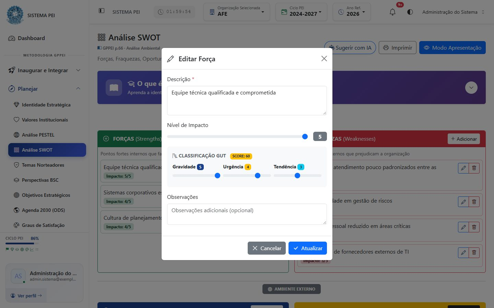
*Figura 34 — Janela Editar Força com a Classificação GUT.*

Na figura, com a AFE selecionada, a força "Equipe técnica qualificada e comprometida" tem **Nível de
Impacto 5**. No quadro **CLASSIFICAÇÃO GUT**, as réguas estão em **Gravidade 5**, **Urgência 4** e
**Tendência 3**, e o selo **SCORE: 60** é o produto das três notas (5 × 4 × 3). A cor do selo ajuda a
priorizar:

| Score GUT | Cor do selo | Leitura |
|---|---|---|
| 64 a 125 | Vermelho | Prioridade alta |
| 27 a 63 | Amarelo | Prioridade média |
| 1 a 26 | Verde | Prioridade baixa |

O score é calculado e gravado com o item, mas aparece só dentro da janela; os cartões dos quadrantes
mostram o impacto.

#### 13.5.3 Excluir um item SWOT

1. Clique na lixeira do cartão.
2. Confirme em "Tem certeza que deseja excluir este item?". O aviso "Item removido com sucesso!"
   confirma.

#### 13.5.4 Pedir sugestões à IA

O Mentor de IA lê o **nome da unidade selecionada** e sugere **três forças, três fraquezas, três
oportunidades e três ameaças**. Nenhum item é gravado até você escolher.

1. Clique em **Sugerir com IA**.
2. Aparece o quadro **Sugestões do Mentor IA**, com uma coluna por quadrante.
3. Clique na sugestão que interessa. Ela é gravada no quadrante correspondente, com impacto 3, e sai da
   lista. Depois, edite o item para ajustar o impacto e a GUT.
4. Feche o quadro no **x** para descartar o restante.

> **A IA depende de configuração** (ver capítulo 32). Se nada acontecer ao clicar, o agente não está
> configurado ou o limite de 20 pedidos por minuto foi atingido. Em caso de falha, aparece "Não foi
> possível gerar sugestões."

#### 13.5.5 Usar o Modo Apresentação

O Modo Apresentação mostra a matriz limpa, sem botões, para reuniões e projeções.

1. Clique em **Modo Apresentação**.
2. Para voltar, clique em **Modo Edição** (o mesmo botão, com o novo nome).

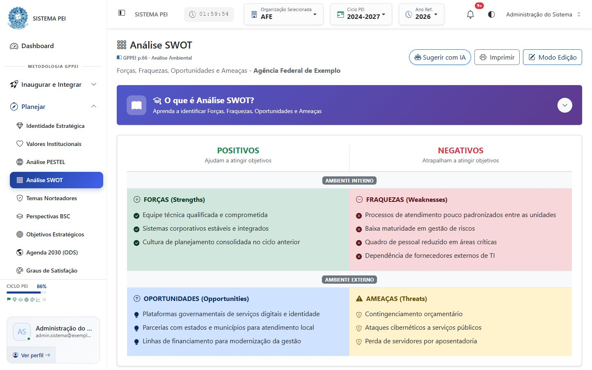
*Figura 35 — SWOT em Modo Apresentação.*

Na figura, a matriz tem duas colunas — **POSITIVOS** ("Ajudam a atingir objetivos") e **NEGATIVOS**
("Atrapalham a atingir objetivos") — e duas faixas — **AMBIENTE INTERNO** (Forças e Fraquezas) e
**AMBIENTE EXTERNO** (Oportunidades e Ameaças). Cada item vira uma linha com ícone: visto verde nas
forças, **x** vermelho nas fraquezas, lâmpada azul nas oportunidades e escudo amarelo nas ameaças. Na
figura, a AFE tem, por exemplo, a oportunidade "Plataformas governamentais de serviços digitais e
identidade" e a ameaça "Contingenciamento orçamentário". Quadrante vazio mostra "Nenhuma … registrada.".
No Modo Apresentação, as seções de Partes Interessadas, Cenários e TOWS ficam ocultas.

#### 13.5.6 Partes Interessadas

As Partes Interessadas mapeiam quem tem interesse na estratégia e quanto poder tem para influenciá-la.

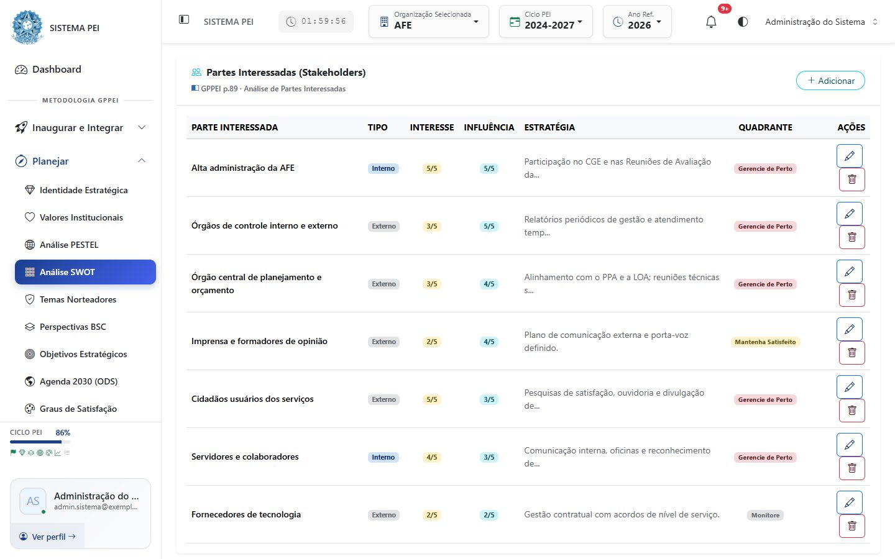
*Figura 36 — Quadro Partes Interessadas na tela SWOT.*

Para chegar ao quadro, role a tela SWOT para baixo, até depois dos quatro quadrantes. O quadro **Partes
Interessadas (Stakeholders)** tem o selo **GPPEI p.89** e o botão **+ Adicionar**. A tabela mostra:

| Coluna | O que mostra |
|---|---|
| **Parte Interessada** | O nome |
| **Tipo** | **Interno** (selo azul) ou **Externo** (selo cinza) |
| **Interesse** | Nota de 1 a 5 |
| **Influência** | Nota de 1 a 5 |
| **Estratégia** | O início da estratégia de engajamento |
| **Quadrante** | A classificação automática (abaixo) |
| **Ações** | Lápis e lixeira |

O **Quadrante** é calculado pelo sistema (nota 3 ou mais conta como "alta"):

| Influência | Interesse | Quadrante | Cor |
|---|---|---|---|
| Alta | Alto | **Gerencie de Perto** | Vermelho |
| Alta | Baixo | **Mantenha Satisfeito** | Amarelo |
| Baixa | Alto | **Mantenha Informado** | Azul |
| Baixa | Baixo | **Monitore** | Cinza |

A lista vem ordenada da maior para a menor influência. Na figura, a AFE tem sete partes: "Alta
administração da AFE" (Interno, interesse 5/5, influência 5/5, **Gerencie de Perto**), "Órgãos de controle
interno e externo" (Externo, 3/5 e 5/5), "Órgão central de planejamento e orçamento" (3/5 e 4/5),
"Imprensa e formadores de opinião" (interesse 2/5, influência 4/5, **Mantenha Satisfeito**), "Cidadãos
usuários dos serviços" (5/5 e 3/5), "Servidores e colaboradores" (Interno, 4/5 e 3/5) e "Fornecedores de
tecnologia" (2/5 e 2/5, **Monitore**). As que não têm quadrante indicado acima estão em **Gerencie de
Perto**. Para incluir:

1. Clique em **+ Adicionar** no quadro.
2. Na janela **Nova Parte Interessada**, informe **Nome**, **Tipo**, **Interesse**, **Influência** e,
   se quiser, a **Estratégia de Engajamento**.
3. Clique em **Salvar**. O aviso "Parte interessada salva." confirma.

Para editar, use o lápis; para excluir, a lixeira e a confirmação "Tem certeza que deseja excluir esta
parte interessada?".

#### 13.5.7 Cenários Prospectivos

Os cenários antecipam futuros possíveis e a resposta que a organização deve preparar para cada um.

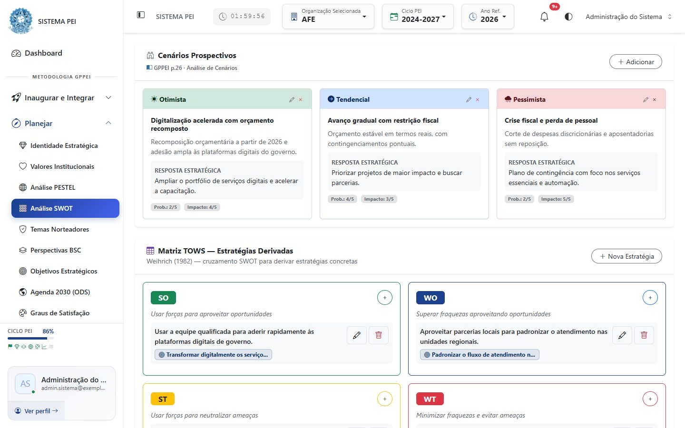
*Figura 37 — Quadro Cenários Prospectivos na tela SWOT.*

O quadro **Cenários Prospectivos** fica abaixo das Partes Interessadas, com o selo **GPPEI p.26** e o
botão **+ Adicionar**. Cada cenário vira um cartão com a cor do tipo — **Otimista** (verde, sol),
**Tendencial** (azul, seta) e **Pessimista** (vermelho, nuvem) —, o nome, o começo da descrição, a
**Resposta Estratégica** e os selos **Prob.: N/5** e **Impacto: N/5**. O lápis e o **x** no canto do
cartão editam e excluem. Sem cenários, o quadro sugere: "Antecipe futuros possíveis (otimista,
tendencial, pessimista) e as respostas estratégicas."

Na figura, a AFE tem três cenários:

| Tipo | Cenário | Resposta Estratégica | Prob. | Impacto |
|---|---|---|---|---|
| Otimista | Digitalização acelerada com orçamento recomposto | Ampliar o portfólio de serviços digitais e acelerar a capacitação. | 2/5 | 4/5 |
| Tendencial | Avanço gradual com restrição fiscal | Priorizar projetos de maior impacto e buscar parcerias. | 4/5 | 3/5 |
| Pessimista | Crise fiscal e perda de pessoal | Plano de contingência com foco nos serviços essenciais e automação. | 2/5 | 5/5 |

Abaixo dos cenários começa a Matriz TOWS (ver 13.5.8).

Para incluir:

1. Clique em **+ Adicionar** no quadro.
2. Na janela **Novo Cenário Prospectivo**, preencha os campos (ver 13.6).
3. Clique em **Salvar**. O aviso "Cenário prospectivo salvo." confirma.

#### 13.5.8 Matriz TOWS

A Matriz TOWS transforma a SWOT em estratégias concretas, cruzando quadrantes.

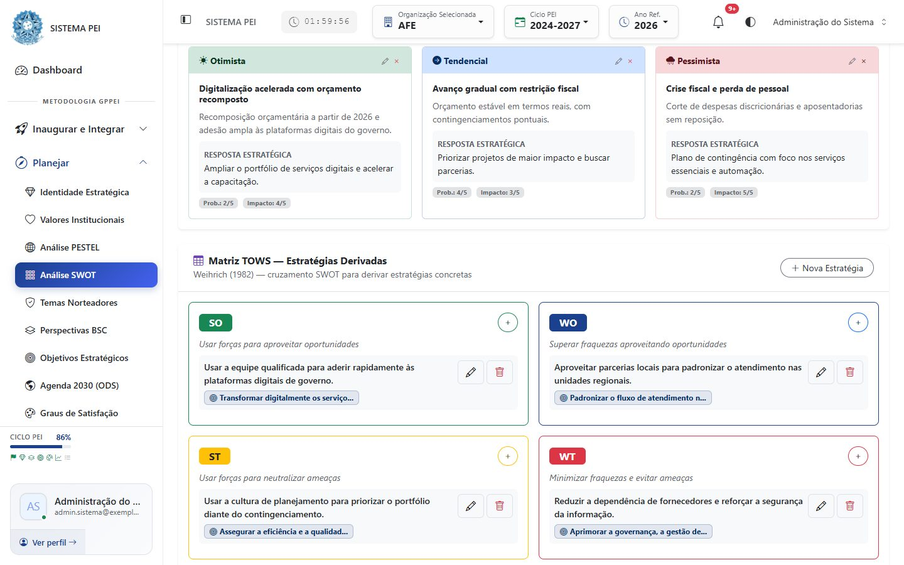
*Figura 38 — Matriz TOWS na tela SWOT.*

O quadro **Matriz TOWS — Estratégias Derivadas** fica no fim da página, com o botão **+ Nova
Estratégia**. Ele tem quatro caixas:

| Caixa | Significado |
|---|---|
| **SO** (verde) | Usar forças para aproveitar oportunidades |
| **WO** (azul) | Superar fraquezas aproveitando oportunidades |
| **ST** (amarelo) | Usar forças para neutralizar ameaças |
| **WT** (vermelho) | Minimizar fraquezas e evitar ameaças |

Cada estratégia aparece dentro da sua caixa, com lápis e lixeira, e, se estiver ligada a um objetivo,
mostra um selo azul com o nome do objetivo. O **+** de cada caixa já abre a janela com aquele quadrante
escolhido. Na figura, a AFE tem uma estratégia em cada caixa:

| Caixa | Estratégia | Objetivo ligado |
|---|---|---|
| SO | Usar a equipe qualificada para aderir rapidamente às plataformas digitais de governo. | Transformar digitalmente os serviços e processos |
| WO | Aproveitar parcerias locais para padronizar o atendimento nas unidades regionais. | Padronizar o fluxo de atendimento… |
| ST | Usar a cultura de planejamento para priorizar o portfólio diante do contingenciamento. | Assegurar a eficiência e a qualidade… |
| WT | Reduzir a dependência de fornecedores e reforçar a segurança da informação. | Aprimorar a governança, a gestão de riscos e a integridade |

Cada linha cruza um item da SWOT com outro (ex.: a força "Equipe técnica qualificada" com a oportunidade
"Plataformas governamentais de serviços digitais").

1. Clique em **+ Nova Estratégia** ou no **+** de uma caixa.
2. Na janela **Estratégia TOWS**, escolha o **Quadrante**, descreva a **Estratégia**, a
   **Fundamentação** e, se já existir, o **Objetivo Estratégico que operacionaliza esta estratégia**.
3. Clique em **Salvar**. O aviso "Estratégia TOWS salva." confirma.

### 13.6 Campos do formulário

**Item SWOT**

| Campo | Obrigatório | O que informar | Exemplo |
|---|---|---|---|
| Descrição | Sim | O ponto forte, fraco, a oportunidade ou a ameaça (até 500 caracteres) | Equipe técnica qualificada e comprometida |
| Nível de Impacto | Sim (vem em 3) | 1 a 5 | 5 |
| Gravidade, Urgência, Tendência (GUT) | Sim (vêm em 3) | 1 a 5 cada | 5, 4, 3 |
| Observações | Não | Contexto ou evidência (até 1.000 caracteres) | Avaliação de desempenho de 2025 |

**Parte Interessada**

| Campo | Obrigatório | O que informar | Exemplo |
|---|---|---|---|
| Nome | Sim | Quem é a parte (até 150 caracteres) | Cidadãos usuários dos serviços digitais |
| Tipo | Sim (vem em Externo) | Interno ou Externo | Externo |
| Interesse | Sim (vem em 3) | 1 a 5 | 5 |
| Influência | Sim (vem em 3) | 1 a 5 | 3 |
| Estratégia de Engajamento | Não | Como envolver essa parte | Pesquisa anual de satisfação e canal de sugestões |

**Cenário Prospectivo**

| Campo | Obrigatório | O que informar | Exemplo |
|---|---|---|---|
| Nome do Cenário | Sim | Um título curto (até 150 caracteres) | Expansão acelerada da digitalização |
| Tipo | Sim (vem em Tendencial) | Otimista, Tendencial ou Pessimista | Otimista |
| Descrição do Cenário | Não | O futuro possível e seus elementos | Adesão de 80% dos cidadãos aos canais digitais até 2027 |
| Implicações para a Organização | Não | Como o cenário afetaria a organização | Aumento da demanda de suporte técnico |
| Resposta Estratégica | Não | O que preparar | Ampliar a central de atendimento digital |
| Probabilidade | Sim (vem em 3) | 1 a 5 | 4 |
| Impacto | Sim (vem em 3) | 1 a 5 | 4 |

**Estratégia TOWS**

| Campo | Obrigatório | O que informar | Exemplo |
|---|---|---|---|
| Quadrante | Sim | SO, WO, ST ou WT | SO — Força + Oportunidade |
| Estratégia | Sim | A estratégia derivada (até 1.000 caracteres) | Usar a equipe qualificada para acelerar a oferta de serviços digitais |
| Fundamentação | Não | Quais itens da SWOT a embasam | Aproveita a Força F1 e a Oportunidade O2 |
| Objetivo Estratégico que operacionaliza esta estratégia | Não | Um objetivo do ciclo, ou "— Nenhum —" | Assegurar a eficiência e a qualidade do gasto público |

### 13.7 Regras e validações

- Sem ciclo: "Nenhum PEI ativo encontrado. Configure um PEI antes de realizar a análise SWOT."; sem
  unidade: "Selecione uma organização no menu superior para visualizar ou cadastrar a análise SWOT."
- Parte interessada sem nome: "Informe o nome da parte interessada."
- Cenário sem nome: "Informe o nome do cenário."
- Estratégia TOWS sem texto: "Descreva a estratégia TOWS."; objetivo de outro ciclo: "Escolha um
  objetivo deste ciclo."
- Todas as exclusões pedem confirmação e não podem ser desfeitas pela tela.

### 13.8 Dicas e cuidados

- **Dica:** força e fraqueza são **internas** (dependem da organização); oportunidade e ameaça são
  **externas** (vêm do ambiente — use a PESTEL, capítulo 12).
- **Dica:** numere os itens na descrição (F1, F2, O1…) para citá-los na **Fundamentação** da TOWS.
- **Dica:** ligar cada estratégia TOWS a um objetivo mostra, na prática, que o diagnóstico virou plano.
- **Cuidado:** as Partes Interessadas valem para a instituição inteira. Alterar uma delas muda a lista
  vista por todas as unidades.

---

## 14. Perspectivas BSC

### 14.1 Para que serve

As perspectivas são as **camadas** do Mapa Estratégico, no modelo do Balanced Scorecard (BSC). Elas
se empilham de baixo para cima: a base (pessoas, recursos, processos) sustenta o topo (o resultado que
a organização entrega). Cada perspectiva também define **como o seu desempenho é calculado**: quanto
pesam os indicadores e quanto pesam as iniciativas (ver 14.4 e 16.4).

### 14.2 Como chegar

Menu lateral **Planejar → Perspectivas BSC**. O endereço é `/pei/perspectivas`.

### 14.3 Quem pode

| Ação | Perfis |
|---|---|
| Ver as perspectivas e o detalhe | Todos os perfis com vínculo |
| Incluir, editar, excluir e pedir sugestões à IA | Super Administrador e Administrador da unidade raiz |

As perspectivas são **da instituição**: valem para todas as unidades do ciclo.

### 14.4 O que aparece na tela

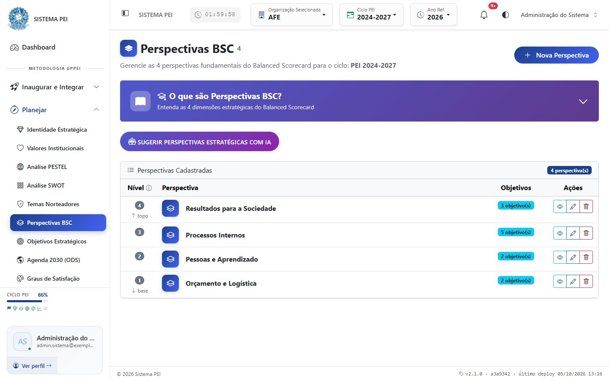
*Figura 39 — Perspectivas BSC do ciclo 2024-2027.*

Na figura, o ciclo 2024-2027 tem quatro perspectivas. Os elementos são:

- **Título** com o contador (**4**) e a frase "Gerencie as 4 perspectivas fundamentais do Balanced
  Scorecard para o ciclo: PEI 2024-2027".
- **Nova Perspectiva**: botão azul à direita.
- **O que são Perspectivas BSC?**: seção educativa recolhida, com as quatro perspectivas clássicas.
- **SUGERIR PERSPECTIVAS ESTRATÉGICAS COM IA**: botão do Mentor de IA (ver 14.5.5).
- **Perspectivas Cadastradas**: tabela com o selo "4 perspectiva(s)" e as colunas:
  - **Nível**: o degrau no mapa. A tabela segue a ordem do mapa — a primeira linha (marcada **topo**) é
    a de maior nível e a última (marcada **base**) é o nível 1. Passe o mouse no **i** para ler a
    explicação. Na figura, de cima para baixo: 4 Resultados para a Sociedade (topo), 3 Processos
    Internos, 2 Pessoas e Aprendizado e 1 Orçamento e Logística (base).
  - **Perspectiva**: o nome, que também é um link para o detalhe.
  - **Objetivos**: quantos objetivos a perspectiva tem (na figura, 3, 5, 2 e 2).
  - **Ações**: olho (detalhar), lápis (editar) e lixeira (excluir).

### 14.5 Passo a passo

#### 14.5.1 Incluir uma perspectiva

1. Clique em **Nova Perspectiva**.
2. Na janela **Nova Perspectiva**, escreva o **Nome da Perspectiva**.
3. Confira o **Nível no Mapa**: o sistema já propõe o próximo nível livre (o maior existente + 1).
4. Ajuste a **Distribuição de Peso** entre indicadores e iniciativas (ver 14.5.2).
5. Clique em **Salvar Perspectiva**. A janela **Operação Concluída!** confirma; clique em **Continuar**.

#### 14.5.2 Editar uma perspectiva e definir os pesos

1. Clique no lápis da linha (ou em **Editar** no detalhe da perspectiva).
2. Altere os campos na janela **Editar Perspectiva**.
3. Clique em **Atualizar Perspectiva**.

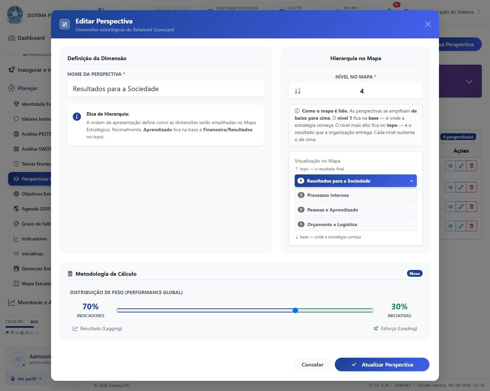
*Figura 40 — Janela Editar Perspectiva.*

Na figura, a perspectiva "Resultados para a Sociedade" está no **Nível no Mapa 4**. A janela tem três
partes:

- **Definição da Dimensão**: o nome e a **Dica de Hierarquia** ("Normalmente, Aprendizado fica na base e
  Financeira/Resultados no topo").
- **Hierarquia no Mapa**: o campo de nível, a explicação **Como o mapa é lido** e a **Visualização no
  Mapa**, uma prévia real da pilha do ciclo. A perspectiva em edição aparece destacada em azul, com uma
  seta, na posição que o número escolhido determina. Na figura, a ordem é: 4 Resultados para a
  Sociedade (em destaque, no topo), 3 Processos Internos, 2 Pessoas e Aprendizado e 1 Orçamento e
  Logística (na base).
- **Metodologia de Cálculo** (parte de baixo): a régua **Distribuição de Peso (Performance Global)**. À
  esquerda, o peso dos **Indicadores** (rótulo "Resultado (Lagging)"); à direita, o das **Iniciativas**
  ("Esforço (Leading)"). Ao mover a régua, de 5 em 5, um lado aumenta e o outro diminui, e a soma é
  sempre 100%. Nesta perspectiva, os pesos são **70%** e **30%**.
- **Cancelar** e **Atualizar Perspectiva**, no rodapé.

> **O que o peso faz.** Com 70% / 30%, o atingimento da perspectiva no mapa é 70% da média dos
> indicadores mais 30% do avanço das entregas do ano. Com 100% / 0%, só os indicadores contam. Se um
> dos lados não tiver dado no ano, ele sai da conta e o outro vale 100%. Exemplo na seção 16.5.3.

#### 14.5.3 Ver o detalhe de uma perspectiva

Clique no olho da linha ou no nome da perspectiva.

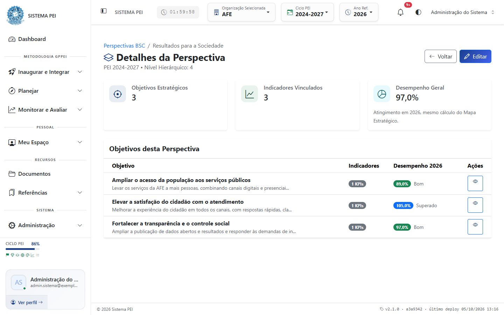
*Figura 41 — Detalhes da Perspectiva "Resultados para a Sociedade".*

A página mostra:

- O ciclo e o nível ("PEI 2024-2027 • Nível Hierárquico: 4") e os botões **Voltar** e **Editar** (este
  só para quem pode editar).
- Três cartões: **Objetivos Estratégicos** (3), **Indicadores Vinculados** (3) e **Desempenho Geral**
  (97,0%), com a nota "Atingimento em 2026, mesmo cálculo do Mapa Estratégico." Quando nada foi medido
  no ano, o cartão mostra **Sem medição** ou **Sem indicador**.
- **Objetivos desta Perspectiva**: tabela com o nome e o início da descrição de cada objetivo, a
  quantidade de **KPIs**, o **Desempenho** no ano (selo na cor da faixa e o nome da faixa; ou **Sem
  medição** / **Sem indicador**) e o olho para abrir o objetivo. Na figura: "Ampliar o acesso da
  população aos serviços públicos" com 89,0% **Bom** (verde), "Elevar a satisfação do cidadão com o
  atendimento" com 105,0% **Superado** (azul) e "Fortalecer a transparência e o controle social" com
  97,0% **Bom**.

#### 14.5.4 Excluir uma perspectiva

1. Clique na lixeira da linha.
2. Leia o aviso da janela **Excluir Perspectiva** e clique em **Excluir Agora** para confirmar.

> **Cuidado — exclusão em cascata.** Excluir uma perspectiva exclui também os **objetivos** dela, com as
> **iniciativas** (e suas entregas), os **indicadores**, o **futuro almejado** e os **comentários** de
> cada objetivo. As atividades da Cadeia de Valor ligadas a ela ficam sem perspectiva. A ação não pode
> ser desfeita pela tela.

#### 14.5.5 Pedir sugestões à IA

O Mentor de IA lê a **missão e a visão** cadastradas no ciclo e sugere as **quatro perspectivas do
BSC**, já numeradas de baixo para cima (1 = base, 4 = topo), cada uma com uma frase sobre o seu foco.

1. Clique em **SUGERIR PERSPECTIVAS ESTRATÉGICAS COM IA**. Enquanto a IA trabalha, aparece "Analisando
   Missão e Visão...".
2. No quadro **Sugestões do Mentor IA**, cada sugestão mostra o nível, o nome e a descrição.
3. Clique em **Adicionar** na que interessa. Ela é gravada como perspectiva (com pesos 100% indicadores
   e 0% iniciativas) e sai da lista. Se o nível sugerido já estiver ocupado, o sistema usa o próximo
   nível livre.
4. Feche o quadro no **x** para descartar o restante.

> **A IA depende de configuração** (ver capítulo 32). Se nada acontecer ao clicar, o agente não está
> configurado ou o limite de 20 pedidos por minuto foi atingido. Formato inválido gera "A IA gerou um
> formato inválido. Por favor, tente novamente."

### 14.6 Campos do formulário

| Campo | Obrigatório | O que informar | Exemplo |
|---|---|---|---|
| Nome da Perspectiva | Sim | O nome da camada (até 255 caracteres) | Pessoas e Aprendizado |
| Nível no Mapa | Sim | Número inteiro a partir de 1; 1 é a base do mapa | 3 |
| Distribuição de Peso — Indicadores | Sim (vem em 100%) | 0 a 100 | 80 |
| Distribuição de Peso — Iniciativas | Sim (vem em 0%) | Completa 100 automaticamente | 20 |

### 14.7 Regras e validações

- **Nível único por ciclo.** Duas perspectivas não podem ocupar o mesmo nível: "Já existe uma
  perspectiva neste nível do ciclo. Escolha outro nível." A prévia da janela já alerta quando o número
  digitado coincide com o de outra perspectiva.
- **Soma dos pesos.** Indicadores + iniciativas devem somar exatamente 100: "A soma dos pesos deve ser
  exatamente 100%."
- **Identidade antes das perspectivas.** Se o ciclo ainda não tem missão e visão (com mais de 10
  caracteres cada) em nenhuma unidade, **Nova Perspectiva** leva à tela **Identidade Estratégica** com a
  orientação "Defina a identidade da sua organização: Missão, Visão e Valores."
- Em caso de falha inesperada, aparece a janela **Não foi possível salvar**.

### 14.8 Dicas e cuidados

- **Dica:** quatro perspectivas é o modelo clássico, mas o sistema aceita outro número. O assistente do
  ciclo recomenda quatro.
- **Dica:** pense o nível como degrau: o que sustenta fica embaixo (nível 1), o resultado para a
  sociedade fica em cima (maior nível).
- **Cuidado:** mudar os pesos repinta o farol da perspectiva em todas as telas e no Portal da
  Transparência. Combine a mudança com a equipe antes de fazê-la.
- **Cuidado:** a exclusão leva todo o conteúdo da perspectiva (ver 14.5.4).

---

## 15. Objetivos Estratégicos

### 15.1 Para que serve

Os objetivos dizem **o que** a organização precisa alcançar no ciclo. Cada objetivo pertence a uma
perspectiva e é medido pelos indicadores e iniciativas ligados a ele. Nesta tela também se faz o
**desdobramento** (um objetivo que nasce de outro, mais amplo), o vínculo **opcional** com até três
**ODS** da Agenda 2030 e o registro do **Futuro Almejado** (onde o objetivo está hoje e onde precisa
estar).

### 15.2 Como chegar

Menu lateral **Planejar → Objetivos Estratégicos**. O endereço é `/objetivos`. Também se chega a um
objetivo pelo detalhe da perspectiva, pelo Painel da Agenda 2030 e pelo Mapa Estratégico.

### 15.3 Quem pode

| Ação | Perfis |
|---|---|
| Ver a lista e o detalhe dos objetivos | Todos os perfis com vínculo; a lista e o detalhe também são públicos no Portal da Transparência (ver capítulo 35), sem comentários |
| Incluir, editar, excluir, vincular ODS, gerenciar o Futuro Almejado e pedir sugestões à IA | Super Administrador e Administrador da unidade raiz |
| Comentar num objetivo | Super Administrador, Administrador da Unidade, Gestor(a) Responsável e Gestor(a) Substituto(a) |
| Ler os comentários | Todos os perfis com vínculo (o perfil Consulta lê, mas não comenta) |

Os objetivos são **da instituição**: aparecem no Mapa Estratégico de todas as unidades.

### 15.4 O que aparece na tela

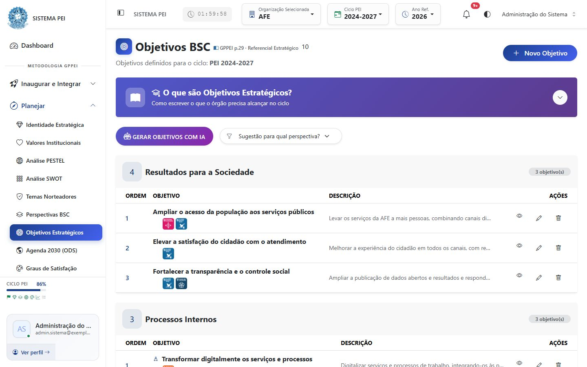
*Figura 42 — Lista de Objetivos agrupada por perspectiva.*

Na figura, o ciclo 2024-2027 tem 10 objetivos. Os elementos são:

- **Título Objetivos BSC**, o selo **GPPEI p.29 · Referencial Estratégico**, o total de objetivos e a
  linha "Objetivos definidos para o ciclo: PEI 2024-2027".
- **Novo Objetivo**: botão azul à direita.
- **O que são Objetivos Estratégicos?**: seção educativa recolhida, com exemplos por perspectiva e o
  método SMART.
- **GERAR OBJETIVOS COM IA** e o seletor **Sugestão para qual perspectiva?** (ver 15.5.6).
- **Um bloco por perspectiva**, na ordem do mapa (topo primeiro). O cabeçalho do bloco mostra o nível
  (ex.: **4**), o nome (ex.: **Resultados para a Sociedade**) e a contagem (ex.: "3 objetivo(s)"). Na
  figura, depois desse bloco vem o de **Processos Internos** (nível 3). A tabela de cada bloco tem:
  - **ORDEM**: a posição do objetivo na perspectiva;
  - **OBJETIVO**: o nome (link para o detalhe) e, logo abaixo, os ícones coloridos dos ODS vinculados
    (na figura, os ODS 10 e 16 em "Ampliar o acesso da população aos serviços públicos"). Um ícone de
    hierarquia antes do nome indica que o objetivo tem desdobramentos (na figura, em "Transformar
    digitalmente os serviços e processos");
  - **DESCRIÇÃO**: o começo da descrição (passe o mouse para ler inteira) ou "Sem descrição";
  - **AÇÕES**: olho (detalhar), lápis (editar) e lixeira (excluir).
- **Objetivos desdobrados** aparecem logo abaixo do objetivo de origem, recuados, com o selo
  **desdobrado**.

Perspectiva sem objetivo mostra "Nenhum objetivo cadastrado nesta perspectiva." e o link **Adicionar o
primeiro**, que já abre o formulário com aquela perspectiva escolhida. Sem perspectivas no ciclo,
aparece "Nenhuma perspectiva encontrada" com um botão para a tela de perspectivas.

### 15.5 Passo a passo

#### 15.5.1 Incluir um objetivo

1. Clique em **Novo Objetivo** (ou em **Adicionar o primeiro**, dentro de uma perspectiva).
2. Na janela **Novo Objetivo Estratégico**, escreva o **Título do Objetivo** e a **Descrição Detalhada**.
3. Escolha a **Perspectiva BSC**. O sistema propõe a próxima **Ordem de Apresentação** livre naquela
   perspectiva.
4. Se o objetivo nasce de outro, escolha-o em **Desdobramento de** (ver 15.5.3). Caso contrário, deixe
   "— Objetivo raiz (nível estratégico) —".
5. Se quiser, marque até três ODS no bloco **Contribuição para a Agenda 2030 (ODS)** (ver 15.5.4).
6. Clique em **Salvar Objetivo**. A janela **Operação Concluída!** confirma; clique em **Continuar**.

#### 15.5.2 Editar um objetivo

1. Clique no lápis da linha (ou em **Editar** no detalhe do objetivo).
2. Altere os campos na janela **Editar Objetivo Estratégico**.
3. Clique em **Atualizar Objetivo**.

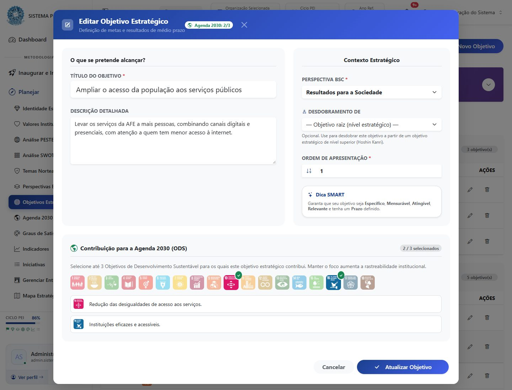
*Figura 43 — Janela Editar Objetivo Estratégico com o bloco de ODS.*

Na figura, o objetivo "Ampliar o acesso da população aos serviços públicos" está na perspectiva
**Resultados para a Sociedade**, é um objetivo raiz e tem ordem **1**. Os elementos da janela são:

- **Selo Agenda 2030: 2/3** no cabeçalho: mostra quantos ODS estão marcados. Clicar nele leva ao bloco
  de ODS, no fim da janela. O selo fica amarelo quando nenhum ODS está marcado.
- **O que se pretende alcançar?**: título e descrição.
- **Contexto Estratégico**: perspectiva, desdobramento, ordem e a **Dica SMART** ("Garanta que seu
  objetivo seja Específico, Mensurável, Atingível, Relevante e tenha um Prazo definido").
- **Contribuição para a Agenda 2030 (ODS)**: os 18 ícones dos ODS. Os marcados (na figura, os ODS 10 e
  16) ficam acesos e com um visto verde; os demais ficam esmaecidos. O contador "2 / 3 selecionados" fica
  no canto. Abaixo, para cada ODS marcado, há uma linha para escrever como o objetivo contribui (na
  figura, "Redução das desigualdades de acesso aos serviços." e "Instituições eficazes e acessíveis.").

#### 15.5.3 Desdobrar um objetivo

O desdobramento liga um objetivo mais específico a um objetivo estratégico mais amplo (método Hoshin
Kanri).

1. No formulário do objetivo mais específico, abra **Desdobramento de**.
2. Escolha o objetivo de origem. A lista mostra os objetivos raiz do ciclo, com a perspectiva entre
   colchetes (ex.: "[Processos Internos] Transformar digitalmente os serviços e processos").
3. Salve. Na lista, o novo objetivo aparece recuado abaixo do de origem, com o selo **desdobrado**.

No Mapa Estratégico, o objetivo de origem passa a considerar também os desdobrados (ver 16.5.3).

#### 15.5.4 Vincular ODS da Agenda 2030 (opcional)

O vínculo com os ODS é **opcional**: um objetivo sem ODS é perfeitamente válido.

1. Na janela do objetivo, role até **Contribuição para a Agenda 2030 (ODS)** (ou clique no selo
   **Agenda 2030** do cabeçalho).
2. Clique no ícone de cada ODS para o qual o objetivo contribui. Clique de novo para desmarcar.
3. Se quiser, descreva a contribuição na linha que aparece para cada ODS marcado.
4. Salve o objetivo.

Ao tentar marcar um quarto ODS, o Mentor avisa "Limite de ODS atingido" e não marca. A leitura desses
vínculos está no capítulo 18.

#### 15.5.5 Excluir um objetivo

1. Clique na lixeira da linha.
2. A janela **Excluir Objetivo** informa quantos **Indicadores vinculados** e quantas **Iniciativas
   vinculadas** o objetivo tem. Clique em **Excluir** para confirmar.

> **Cuidado:** antes de excluir, transfira para outro objetivo (ou exclua) os indicadores, as
> iniciativas e os objetivos desdobrados dele. A exclusão do objetivo não faz isso por você, e os
> objetivos desdobrados deixam de aparecer na lista. A ação não pode ser desfeita pela tela.

#### 15.5.6 Pedir sugestões à IA

O Mentor de IA lê a **perspectiva escolhida** e a **missão e a visão** do ciclo e sugere **três
objetivos** para aquela perspectiva, cada um com nome e descrição.

1. No seletor **Sugestão para qual perspectiva?**, escolha a perspectiva.
2. Clique em **GERAR OBJETIVOS COM IA**. Enquanto a IA trabalha, aparece "Analisando e gerando...".
3. No quadro **Objetivos Recomendados pelo Mentor IA**, clique em **Adicionar** no objetivo que
   interessa. Ele é gravado na perspectiva escolhida e sai da lista.
4. Edite o objetivo gravado para ajustar a ordem, a descrição e os ODS.

Sem perspectiva escolhida, aparece "Selecione uma perspectiva primeiro.". Falha de formato gera "Falha
ao processar sugestões. Tente novamente."

**Análise SMART automática.** Ao digitar um título com mais de 10 caracteres no formulário, a IA analisa
se ele é específico, mensurável, atingível, relevante e com prazo, e mostra o quadro **Análise SMART**
abaixo do campo. É só uma orientação: nada é alterado no texto. Feche o quadro no **x**.

> **A IA depende de configuração** (ver capítulo 32). Se nada acontecer, o agente não está configurado
> ou o limite de 20 pedidos por minuto foi atingido.

#### 15.5.7 Ver o detalhe de um objetivo

Clique no olho da linha ou no nome do objetivo.

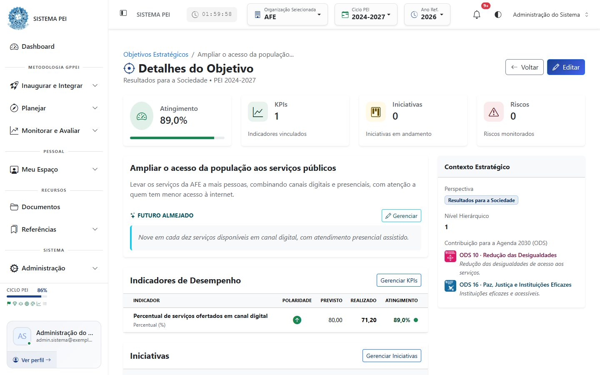
*Figura 44 — Detalhes do Objetivo "Ampliar o acesso da população aos serviços públicos".*

A página mostra, de cima para baixo:

- O caminho "Objetivos Estratégicos / …", a perspectiva e o ciclo ("Resultados para a Sociedade • PEI
  2024-2027"), e os botões **Voltar** e **Editar** (este só para quem pode editar).
- Quatro cartões: **Atingimento** no ano de referência (89,0%, com a barra na cor da faixa; ou **Sem
  medição** / **Sem indicador**), **KPIs** (1 indicador vinculado), **Iniciativas** (0) e **Riscos** (0).
- O título e a descrição do objetivo e o quadro **FUTURO ALMEJADO**, com o botão **Gerenciar** (ver
  15.5.8). Na figura: "Nove em cada dez serviços disponíveis em canal digital, com atendimento
  presencial assistido."
- **Indicadores de Desempenho**: tabela com **Indicador** (e unidade de medida), **Polaridade** (seta
  verde para cima = quanto maior, melhor; seta vermelha para baixo = quanto menor, melhor; traço amarelo
  = estabilidade), **Previsto**, **Realizado** e **Atingimento** com a bolinha da cor da faixa. Na
  figura: "Percentual de serviços ofertados em canal digital" (Percentual), previsto 80,00, realizado
  71,20, atingimento 89,0% (verde). O botão **Gerenciar KPIs** abre a tela de Indicadores.
- **Iniciativas**: tabela com prazo, orçamento e situação, e o botão **Gerenciar Iniciativas**.
- **Colaboração e Comentários**: caixa de texto e botão **Postar** (para quem pode comentar) e a lista
  de comentários, do mais recente para o mais antigo, com as iniciais e o nome do autor. O autor (ou o
  Super Administrador) pode apagar o próprio comentário na lixeira.
- **Contexto Estratégico** (à direita): perspectiva, nível hierárquico e os ODS vinculados, com o texto
  de contribuição (na figura, "ODS 10 · Redução das Desigualdades — Redução das desigualdades de acesso
  aos serviços." e "ODS 16 · Paz, Justiça e Instituições Eficazes — Instituições eficazes e
  acessíveis."). Sem ODS: "Nenhum ODS vinculado (opcional)."

> O cartão **Riscos** ainda mostra sempre 0: os riscos do objetivo são consultados na tela Gestão de
> Riscos (ver capítulo 23).

#### 15.5.8 Registrar o Futuro Almejado

O Futuro Almejado diz, para cada objetivo, onde ele está hoje (linha de base) e onde precisa estar até
uma data (GPPEI p. 29, 32 e 77–79).

1. No detalhe do objetivo, clique em **Gerenciar** no quadro **FUTURO ALMEJADO**.
2. Na página **Futuro Almejado**, clique em **Adicionar Item**.
3. Na janela **Novo Futuro Almejado**, preencha os campos (ver 15.6) e clique em **Salvar**. A mensagem "Futuro almejado salvo com sucesso!"
   confirma.
4. Para editar ou excluir, use o lápis e a lixeira da linha (a exclusão pede "Confirma a exclusão deste
   item?").
5. **Voltar ao Objetivo** retorna ao detalhe.

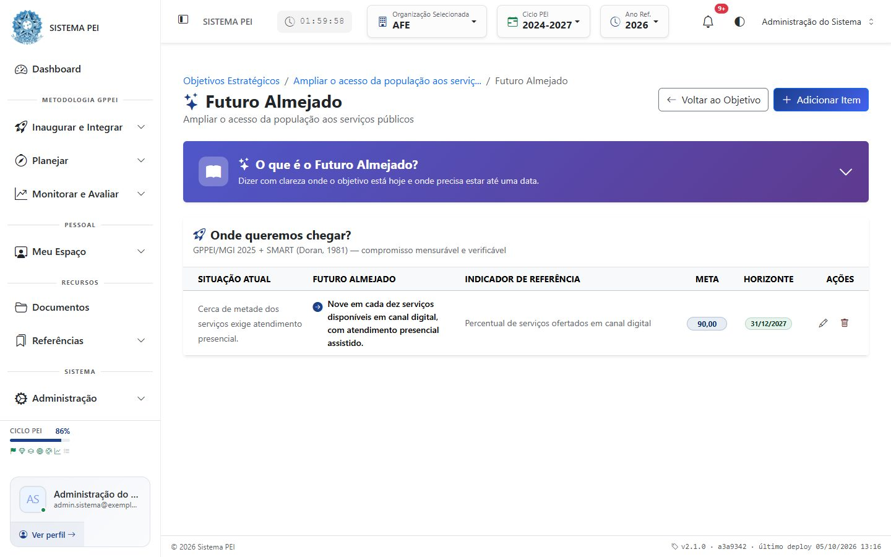
*Figura 45 — Futuro Almejado de um objetivo.*

Na figura, o objetivo é "Ampliar o acesso da população aos serviços públicos" e a tabela **Onde queremos
chegar?** tem uma linha: **SITUAÇÃO ATUAL** "Cerca de metade dos serviços exige atendimento
presencial."; **FUTURO ALMEJADO** "Nove em cada dez serviços disponíveis em canal digital, com
atendimento presencial assistido."; **INDICADOR DE REFERÊNCIA** "Percentual de serviços ofertados em
canal digital"; **META** 90,00; **HORIZONTE** 31/12/2027; e, em **AÇÕES**, o lápis e a lixeira. Acima, a seção educativa
**O que é o Futuro Almejado?** explica o conceito com um exemplo fictício.

### 15.6 Campos do formulário

**Objetivo**

| Campo | Obrigatório | O que informar | Exemplo |
|---|---|---|---|
| Título do Objetivo | Sim | Verbo + resultado, de forma específica (até 255 caracteres) | Assegurar a eficiência e a qualidade do gasto público |
| Descrição Detalhada | Não | O que se pretende alcançar e por quê (até 1.000 caracteres) | Priorizar o orçamento nos resultados estratégicos e gerar economia nas contratações. |
| Perspectiva BSC | Sim | A camada do mapa a que o objetivo pertence | Orçamento e Logística |
| Desdobramento de | Não | O objetivo raiz de origem, ou "Objetivo raiz" | — Objetivo raiz (nível estratégico) — |
| Ordem de Apresentação | Sim | Posição dentro da perspectiva, a partir de 1 | 1 |
| ODS (até 3) | Não | Os ODS para os quais o objetivo contribui | ODS 12 |
| Contribuição para cada ODS | Não | Como contribui (até 2.000 caracteres) | Uso eficiente dos recursos públicos. |

**Futuro Almejado**

| Campo | Obrigatório | O que informar | Exemplo |
|---|---|---|---|
| Situação Atual (linha de base qualitativa) | Não | Onde o objetivo está hoje, com dados se possível | Baixa previsibilidade da execução orçamentária. |
| Futuro Almejado | Sim | A situação desejada (até 1.000 caracteres) | Orçamento executado conforme o cronograma e economia anual acima de R$ 2 milhões. |
| Indicador de Referência | Não | O indicador que vai provar o resultado | Valor economizado em contratações |
| Valor Meta | Não | Número maior ou igual a zero | 2000000 |
| Horizonte Temporal | Não | A data-alvo, em geral o fim do ciclo | 31/12/2027 |

### 15.7 Regras e validações

- **Até 3 ODS por objetivo**: "Vincule no máximo 3 ODS por objetivo." O vínculo é opcional.
- Um objetivo não pode ser desdobramento de si mesmo: "Um objetivo não pode ser pai de si mesmo."
- Perspectiva e objetivo de origem têm de ser do ciclo selecionado.
- **Ordem das etapas.** Se o ciclo ainda está na etapa de identidade (sem missão e visão) ou não tem
  perspectivas, **Novo Objetivo** leva à tela da etapa pendente, com a orientação correspondente.
- Comentário precisa de pelo menos 3 caracteres.
- Futuro almejado sem texto: "Descreva o futuro almejado."
- Em caso de falha inesperada, aparece a janela **Não foi possível salvar**.

### 15.8 Dicas e cuidados

- **Dica:** comece o título com um verbo no infinitivo ("Ampliar", "Assegurar", "Desenvolver").
- **Dica:** prefira um ou dois ODS bem justificados a três genéricos: o vínculo precisa dizer algo.
- **Dica:** o Futuro Almejado com linha de base e meta numérica torna o objetivo verificável (SMART).
- **Cuidado:** objetivos aparecem no Portal da Transparência. Escreva título e descrição para um leitor
  de fora da organização.
- **Cuidado:** veja o aviso de exclusão em 15.5.5.

### 15.9 Perguntas frequentes

- **Por que o mesmo objetivo mostra percentuais diferentes em telas diferentes?** O detalhe do objetivo
  e o Mapa Estratégico combinam indicadores e entregas do ano com os pesos da perspectiva. O detalhe da
  perspectiva e o Painel da Agenda 2030 mostram, para cada objetivo, só a média dos indicadores. Quando o
  objetivo não tem entregas no ano, os números coincidem (é o caso de "Ampliar o acesso da população aos
  serviços públicos", com 89,0% nas duas telas); quando tem, podem diferir.
- **"Sem indicador" é o mesmo que 0%?** Não. **Sem indicador** quer dizer que não há o que medir;
  **Sem medição**, que há indicador, mas nenhum resultado lançado no ano. Nenhum dos dois entra nas
  médias como zero.

---

## 16. Mapa Estratégico

### 16.1 Para que serve

O Mapa Estratégico é o plano numa página: a identidade da unidade (missão, visão, valores e temas) e,
abaixo, as perspectivas empilhadas com os seus objetivos. Lê-se de baixo para cima: o que está na base
sustenta o que está no topo. Cada perspectiva e cada objetivo mostram o desempenho do ano na cor do
farol, e a **memória de cálculo** explica de onde sai cada percentual (GPPEI p. 29–30).

### 16.2 Como chegar

Menu lateral **Planejar → Mapa Estratégico**. O endereço é `/pei/mapa`. O mesmo mapa é público, sem
login, no Portal da Transparência (ver capítulo 35).

### 16.3 Quem pode

Todos os perfis com vínculo veem o mapa. O mapa **não tem edição**: para mudar o conteúdo, use as telas
de Identidade, Valores, Temas, Perspectivas e Objetivos. Visitantes do Portal veem o mesmo mapa, sem a
seção educativa.

### 16.4 O que aparece na tela

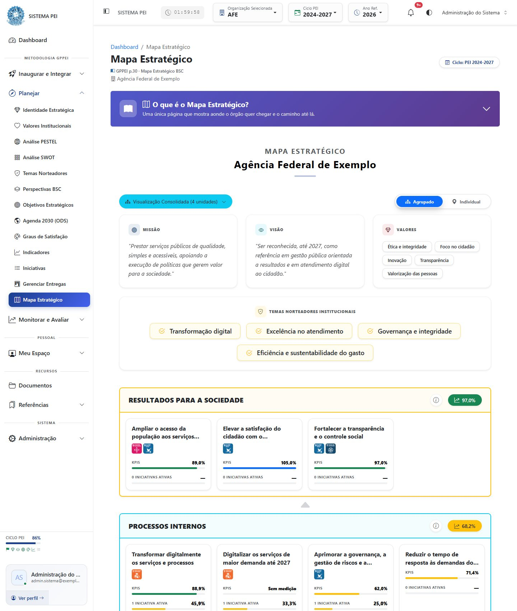
*Figura 46 — Mapa Estratégico da AFE no modo Agrupado.*

Na figura, a unidade é a AFE, o ciclo é o 2024-2027 e o ano de referência é 2026. Os elementos são:

- **Cabeçalho**: título, selo **GPPEI p.30 · Mapa Estratégico BSC**, nome da unidade e o selo **Ciclo:
  PEI 2024-2027**.
- **O que é o Mapa Estratégico?**: seção educativa recolhida.
- **Título central**: "MAPA ESTRATÉGICO" e o nome da unidade.
- **Barra de controles**: à esquerda, o selo do modo de visualização (na figura, **Visualização
  Consolidada (4 unidades)**); à direita, a chave **Agrupado | Individual** (ver 16.5.1).
- **Identidade**: os cartões **MISSÃO**, **VISÃO** e **VALORES** e o quadro **TEMAS NORTEADORES
  INSTITUCIONAIS**, sempre da unidade selecionada. Na figura aparecem a missão e a visão da AFE (entre
  aspas), os cinco valores em etiquetas ("Ética e integridade", "Foco no cidadão", "Inovação",
  "Transparência", "Valorização das pessoas") e os quatro temas norteadores. Unidade sem identidade
  mostra textos-padrão ("O propósito fundamental da organização.", "O futuro desejado pela
  instituição.") e os avisos "Valores não definidos." e "Temas norteadores não definidos.".
- **Perspectivas**, da maior para a menor: na figura, **RESULTADOS PARA A SOCIEDADE** no topo e, abaixo,
  **PROCESSOS INTERNOS**. Cada faixa tem a borda na cor do seu nível, o botão **i** (memória de cálculo) e
  o **selo de desempenho**, pintado com a cor da faixa de Graus de Satisfação em que o valor cai (na
  figura, 97,0% em verde e 68,2% em amarelo). Sem nada medido, o selo mostra **Sem medição**, em cinza.
  Entre as faixas, uma seta para cima indica a relação de causa e efeito.
- **Cartão do objetivo**: o nome, os ícones dos ODS vinculados e duas barras (na figura, "Ampliar o
  acesso da população aos serviços…" com KPIs 89,0% e "0 INICIATIVAS ATIVAS"; "Transformar digitalmente
  os serviços e processos" com KPIs 88,9% e "1 INICIATIVA ATIVA" com 45,9%):
  - **KPIs**: a média de atingimento dos indicadores do objetivo no ano (ou **Sem indicador** / **Sem
    medição**), com a barra na cor da faixa. Clicar abre a tela de Indicadores filtrada por esse objetivo.
  - **N Iniciativas Ativas**: quantas iniciativas têm entregas com prazo no ano e o avanço ponderado
    dessas entregas (ou "—"). A barra fica verde quando todas essas iniciativas estão concluídas, amarela
    quando alguma está pendente e cinza quando não há iniciativa com entrega no ano. Clicar abre a tela
    de Iniciativas filtrada por esse objetivo.
- **Legenda Graus de Satisfação**, no fim da página: cada faixa com a cor e o intervalo (ex.: Crítico
  0-50%). Sem faixas no ciclo, a legenda avisa "Sem faixas de satisfação configuradas neste ciclo." e
  explica que os percentuais aparecem em cinza; quem tem acesso vê o link **Configurar agora**.

### 16.5 Passo a passo

#### 16.5.1 Escolher o modo de visualização

A chave no canto direito da barra de controles define quais unidades entram no cálculo.

1. **Agrupado** (padrão): soma a unidade selecionada e **todas as subordinadas**. O selo azul
   **Visualização Consolidada (N unidades)** mostra quantas são. Clique nele para abrir a lista
   **Organizações Incluídas no Cálculo** (na base de demonstração, com a AFE selecionada: AFE, SPG, DTI
   e DAC — 4 unidades; com a SPG selecionada: SPG e DTI).
2. **Individual**: considera **só** a unidade selecionada. O selo muda para **Visualização Estrita
   (Apenas Unidade Selecionada)**.

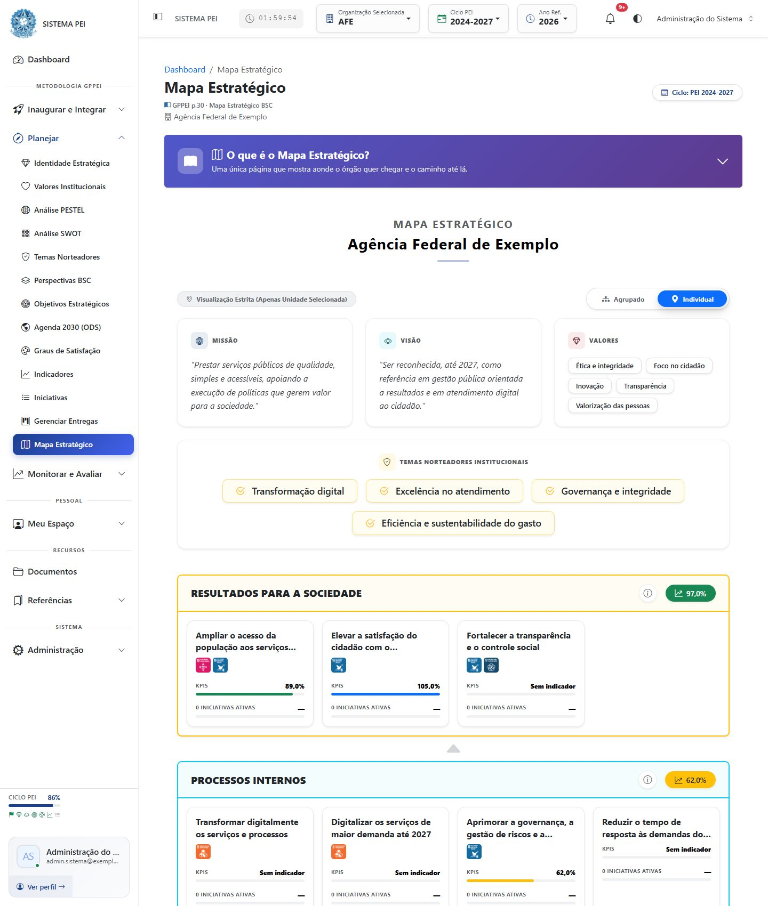
*Figura 47 — Mapa Estratégico da AFE no modo Individual.*

Na figura, o botão **Individual** está aceso e o selo cinza indica a visualização estrita. Compare com a
figura do modo Agrupado: a identidade é a mesma, mas os números mudam. Em **PROCESSOS INTERNOS**, o selo
cai de 68,2% para 62,0%, e vários cartões passam a mostrar **Sem indicador** e "0 INICIATIVAS ATIVAS"
(ex.: "Transformar digitalmente os serviços e processos"), porque os indicadores e as iniciativas desses
objetivos pertencem a unidades subordinadas, e não à própria AFE. O sistema lembra o modo escolhido
enquanto a sessão estiver aberta.

> **O que muda entre os modos.** Os objetivos são os mesmos (são da instituição). O que muda são os
> **indicadores e as iniciativas** que entram no cálculo: no Agrupado, os ligados à unidade e às
> subordinadas; no Individual, só os ligados à unidade. A identidade (missão, visão, valores e temas) é
> sempre a da unidade selecionada. Quando as subordinadas não têm indicadores nem iniciativas próprios,
> os dois modos dão o mesmo resultado (na figura, Resultados para a Sociedade fica em 97,0% nos dois).

#### 16.5.2 Ler o farol

1. Confira o **Ano Ref.** no topo: todo percentual do mapa é do ano escolhido.
2. Olhe a cor do selo de cada perspectiva e das barras de cada objetivo. A cor vem da régua de **Graus
   de Satisfação** do ciclo (ver capítulo 17). Na base de demonstração: vermelho = Crítico (até 49,99%),
   amarelo = Atenção (50% a 79,99%), verde = Bom (80% a 99,99%) e azul = Superado (100% ou mais).
3. Cinza significa "não há o que julgar": nada medido no ano, ou o ciclo sem régua configurada. Cinza
   **não** é desempenho ruim.
4. Valor abaixo da primeira faixa recebe a cor da primeira; acima da última, a cor da última.

#### 16.5.3 Abrir a memória de cálculo

1. Clique no **i** ao lado do selo de desempenho da perspectiva.
2. Leia a janela **Memória de Cálculo**.
3. Clique em **Fechar Memória** para sair.

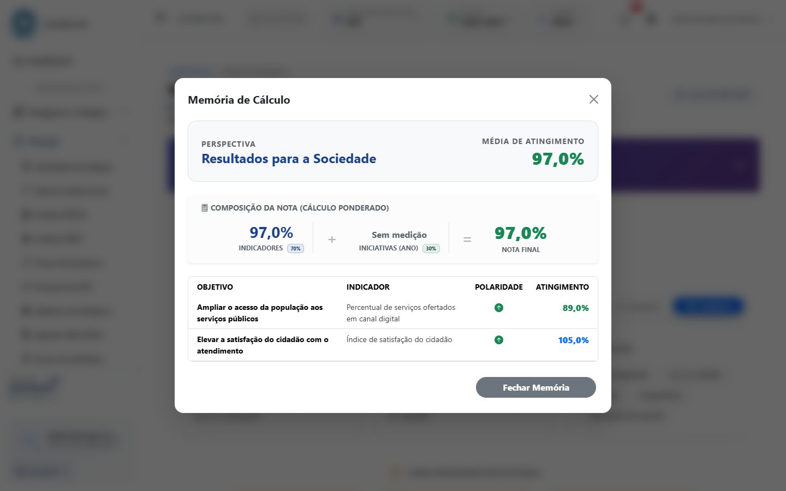
*Figura 48 — Memória de Cálculo da perspectiva Resultados para a Sociedade.*

A janela tem até quatro partes:

- **Cabeçalho**: o nome da perspectiva e a **MÉDIA DE ATINGIMENTO** (na figura, 97,0%), na cor da faixa.
- **COMPOSIÇÃO DA NOTA (CÁLCULO PONDERADO)**: aparece quando a perspectiva dá peso às iniciativas. Mostra
  a nota dos **INDICADORES** com o peso (97,0%, peso 70%), a nota das **INICIATIVAS (ANO)** com o peso
  (**Sem medição**, peso 30%) e a **NOTA FINAL** (97,0%).
- **Tabela de indicadores**: **OBJETIVO**, **INDICADOR**, **POLARIDADE** (seta verde para cima =
  positiva; seta vermelha para baixo = negativa; traço amarelo = estabilidade; **i** cinza = não
  aplicável) e **ATINGIMENTO** na cor da faixa. Indicador sem resultado no ano mostra **Sem medição**;
  indicador informativo mostra **Informativo**. Na figura: "Percentual de serviços ofertados em canal
  digital" (objetivo "Ampliar o acesso da população aos serviços públicos"), 89,0% em verde, e "Índice de
  satisfação do cidadão" (objetivo "Elevar a satisfação do cidadão com o atendimento"), 105,0% em azul.
- **DETALHAMENTO DE INICIATIVAS E ENTREGAS**: cada iniciativa com as entregas do ano (descrição, prazo e
  um ícone de situação — visto verde = concluída, ampulheta amarela = em andamento, pausa cinza =
  suspensa) e a **NOTA** da iniciativa. Só aparece quando a perspectiva tem iniciativas com entregas no
  ano; por isso não aparece na figura.

**Como o número é calculado** (regra usada pelo mapa):

1. **Nota dos indicadores** = média simples do atingimento no ano dos indicadores **medidos** da
   perspectiva. Indicador sem medição ou informativo fica fora da média (não entra como zero). Na figura:
   (89,0% + 105,0%) ÷ 2 = 97,0%.
2. **Nota das iniciativas** = avanço ponderado das **entregas com prazo no ano** das iniciativas da
   perspectiva. Cada entrega vale: **Concluído = 100%**, **Em Andamento = 50%**, **Suspenso = 25%** e as
   demais situações = 0%. Entregas **Canceladas** ficam fora. O peso de cada entrega é o peso cadastrado
   nela (ou 1, se não houver). Na figura, a perspectiva não tem entregas no ano: **Sem medição**.
3. **Nota final** = nota dos indicadores × peso dos indicadores + nota das iniciativas × peso das
   iniciativas (pesos definidos na perspectiva, ver 14.5.2). Exemplo com os pesos da figura (70% / 30%):
   se os indicadores dessem 90% e as iniciativas 50%, a nota final seria 90% × 70% + 50% × 30% = 63% +
   15% = **78%**.
4. **Componente sem dado sai da conta.** Se não houver indicador medido, a nota final é só a das
   iniciativas, e vice-versa (os pesos se redistribuem). É o que acontece na figura: sem entregas no ano,
   a nota final é a própria nota dos indicadores (97,0%), e não 97,0% × 70% = 67,9%. Sem nenhum dos dois,
   o selo mostra **Sem medição**.

> Para objetivos com desdobramento, o atingimento usado nos cálculos de cascata é a média entre o
> objetivo e os desdobrados que têm medição.

### 16.6 Campos do formulário

O Mapa Estratégico não tem formulário. Os controles são a chave **Agrupado | Individual**, o selo da
visualização consolidada (abre a lista de unidades), o botão **i** de cada perspectiva e os links das
barras **KPIs** e **Iniciativas** de cada objetivo.

### 16.7 Regras e validações

- Sem ciclo selecionado, aparece "Nenhum PEI Ativo — Selecione ou configure um ciclo estratégico para
  carregar o mapa."
- Para o Super Administrador sem unidade selecionada, o mapa abre na unidade raiz.
- A régua de cores é sempre a do ciclo exibido; se houver faixas específicas para o ano de referência,
  elas substituem as faixas gerais do ciclo (ver 17.7).

### 16.8 Dicas e cuidados

- **Dica:** em reunião, use o modo **Agrupado** na unidade de topo para ver a instituição inteira, e o
  **Individual** para cobrar o resultado de uma unidade específica.
- **Dica:** antes de apresentar, abra a memória de cálculo das perspectivas com cor de alerta: ela mostra
  exatamente qual indicador ou entrega puxou o número para baixo.
- **Cuidado:** quando a unidade não tem missão e visão, os cartões mostram textos-padrão entre aspas.
  Cadastre a identidade da unidade (capítulo 9) antes de publicar o mapa.
- **Cuidado:** clicar no nome do objetivo abre a lista geral de objetivos. Para ir direto aos
  indicadores ou às iniciativas daquele objetivo, clique nas barras **KPIs** ou **Iniciativas Ativas**
  do cartão.

### 16.9 Perguntas frequentes

- **O mapa está todo cinza.** Ou o ciclo não tem Graus de Satisfação configurados (a legenda avisa),
  ou nada foi medido no **Ano Ref.** escolhido. Confira o ano no topo.
- **A perspectiva está em 68,2%, mas os objetivos dela mostram outros números. Está errado?** Não
  necessariamente. O selo da perspectiva combina indicadores e entregas com os pesos; a barra **KPIs** do
  cartão mostra só os indicadores daquele objetivo. Abra a memória de cálculo para ver a composição.
- **Por que o modo Agrupado e o Individual dão números diferentes?** Porque o Agrupado soma os
  indicadores e as iniciativas das unidades subordinadas. Na base de demonstração, Processos Internos
  marca 68,2% no Agrupado e 62,0% no Individual da AFE. Quando as subordinadas não têm indicadores nem
  iniciativas próprios, os dois modos coincidem.

---

## 17. Graus de Satisfação

### 17.1 Para que serve

Os Graus de Satisfação são a **régua do farol**: as faixas de percentual e as cores com que a
organização julga o próprio desempenho (ex.: Crítico, Atenção, Bom, Superado). A mesma régua pinta o
Mapa Estratégico, as fichas de indicadores e objetivos, o Dashboard e o Portal. Por isso, um mesmo
número tem a mesma cor em todo o sistema. O assistente do ciclo pede a régua logo depois dos objetivos e
antes dos indicadores.

### 17.2 Como chegar

Menu lateral **Planejar → Graus de Satisfação**. O endereço é `/graus-satisfacao`. A legenda do Mapa
Estratégico também tem o link **Configurar agora** quando o ciclo ainda não tem faixas.

### 17.3 Quem pode

| Ação | Perfis |
|---|---|
| Ver as faixas e o detalhe | Todos os perfis com vínculo |
| Incluir, editar, excluir e pedir sugestões à IA | Super Administrador e Administrador da unidade raiz |

A régua é **da instituição**: vale para o ciclo inteiro, em todas as unidades. Mudar uma faixa depois de
lançados os resultados é "reescrever a nota depois da prova" — por isso só a unidade raiz altera.

### 17.4 O que aparece na tela

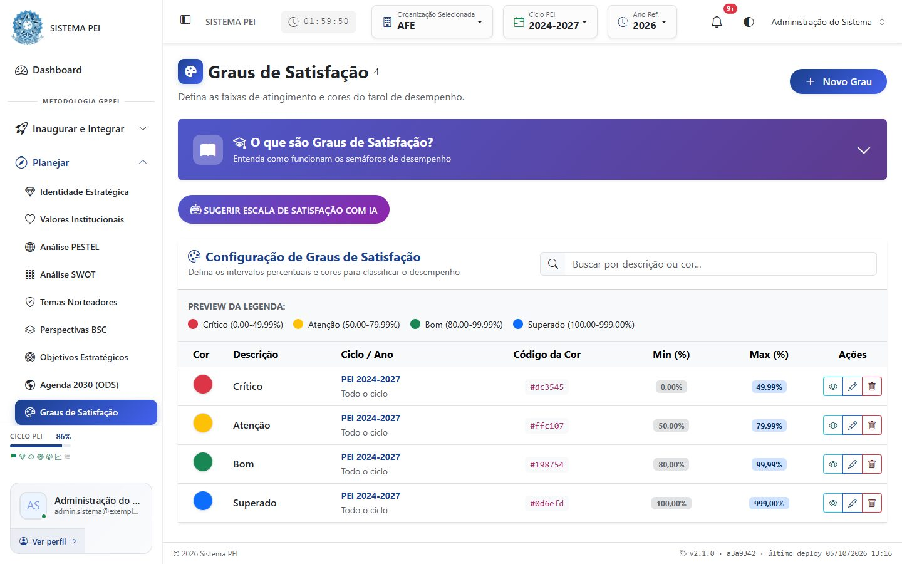
*Figura 49 — Graus de Satisfação do ciclo 2024-2027.*

Na figura, o ciclo 2024-2027 tem quatro faixas. Os elementos são:

- **Título** com o contador (**4**) e a frase "Defina as faixas de atingimento e cores do farol de
  desempenho."
- **Novo Grau**: botão azul à direita.
- **O que são Graus de Satisfação?**: seção educativa recolhida, com exemplos de faixas e de leitura.
- **SUGERIR ESCALA DE SATISFAÇÃO COM IA**: botão do Mentor de IA (ver 17.5.4).
- **Configuração de Graus de Satisfação**: campo **Buscar por descrição ou cor...** e o quadro
  **PREVIEW DA LEGENDA**, que mostra as faixas como aparecerão nas telas: Crítico (0,00-49,99%), Atenção
  (50,00-79,99%), Bom (80,00-99,99%) e Superado (100,00-999,00%).
- **Tabela**, ordenada do menor para o maior percentual, com as colunas:
  - **Cor**: a bolinha da cor (passe o mouse para ver o código);
  - **Descrição**: o nome da faixa (link para o detalhe);
  - **Ciclo / Ano**: o ciclo e "Todo o ciclo" ou "Ano: AAAA";
  - **Código da Cor**: o código hexadecimal (ex.: #dc3545);
  - **Min (%)** e **Max (%)**: os limites da faixa;
  - **Ações**: olho (detalhar), lápis (editar) e lixeira (excluir).

### 17.5 Passo a passo

#### 17.5.1 Incluir uma faixa

1. Clique em **Novo Grau**.
2. Na janela **Novo Grau de Satisfação**, escreva a **Descrição do Grau**.
3. Escolha a **Cor Representativa**: clique no quadradinho colorido para abrir a paleta, ou digite o
   código no formato #rrggbb.
4. Confira o **Ciclo PEI** (vem com o ciclo selecionado no topo) e escolha o **Ano Específico** ("Todo o
   Ciclo" ou um ano do ciclo).
5. Digite o **Percentual Mínimo** e o **Percentual Máximo**, com vírgula (ex.: 29,99). O campo aceita
   apagar e reescrever como qualquer texto.
6. Confira a **Representação no Mapa**, uma prévia da faixa com a cor e o nome.
7. Clique em **Salvar Grau**. A janela **Operação Concluída!** confirma; clique em **Continuar**.

#### 17.5.2 Editar uma faixa

1. Clique no lápis da linha (ou em **Editar** no detalhe da faixa).
2. Altere os campos na janela **Editar Grau de Satisfação**.
3. Clique em **Atualizar Grau**.

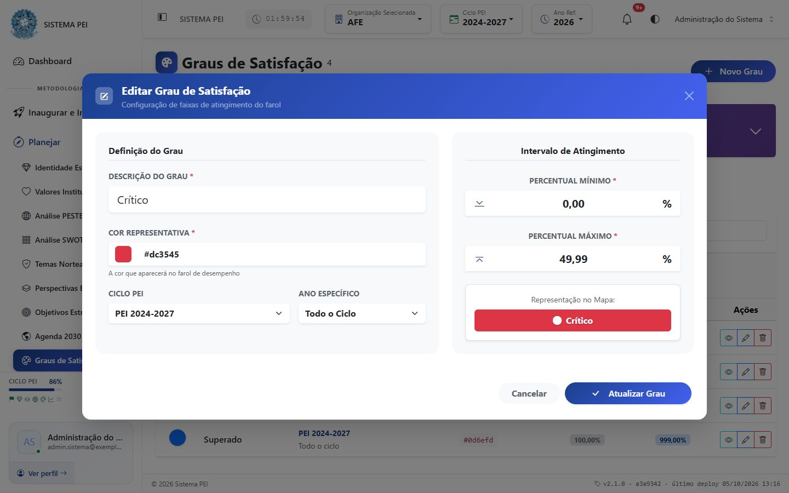
*Figura 50 — Janela Editar Grau de Satisfação.*

Na figura, a faixa **Crítico** tem a cor **#dc3545**, vale para o **PEI 2024-2027** em **Todo o
Ciclo** e vai de **0,00%** a **49,99%**. A **Representação no Mapa** mostra o selo vermelho "Crítico".

#### 17.5.3 Ver o detalhe de uma faixa

Clique no olho da linha ou no nome da faixa.

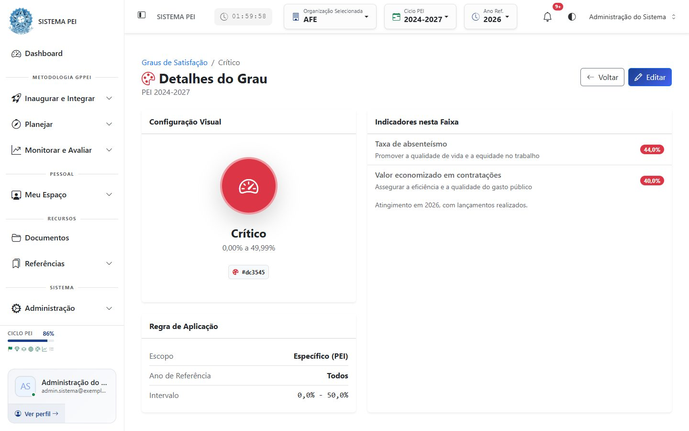
*Figura 51 — Detalhes do Grau "Crítico".*

A página mostra:

- **Configuração Visual**: o círculo na cor da faixa, o nome, o intervalo (0,00% a 49,99%) e o código da
  cor.
- **Regra de Aplicação**: **Escopo** (Específico do ciclo), **Ano de Referência** ("Todos", quando vale
  para o ciclo inteiro) e **Intervalo** (mostrado com uma casa decimal; por isso 49,99% aparece como
  50,0%).
- **Indicadores nesta Faixa**: os indicadores do ciclo cujo atingimento no ano cai nesta faixa, com o
  objetivo de cada um e o percentual. Na figura: "Taxa de absenteísmo" (44,0%) e "Valor economizado em
  contratações" (40,0%). A nota "Atingimento em 2026, com lançamentos realizados." indica o ano usado. Sem
  indicadores, aparece "Nenhum indicador deste ciclo tem atingimento nesta faixa em AAAA." Clicar num
  indicador abre a ficha dele.
- **Voltar** e **Editar** (este só para quem pode editar).

#### 17.5.4 Pedir sugestões à IA

O Mentor de IA propõe uma escala padrão de **quatro a cinco faixas** cobrindo de 0 a 100%, com nome,
cor, mínimo e máximo. Nenhuma faixa é gravada até você escolher.

1. Clique em **SUGERIR ESCALA DE SATISFAÇÃO COM IA**.
2. No quadro **Escala Sugerida pelo Mentor IA**, clique em **Adicionar** na faixa que interessa. Ela é
   gravada no ciclo selecionado no topo, para todo o ciclo, e sai da lista.
3. Feche o quadro no **x** para descartar o restante.

As faixas sugeridas passam pelas mesmas regras de 17.7: se uma delas cruzar uma faixa existente, não é
gravada. Sem ciclo no topo, aparece "Selecione um Ciclo PEI antes de aplicar sugestões da IA."

> **A IA depende de configuração** (ver capítulo 32). Se nada acontecer ao clicar, o agente não está
> configurado ou o limite de 20 pedidos por minuto foi atingido.

#### 17.5.5 Excluir uma faixa

1. Clique na lixeira da linha.
2. Confirme na janela **Excluir Grau de Satisfação**. O Mentor avisa "Grau Removido".

### 17.6 Campos do formulário

| Campo | Obrigatório | O que informar | Exemplo |
|---|---|---|---|
| Descrição do Grau | Sim | O nome da faixa (até 100 caracteres) | Atenção |
| Cor Representativa | Sim | Código no formato #rrggbb | #ffc107 |
| Ciclo PEI | Sim | O ciclo a que a régua pertence | PEI 2024-2027 |
| Ano Específico | Não | "Todo o Ciclo" ou um ano do ciclo | Todo o Ciclo |
| Percentual Mínimo | Sim | De 0 a 999,99, com vírgula | 50,00 |
| Percentual Máximo | Sim | De 0 a 999,99, maior ou igual ao mínimo | 79,99 |

### 17.7 Regras e validações

- **Faixas não podem se cruzar** no mesmo ciclo e no mesmo ano, porque um mesmo resultado teria duas
  cores. Encostar no limite é permitido (0–50 e 50–75); cruzar não (0–60 e 50–75). O sistema diz qual
  faixa está em conflito: "Esta faixa se sobrepõe a "…" (…% a …%). As faixas não podem se cruzar: um
  mesmo resultado teria duas cores."
- Máximo menor que o mínimo: "O valor máximo deve ser maior ou igual ao mínimo."
- Valores fora de 0 a 999,99: "Informe o percentual mínimo entre 0 e 999,99. Ex.: 0,00" (e a mensagem
  equivalente para o máximo).
- Cor fora do formato #rrggbb é recusada.
- **Régua do ano substitui a do ciclo.** Se existirem faixas para um ano específico, naquele ano elas
  julgam sozinhas, sem se misturar com as de "Todo o Ciclo". Nos demais anos, valem as de "Todo o Ciclo".
- **Fora das pontas.** Valor abaixo da primeira faixa recebe a cor da primeira; acima da última, a cor
  da última (um indicador a 125% não fica vermelho por "sair" da régua).
- Sem nenhuma faixa no ciclo, o sistema não inventa cores: os percentuais aparecem em cinza.

### 17.8 Dicas e cuidados

- **Dica:** cubra todo o intervalo de 0 até o maior valor possível, sem buracos. Uma faixa final como
  "Superado" (100 a 999,99) evita que resultados acima da meta fiquem sem nome.
- **Dica:** use cores intuitivas — vermelho para crítico, amarelo para atenção, verde para bom.
- **Cuidado:** alterar a régua repinta, de uma vez, o farol de todas as unidades, inclusive de anos já
  encerrados que usem as faixas de "Todo o Ciclo". Defina a régua no início do ciclo e evite mudá-la
  depois dos resultados lançados.

---

## 18. Agenda 2030 (ODS)

### 18.1 Para que serve

O Painel da Agenda 2030 mostra **como a estratégia do ciclo contribui para os Objetivos de
Desenvolvimento Sustentável**: os 17 ODS da ONU mais o **ODS 18 — Igualdade Étnico-Racial**, adotado
pelo Brasil, num total de **18 ODS**. O vínculo com os ODS é um **eixo transversal opcional**: nenhum
ciclo é obrigado a cobrir todos, e um objetivo sem ODS é válido. O painel ajuda a responder, numa
reunião, "o que estamos entregando para este ODS e como está indo?".

A tela **não cria nada**. Ela lê dois vínculos feitos em outras telas e os cruza:

| Informação | Onde se registra | Significado |
|---|---|---|
| **Aderência declarada** (estrela) | **Inaugurar e Integrar → aba Agenda 2030** (ver capítulo 7) | A intenção: "o ciclo se propõe a contribuir para estes ODS", com intensidade e texto de contribuição |
| **Cobertura efetiva** (ODS colorido e número verde) | Formulário do **Objetivo Estratégico** (ver 15.5.4) | A estratégia de fato: objetivos ligados a cada ODS (até 3 por objetivo) |

### 18.2 Como chegar

Menu lateral **Planejar → Agenda 2030 (ODS)**. O endereço é `/agenda2030`. O Dashboard também tem o
botão **Abrir Painel** no quadro da Agenda 2030, e os ícones de ODS do Dashboard levam a esta tela.

### 18.3 Quem pode

Todos os perfis com vínculo veem o painel. Ele não tem edição: os vínculos são alterados em **Inaugurar
e Integrar** e em **Objetivos Estratégicos**, por quem tem permissão nessas telas.

### 18.4 O que aparece na tela

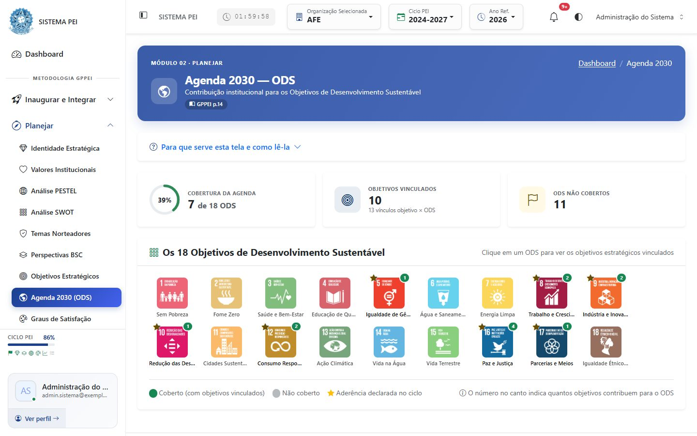
*Figura 52 — Painel Agenda 2030 do ciclo 2024-2027.*

Na figura, o ciclo é o 2024-2027. Os elementos são:

- **Cabeçalho** "MÓDULO 02 · PLANEJAR — Agenda 2030 — ODS", com o selo **GPPEI p.14**.
- **Para que serve esta tela e como lê-la**: clique para abrir um resumo da leitura do painel.
- **Três contadores**:
  - **COBERTURA DA AGENDA**: quantos ODS têm ao menos um objetivo vinculado, em número e em percentual
    no círculo (na figura, **7 de 18 ODS**, 39%). O total vem do cadastro de ODS.
  - **OBJETIVOS VINCULADOS**: quantos objetivos têm pelo menos um ODS (10) e, abaixo, quantos vínculos
    objetivo × ODS existem (13). Os números diferem porque um objetivo pode ter até 3 ODS.
  - **ODS NÃO COBERTOS**: quantos ODS ainda não têm objetivo (11).
- **Alerta de coerência** (faixa amarela, quando houver): lista os ODS **declarados** na aderência que
  **não têm nenhum objetivo** vinculado, com links para **Objetivos Estratégicos** e **Inaugurar e
  Integrar**.
- **Os 18 Objetivos de Desenvolvimento Sustentável**: a grade com os ícones oficiais e o nome abreviado
  de cada ODS. Como ler cada ícone:

| O que aparece | Significa |
|---|---|
| Ícone com cor plena | Ao menos um objetivo do ciclo contribui para o ODS |
| Ícone mais claro (esmaecido) | Nenhum objetivo vinculado |
| **Número verde** no canto superior direito | Quantos objetivos contribuem (na figura, 4 no ODS 16) |
| **Estrela amarela** no canto superior esquerdo | O ODS foi declarado na aderência do ciclo; passe o mouse para ver a intensidade |

- **Legenda** no rodapé da grade: Coberto, Não coberto, Aderência declarada no ciclo e a nota "O número
  no canto indica quantos objetivos contribuem para o ODS".

Sem nenhum objetivo vinculado no ciclo, aparece o quadro "Comece a alinhar sua estratégia à Agenda
2030", lembrando que o vínculo é opcional, com o botão para a tela de objetivos. Sem ciclo, aparece
"Nenhum ciclo PEI ativo" com o botão para **Ciclos PEI**.

### 18.5 Passo a passo

#### 18.5.1 Ver o detalhe de um ODS

1. Clique no ícone do ODS na grade. Ele fica em destaque, com contorno verde, e o detalhe abre logo
   abaixo da grade.
2. Clique de novo no mesmo ícone, ou em **Fechar** no detalhe, para recolher.

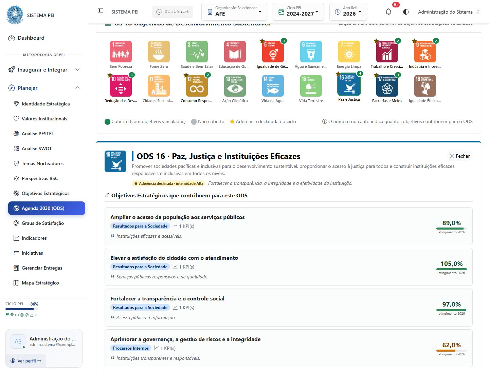
*Figura 53 — Painel com o ODS 16 selecionado.*

Na figura, o ODS 16 (Paz e Justiça), com estrela de aderência declarada e 4 objetivos vinculados, está
selecionado: o ícone sobe e ganha contorno verde, e o quadro de detalhe abre abaixo da grade, com a
borda superior na cor do ODS. Na figura, o detalhe mostra o título "ODS 16 · Paz, Justiça e Instituições
Eficazes", a descrição oficial, o selo **Aderência declarada · intensidade Alta** com o texto "Fortalecer
a transparência, a integridade e a efetividade da instituição." e quatro objetivos: "Ampliar o acesso da
população aos serviços públicos" (89,0%), "Elevar a satisfação do cidadão com o atendimento" (105,0%),
"Fortalecer a transparência e o controle social" (97,0%) — os três de Resultados para a Sociedade — e
"Aprimorar a governança, a gestão de riscos e a integridade" (Processos Internos, 62,0%, em laranja).
Cada um tem 1 KPI e o texto de contribuição entre aspas (ex.: "Instituições eficazes e acessíveis.").
Em geral, o quadro de detalhe mostra:

- O ícone, o número e o nome completo do ODS, a descrição oficial e o botão **Fechar**.
- Se o ODS foi declarado na aderência: o selo **Aderência declarada · intensidade …** e o texto de
  contribuição escrito em Inaugurar e Integrar.
- **Objetivos Estratégicos que contribuem para este ODS**: para cada objetivo, o nome (link para o
  detalhe), a perspectiva, a quantidade de KPIs, o texto de contribuição (entre aspas) e, à direita, o
  **atingimento no ano de referência** com uma barra.
- Sem objetivos vinculados (caso, por exemplo, do ODS 1 na base de demonstração): "Nenhum objetivo estratégico
  vinculado a este ODS ainda." e o botão **Vincular nos Objetivos**.

**Como ler o atingimento no detalhe do ODS:**

- O percentual é a média ponderada dos **indicadores** do objetivo (diretos e das suas iniciativas)
  medidos no ano escolhido no topo.
- A cor segue cortes fixos deste painel: **80% ou mais, verde**; **de 50% a 79,9%, laranja**; **abaixo
  de 50%, vermelho**. Ela não usa a régua de Graus de Satisfação do ciclo (capítulo 17). Na figura, por
  isso, 105,0% aparece em verde, embora no Mapa Estratégico o mesmo valor fique azul (Superado).
- **Sem indicador**: o objetivo não tem indicador direto nem de iniciativa — não há o que medir.
- **Sem medição**: há indicador, mas nenhum resultado lançado no ano. Nenhum dos dois casos é 0%.

#### 18.5.2 Corrigir um alerta de coerência

O alerta aparece quando um ODS foi declarado (estrela) e nenhum objetivo o sustenta. Há dois caminhos:

1. **Vincular um objetivo**: clique em **Objetivos Estratégicos** no alerta, edite o objetivo que de fato
   contribui e marque o ODS (ver 15.5.4).
2. **Rever a declaração**: clique em **Inaugurar e Integrar** e desmarque o ODS na aderência (ver
   capítulo 7), se a organização concluir que não vai atuar nele neste ciclo.

### 18.6 Campos do formulário

O painel não tem formulário. Os campos que alimentam a tela são o bloco **Contribuição para a Agenda
2030 (ODS)** do objetivo (15.6) e a aba **Agenda 2030** de Inaugurar e Integrar (capítulo 7).

### 18.7 Regras e validações

- O vínculo a ODS é **opcional**, tanto na aderência quanto nos objetivos. O sistema nunca exige ODS.
- Cada objetivo pode ter **no máximo 3 ODS**.
- O painel considera os objetivos do **ciclo selecionado** no topo, de todas as unidades (objetivos são
  da instituição). O atingimento é sempre do **Ano Ref.**
- O ODS **não altera** o cálculo de desempenho: o atingimento vem dos indicadores e das iniciativas. O
  ODS é só uma forma de agrupar e ler a estratégia.

### 18.8 Dicas e cuidados

- **Dica:** roteiro de dois minutos para apresentar a um gestor: (1) "os coloridos são os ODS que a
  estratégia apoia de fato"; (2) "a estrela marca o que declaramos na abertura do ciclo"; (3) "estrela em
  ODS apagado é promessa sem estratégia — o sistema avisa"; (4) clique num ODS colorido e mostre os
  objetivos e o atingimento; (5) "tudo isso é opcional e não muda o cálculo do desempenho".
- **Cuidado:** as cores do detalhe do ODS seguem os cortes fixos do painel e podem diferir da cor do
  mesmo objetivo no Mapa Estratégico, que usa a régua do ciclo. Para a avaliação oficial, use o Mapa.

### 18.9 Perguntas frequentes

- **O painel está todo apagado.** Nenhum objetivo do ciclo selecionado tem ODS. Vincule em **Planejar →
  Objetivos Estratégicos** e confira o seletor **Ciclo PEI** no topo.
- **Declarei o ODS e ele continua apagado.** A declaração é intenção; a cor vem dos objetivos. Esse é
  exatamente o caso do alerta de coerência (18.5.2).
- **Por que no máximo 3 ODS por objetivo?** Para que o vínculo diga algo: um objetivo marcado em todos os
  ODS não informa nada.
- **Por que são 18 e não 17?** O Brasil adotou o ODS 18, Igualdade Étnico-Racial, além dos 17 da ONU.
- **O percentual do objetivo aqui é diferente do detalhe do objetivo.** O painel usa só os indicadores;
  o detalhe do objetivo combina indicadores e entregas com os pesos da perspectiva (ver 15.9).

# PARTE IV — MÓDULO 03: MONITORAR E AVALIAR

O Módulo 03 é onde o plano sai do papel e passa a ser acompanhado. Aqui se mede o resultado
(indicadores), se executa o que foi planejado (iniciativas e entregas), se cuida do que pode dar
errado (riscos), se registra a reunião em que a direção revisa a estratégia (RAE), se guarda o
aprendizado (lições aprendidas) e se presta contas (relatórios).

> **Onde fica cada tela no menu.** Indicadores, Iniciativas e Gerenciar Entregas ficam no grupo
> **Planejar** do menu lateral, logo abaixo de Graus de Satisfação. Gestão de Riscos, RAE — Revisão
> da Estratégia, Relatórios, Histórico de Relatórios e Lições Aprendidas ficam no grupo
> **Monitorar e Avaliar**. Minhas Entregas fica em **Meu Espaço**.

> **Antes de qualquer tela deste módulo, confira os três seletores do topo** (ver capítulo 3):
> a **unidade**, o **ciclo PEI** e o **ano de referência**. Todas as listas deste módulo mostram a
> unidade selecionada e as subordinadas a ela (dentro do que o seu perfil alcança), sempre no ciclo
> selecionado. O ano de referência decide a régua e o farol dos indicadores.

---

## 19. Indicadores

### 19.1 Para que serve

O indicador é a régua que mostra o quanto a organização se aproxima de um objetivo estratégico ou o
quanto uma iniciativa avança. Cada indicador tem uma unidade de medida, uma polaridade (se "mais é
melhor" ou "menos é melhor"), metas por ano e uma linha de base. Mês a mês, a equipe lança o valor
previsto e o valor realizado; o sistema calcula o **atingimento** e pinta o **farol** com as cores
da régua de Graus de Satisfação (capítulo 17). É desse número que se alimentam o Mapa Estratégico,
o Painel, o IQG e os relatórios (GPPEI, p. 31).

### 19.2 Como chegar

- Menu lateral **Planejar → Indicadores**.
- Pelo Mapa Estratégico ou pela tela de um objetivo, os links de indicadores abrem esta mesma tela
  já filtrada pelo objetivo (o filtro de objetivo soma-se ao de unidade).

### 19.3 Quem pode

| Ação | Super Admin | Administrador da Unidade | Gestor(a) Responsável | Gestor(a) Substituto(a) | Consulta |
|---|---|---|---|---|---|
| Ver a lista e a ficha técnica | Sim | Sim | Sim | Sim | Sim |
| Criar indicador | Sim | Sim (nas unidades que administra) | Só de iniciativa pela qual responde | Não | Não |
| Editar, lançar evolução, metas e linha de base | Sim | Sim | Só nos indicadores da sua iniciativa | Só nos indicadores da sua iniciativa | Não |
| Excluir | Sim | Sim (unidade que administra) | Não | Não | Não |
| Exportar (PDF/Excel) | Sim | Sim | Sim | Sim | Sim |

Regras complementares, conferidas pelo sistema:

- O Gestor da iniciativa não transforma um indicador de iniciativa em indicador de objetivo. Ao
  tentar, recebe a mensagem *"Só o Administrador da unidade vincula o indicador a um Objetivo.
  Mantenha a origem 'Iniciativa'."*
- Acrescentar ou retirar uma unidade do vínculo de um indicador existente exige ser Administrador
  daquela unidade.
- Indicador de objetivo sem nenhuma unidade vinculada é da instituição inteira: só quem edita o que é
  institucional (Super Admin ou Administrador da unidade raiz) altera ou exclui.

### 19.4 Pré-requisito

Para criar um indicador é preciso ter ao menos um Objetivo Estratégico no ciclo selecionado. Sem
isso, o botão **Novo Indicador** mostra o aviso *"Para criar Indicadores é necessário ter ao menos 1
Objetivo Estratégico cadastrado."* Sem ciclo PEI cadastrado, o aviso é *"É necessário ter um Ciclo
PEI ativo antes de registrar qualquer informação estratégica."*

### 19.5 A lista de indicadores e o farol

A figura a seguir mostra a tela aberta pelo menu **Planejar → Indicadores**, com a unidade AFE, o
ciclo PEI 2024-2027 e o ano de referência 2026 selecionados no topo.

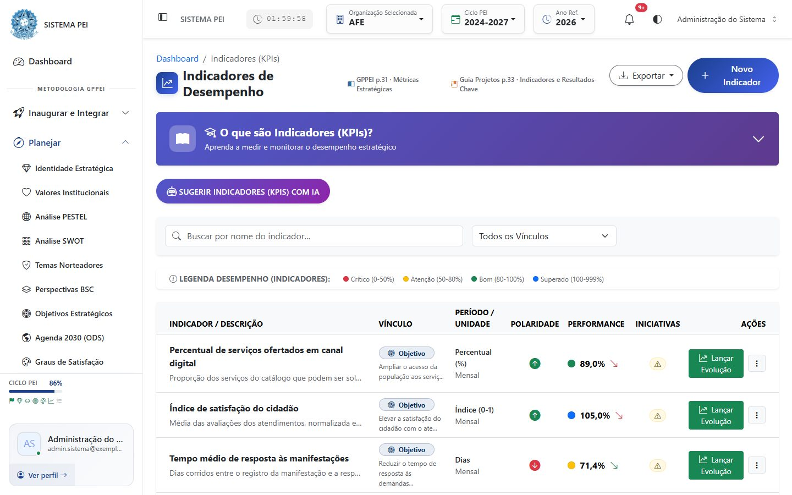
*Figura 54 — Lista de indicadores com farol, polaridade e tendência.*

O que aparece na tela, de cima para baixo:

- **Cabeçalho** — título *Indicadores de Desempenho*, atalhos para as páginas de referência
  (GPPEI p. 31 · Métricas Estratégicas; Guia de Projetos p. 33 · Indicadores e Resultados-Chave),
  o botão **Exportar** (PDF ou Excel da lista de indicadores, ver capítulo 26) e o botão
  **Novo Indicador** (só para quem pode criar).
- **O que são Indicadores (KPIs)?** — seção educativa que se abre ao clicar na seta (ver capítulo 3).
- **Sugerir Indicadores (KPIs) com IA** — pede ao agente de IA três sugestões (ver 19.11). Só
  aparece para quem pode criar indicador.
- **Filtros** — a caixa **Buscar por nome do indicador…** e o seletor de vínculo:
  **Todos os Vínculos**, **Vínculo com Objetivo** ou **Vínculo com Iniciativa**.
- **Legenda Desempenho (Indicadores)** — as faixas da régua de Graus de Satisfação do ano de
  referência. Na figura: Crítico (0-50%), Atenção (50-80%), Bom (80-100%) e Superado (100-999%). As
  faixas e cores são as cadastradas pela sua organização no capítulo 17; as da figura são exemplo.
- **Tabela**, dez indicadores por página, com as colunas:

| Coluna | O que mostra |
|---|---|
| **Indicador / Descrição** | Nome do indicador e o começo da descrição. |
| **Vínculo** | Selo **Objetivo** (com o nome do objetivo) ou **Iniciativa** (com o nome da iniciativa). Nos indicadores de iniciativa aparece ainda o selo **Auto** (calculado pelas entregas) ou **Manual** (valores lançados à mão). |
| **Período / Unidade** | Unidade de medida e periodicidade, por exemplo "Quantidade (un) · Mensal". |
| **Polaridade** | Seta verde para cima = Positiva (quanto maior, melhor); seta vermelha para baixo = Negativa (quanto menor, melhor); traço amarelo = Estabilidade (quanto mais perto do alvo, melhor); "i" cinza = Não Aplicável (informativo). Passe o mouse para ver o nome. |
| **Performance** | Bolinha do farol na cor da régua, o atingimento do ano de referência (ex.: 88,9%) e uma seta de tendência. Quando não há medição, aparece **Sem medição** com bolinha cinza. |
| **Iniciativas** | Quantidade de iniciativas associadas ao indicador; o triângulo amarelo indica "Sem iniciativa vinculada". |
| **Ações** | Botão verde **Lançar Evolução** e o menu **⋮**. |

**A seta de tendência** compara os três últimos valores realizados lançados: seta para cima à
direita = crescente; para baixo = decrescente; horizontal = estável. A cor diz se a tendência é boa
para a polaridade do indicador (verde = favorável, vermelho = desfavorável, cinza = neutra). Passe o
mouse para ver a variação, por exemplo "Crescente (+12,5% / mês)". Na figura, "Percentual de
serviços ofertados em canal digital" (polaridade positiva, 89,0%, farol verde) tem a seta descendo em
vermelho: o percentual caiu nos últimos meses, o que é ruim para quem quer "mais". Já "Tempo médio de
resposta às manifestações" tem polaridade negativa (seta vermelha para baixo na coluna Polaridade),
71,4% com farol amarelo e seta descendo em verde: o tempo está diminuindo, o que é bom. "Índice de
satisfação do cidadão" passou da meta (105,0%) e aparece com farol azul, a cor de "Superado" na régua
da figura.

**O menu ⋮ de cada linha** tem dois grupos:

- *Lançamentos*: **Ficha Técnica**, **Lançar Evolução** (não aparece em indicador automático),
  **Gerenciar Metas** e **Linha de Base**;
- *Configuração*: **Editar** e **Excluir** (este, só para quem pode excluir).

Quem só consulta vê apenas **Ficha Técnica** no menu e não vê o botão **Lançar Evolução**.

### 19.6 Cadastrar ou editar um indicador

#### 19.6.1 Passo a passo

1. Confira no topo a unidade e o ciclo. O indicador nasce vinculado à unidade selecionada.
2. Clique em **Novo Indicador** (para editar: **⋮ → Editar** na linha do indicador).
3. Preencha os blocos do formulário (ver a tabela de campos em 19.6.2).
4. Clique em **Salvar Indicador**. O sistema mostra *KPI Registrado!* (ou *KPI Atualizado!*, na
   edição). Clique no botão da janela de sucesso para voltar à lista.

A figura mostra o formulário aberto para edição do indicador "Percentual de serviços ofertados em
canal digital", vinculado à AFE e ao objetivo "Ampliar o acesso da população aos serviços públicos",
com unidade Percentual (%), periodicidade Mensal e acumulado "Não (Valor pontual)".

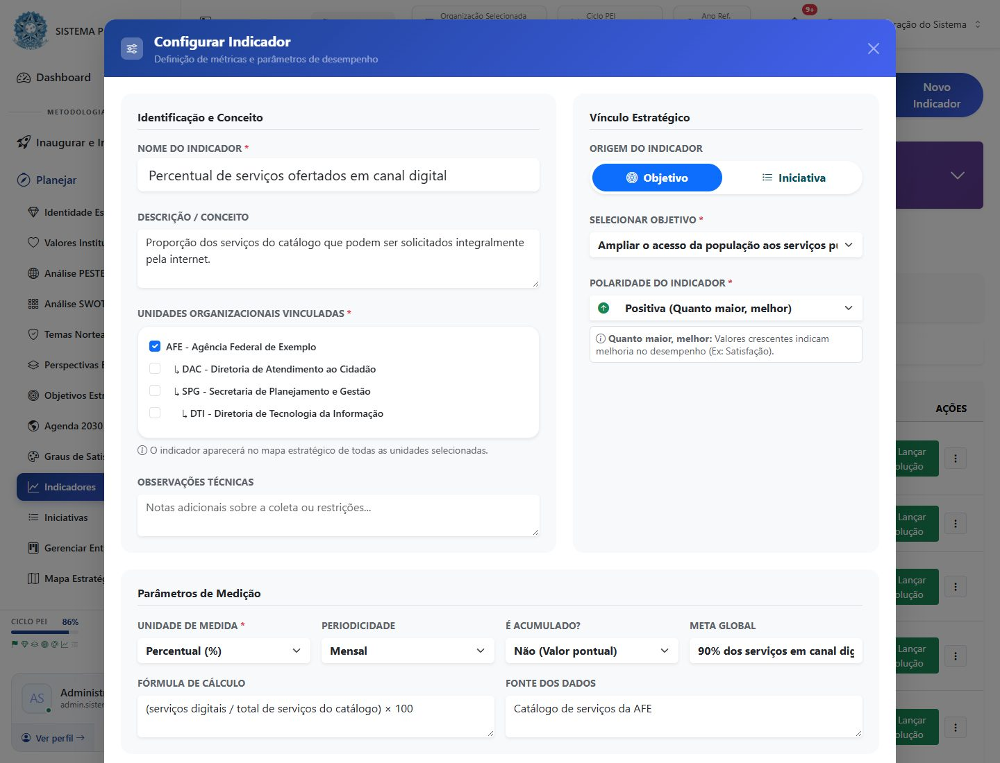
*Figura 55 — Formulário Configurar Indicador.*

O formulário tem quatro blocos:

- **Identificação e Conceito** (à esquerda): nome, descrição, unidades organizacionais vinculadas
  (lista em árvore com caixas de marcar; a nota abaixo avisa que *"O indicador aparecerá no mapa
  estratégico de todas as unidades selecionadas"*) e observações técnicas.
- **Vínculo Estratégico** (à direita): a **Origem do Indicador** — botões **Objetivo** e
  **Iniciativa** —, o seletor do objetivo (ou da iniciativa) e a **Polaridade do Indicador**, com uma
  explicação curta da polaridade escolhida logo abaixo. Na figura, a origem é Objetivo e a
  polaridade é Positiva (Quanto maior, melhor).
- **Parâmetros de Medição** (embaixo): unidade de medida, periodicidade, se é acumulado, meta global,
  fórmula e fonte dos dados.
- **Checklist SMART** (rolando a janela): cinco caixas para conferir se o indicador está bem
  formulado.

No título do formulário aparece **Novo Indicador** na criação e **Configurar Indicador** na edição.

#### 19.6.2 Campos do formulário

| Campo | Obrigatório | O que informar | Exemplo |
|---|---|---|---|
| **Nome do Indicador** | Sim | Nome curto e claro, até 255 caracteres. | Quantidade de serviços digitalizados no ano |
| **Descrição / Conceito** | Não | O que o indicador mede exatamente. | Número de serviços redesenhados e publicados em canal digital no ano. |
| **Unidades Organizacionais Vinculadas** | Sim (ao menos uma) | As unidades em cujo mapa o indicador aparece. Só aparecem as unidades do seu escopo. | DTI |
| **Observações Técnicas** | Não | Restrições de coleta, ressalvas. | Dados do portal só a partir de março. |
| **Origem do Indicador** | Sim | **Objetivo** (mede o objetivo estratégico) ou **Iniciativa** (mede uma iniciativa). | Objetivo |
| **Selecionar Objetivo** | Sim, se a origem for Objetivo | Objetivo do ciclo selecionado; a lista vem agrupada por perspectiva. | Transformar digitalmente os serviços e processos |
| **Selecionar Iniciativa** | Sim, se a origem for Iniciativa | Iniciativa das suas unidades no ciclo; a lista vem agrupada por objetivo. | Implantação do Portal Único de Serviços ao Cidadão |
| **Método de Cálculo** | Só aparece para origem Iniciativa | **Manual** (você lança os valores) ou **Automático** (o sistema calcula pelo andamento das entregas). | Automático |
| **Polaridade do Indicador** | Sim | Positiva, Negativa, Estabilidade ou Não Aplicável (ver 19.7). | Negativa |
| **Unidade de Medida** | Sim | Uma das unidades da lista (ver 19.8). Ela define a máscara dos campos de valor. | Quantidade (un) |
| **Periodicidade** | Não | Mensal, Bimestral, Trimestral, Semestral ou Anual. É informativa: o lançamento é sempre feito por mês. | Mensal |
| **É Acumulado?** | Não | **Sim (Soma mensal)** ou **Não (Valor pontual)** (ver 19.9). | Sim (Soma mensal) |
| **Meta Global** | Não | Texto livre que descreve a meta do ciclo. Não entra em conta: o cálculo usa as **metas anuais** (19.12). | 72 serviços digitalizados no ciclo |
| **Fórmula de Cálculo** | Não | Como o valor é calculado. | Contagem de serviços publicados no portal no ano |
| **Fonte dos Dados** | Não | De onde vem o número. | Portal de serviços |
| **Checklist SMART** | Não | Marque cada critério atendido: Específico, Mensurável, Atingível, Relevante, Temporal. | — |

#### 19.6.3 Regras e validações

- *"Selecione o Objetivo Estratégico vinculado a este indicador."* — a origem é Objetivo e nenhum
  objetivo foi escolhido.
- *"Escolha um objetivo do ciclo PEI selecionado."* — o objetivo não pertence ao ciclo do topo.
- *"Selecione a Iniciativa vinculada a este indicador."* — a origem é Iniciativa e nenhuma foi
  escolhida.
- *"Escolha uma unidade de medida da lista."* — unidade fora da lista.
- *"Esta unidade está fora do seu escopo de acesso."* — unidade vinculada que você não alcança.
- Indicador antigo com uma unidade que saiu da lista (por exemplo "Índice") abre a edição com essa
  unidade marcada como **(atual)**; ela pode ser mantida.
- Ao mudar a origem para Objetivo, o vínculo com a iniciativa é apagado e o método volta a Manual;
  ao mudar para Iniciativa, o vínculo com o objetivo é apagado.

> **Cuidado — método Automático.** No indicador automático, o atingimento é o progresso ponderado
> das entregas da iniciativa (ver 21.5). Ele não recebe lançamento manual: o botão **Lançar
> Evolução** some e, se a tela for aberta por endereço, o sistema recusa com *"Este indicador é
> calculado automaticamente pelo progresso das entregas da iniciativa e não recebe lançamento
> manual."*

### 19.7 Polaridade

A polaridade diz ao sistema como comparar o realizado com o previsto. A conta é feita assim:

| Polaridade | Quando usar | Como se calcula o atingimento | Exemplo |
|---|---|---|---|
| **Positiva (Quanto maior, melhor)** | Satisfação, serviços entregues | (Realizado ÷ Previsto) × 100 | Previsto 100, realizado 85 → 85% |
| **Negativa (Quanto menor, melhor)** | Tempo de espera, defeitos, absenteísmo | (Previsto ÷ Realizado) × 100 | Previsto 10 dias, realizado 8 → 125%; realizado 20 → 50% |
| **Estabilidade (Quanto mais próximo do alvo, melhor)** | Taxa de ocupação | 100% menos o desvio relativo, nunca abaixo de 0 | Alvo 100: realizado 100 → 100%; 150 ou 50 → 50% |
| **Não Aplicável (Informativo)** | Número de colaboradores | Não há julgamento: farol cinza e o indicador fica fora das médias | — |

Casos de meta zero: na polaridade Negativa, meta 0 é a mais ambiciosa (zero acidente). Quem alcança
zero recebe 100%; quem não alcança recebe 0%. Na Negativa, realizado zero também dá 100%.

### 19.8 Unidade de medida e máscaras de digitação

Os campos de valor (previsto, realizado, meta e linha de base) são campos de texto no formato
brasileiro: ponto separa milhar e vírgula separa decimais. A máscara se ajusta à unidade de medida
do indicador:

| Unidade | Casas decimais | Símbolo | Só inteiros? | Exemplo de digitação |
|---|---|---|---|---|
| Percentual (%) | 2 | % depois | Não | 87,50 |
| Monetário (R$) | 2 | R$ antes | Não | 20.000.000.000,00 |
| Índice (0-1) | 4 | — | Não | 0,8750 |
| Quantidade (un) | 0 | un | Sim | 1.250 |
| Horas (h) | 2 | h | Não | 37,50 |
| Dias | 0 | dias | Sim | 12 |
| Proporção | 4 | — | Não | 0,9300 |
| Taxa | 4 | — | Não | 0,0440 |
| Nº de Ocorrências | 0 | — | Sim | 3 |
| Kilômetros (km) | 2 | km | Não | 1.250,75 |
| Metros (m) | 2 | m | Não | 320,00 |
| Toneladas (t) | 3 | t | Não | 12,500 |
| Pontos | 2 | pts | Não | 72,00 |

Abaixo de cada campo de valor aparece uma dica, por exemplo *"Número inteiro. Ex.: 1.250"* ou
*"Em reais, com centavos. Ex.: 20.000.000.000,00"*. Mensagens de erro possíveis:

- *"Informe um número."* seguido da dica — o texto digitado não é número;
- *"Esta unidade aceita só números inteiros."* — fração numa unidade de contagem;
- *"Valor acima do máximo aceito (999.999.999.999.999,9999)."*

### 19.9 Acumulado, mês de referência e "Sem medição"

O atingimento do ano é calculado só com os meses **medidos**, isto é, os meses com valor realizado
lançado. O mês limite depende do ano de referência escolhido no topo:

- **ano que já passou** — considera até dezembro;
- **ano atual** — considera até o mês corrente;
- **ano futuro** — considera só janeiro.

Com esse recorte:

- **Acumulado = Sim (Soma mensal)** — soma o previsto e soma o realizado de todos os meses medidos e
  compara as somas. Use para quantidades que se juntam ao longo do ano (serviços entregues, pessoas
  capacitadas).
- **Acumulado = Não (Valor pontual)** — usa só o último mês medido. Use para retratos (taxa,
  índice, percentual de satisfação).

Quando o mês não tem **valor previsto**, o sistema usa a **meta anual** daquele ano (19.12): no
indicador acumulado, a meta dividida por 12 e multiplicada pelo número de meses medidos; no não
acumulado, a meta inteira.

**Sem medição** aparece quando nenhum mês do recorte tem realizado lançado, ou quando não há previsto
nem meta anual para comparar. Indicador sem medição não é 0% nem 100%: fica com farol cinza e **fora
das médias** do objetivo, da perspectiva e do IQG (ver capítulo 36). Um mês salvo com o realizado em
branco conta como "não medido", nunca como zero.

### 19.10 Lançar a evolução mensal

#### 19.10.1 Como chegar

Na lista de indicadores, botão verde **Lançar Evolução** da linha, ou **⋮ → Lançar Evolução**, ou
ainda o botão **Lançar Resultados** da ficha técnica. A figura mostra a tela do indicador "Percentual
de serviços ofertados em canal digital".

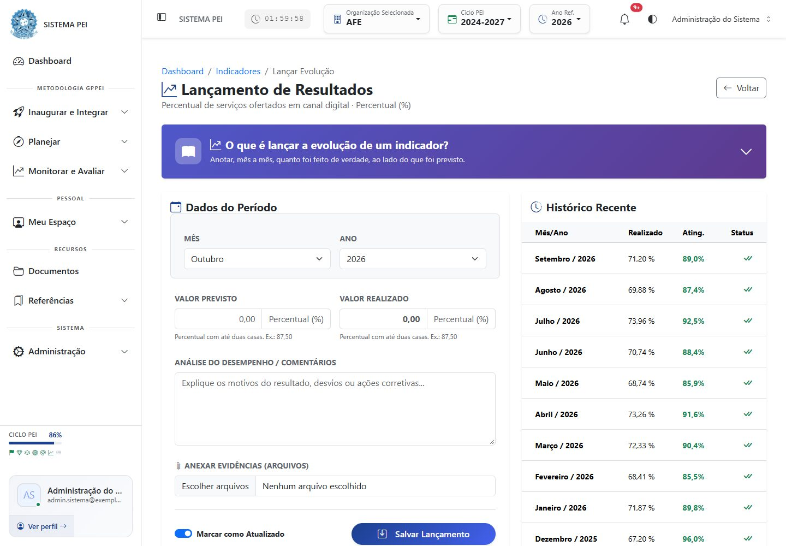
*Figura 56 — Lançamento de Resultados do indicador.*

O que aparece na tela:

- **Cabeçalho** — título *Lançamento de Resultados*, o nome do indicador e a unidade de medida, e o
  botão **Voltar**.
- **O que é lançar a evolução de um indicador?** — seção educativa com o passo a passo.
- **Dados do Período** (à esquerda) — os seletores **Mês** e **Ano**, os campos **Valor Previsto** e
  **Valor Realizado** (com a unidade de medida ao lado e a dica de digitação embaixo), o campo
  **Análise do Desempenho / Comentários**, o campo **Anexar Evidências (Arquivos)**, a chave
  **Marcar como Atualizado** e o botão **Salvar Lançamento**.
- **Histórico Recente** (à direita) — os últimos 12 lançamentos, do mais recente para o mais antigo,
  com as colunas **Mês/Ano**, **Realizado**, **Ating.** (atingimento do mês, colorido pela régua) e
  **Status** (dois tiques verdes = Atualizado; traço cinza = Pendente). Mês sem realizado mostra
  *Sem medição*; indicador informativo mostra *Informativo*.

Na figura, outubro de 2026 está selecionado e ainda sem lançamento (campos vazios, com a máscara
"0,00" e a dica *"Percentual com até duas casas. Ex.: 87,50"*). No histórico, setembro de 2026 tem
71,20% realizados e 89,0% de atingimento em verde; dezembro de 2025, 67,20% e 96,0%. Todos os meses
estão marcados como Atualizado.

#### 19.10.2 Passo a passo

1. Escolha o **Mês** e o **Ano**. O ano só oferece os anos do ciclo do indicador. Se o mês já tiver
   lançamento, os campos vêm preenchidos com o que foi gravado.
2. Informe o **Valor Previsto** (o que se esperava para o mês). Pode deixar em branco: nesse caso o
   sistema compara com a meta anual.
3. Informe o **Valor Realizado**, a partir de fonte confiável. Deixe em branco se o mês ainda não foi
   medido.
4. Escreva a **Análise do Desempenho**, sobretudo quando houver desvio (até 2.000 caracteres).
5. Se tiver comprovantes, use **Anexar Evidências** (pode selecionar vários arquivos de uma vez).
6. Deixe **Marcar como Atualizado** ligado quando o mês estiver fechado; desligue para indicar que o
   lançamento ainda está pendente de confirmação.
7. Clique em **Salvar Lançamento**. Aparece a faixa verde *"Lançamento realizado com sucesso!"* e o
   histórico à direita é atualizado.

Para corrigir um mês já lançado, selecione o mesmo mês e ano, altere os campos e salve de novo: o
lançamento daquele mês é substituído.

#### 19.10.3 Evidências (anexos)

- Formatos aceitos: PDF, DOC, DOCX, XLS, XLSX, PPT, PPTX, ODT, ODS, ODP, PNG, JPG, JPEG, GIF, TXT,
  CSV e ZIP.
- Tamanho máximo: **10 MB por arquivo**.
- Os arquivos ficam guardados em área restrita do servidor (sem link público).
- Depois de salvar, os arquivos aparecem em **Arquivos Enviados**: clique no nome para abrir ou
  baixar; o **x** vermelho exclui, após a confirmação *"Excluir a evidência … ? O arquivo será apagado
  do servidor."*

#### 19.10.4 Regras e validações

- *"Informe o previsto, o realizado, a análise ou uma evidência antes de salvar o mês."* — tentativa
  de salvar um mês novo completamente vazio.
- *"O ano precisa estar dentro do ciclo do PEI."* e *"Mês inválido."*
- As mesmas mensagens de valor da seção 19.8.

> **Dica — alerta de tendência.** Se, depois do lançamento, os três últimos valores mostrarem
> tendência desfavorável para a polaridade, o sistema cria um alerta *"Tendência Desfavorável:
> <nome do indicador>"* no sino (aba Alertas) de quem lançou. O alerta não se repete para o mesmo
> indicador enquanto houver um não lido das últimas 24 horas.

### 19.11 Sugestão de indicadores por IA

O botão **Sugerir Indicadores (KPIs) com IA** pede ao agente de IA configurado (capítulo 32) três
indicadores SMART alinhados aos objetivos do ciclo e à unidade selecionada. As sugestões aparecem num
cartão *KPIs Recomendados pelo Mentor IA*; ao clicar numa delas, o formulário de novo indicador abre
já preenchido com nome, descrição, unidade de medida e fórmula. Revise e complete antes de salvar —
a sugestão nunca é gravada sozinha. Sem provedor de IA configurado, a tela avisa *"Nenhum provedor de
IA configurado. Configure em Configurações do Sistema."*

### 19.12 Metas anuais

A meta anual é o valor que o indicador deve alcançar em cada ano do ciclo. Ela é usada como previsto
nos meses lançados sem previsto, aparece na ficha técnica e nos relatórios.

Abra pela lista: **⋮ → Gerenciar Metas**. A figura mostra as metas do indicador "Percentual de
serviços ofertados em canal digital".

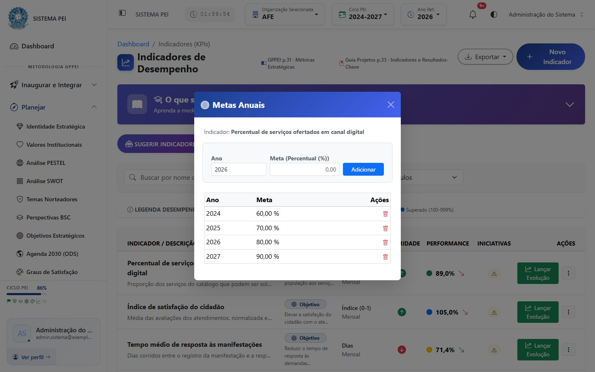
*Figura 57 — Janela Metas Anuais.*

Na janela aparecem o nome do indicador, a linha de inclusão (campos **Ano** e **Meta**, com a unidade
de medida entre parênteses, e o botão **Adicionar**) e a tabela das metas já cadastradas, com a
lixeira vermelha em cada linha. Na figura, as metas são 60,00% (2024), 70,00% (2025), 80,00% (2026) e
90,00% (2027); o campo de meta mostra a máscara "0,00" porque a unidade é Percentual (%).

Passo a passo:

1. Informe o **Ano** (entre 2000 e 2100; vem preenchido com o ano corrente).
2. Informe a **Meta**, com a máscara da unidade de medida (19.8).
3. Clique em **Adicionar**. Aparece *"Meta salva!"*.

Para **corrigir** a meta de um ano, informe o mesmo ano com o novo valor e clique em **Adicionar**: o
valor anterior é substituído. Para **excluir**, clique na lixeira e confirme *"Excluir a meta de …?
A exclusão não pode ser desfeita pela tela."*

### 19.13 Linha de base

A linha de base é o ponto de partida: o valor do indicador antes do ciclo (ou no ano anterior). Ela
serve de comparação na ficha técnica e nos relatórios.

Abra pela lista: **⋮ → Linha de Base**.

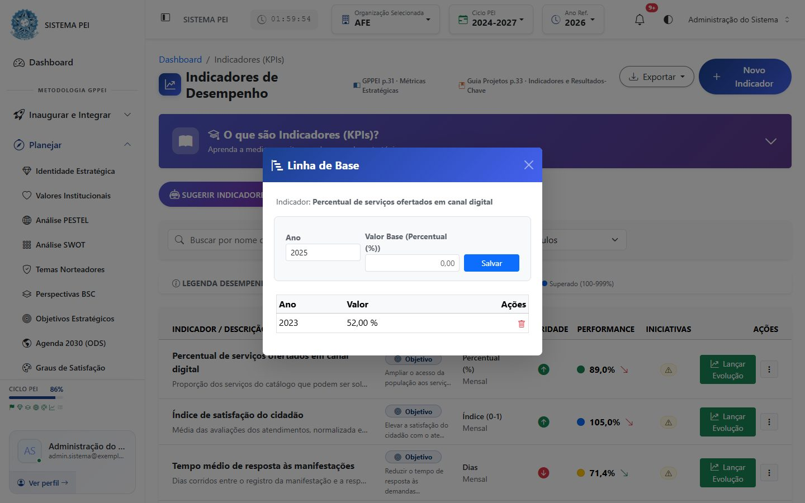
*Figura 58 — Janela Linha de Base.*

A janela funciona como a de metas: campos **Ano** (vem preenchido com o ano anterior ao corrente) e
**Valor Base** (com a unidade de medida), botão **Salvar** e a tabela com os valores já
registrados. Na figura, o ano vem preenchido com 2025 e há uma linha de base de 52,00% em 2023. Informar de novo um ano já cadastrado
substitui o valor; a lixeira exclui após a confirmação *"Excluir a linha de base de …? A exclusão
não pode ser desfeita pela tela."* Ao salvar, aparece *"Linha de base salva!"*.

### 19.14 Ficha técnica

A ficha técnica reúne tudo sobre o indicador numa só página. Abra pela lista: **⋮ → Ficha Técnica**.
A figura mostra a ficha do indicador "Percentual de serviços ofertados em canal digital" no ano 2026.

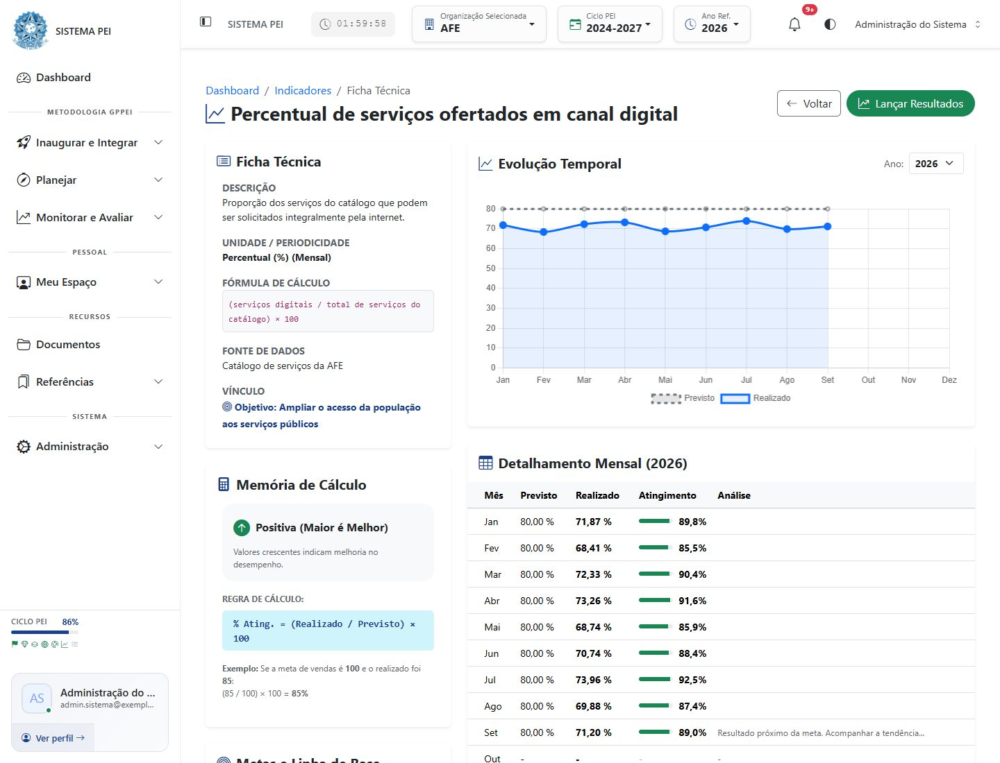
*Figura 59 — Ficha técnica do indicador.*

Na figura, a coluna da esquerda traz a ficha (descrição, "Percentual (%) (Mensal)", a fórmula
"(serviços digitais / total de serviços do catálogo) × 100", a fonte "Catálogo de serviços da AFE" e
o vínculo com o objetivo "Ampliar o acesso da população aos serviços públicos") e, abaixo, a Memória
de Cálculo da polaridade Positiva. À direita, o gráfico Evolução Temporal mostra o previsto (linha
pontilhada em 80) e o realizado (linha azul, entre 68 e 74) de janeiro a setembro; o Detalhamento
Mensal repete os números mês a mês — em setembro, previsto 80,00%, realizado 71,20%, atingimento
89,0% e a análise "Resultado próximo da meta. Acompanhar a tendência…". Outubro em diante aparece com
"-", porque ainda não foi lançado.

O que aparece na ficha:

- **Cabeçalho** — o nome do indicador, o botão **Voltar** e, para quem pode lançar (e só em
  indicador manual), o botão **Lançar Resultados**.
- **Ficha Técnica** — Descrição, Unidade / Periodicidade, Fórmula de Cálculo, Fonte de Dados e o
  Vínculo (Objetivo ou Iniciativa).
- **Memória de Cálculo** — a polaridade com o seu ícone e a regra de cálculo com um exemplo, como
  "% Ating. = (Realizado / Previsto) × 100".
- **Metas e Linha de Base** — tabela por ano com a linha de base e a meta; ano sem valor mostra "—".
- **Evolução Temporal** — gráfico de linhas com o previsto e o realizado de cada mês do ano escolhido
  no seletor **Ano** do cartão.
- **Detalhamento Mensal** — tabela de janeiro a dezembro do ano escolhido com Previsto, Realizado,
  Atingimento (barra colorida pela régua) e o início da Análise.

> **Cuidado.** Na polaridade **Estabilidade**, a Memória de Cálculo mostra a fórmula da polaridade
> positiva, mas o sistema calcula como descrito em 19.7 (100% menos o desvio). Vale a tabela da
> seção 19.7.

### 19.15 Excluir um indicador

1. Na lista, **⋮ → Excluir**.
2. Leia o aviso da janela *Excluir Indicador (KPI)*: o indicador deixa de aparecer em listas,
   painéis e relatórios; os lançamentos, as metas e a linha de base **não são apagados**, ficam
   preservados no banco (exclusão lógica).
3. Clique em **Excluir Agora**.

Não há como restaurar pela tela: peça ao suporte técnico se excluir por engano.

### 19.16 Perguntas frequentes

- **Lancei o mês, mas a lista continua "Sem medição".** Confira o ano de referência no topo e o mês
  limite (19.9): um lançamento de novembro não entra enquanto o ano corrente estiver em outubro. Confira
  também se há previsto no mês ou meta anual para o ano.
- **Por que o indicador de iniciativa não tem o botão Lançar Evolução?** Ele é automático: o valor
  vem das entregas. Para lançar à mão, edite e mude o **Método de Cálculo** para Manual.
- **Posso lançar um indicador anual?** Sim. O lançamento é sempre mensal: lance no mês em que o dado
  foi apurado (por exemplo, dezembro) e deixe os outros meses em branco.

---

## 20. Iniciativas

### 20.1 Para que serve

Iniciativa é o projeto ou ação que transforma um objetivo estratégico em resultado concreto. Cada
iniciativa pertence a um objetivo do ciclo, tem período de vigência, orçamento previsto, status e
gestores designados; é dentro dela que nascem as **entregas** (capítulo 21). O conjunto das
iniciativas forma a carteira do PEI (GPPEI, p. 32).

### 20.2 Como chegar

- Menu lateral **Planejar → Iniciativas**.
- A partir de um objetivo, os links "iniciativas" abrem a lista já filtrada por ele; nesse caso, o
  topo da tela mostra o contexto do objetivo e os cartões **Status das Iniciativas** (gráfico de rosca
  com Concluídos, Em Andamento, Não Iniciados e Atrasados) e **Resumo** (orçamento total previsto e
  entregas concluídas).

### 20.3 Quem pode

| Ação | Super Admin | Administrador da Unidade | Gestor(a) Responsável | Gestor(a) Substituto(a) | Consulta |
|---|---|---|---|---|---|
| Ver lista e detalhe | Sim | Sim | Sim | Sim | Sim |
| Criar iniciativa | Sim | Sim | Não | Não | Não |
| Editar a iniciativa | Sim | Sim | Só a sua | Só a sua | Não |
| Designar Gestor Responsável e Substituto | Sim | Sim | Não | Não | Não |
| Matriz RACI e Plano de Comunicação | Sim | Sim | Só na sua | Só na sua | Não |
| Excluir | Sim | Sim | Não | Não | Não |

"A sua" é a iniciativa em que a pessoa foi designada Gestor(a) Responsável ou Substituto(a) — o
papel é um vínculo com aquela iniciativa, não um crachá geral (ver capítulo 4). O Gestor não muda as
unidades da iniciativa: acrescentar, retirar ou trocar a unidade principal exige ser Administrador da
unidade.

### 20.4 A lista de iniciativas

A figura mostra a lista da AFE (com as subordinadas) no ciclo PEI 2024-2027, com o ano 2026 no
filtro. A primeira iniciativa, com término em 31/08/2026 já vencido, aparece como **Atrasado** e com a
data em vermelho.

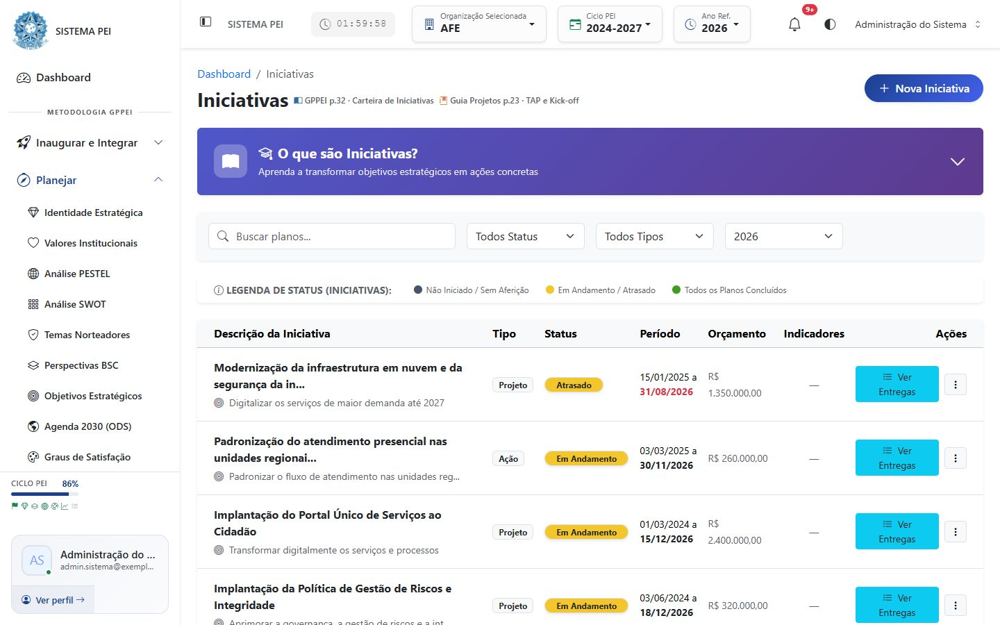
*Figura 60 — Lista de iniciativas com filtros e legenda de status.*

O que aparece na tela:

- **Cabeçalho** — título *Iniciativas*, atalhos de referência (GPPEI p. 32 · Carteira de
  Iniciativas; Guia de Projetos p. 23 · TAP e Kick-off) e o botão **Nova Iniciativa** (só para quem
  pode criar).
- **O que são Iniciativas?** — seção educativa.
- **Filtros** — **Buscar planos…** (pela descrição), **Todos Status**, **Todos Tipos** (Ação ou
  Projeto) e o **Ano**. O filtro de ano mostra as iniciativas **vigentes** naquele ano: uma iniciativa
  de 2025 a 2027 aparece em 2025, 2026 e 2027. Ao abrir a tela, o ano vem do seletor do topo.
- **Legenda de Status (Iniciativas)** — cinza = Não Iniciado / Sem Aferição; amarelo = Em Andamento /
  Atrasado; verde = Todos os Planos Concluídos.
- **Tabela**, dez por página, ordenada pelo término mais próximo:

| Coluna | O que mostra |
|---|---|
| **Descrição da Iniciativa** | Nome da iniciativa e, embaixo, o objetivo a que pertence. |
| **Tipo** | Projeto ou Ação. |
| **Status** | Selo colorido. Iniciativa com término vencido e não concluída aparece como **Atrasado**, qualquer que seja o status gravado. |
| **Período** | Início e término; o término fica em vermelho quando a iniciativa está atrasada. |
| **Orçamento** | Investimento previsto em reais. |
| **Indicadores** | Quantidade de indicadores associados (traço quando não há). |
| **Ações** | Botão **Ver Entregas** e menu **⋮**. |

O menu **⋮** (grupo *Gestão*) tem: **Detalhes**, **Entregas**, **Responsáveis** (quem pode editar),
**Editar** (quem pode editar) e **Excluir** (quem pode excluir).

Se nenhuma unidade estiver selecionada no topo, a tela mostra o aviso *Selecione uma Organização*.

### 20.5 Cadastrar ou editar uma iniciativa

#### 20.5.1 Passo a passo

1. Confira no topo a unidade e o ciclo.
2. Clique em **Nova Iniciativa** (para editar: **⋮ → Editar**).
3. Escolha o **Objetivo Estratégico Vinculado** e preencha a descrição.
4. (Opcional) Clique em **Gerar Ideias** no quadro *Assistente de Planejamento* para receber três
   sugestões da IA para o objetivo escolhido; clicar numa sugestão preenche a descrição e o
   detalhamento.
5. Marque as unidades, preencha a vigência, o orçamento e os demais campos.
6. Clique em **Salvar Plano**. Aparece a janela *Sucesso!*.

A figura mostra a edição da iniciativa "Modernização da infraestrutura em nuvem e da segurança da
informação".

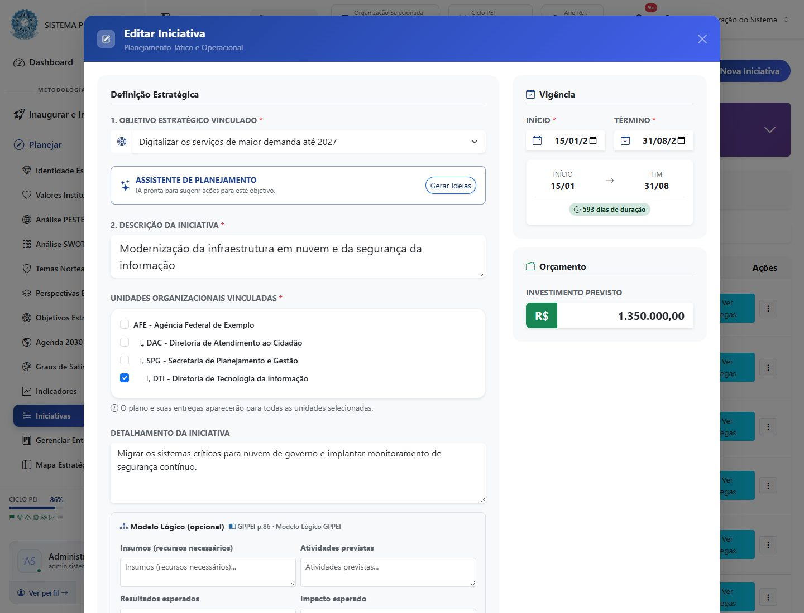
*Figura 61 — Formulário Editar Iniciativa.*

O formulário se divide em **Definição Estratégica** (à esquerda: objetivo, assistente de IA,
descrição, unidades, detalhamento, modelo lógico, tipo e status), **Vigência** (à direita: início,
término e um resumo com a duração em dias — 593 dias na figura) e **Orçamento** (investimento
previsto, com R$ fixo e máscara de centavos). Embaixo fica o bloco recolhível **Códigos
Orçamentários (PPA/LOA)**.

#### 20.5.2 Campos do formulário

| Campo | Obrigatório | O que informar | Exemplo |
|---|---|---|---|
| **1. Objetivo Estratégico Vinculado** | Sim | Objetivo do ciclo, agrupado por perspectiva. | Digitalizar os serviços de maior demanda até 2027 |
| **2. Descrição da Iniciativa** | Sim | O que será feito, até 255 caracteres. | Modernização da infraestrutura em nuvem e da segurança da informação |
| **Unidades Organizacionais Vinculadas** | Sim (ao menos uma) | Unidades em que a iniciativa e as entregas aparecem. | DTI |
| **Detalhamento da Iniciativa** | Não | Objetivos técnicos e resultados esperados. | Migrar os sistemas críticos para nuvem de governo… |
| **Modelo Lógico (opcional)** | Não | Insumos, Atividades previstas, Resultados esperados, Impacto esperado, Pressupostos / Riscos — até 5.000 caracteres cada (GPPEI p. 86). | — |
| **Tipo** | Sim | **Projeto** ou **Ação**. | Projeto |
| **Status** | Não | Não Iniciado, Em Andamento, Concluído, Atrasado, Suspenso ou Cancelado. | Em Andamento |
| **Início** | Sim | Data de início, não anterior a 1º de janeiro do primeiro ano do ciclo. | 15/01/2025 |
| **Término** | Sim | Data de término, não anterior ao início e não posterior a 31 de dezembro do último ano do ciclo. | 31/08/2026 |
| **Investimento Previsto** | Não | Valor em reais; digite só os números (os centavos entram automaticamente). | 1.350.000,00 |
| **Cód. PPA** / **Cód. LOA** | Não | Códigos do Plano Plurianual e da Lei Orçamentária, até 191 caracteres. | 2215 / 20TP |

A **unidade principal** da iniciativa (a que decide quem administra) é escolhida assim: na edição,
continua a já gravada enquanto ela estiver marcada; numa iniciativa nova, é a unidade do topo, se
marcada; senão, a primeira marcada.

#### 20.5.3 Regras e validações

- *"A descrição da iniciativa é obrigatória."*; *"Vincule a iniciativa a um objetivo estratégico."*;
  *"Defina o tipo de execução (Projeto, Atividade, etc)."*
- *"A data de início é obrigatória."*; *"A data de término é obrigatória."*; *"A data final não pode
  ser anterior à data inicial."*
- *"A data de início deve ser igual ou posterior ao início do PEI (…)."* e *"A data final deve ser
  igual ou anterior ao fim do PEI (…)."*
- Sem objetivo no ciclo, o botão **Nova Iniciativa** avisa *"Para criar Iniciativas é necessário ter
  ao menos 1 Objetivo Estratégico cadastrado."*
- Sem unidade no topo: *"Selecione uma organização no menu superior."*

> **Cuidado — prazo das entregas.** O prazo de toda entrega precisa ficar dentro do período da
> iniciativa (ver 21.7). Ao encurtar a vigência, confira as entregas já cadastradas.

### 20.6 Detalhe da iniciativa

Abra pela lista: **⋮ → Detalhes**. A tela se chama *Ficha Técnica da Iniciativa*; a figura mostra a
da iniciativa "Modernização da infraestrutura em nuvem e da segurança da informação".

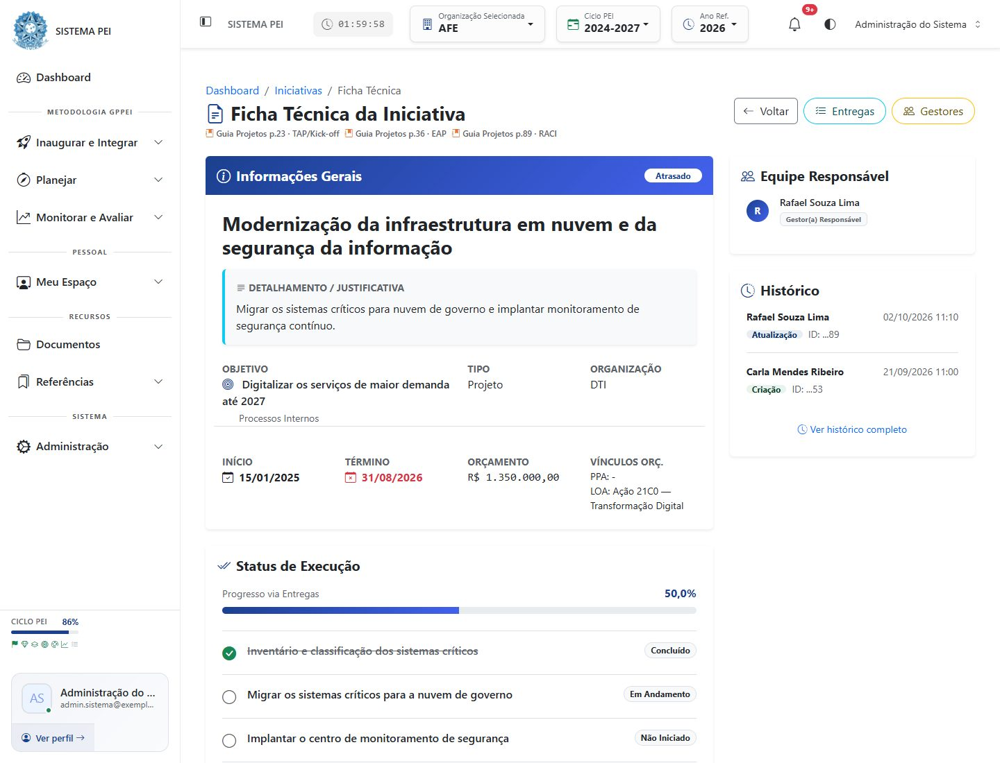
*Figura 62 — Ficha Técnica da Iniciativa.*

Na figura, o cartão **Informações Gerais** traz o selo **Atrasado**, o detalhamento, o objetivo
"Digitalizar os serviços de maior demanda até 2027" (perspectiva Processos Internos), o tipo Projeto,
a organização DTI, o início 15/01/2025, o término 31/08/2026 em vermelho, o orçamento de
R$ 1.350.000,00 e o código da LOA. O **Status de Execução** mostra 50,0% de progresso e as entregas
com o status de cada uma. À direita, a **Equipe Responsável** lista Rafael Souza Lima como Gestor(a)
Responsável, e o **Histórico** mostra a criação por Carla Mendes Ribeiro e uma atualização por Rafael
Souza Lima, com o link **Ver histórico completo**.

O que aparece:

- **Cabeçalho** — título *Ficha Técnica da Iniciativa*, atalhos para o Guia de Projetos (TAP/Kick-off, EAP, RACI) e os
  botões **Voltar**, **Entregas** e **Gestores** (este, para quem pode editar).
- **Informações Gerais** — status, descrição, detalhamento/justificativa, objetivo (com a
  perspectiva), tipo, organização, início, término (em vermelho se atrasada), orçamento e vínculos
  orçamentários (PPA e LOA).
- **Status de Execução** — o **Progresso via Entregas** (a mesma conta do quadro de entregas, ver
  21.5) e a lista das entregas com o status de cada uma.
- **Equipe Responsável** — primeiro os gestores designados (com o perfil), depois quem responde por
  alguma entrega ("Responsável por entrega").
- **Histórico** — as últimas cinco alterações da iniciativa (autor, data e tipo: Criação,
  Atualização…), com o link **Ver histórico completo** para a Auditoria. Só aparece para quem tem
  acesso à Auditoria (Super Admin).
- **Modelo Lógico**, **Matriz RACI**, **Plano de Comunicação** e **Lições Aprendidas** da iniciativa,
  quando preenchidos.

### 20.7 Gestores, Matriz RACI e Plano de Comunicação

Abra pela lista (**⋮ → Responsáveis**) ou pelo botão **Gestores** do detalhe. A figura mostra a tela
da iniciativa "Modernização da infraestrutura em nuvem e da segurança da informação", com Rafael
Souza Lima como Gestor Responsável.

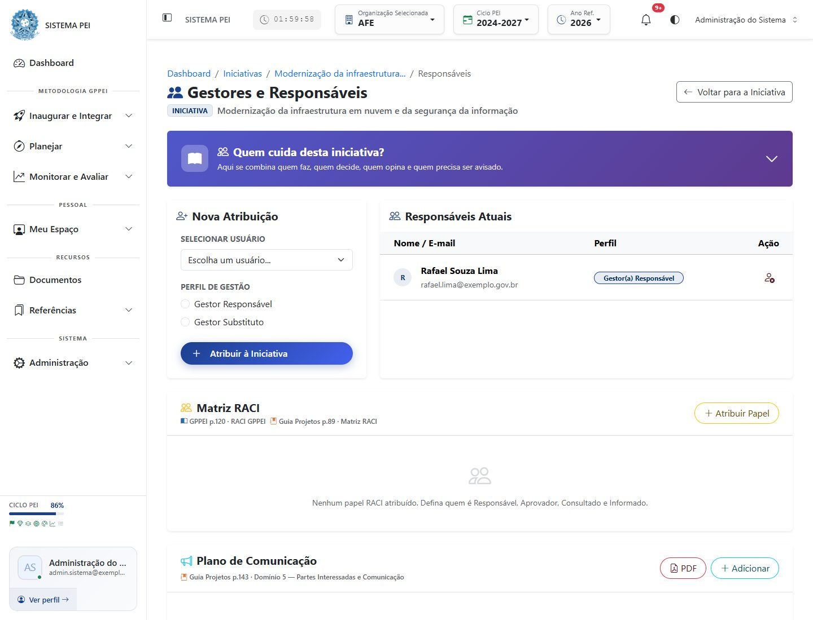
*Figura 63 — Gestores e Responsáveis da iniciativa.*

A tela tem quatro partes:

- **Nova Atribuição** — o seletor **Selecionar Usuário** (pessoas da unidade da iniciativa, exceto
  você mesmo), a escolha **Perfil de Gestão** (**Gestor Responsável** ou **Gestor Substituto**) e o
  botão **Atribuir à Iniciativa**. Quem não é Administrador da unidade vê, no lugar, o aviso *"Somente
  o Administrador da unidade da iniciativa designa o Gestor Responsável e o Substituto."*
- **Responsáveis Atuais** — nome, e-mail e perfil de cada gestor, com o ícone de remover (só para o
  Administrador), que pede a confirmação *"Remover … da gestão desta iniciativa?"*.
- **Matriz RACI** — quem é **R** (Responsável — executa), **A** (Aprovador — accountability),
  **C** (Consultado — contribui) e **I** (Informado — recebe resultado), na iniciativa inteira ou numa
  entrega. Botão **Atribuir Papel**.
- **Plano de Comunicação** — o que comunicar, a quem, por qual canal e com que frequência. Botões
  **PDF** (relatório consolidado de comunicação do ciclo) e **Adicionar**.

#### 20.7.1 Designar um gestor

1. Em **Nova Atribuição**, escolha a pessoa em **Selecionar Usuário**.
2. Marque **Gestor Responsável** ou **Gestor Substituto**.
3. Clique em **Atribuir à Iniciativa**. Aparece *"Responsável atribuído com sucesso!"*.

Regras: cada pessoa tem **um** papel de gestão por iniciativa. Se ela já tiver um, o sistema avisa
*"Esta pessoa já é Gestor(a) Responsável desta iniciativa. Para trocar o papel, remova o atual
primeiro."* Ninguém designa a si mesmo: *"Escolha um usuário da unidade da iniciativa (e não você
mesmo)."*

#### 20.7.2 Atribuir um papel RACI

1. Clique em **Atribuir Papel**.
2. Preencha **Usuário** (pessoas da unidade da iniciativa), **Papel** (R, A, C ou I) e, se quiser,
   **Entrega (opcional)** — deixe *Iniciativa inteira* para o papel valer na iniciativa toda.
3. Salve. Aparece *"Papel RACI salvo."* Cada papel pode ser editado (lápis) ou excluído (x, com a
   confirmação *"Excluir este papel RACI?"*).

#### 20.7.3 Incluir um item no Plano de Comunicação

| Campo | Obrigatório | O que informar | Exemplo |
|---|---|---|---|
| **Público-Alvo** | Sim | A quem se comunica (até 150 caracteres). | Comitê de Governança Digital |
| **Responsável pela Comunicação** | Não | Nome de quem comunica (até 100). | Juliana Alves Costa |
| **Mensagem-Chave** | Sim | O que se comunica (até 500). | Andamento da migração para a nuvem |
| **Canal** | Sim | E-mail, Reunião presencial, Videoconferência, Relatório, Apresentação, Mensagem instantânea, Portal/Intranet, Ofício ou Outro. | Videoconferência |
| **Frequência** | Sim | Semanal, Quinzenal, Mensal, Bimestral, Trimestral, Sob demanda ou Única vez. | Mensal |

Clique em **Adicionar**, preencha e salve: *"Item de comunicação salvo."* A tabela mostra Público-Alvo,
Mensagem-Chave, Canal, Frequência e Responsável, com lápis (editar) e lixeira (excluir, com a
confirmação *"Excluir este item do plano de comunicação?"*).

### 20.8 Excluir uma iniciativa

1. Na lista, **⋮ → Excluir**.
2. A janela *Excluir Iniciativa* informa exatamente o que vai junto: o número de **entregas** (com os
   comentários e anexos delas), de **indicadores** da iniciativa e de **vínculos de Gestor** (as
   pessoas deixam de ser gestoras desta iniciativa).
3. Clique em **Excluir Agora**.

Tudo sai das telas; os registros ficam guardados no banco (exclusão lógica) e só o suporte técnico
consegue recuperá-los.

---

## 21. Entregas

### 21.1 Para que serve

Entrega é o produto concreto que a iniciativa precisa produzir: um sistema implantado, um curso
realizado, um normativo publicado. **Toda entrega pertence a uma iniciativa** — não existe entrega
solta. O andamento das entregas gera o **Progresso Consolidado** da iniciativa e, nos indicadores
automáticos, o próprio atingimento.

### 21.2 Como chegar

- Menu lateral **Planejar → Gerenciar Entregas** — abre primeiro a escolha da iniciativa (21.4).
- Na lista de Iniciativas, botão **Ver Entregas** (ou **⋮ → Entregas**) — abre direto o quadro da
  iniciativa.
- Em **Minhas Entregas**, botão **Ver iniciativa** ou o ícone de abrir de cada entrega.

### 21.3 Quem pode

| Ação | Super Admin | Administrador da Unidade | Gestor(a) Responsável | Gestor(a) Substituto(a) | Consulta |
|---|---|---|---|---|---|
| Ver o quadro e os detalhes | Sim | Sim | Sim | Sim | Sim |
| Criar, editar, mudar status, arrastar, comentar, anexar, arquivar | Sim | Sim | Na sua iniciativa | Na sua iniciativa | Não |
| Mandar para a lixeira, restaurar e excluir definitivamente | Sim | Sim | Na sua iniciativa | Não | Não |

Quem só consulta vê o quadro sem os controles de alteração.

### 21.4 Escolher a iniciativa

Pelo menu **Gerenciar Entregas**, a primeira tela pede a iniciativa — o sistema nunca escolhe uma
sozinho. A figura mostra a escolha com a AFE selecionada no topo.

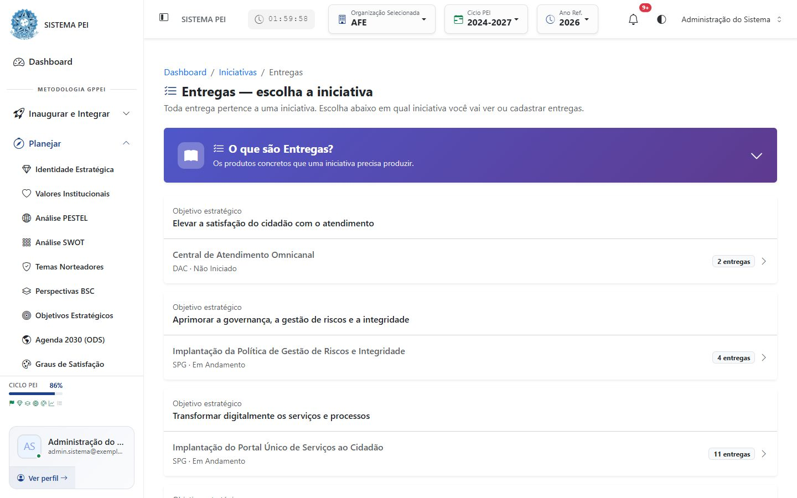
*Figura 64 — Entregas: escolha a iniciativa.*

A tela lista as iniciativas do ciclo selecionado, da unidade do topo e das subordinadas que você pode
ver, agrupadas por **Objetivo estratégico**. Cada linha mostra o nome da iniciativa, a sigla da
unidade, o status e a quantidade de entregas (por exemplo, "11 entregas"). Clique na linha para abrir
o quadro de entregas daquela iniciativa.

### 21.5 O quadro de entregas e o Progresso Consolidado

Ao abrir uma iniciativa, aparece o quadro. A parte de cima é a mesma nas quatro visões:

- **Cabeçalho** — o nome da iniciativa, a unidade e o botão **Nova Entrega nesta iniciativa** (só
  para quem pode criar).
- **O que são Entregas?** — seção educativa.
- **Barra de ferramentas**:
  - as visões **Kanban**, **Lista**, **Calendário** e **Gantt**;
  - a navegação estratégica: perspectiva → objetivo → iniciativa. Trocar a iniciativa no terceiro
    seletor abre o quadro dela;
  - os filtros **Buscar…** (pelo título), **Todos os Status**, **Todas Prioridades** e **Todos
    Responsáveis**;
  - o menu **⋯** com **Mostrar Arquivados**, **Mostrar Lixeira** e **Limpar Filtros**.
- **Progresso Consolidado** — percentual e barra de progresso da iniciativa.

**Como o Progresso Consolidado é calculado.** Cada entrega vale conforme o status:

| Status | Valor no progresso |
|---|---|
| Concluído | 100% |
| Em Andamento | 50% |
| Suspenso | 25% |
| Não Iniciado | 0% |
| Cancelado | Fica fora da conta |

O progresso é a média desses valores entre as entregas ativas (as arquivadas e as da lixeira não
entram). Se as entregas tiverem pesos, a média é ponderada pelo peso. Exemplo: 4 entregas, sendo 2
concluídas, 1 em andamento e 1 não iniciada → (100 + 100 + 50 + 0) ÷ 4 = 62,5%.

### 21.6 As quatro visões

#### 21.6.1 Kanban

A figura mostra a iniciativa "Implantação do Portal Único de Serviços ao Cidadão" na visão Kanban.

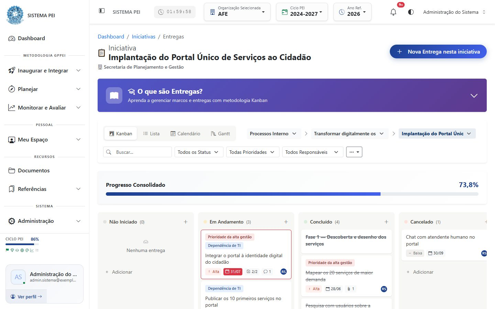
*Figura 65 — Entregas na visão Kanban.*

- Há uma coluna para cada status — **Não Iniciado**, **Em Andamento**, **Concluído**, **Cancelado** e
  **Suspenso** (esta última à direita; role a tela para o lado) — com a contagem entre parênteses.
- **Arraste** um cartão para outra coluna para mudar o status; arraste dentro da coluna para mudar a
  ordem. A mudança é gravada na hora e o progresso é recalculado.
- O **+** no topo da coluna e o **Adicionar** no pé abrem a criação rápida já com o status da coluna.
- Cada **cartão** mostra as etiquetas (labels) coloridas, o título (riscado quando concluído), a
  prioridade, o prazo (em vermelho quando a entrega está atrasada), a contagem de subentregas
  (ex.: 2/2), de comentários e de anexos, e as iniciais dos responsáveis. Entrega atrasada ganha
  borda vermelha. Clique no cartão para abrir o detalhe (21.8).

Uma entrega está **atrasada** quando o prazo é anterior a hoje e o status não é Concluído, Cancelado
nem Suspenso. O prazo de hoje ainda não é atraso.

#### 21.6.2 Lista

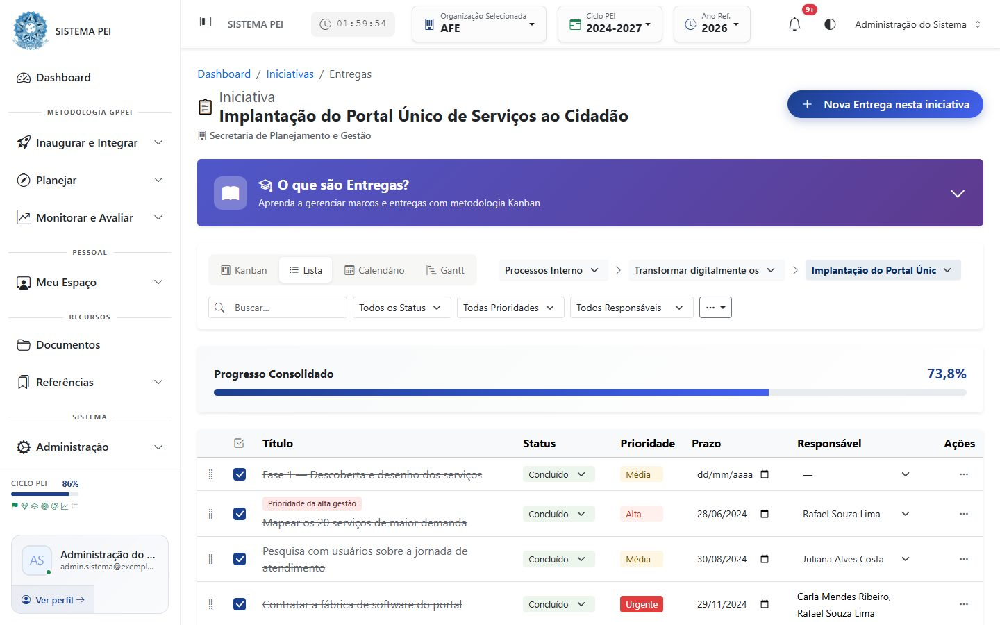
*Figura 66 — Entregas na visão Lista.*

A Lista é uma planilha editável. Colunas:

- alça **⋮⋮** para arrastar e reordenar;
- caixa de marcar — marca a entrega como **Concluído** (ou a devolve para **Em Andamento**);
- **Título** (com as etiquetas acima) — clique para abrir o detalhe;
- **Status** e **Prioridade** — escolha direto na linha;
- **Prazo** — data editável na linha (deve ficar dentro do período da iniciativa);
- **Responsável** — escolha na linha;
- **Ações** (**⋯**) — **Editar**, **Ver Detalhes**, **Arquivar**/**Desarquivar**, **Excluir**; na
  lixeira, **Restaurar** e **Excluir definitivamente**.

Na figura, as quatro primeiras entregas estão concluídas (marcadas e riscadas); a primeira não tem
prazo ("dd/mm/aaaa").

#### 21.6.3 Calendário

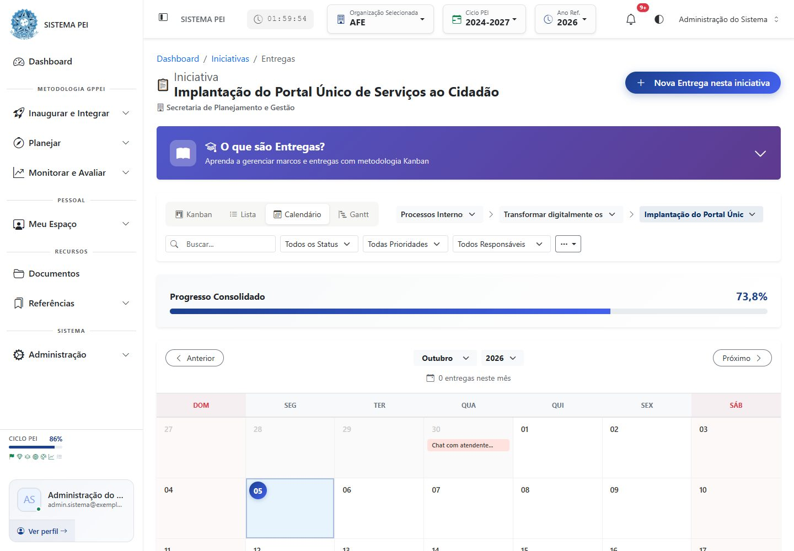
*Figura 67 — Entregas na visão Calendário.*

- Navegação: **Anterior**, **Próximo**, os seletores de **mês** e **ano**, e o botão **Hoje** (aparece
  quando outro mês está aberto). Abaixo, a contagem "N entregas neste mês".
- Cada entrega aparece no dia do seu prazo, com a cor do status; passe o mouse para ver título e
  status, clique para abrir o detalhe. O dia de hoje fica destacado.
- **Clique num dia vazio** para criar uma entrega já com aquele prazo.
- Abaixo do calendário ficam as **Entregas sem prazo definido**.

Na figura (outubro de 2026), a entrega "Chat com atendente…" aparece em 30 de setembro, dia do mês
anterior mostrado na primeira semana.

#### 21.6.4 Gantt (linha do tempo)

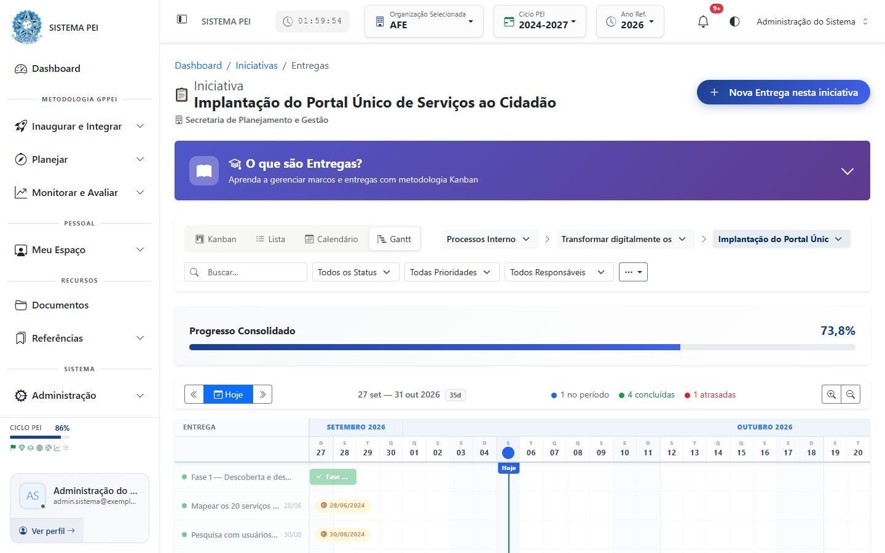
*Figura 68 — Entregas na visão Gantt.*

- Navegação: **«** e **»** (período anterior e seguinte) e **Hoje**. O período inicial vai de uma
  semana atrás a três semanas à frente (cerca de 35 dias, indicado ao lado das datas).
- Os botões de **lupa** aproximam e afastam a escala (de 7 a 120 dias).
- O resumo mostra quantas entregas estão **no período**, quantas estão **concluídas** e quantas
  **atrasadas**.
- Cada linha é uma entrega; a linha azul vertical marca **Hoje**. Entregas com prazo fora do período
  aparecem como uma etiqueta com a data (na figura, 28/06/2024 e 30/08/2024).
- As entregas sem prazo não entram no Gantt; aparecem embaixo, em "N entrega(s) sem prazo — não
  exibidas no Gantt".

### 21.7 Criar e editar uma entrega

Há duas formas de criar:

- **Criação rápida** — pelo **+**/**Adicionar** de uma coluna do Kanban ou clicando num dia do
  Calendário. Digite o título (*"Digite o título da entrega…"*) e confirme. A entrega nasce com o
  status da coluna (ou o prazo do dia clicado), prioridade Média e tipo Tarefa.
- **Formulário completo** — pelo botão **Nova Entrega nesta iniciativa**, ou para editar, pelo lápis
  do detalhe ou **⋯ → Editar** da Lista.

A figura mostra o formulário completo na edição da entrega "Integrar o portal à identidade digital
do cidadão".

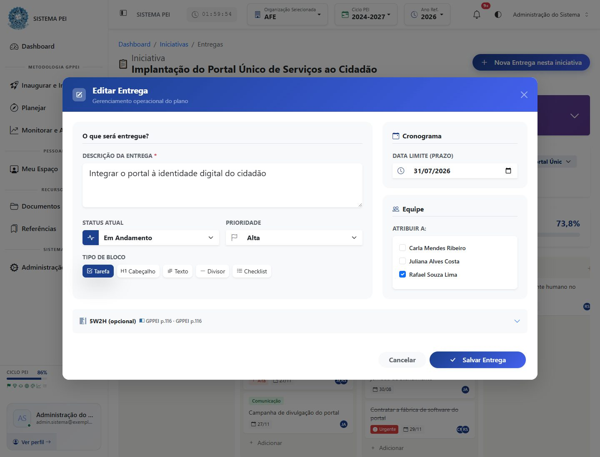
*Figura 69 — Formulário Editar Entrega.*

| Campo | Obrigatório | O que informar | Exemplo |
|---|---|---|---|
| **Descrição da Entrega** | Sim | O produto ou marco, de 3 a 500 caracteres. | Integrar o portal à identidade digital do cidadão |
| **Status Atual** | Sim | Não Iniciado, Em Andamento, Concluído, Cancelado ou Suspenso. | Em Andamento |
| **Prioridade** | Sim | Baixa, Média, Alta ou Urgente. | Alta |
| **Tipo de Bloco** | Sim | **Tarefa** (padrão), **Cabeçalho**, **Texto**, **Divisor** ou **Checklist** — define como o item aparece. | Tarefa |
| **Data Limite (Prazo)** | Não | Data dentro do período da iniciativa. | 31/07/2026 |
| **Atribuir a** (Equipe) | Não | Marque uma ou mais pessoas das unidades da iniciativa. | Rafael Souza Lima |
| **5W2H (opcional)** | Não | Abra o bloco e preencha O quê, Por quê, Quem, Onde, Quando, Como e Quanto custa — até 1.000 caracteres cada (GPPEI p. 116). | O quê: integração do login do portal à identidade digital do governo |

Clique em **Salvar Entrega**. Aparece *Entrega Registrada!* (ou *Entrega Atualizada!*).

Regras e validações:

- *"O prazo precisa estar dentro do período da iniciativa (dd/mm/aaaa a dd/mm/aaaa)."* — vale no
  formulário, na criação rápida, na Lista e no detalhe.
- *"O título precisa ter entre 3 e 500 caracteres."*
- Responsável fora das unidades da iniciativa é recusado.
- *"Cada campo do 5W2H aceita até 1.000 caracteres."* Limpar os sete campos apaga o 5W2H.

### 21.8 Detalhe da entrega: comentários, anexos e histórico

Clique em qualquer cartão ou título para abrir o painel lateral de detalhe.

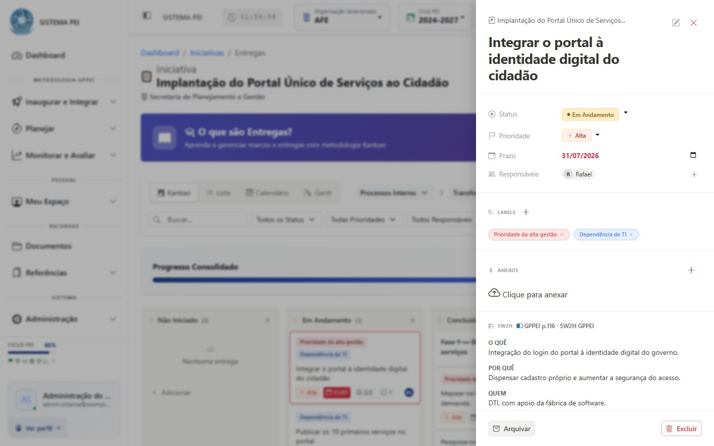
*Figura 70 — Painel de detalhe da entrega.*

De cima para baixo:

- **Cabeçalho** — o nome da iniciativa, o título da entrega, o lápis (abre o formulário completo) e o
  **x** (fecha).
- **Status**, **Prioridade**, **Prazo** e **Responsáveis** — alteráveis ali mesmo: clique na seta do
  status ou da prioridade, no calendário do prazo ou no **+** dos responsáveis (*Atribuir Pessoas*).
  Na figura, o prazo 31/07/2026 está em vermelho porque a entrega está atrasada.
- **Labels** — etiquetas coloridas da entrega. O **+** abre a janela *Labels*, onde se marca ou
  desmarca uma etiqueta da iniciativa ou se cria uma nova (nome de até 50 caracteres e cor). O **x**
  de cada etiqueta a remove da entrega.
- **Anexos** — clique em **Clique para anexar** (ou no **+**) para enviar arquivos; cada anexo pode
  ser baixado ou excluído (confirmação *"Excluir este anexo permanentemente?"* — o arquivo é apagado
  do servidor).
- **5W2H** — as respostas preenchidas no formulário.
- **Comentários** — escreva em *Adicionar comentário…* e clique em **Enviar**. Cada comentário tem
  **Responder** (até três níveis de conversa) e, no comentário que é seu e ainda não tem respostas,
  **Excluir** (confirmação *"Excluir este comentário?"*). Comentário com respostas não pode ser
  excluído: *"Este comentário já tem respostas e por isso não pode ser excluído."*
- **Histórico** — as últimas oito alterações da entrega, com o autor e há quanto tempo.
- **Rodapé** — **Arquivar** (ou **Desarquivar**) e **Excluir**. Na lixeira, o rodapé mostra
  **Restaurar** e **Excluir definitivamente**.

**Anexos — formatos e limite.** São aceitos PDF, DOC, DOCX, XLS, XLSX, PPT, PPTX, ODT, ODS, ODP,
PNG, JPG, JPEG, GIF, TXT, CSV e ZIP, com até **10 MB por arquivo**. Ao final aparece *"Arquivo(s)
anexado(s) com sucesso!"*. Os arquivos ficam em área restrita e só são baixados por quem tem acesso à
iniciativa.

### 21.9 Arquivar, lixeira, restaurar e excluir definitivamente

O sistema tem três formas de tirar uma entrega da frente — e elas são diferentes:

| Ação | O que acontece | Conta no progresso? | Como desfazer |
|---|---|---|---|
| **Arquivar** | A entrega sai da visão normal, mas continua inteira. | Não | **⋯ → Mostrar Arquivados** e **Desarquivar**. |
| **Excluir** (para a lixeira) | A entrega vai para a lixeira. | Não | **⋯ → Mostrar Lixeira** e **Restaurar**. |
| **Excluir definitivamente** | Apaga a entrega, os comentários, o histórico e os arquivos anexados. | — | **Não pode ser desfeito.** |

A figura mostra a lixeira aberta.

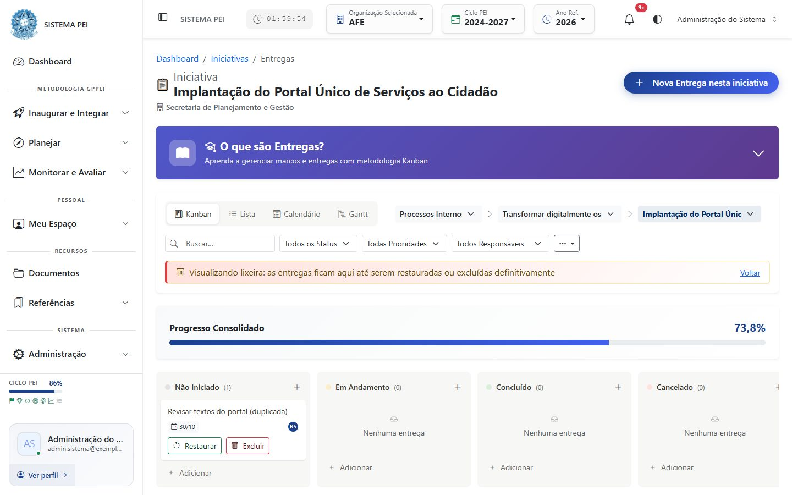
*Figura 71 — Lixeira de entregas.*

Com a lixeira aberta, a faixa *"Visualizando lixeira: as entregas ficam aqui até serem restauradas
ou excluídas definitivamente"* aparece acima do progresso, com o link **Voltar**. Cada cartão da
lixeira traz os botões **Restaurar** e **Excluir**; este último faz a exclusão definitiva, depois da
janela *Excluir Permanentemente* (*"Atenção: a entrega, os comentários, o histórico e os arquivos
anexados serão apagados definitivamente."*). A lixeira não se esvazia sozinha.

Passo a passo para excluir:

1. No detalhe (rodapé **Excluir**) ou na Lista (**⋯ → Excluir**), clique em excluir.
2. A janela *Excluir Entrega* avisa: *"Ela vai para a lixeira, de onde pode ser restaurada."*
3. Confirme. Aparece *"A entrega foi movida para a lixeira, de onde pode ser restaurada."*

> **Cuidado.** O Gestor(a) Substituto(a) arquiva, mas não manda para a lixeira, não restaura e não
> exclui definitivamente — essas ações são do Gestor Responsável e do Administrador.

---

## 22. Minhas Entregas

### 22.1 Para que serve

É a sua fila de trabalho: todas as entregas em que **você** é responsável, de todas as iniciativas,
agrupadas por iniciativa e ordenadas pelo prazo. Serve para não perder prazo sem precisar abrir
iniciativa por iniciativa.

### 22.2 Como chegar e quem pode

Menu lateral **Meu Espaço → Minhas Entregas**. Todos os perfis com acesso ao módulo de entregas
(Administrador, Gestores e Consulta) veem a tela; ela mostra apenas as entregas atribuídas à pessoa
logada, no ciclo selecionado no topo.

### 22.3 O que aparece na tela

A figura mostra a tela de Rafael Souza Lima (Gestor Responsável), aberta pelo Administrador com a
função de assumir identidade — por isso a faixa laranja *Modo Impersonação Ativo* no topo (ver
capítulo 31).

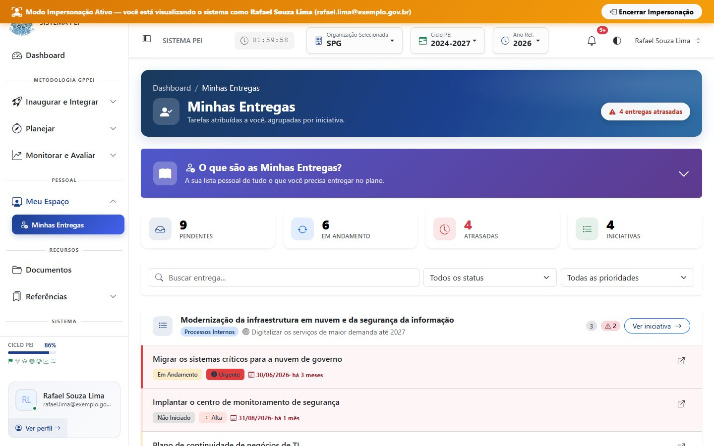
*Figura 72 — Minhas Entregas.*

- **Cabeçalho** — título, subtítulo *"Tarefas atribuídas a você, agrupadas por iniciativa."* e, se
  houver, o aviso em vermelho com o número de entregas atrasadas ("4 entregas atrasadas").
- **O que são as Minhas Entregas?** — seção educativa.
- **Quatro contadores**: **Pendentes** (entregas listadas que não estão concluídas), **Em andamento**,
  **Atrasadas** e **Iniciativas** (quantas iniciativas aparecem).
- **Filtros**: **Buscar entrega…**, **Todos os status** e **Todas as prioridades**.
- **Um cartão por iniciativa** — nome da iniciativa, a perspectiva (selo azul), o objetivo, a
  quantidade de entregas, a quantidade de atrasadas (selo vermelho) e o botão **Ver iniciativa**.
- **Cada entrega** — título, status, prioridade (a barra colorida à esquerda segue a cor da
  prioridade), prazo com a distância em relação a hoje ("há 3 meses", "em 15 dias") e o ícone de
  abrir no quadro da iniciativa. Entrega atrasada fica com fundo rosado e prazo em vermelho.

### 22.4 Regras

- Sem filtro de status, as entregas **concluídas não aparecem**: a tela é a fila do que falta. Para
  vê-las, escolha **Concluído** no filtro de status.
- Entregas arquivadas não aparecem.
- Sem entregas pendentes, a tela mostra *Tudo em dia!*; se houver filtro aplicado, aparece o botão
  **Limpar filtros**.
- Para mudar status, prazo ou comentar, abra a entrega no quadro da iniciativa (capítulo 21).

---

## 23. Gestão de Riscos

### 23.1 Para que serve

Risco é um evento que **pode** acontecer e atrapalhar um objetivo. A gestão de riscos identifica
esses eventos, avalia a probabilidade e o impacto de cada um, define a resposta (mitigar, evitar,
transferir ou aceitar), planeja as ações de mitigação e registra as ocorrências quando o risco se
materializa (GPPEI, p. 93–96; ISO 31000).

### 23.2 Como chegar

- Menu lateral **Monitorar e Avaliar → Gestão de Riscos**.
- A matriz: botão **Ver Matriz** da lista.
- Mitigação e ocorrências: menu **⋮** de cada risco.

### 23.3 Quem pode

| Ação | Super Admin | Administrador da Unidade | Gestor(a) Responsável | Gestor(a) Substituto(a) | Consulta |
|---|---|---|---|---|---|
| Ver lista, matriz, mitigações e ocorrências | Sim | Sim | Sim | Sim | Sim |
| Identificar (criar) risco | Sim | Sim | Sim | Não | Não |
| Editar o risco, incluir mitigações e ocorrências | Sim | Sim | Se for o responsável pelo monitoramento do risco | Se for o responsável pelo monitoramento do risco | Não |
| Excluir risco | Sim | Sim | Não | Não | Não |

### 23.4 Pré-requisito

Recomenda-se ter ao menos um objetivo no ciclo: o risco é vinculado aos objetivos que ameaça. Risco
sem objetivo vinculado não aparece no mapa estratégico nem nos relatórios do PEI.

### 23.5 A lista de riscos

A figura mostra a lista da AFE (com as subordinadas) no ciclo PEI 2024-2027. O primeiro risco, R-001
"Restrição orçamentária para os projetos estratégicos", tem P 4 × I 5 = 20 e nível Crítico; o R-006 e
o R-002 trazem o selo vermelho **Revisão vencida**.

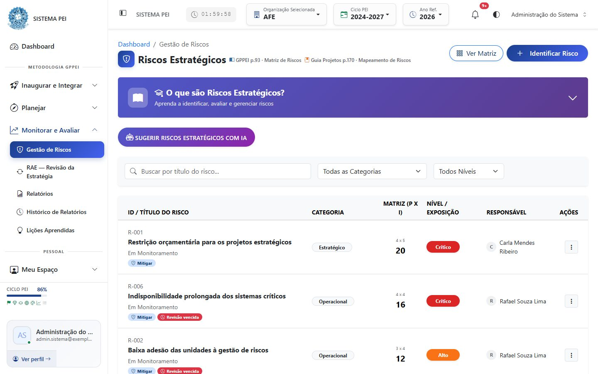
*Figura 73 — Lista de riscos estratégicos.*

- **Cabeçalho** — título *Riscos Estratégicos*, atalhos de referência (GPPEI p. 93 · Matriz de
  Riscos; Guia de Projetos p. 170 · Mapeamento de Riscos) e os botões **Ver Matriz** e **Identificar
  Risco** (este, para quem pode criar).
- **O que são Riscos Estratégicos?** — seção educativa.
- **Sugerir Riscos Estratégicos com IA** — ver 23.10.
- **Filtros** — **Buscar por título do risco…**, **Todas as Categorias** e **Todos Níveis** (as
  opções são **Críticos (≥ 16)** e **Baixos (< 5)**).
- **Tabela**, dez por página, do maior nível para o menor:

| Coluna | O que mostra |
|---|---|
| **ID / Título do Risco** | O código do risco no ciclo (R-001, R-002…), o título, o status e os selos da estratégia de resposta (ex.: Mitigar, Evitar) e de **Revisão vencida** (quando a data da próxima revisão passou e o risco não está encerrado). |
| **Categoria** | Estratégico, Operacional, Financeiro, Reputacional ou Legal/Conformidade. |
| **Matriz (P x I)** | A conta, por exemplo "4 x 4", e o resultado (16). |
| **Nível / Exposição** | Selo colorido com o nível (ver 23.6). |
| **Responsável** | Quem monitora o risco. |
| **Ações** | Menu **⋮**: **Planos de Mitigação**, **Registrar Ocorrência**, **Editar** e **Excluir** (estes dois conforme a permissão). |

### 23.6 Probabilidade × impacto e os níveis da matriz

Probabilidade e impacto recebem notas de 1 a 5:

| Nota | Probabilidade | Impacto |
|---|---|---|
| 1 | Muito Baixa | Muito Baixo |
| 2 | Baixa | Baixo |
| 3 | Média | Médio |
| 4 | Alta | Alto |
| 5 | Muito Alta | Muito Alto |

O **nível de risco** (exposição) é a multiplicação **P × I**, de 1 a 25, recalculado sempre que o
risco é salvo. A régua do nível é a mesma na lista, no formulário, na matriz e no Excel:

| Nível | Faixa de P × I | Cor |
|---|---|---|
| **Crítico** | 16 a 25 | Vermelho |
| **Alto** | 10 a 15 | Laranja |
| **Médio** | 5 a 9 | Amarelo |
| **Baixo** | 1 a 4 | Verde |

Exemplos: P 4 × I 4 = 16, Crítico; P 3 × I 4 = 12, Alto; P 2 × I 3 = 6, Médio; P 2 × I 2 = 4, Baixo.

### 23.7 Identificar ou editar um risco

1. Clique em **Identificar Risco** (para editar: **⋮ → Editar**).
2. Preencha os blocos e as notas de probabilidade e impacto. O quadro **Exposição ao Risco** mostra o
   nível na hora, com a cor da régua.
3. Clique em salvar. Aparece a janela *Risco Registrado!*

A figura mostra o formulário de edição do risco "Restrição orçamentária para os projetos
estratégicos".

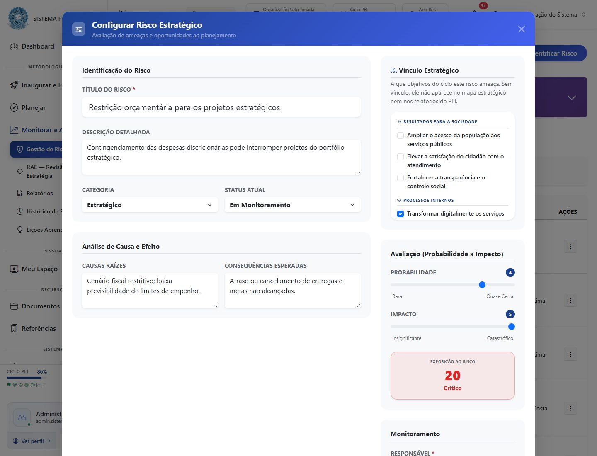
*Figura 74 — Formulário Configurar Risco Estratégico.*

O título da janela é **Identificar Novo Risco** na criação e **Configurar Risco Estratégico** na
edição. À esquerda ficam **Identificação do Risco** e **Análise de Causa e Efeito**; à direita,
**Vínculo Estratégico** (objetivos do ciclo agrupados por perspectiva), **Avaliação (Probabilidade x
Impacto)** com dois controles deslizantes e o quadro de exposição (probabilidade 4 e impacto 5 dão 20,
Crítico, na figura), e, rolando
a janela, **Monitoramento** e **Resposta ao Risco (ISO 31000)**.

| Campo | Obrigatório | O que informar | Exemplo |
|---|---|---|---|
| **Título do Risco** | Sim | O evento de risco, até 255 caracteres. | Indisponibilidade prolongada dos sistemas críticos |
| **Descrição Detalhada** | Não | O evento e o seu contexto. | Falhas de infraestrutura podem deixar os sistemas fora do ar por mais de quatro horas. |
| **Categoria** | Sim | Estratégico, Operacional, Financeiro, Reputacional ou Legal/Conformidade. | Operacional |
| **Status Atual** | Sim | Identificado, Em Monitoramento, Mitigado ou Encerrado. | Em Monitoramento |
| **Causas Raízes** | Não | O que pode gerar o risco. | Infraestrutura própria obsoleta; ausência de redundância. |
| **Consequências Esperadas** | Não | O que acontece se o risco se materializar. | Interrupção do atendimento e perda de credibilidade. |
| **Vínculo Estratégico** | Não (recomendado) | Os objetivos do ciclo que o risco ameaça. | Transformar digitalmente os serviços e processos |
| **Probabilidade** | Sim | Controle de 1 (Rara) a 5 (Quase Certa). | 4 |
| **Impacto** | Sim | Controle de 1 (Insignificante) a 5 (Catastrófico). | 4 |
| **Responsável** | Sim | Pessoa da unidade do risco que vai monitorá-lo. | Rafael Souza Lima |
| **Estratégia de Resposta** | Não | **Mitigar** (reduzir probabilidade ou impacto), **Evitar** (eliminar a causa ou abandonar a atividade), **Transferir** (seguro, terceirização) ou **Aceitar** (registrar e monitorar). | Mitigar |
| **Justificativa** | Sim, se a estratégia for Aceitar | Por que o risco está sendo aceito sem mitigação (até 2.000 caracteres). | Custo da mitigação supera o impacto esperado. |
| **Próxima Revisão** | Não | Data em que o risco deve ser reavaliado. | 31/12/2026 |

Regras e validações:

- *"Ao aceitar o risco, é obrigatório justificar a decisão."*
- *"Escolha um responsável da unidade do risco."*
- *"Há objetivo de outro ciclo na seleção."*
- *"Selecione um Ciclo PEI e uma organização antes de registrar um risco."*
- O risco nasce na unidade e no ciclo selecionados no topo e recebe o próximo código livre do ciclo
  (R-001, R-002…).

### 23.8 A matriz de riscos

Abra pelo botão **Ver Matriz**. A figura mostra a matriz da AFE.

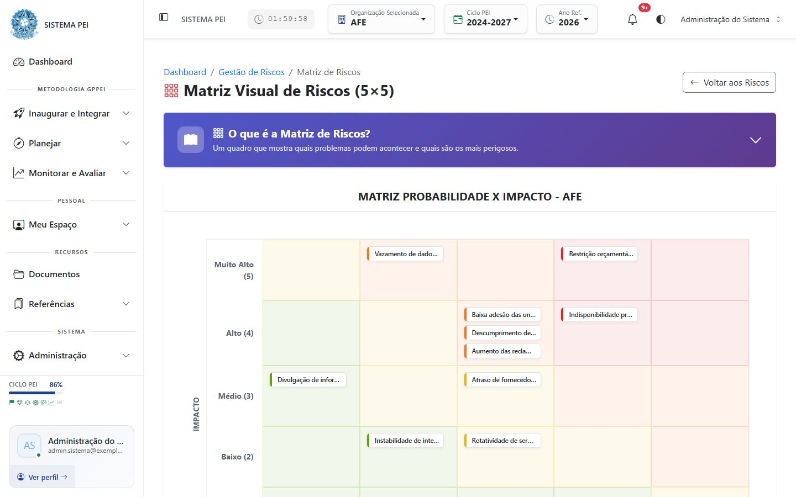
*Figura 75 — Matriz Visual de Riscos (5×5).*

- O eixo vertical é o **Impacto** (Muito Alto (5) no alto, Muito Baixo (1) embaixo); o eixo
  horizontal, a **Probabilidade** (Muito Baixa (1) à esquerda, Muito Alta (5) à direita).
- Cada casa tem a cor do nível que resulta de P × I (23.6): quanto mais para cima e para a direita,
  mais grave. A legenda no pé repete as cores Baixo, Médio, Alto e Crítico.
- Cada risco aparece como uma etiqueta na sua casa, com uma barra na cor do nível. Passe o mouse para
  ler o título completo; clique para abrir a lista já filtrada por aquele risco.
- A matriz usa o mesmo recorte da lista: unidade selecionada e subordinadas, ciclo selecionado.

Na figura, "Restrição orçamentá…" está na casa P 4 × I 5 (Crítico); "Indisponibilidade pr…", na casa
P 4 × I 4 (Crítico); "Vazamento de dado…", na casa P 2 × I 5 (Alto); "Divulgação de infor…", na casa
P 1 × I 3 (Baixo). Para mudar a posição de um risco, edite as notas na lista — a matriz só mostra.

### 23.9 Planos de mitigação e ocorrências

#### 23.9.1 Planos de mitigação

Abra pela lista: **⋮ → Planos de Mitigação**. A figura mostra os planos do risco "Restrição
orçamentária para os projetos estratégicos".

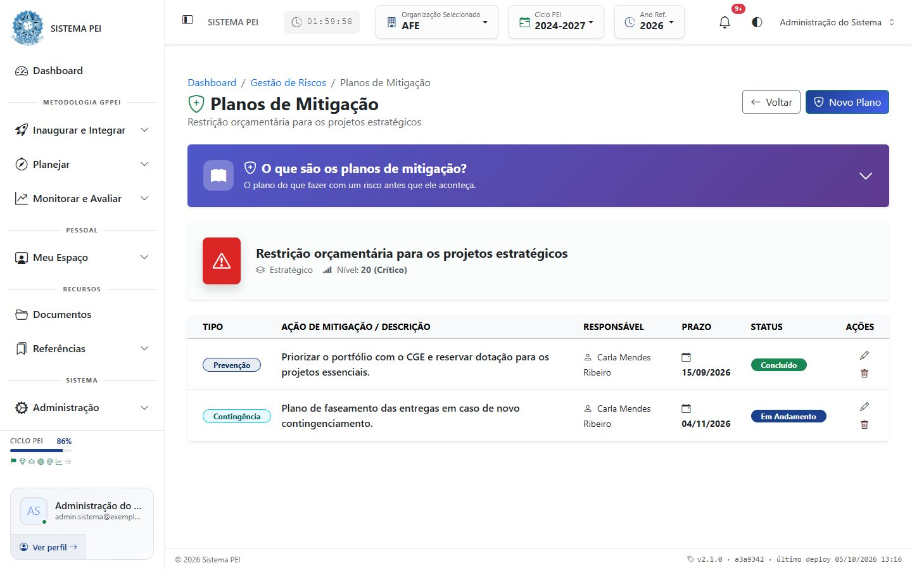
*Figura 76 — Planos de Mitigação de um risco.*

No alto ficam o título do risco, a categoria (Estratégico) e o nível (20, Crítico); abaixo, a tabela
com dois planos de Carla Mendes Ribeiro — uma Prevenção concluída em 15/09/2026 e uma Contingência em
andamento com prazo em 04/11/2026. As colunas são **Tipo**
(**Prevenção** — agir antes de o risco ocorrer; **Contingência** — o que fazer se ele ocorrer),
**Ação de Mitigação / Descrição**, **Responsável**, **Prazo** (em vermelho quando vencido), **Status** e
os ícones de editar e excluir. O botão **Novo Plano** abre o formulário:

| Campo | Obrigatório | O que informar | Exemplo |
|---|---|---|---|
| **Tipo de Plano** | Sim | Prevenção ou Contingência. | Prevenção |
| **Descrição da Ação** | Sim | O que será feito, até 1.000 caracteres. | Migrar os sistemas críticos para a nuvem de governo com redundância. |
| **Responsável** | Sim | Pessoa da unidade do risco. | Rafael Souza Lima |
| **Prazo** | Sim | Data limite da ação. | 25/09/2026 |
| **Status** | Sim | A Fazer, Em Andamento ou Concluído. | Em Andamento |
| **Custo Estimado (R$)** | Não | Valor maior ou igual a zero, só números (sem ponto de milhar); pode ficar em branco. | 450000 |

Mensagens: *"Descreva a ação de mitigação."*, *"Escolha o responsável."*, *"Informe o prazo."*,
*"Escolha um responsável da unidade do risco."*, *"Informe um custo válido (número maior ou igual a
zero) ou deixe em branco."* Ao salvar: *"Plano de mitigação salvo!"*. Excluir pede *"Remover este plano
de mitigação?"*.

#### 23.9.2 Ocorrências (histórico de materialização)

Quando o risco de fato acontece, registre a ocorrência. Abra pela lista: **⋮ → Registrar
Ocorrência**. A figura mostra a tela do risco "Indisponibilidade prolongada dos sistemas críticos",
que já se materializou duas vezes.

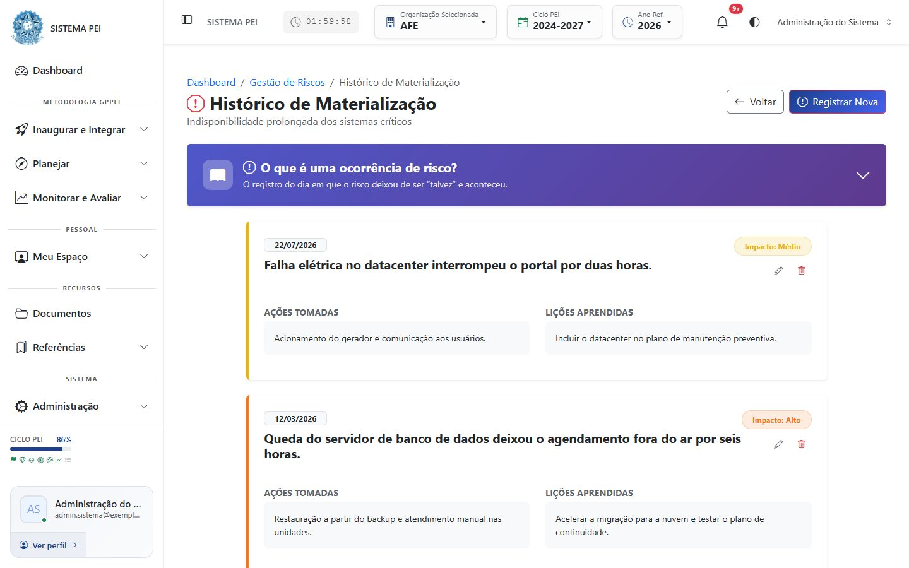
*Figura 77 — Histórico de Materialização do risco.*

Na figura aparecem o título *Histórico de Materialização* com o nome do risco, os botões **Voltar** e
**Registrar Nova**, a seção educativa *O que é uma ocorrência de risco?* e dois cartões, do mais
recente para o mais antigo:

- **22/07/2026** — "Falha elétrica no datacenter interrompeu o portal por duas horas.", com o selo
  **Impacto: Médio** (amarelo, e barra amarela à esquerda do cartão); ações tomadas: "Acionamento do
  gerador e comunicação aos usuários."; lição: "Incluir o datacenter no plano de manutenção
  preventiva.";
- **12/03/2026** — "Queda do servidor de banco de dados deixou o agendamento fora do ar por seis
  horas.", com o selo **Impacto: Alto** (laranja); ações tomadas: "Restauração a partir do backup e
  atendimento manual nas unidades."; lição: "Acelerar a migração para a nuvem e testar o plano de
  continuidade.".

Sem nenhum registro, a tela mostra o aviso *"Nenhuma ocorrência registrada para este risco."*

Em resumo, a tela lista as ocorrências em cartões, com a data, a descrição do
evento, o selo **Impacto** (colorido conforme a gravidade), as **Ações Tomadas** e as **Lições
Aprendidas**, além dos ícones de editar e excluir (confirmação *"Excluir este registro de
ocorrência?"*). O botão **Registrar Nova** abre o formulário:

| Campo | Obrigatório | O que informar | Exemplo |
|---|---|---|---|
| **Data da Ocorrência** | Sim | Quando aconteceu. | 22/07/2026 |
| **Impacto Real Observado** | Sim | Muito Baixo, Baixo, Médio, Alto ou Muito Alto. | Médio |
| **Descrição do Evento** | Sim | O que aconteceu, até 1.000 caracteres. | Falha elétrica no datacenter interrompeu o portal por duas horas. |
| **Ações Tomadas Imediatamente** | Não | Até 5.000 caracteres. | Acionamento do gerador e comunicação aos usuários. |
| **Lições Aprendidas** | Não | Até 5.000 caracteres. | Incluir o datacenter no plano de manutenção preventiva. |

### 23.10 Sugestão de riscos por IA

**Sugerir Riscos Estratégicos com IA** pede ao agente de IA três riscos com base nos objetivos do
ciclo, cada um com título, categoria, descrição e uma sugestão de mitigação. Clicar numa sugestão
abre o formulário de novo risco preenchido, com você como responsável. Revise as notas de
probabilidade e impacto antes de salvar.

### 23.11 Excluir um risco

**⋮ → Excluir** abre a janela *Remover Risco*. Ao confirmar, o risco sai da lista, da matriz e dos
relatórios; os planos de mitigação e as ocorrências deixam de aparecer junto com ele. Só o
Administrador da unidade (ou o Super Admin) exclui. A tela não oferece restauração.

---

## 24. RAE — Revisão e Avaliação da Estratégia

### 24.1 Para que serve

A RAE é a reunião periódica em que a direção confere se a estratégia está funcionando e decide os
ajustes (GPPEI, p. 138). No sistema, cada RAE registra o período de referência, o progresso geral, os
destaques positivos, os problemas, os participantes, os **encaminhamentos formais** (cada decisão
com responsável, prazo e status) e as **análises de causa raiz** (5 Porquês e Ishikawa). A ata sai em
PDF.

### 24.2 Como chegar e quem pode

Menu lateral **Monitorar e Avaliar → RAE — Revisão da Estratégia**. A tela mostra as RAEs da unidade
selecionada no topo, no ciclo selecionado, da mais recente para a mais antiga.

| Ação | Super Admin | Administrador da Unidade | Gestor(a) Responsável | Gestor(a) Substituto(a) | Consulta |
|---|---|---|---|---|---|
| Ver as RAEs | Sim | Sim | Sim | Sim | Sim |
| Criar, editar e excluir RAE, encaminhamentos e causas | Sim | Sim | Não | Não | Não |
| Baixar o PDF | Sim | Sim | Sim | Sim | Sim |

### 24.3 A tela da RAE

A figura mostra a tela da AFE no ciclo 2024-2027, com a RAE de agosto de 2026 no alto.

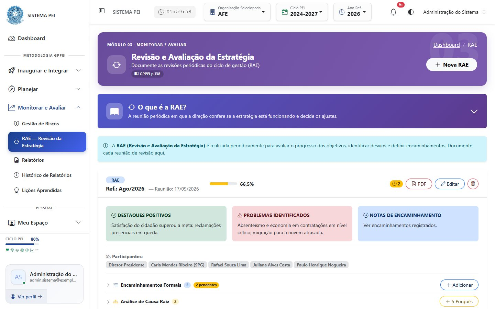
*Figura 78 — Tela da RAE com o cartão de uma revisão.*

- **Cabeçalho** do Módulo 03 com o título *Revisão e Avaliação da Estratégia*, o atalho GPPEI p. 138
  e o botão **Nova RAE** (para quem pode criar).
- **O que é a RAE?** — seção educativa; logo abaixo, um quadro azul explica o propósito da tela.
- **Um cartão por RAE**, da mais recente para a mais antiga. Quando a unidade ainda não tem RAE no
  ciclo, aparece *Nenhuma RAE registrada* e o botão **Registrar Primeira RAE**.

Na figura, o cartão da RAE "Ref.: Ago/2026" (reunião em 17/09/2026) tem progresso geral de 66,5%,
dois encaminhamentos pendentes, os três quadros de texto preenchidos, cinco participantes e as duas
seções recolhíveis fechadas. O que cada parte do cartão mostra:

- **Cabeçalho do cartão** — o tipo (RAE), a referência ("Ref.: Ago/2026"), a data da reunião, a barra
  de **progresso geral** (verde a partir de 70%, amarela de 40% a 69,9%, vermelha abaixo de 40%), o
  selo com o número de encaminhamentos pendentes (relógio amarelo), e os botões **PDF**, **Editar** e
  a lixeira.
- **Três quadros** — **Destaques Positivos** (verde), **Problemas Identificados** (vermelho) e
  **Notas de Encaminhamento** (azul). Quadro vazio não aparece.
- **Participantes** — um selo por nome.
- **Encaminhamentos Formais** — seção recolhível (clique na seta), com o total, o selo de pendentes e
  o botão **Adicionar**. A tabela mostra Tipo, Descrição, Responsável, Prazo (com o selo *atrasado*
  quando vencido e não concluído), Status (alterável na própria linha) e os ícones de editar e excluir.
- **Análise de Causa Raiz** — seção recolhível com o botão **5 Porquês** (ver 24.6).

### 24.4 Registrar ou editar uma RAE

1. Clique em **Nova RAE** (para editar: **Editar** no cartão).
2. Preencha o formulário e clique em **Salvar RAE**. Aparece *"RAE salva com sucesso."*

A figura mostra o formulário aberto pelo botão **Editar** da RAE de agosto de 2026.

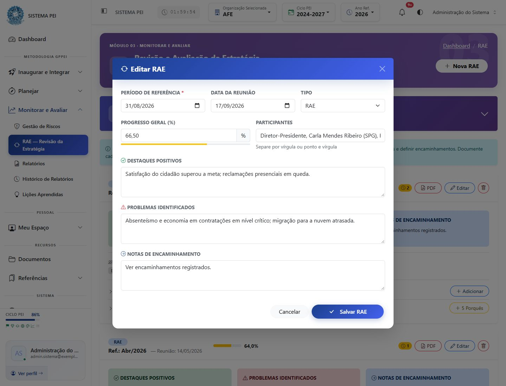
*Figura 79 — Formulário Editar RAE.*

Na figura, o período de referência é 31/08/2026, a reunião foi em 17/09/2026, o tipo é RAE e o
progresso geral é 66,50%, com a barrinha amarela logo abaixo (faixa de 40% a 69,9%). Os campos são:

| Campo | Obrigatório | O que informar | Exemplo |
|---|---|---|---|
| **Período de Referência** | Sim | Uma data do período avaliado; o cartão mostra mês/ano. Vem preenchida com hoje. | 31/08/2026 |
| **Data da Reunião** | Não | Quando a reunião aconteceu. | 17/09/2026 |
| **Tipo** | Sim | RAE, Revisão Semestral, Revisão Anual ou Reunião de Monitoramento. | RAE |
| **Progresso Geral (%)** | Não | De 0 a 100, com até uma casa decimal; a barra embaixo mostra a cor. | 66,5 |
| **Participantes** | Não | Nomes separados por vírgula, ponto e vírgula ou quebra de linha. | Diretor-Presidente, Carla Mendes Ribeiro (SPG), Rafael Souza Lima |
| **Destaques Positivos** | Não | O que avançou bem. | Satisfação do cidadão superou a meta. |
| **Problemas Identificados** | Não | Indicadores abaixo da meta, iniciativas atrasadas, causas. | Absenteísmo em nível crítico; migração para a nuvem atrasada. |
| **Notas de Encaminhamento** | Não | Observações gerais; as ações com responsável e prazo vão em Encaminhamentos Formais. | Ver encaminhamentos registrados. |

Mensagem de validação: *"Informe o período de referência."*

### 24.5 Encaminhamentos formais

Os encaminhamentos são as decisões da reunião, cada uma com responsável, prazo e status. Clique na
seta de **Encaminhamentos Formais** para abrir a tabela. A figura mostra a seção aberta na RAE de
agosto de 2026 da AFE.

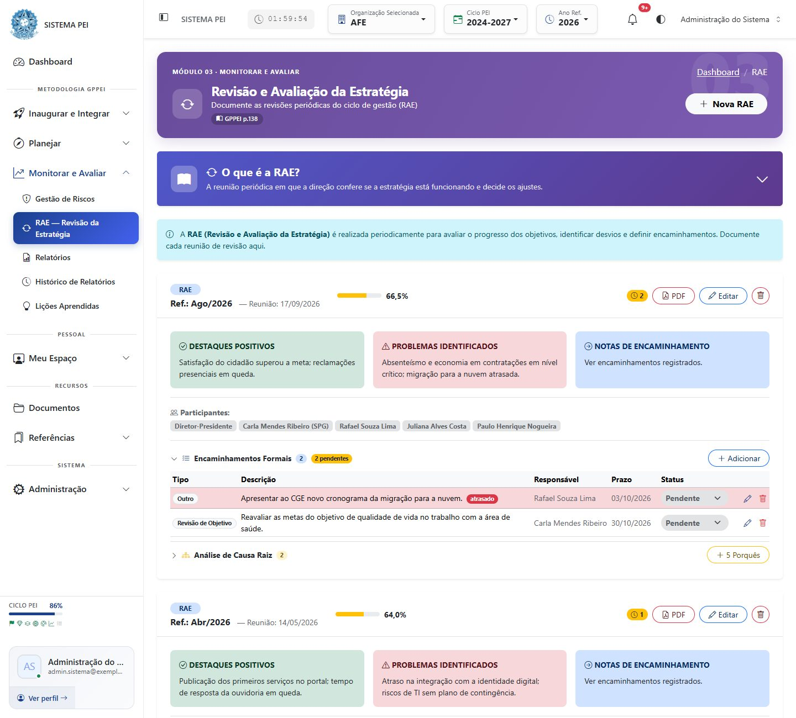
*Figura 80 — Encaminhamentos formais de uma RAE.*

Na figura há dois encaminhamentos, ambos **Pendente**: um do tipo *Outro*, "Apresentar ao CGE novo
cronograma da migração para a nuvem.", de Rafael Souza Lima, com prazo em 03/10/2026 já vencido — por
isso a linha fica rosada e ganha o selo vermelho **atrasado**; e um do tipo *Revisão de Objetivo*, de
Carla Mendes Ribeiro, com prazo em 30/10/2026. Cada linha tem o seletor de status e os ícones de
editar (lápis) e excluir (lixeira). Abaixo aparece a seção fechada **Análise de Causa Raiz** e, mais
abaixo, o cartão da RAE de abril de 2026.

Para incluir um encaminhamento:

1. No cartão da RAE, clique em **Adicionar** (Encaminhamentos Formais).
2. Preencha **Tipo** (Nova Iniciativa, Revisão de Meta, Revisão de Objetivo, Revisão de Risco ou
   Outro), **Status** (Pendente, Em Execução ou Concluído), **Descrição** (obrigatória, até 2.000
   caracteres), **Responsável** (pessoas da unidade da RAE; pode ficar *Sem responsável*) e **Prazo**.
3. Salve. Aparece *"Encaminhamento salvo."*

Para atualizar o andamento, troque o **Status** direto na linha da tabela (*"Status atualizado."*).
Excluir pede confirmação na janela *Confirmar Exclusão*.

### 24.6 Análise de causa raiz (5 Porquês e Ishikawa)

A **Análise de Causa Raiz** ajuda a ir além do sintoma. Clique na seta da seção para abrir as
análises já registradas. A figura mostra a seção aberta na RAE de agosto de 2026 da AFE.

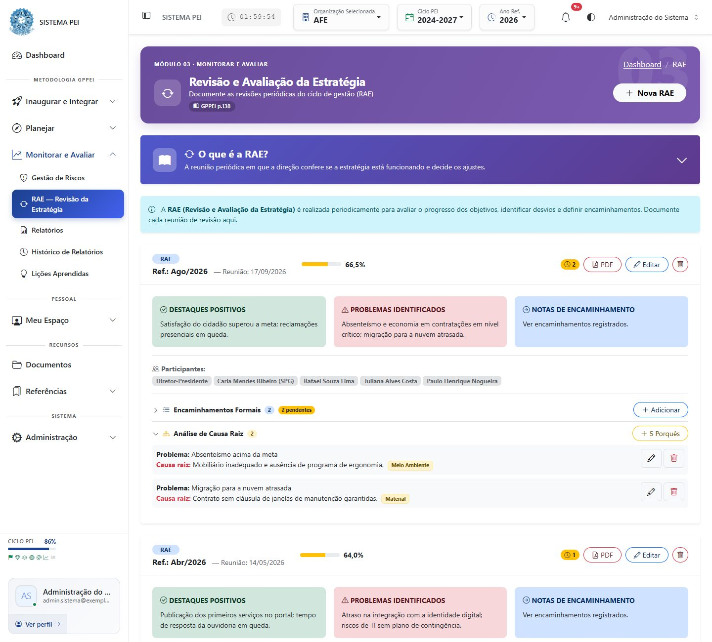
*Figura 81 — Análises de causa raiz de uma RAE.*

Cada análise mostra o **Problema**, a **Causa raiz** (em vermelho) e a categoria Ishikawa num selo
amarelo, com os botões de editar e excluir. Na figura há duas: "Absenteísmo acima da meta", com causa
"Mobiliário inadequado e ausência de programa de ergonomia" (Meio Ambiente), e "Migração para a nuvem
atrasada", com causa "Contrato sem cláusula de janelas de manutenção garantidas" (Material). O contador
ao lado do título da seção mostra 2.

Para registrar uma análise, clique em **5 Porquês** e preencha:

| Campo | Obrigatório | O que informar | Exemplo |
|---|---|---|---|
| **Problema Observado** | Sim | O sintoma, até 1.000 caracteres. | O indicador de absenteísmo subiu 15% no trimestre. |
| **Técnica dos 5 Porquês** | Não | Até cinco respostas encadeadas: cada "por quê?" aprofunda o anterior. | Por quê? Mais licenças médicas. Por quê? … |
| **Causa Raiz Identificada** | Não | A síntese da causa fundamental. | Ausência de programa de saúde ocupacional. |
| **Categoria Ishikawa (6M)** | Não | Método, Máquina, Mão de Obra, Material, Medida ou Meio Ambiente. | Método |
| **Encaminhamento vinculado** | Não | Um encaminhamento desta RAE que trata a causa. | Criar programa de qualidade de vida |

Salve: *"Análise de causa raiz salva."* A exclusão pede *"Excluir esta análise de causa raiz? Os 5
porquês registrados serão perdidos."*

### 24.7 PDF da RAE e exclusão

- **PDF** baixa a ata da revisão (arquivo `RAE_AAAA_MM.pdf`) com todo o conteúdo do cartão.
- A lixeira do cartão abre *Confirmar Exclusão*. A RAE sai da tela; o registro fica guardado no banco
  (exclusão lógica).

---

## 25. Lições Aprendidas

### 25.1 Para que serve

É o caderno coletivo do que deu certo e do que não deu, para o próximo ciclo ser melhor (Guia de
Projetos, p. 227). Cada lição pertence a uma iniciativa e é classificada por tipo e categoria.

### 25.2 Como chegar e quem pode

Menu lateral **Monitorar e Avaliar → Lições Aprendidas**. A tela mostra as lições das iniciativas da
unidade selecionada (e subordinadas) no ciclo selecionado.

- **Ver**: todos os perfis com acesso às iniciativas.
- **Nova Lição**: aparece para Administrador e Gestores; gravar exige poder editar a iniciativa
  escolhida (o Gestor só registra lição da sua iniciativa).
- **Editar e excluir** uma lição: quem pode editar a iniciativa dela.

### 25.3 O que aparece na tela

A figura mostra a tela com a AFE selecionada no topo: uma lição do tipo Aprendizado (da iniciativa
"Programa de Capacitação em Gestão por Resultados") e duas do tipo Problema.

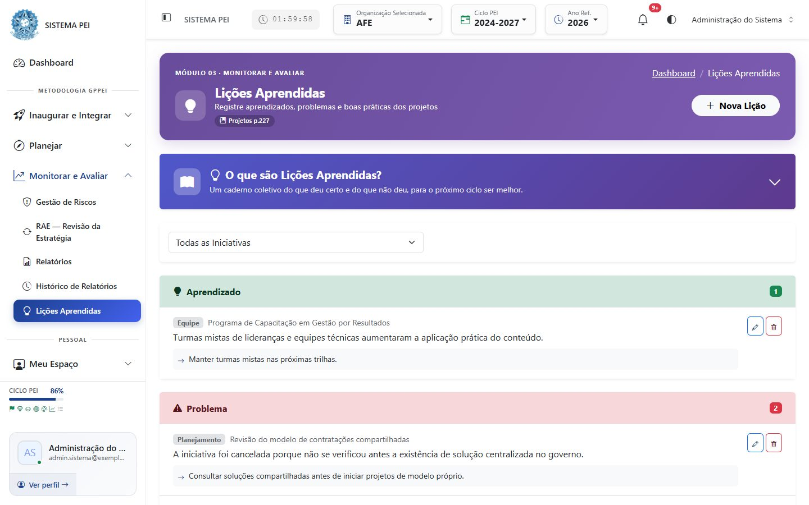
*Figura 82 — Lições Aprendidas agrupadas por tipo.*

- **Cabeçalho** do Módulo 03 com o atalho Projetos p. 227 e o botão **Nova Lição**.
- **O que são Lições Aprendidas?** — seção educativa.
- **Filtro** **Todas as Iniciativas** — escolha uma iniciativa para ver só as lições dela. Com o
  filtro aplicado, a próxima lição já nasce vinculada àquela iniciativa.
- **Grupos por tipo**, cada um com a sua cor e a contagem: **Aprendizado** (verde), **Problema**
  (vermelho), **Melhoria** (azul) e **Boas Práticas** (amarelo). Cada lição mostra a categoria, a
  iniciativa, a descrição, a recomendação (com a seta) e os botões de editar (lápis) e excluir.

### 25.4 Registrar ou editar uma lição

1. Clique em **Nova Lição** (para editar: o lápis da lição).
2. Preencha o formulário e clique em **Salvar**. Aparece *"Lição aprendida salva."*

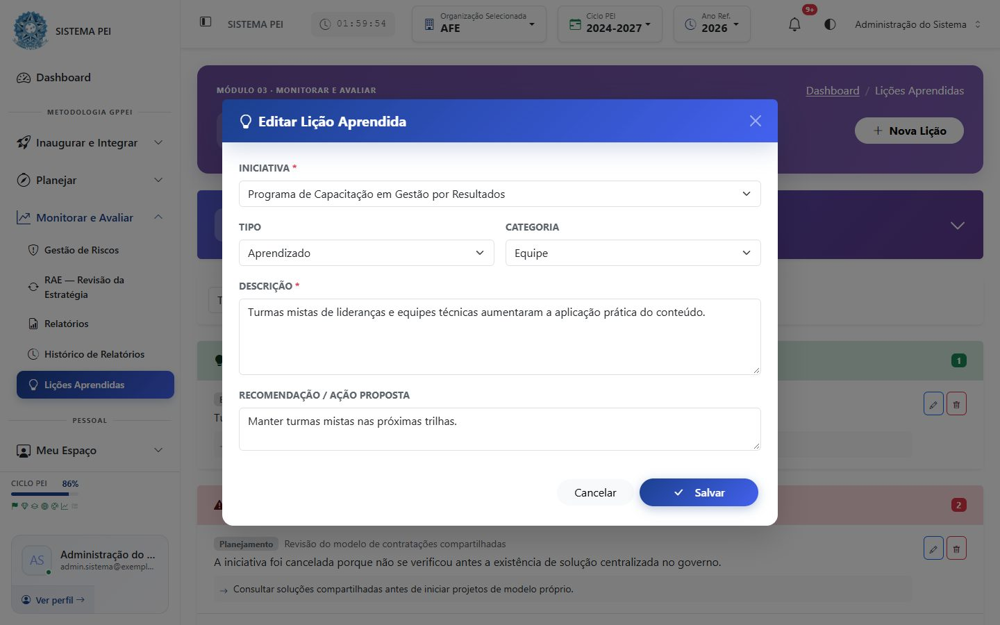
*Figura 83 — Formulário Editar Lição Aprendida.*

| Campo | Obrigatório | O que informar | Exemplo |
|---|---|---|---|
| **Iniciativa** | Sim | A iniciativa de onde vem a lição. | Programa de Capacitação em Gestão por Resultados |
| **Tipo** | Sim | Aprendizado, Problema, Melhoria ou Boas Práticas. | Aprendizado |
| **Categoria** | Não | Geral, Planejamento, Execução, Comunicação, Riscos, Equipe, Orçamento ou Prazo. | Equipe |
| **Descrição** | Sim | O que foi aprendido, até 2.000 caracteres. | Turmas mistas de lideranças e equipes técnicas aumentaram a aplicação prática do conteúdo. |
| **Recomendação / Ação Proposta** | Não | O que fazer diferente nos próximos projetos. | Manter turmas mistas nas próximas trilhas. |

Mensagens: *"Selecione a iniciativa."* e *"Descreva a lição aprendida."* A exclusão é confirmada na
janela *Confirmar Exclusão*.

> **Dica.** As ocorrências de risco também têm um campo de lições aprendidas (23.9.2), e o Relatório
> Estratégico Integrado reúne as lições num capítulo próprio (26.6).

---

## 26. Relatórios

### 26.1 Para que serve

A Central de Relatórios transforma o que está registrado no sistema em documentos para prestar
contas e apresentar resultados: à direção, aos órgãos de controle e à sociedade (GPPEI, p. 43–55).
Cada relatório sai do recorte de **unidade, ciclo e ano**; os arquivos gerados ficam guardados no seu
histórico.

### 26.2 Como chegar e quem pode

- Menu lateral **Monitorar e Avaliar → Relatórios** (Central) e **Monitorar e Avaliar → Histórico de
  Relatórios**.
- Todos os perfis — Administrador, Gestor(a) Responsável, Gestor(a) Substituto(a) e Consulta — geram
  relatórios, mas só das unidades do seu escopo. O relatório de "todas as unidades" é exclusivo do
  Super Admin; os demais recebem sempre o da unidade selecionada.
- Os relatórios saem do ciclo selecionado no topo: para o relatório de outro ciclo, troque o ciclo
  antes.

### 26.3 A Central de Relatórios

A figura mostra a Central aberta pelo menu **Monitorar e Avaliar → Relatórios**, com a AFE no topo
(a barra de contexto mostra "Agência Federal de Exemplo"), o ano 2026, o período Anual, todas as
perspectivas e a chave Incluir IA desligada.

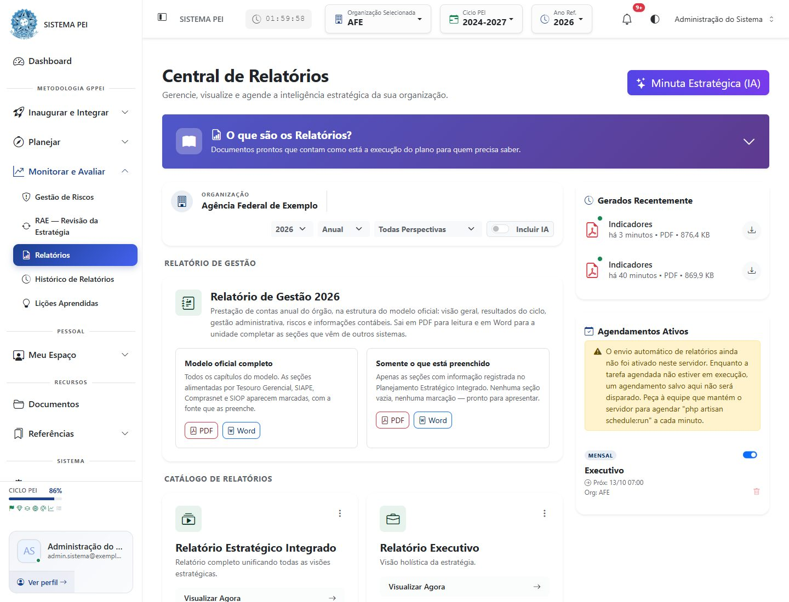
*Figura 84 — Central de Relatórios.*

Na figura, o quadro **Gerados Recentemente** lista dois relatórios de Indicadores em PDF, e o quadro
**Agendamentos Ativos** mostra o aviso amarelo de que a geração automática não foi ativada no servidor
e um agendamento mensal do Relatório Executivo da AFE. Os elementos da tela:

- **Cabeçalho** — título *Central de Relatórios* e o botão **Minuta Estratégica (IA)** (aparece
  quando a IA está ligada e há unidade selecionada; ver 26.8).
- **O que são os Relatórios?** — seção educativa.
- **Barra de contexto e filtros** — o nome da **Organização** (a unidade do topo) e os filtros:
  - **Ano** — os anos dos ciclos cadastrados;
  - **Período** — Anual, 1º Sem., 2º Sem., 1º Tri., 2º Tri., 3º Tri. ou 4º Tri.;
  - **Perspectiva** — Todas Perspectivas ou uma delas;
  - **Incluir IA** — chave que acrescenta análise do agente de IA aos relatórios que a aceitam.
- **Relatório de Gestão** (26.4) e o **Catálogo de Relatórios** (26.5).
- À direita, **Gerados Recentemente** (os três últimos relatórios que você gerou, com tipo, há quanto
  tempo, formato, tamanho e o botão de baixar) e **Agendamentos Ativos** (26.7).

Os filtros valem só para os relatórios que os usam:

| Filtro | Relatórios que usam |
|---|---|
| Unidade (topo) | Todos |
| Ano | Gestão, Integrado, Executivo, Mapa Estratégico, Objetivos (PDF), Indicadores (PDF), Iniciativas (PDF e Excel) |
| Período | Integrado, Executivo, Indicadores (PDF) |
| Perspectiva | Executivo, Objetivos (PDF) |
| Incluir IA | Integrado, Executivo |

### 26.4 Relatório de Gestão (PDF e Word)

É a prestação de contas anual do órgão, na estrutura do modelo oficial, em cinco capítulos:
1. Visão Geral Organizacional e Ambiente Externo; 2. Resultados e Desempenho da Gestão;
3. Resultados e Desempenho da Gestão Administrativa; 4. Riscos, Integridade, Ética, Transparência,
Correição e Controle Interno; 5. Informações Orçamentárias, Financeiras e Contábeis.

Há duas versões, cada uma em **PDF** (para leitura) e **Word** (para completar e editar):

| Versão | O que traz | Quando usar |
|---|---|---|
| **Modelo oficial completo** | Todos os capítulos do modelo. As seções alimentadas por outros sistemas (Tesouro Gerencial, SIAPE, Comprasnet, SIOP) vêm marcadas com a fonte que as preenche. | Para a unidade completar no Word o que vem de fora do PEI. |
| **Somente o que está preenchido** | Apenas as seções com informação registrada no Planejamento Estratégico Integrado; nenhuma seção vazia, nenhuma marcação. | Para apresentar sem completar nada. |

Regras:

- Exige unidade selecionada (*"Selecione uma organização para gerar o Relatório de Gestão."*).
- O exercício precisa estar dentro do ciclo selecionado. Fora dele, a tela avisa antes do clique: *"O
  exercício … não pertence ao ciclo selecionado (…). Selecione no topo o ciclo desse exercício."*
- O PDF sai em formato paisagem, com capa.
- O Relatório de Gestão não pode ser agendado.

### 26.5 Catálogo de relatórios

Cada cartão do catálogo tem o botão **Visualizar Agora** (gera o PDF numa nova aba) e o menu **⋮**
com **Baixar PDF**, **Baixar Excel** (quando existe) e **Agendar geração** (26.7). Sem unidade
selecionada, o cartão mostra **Selecione Org.**

| Relatório | Formatos | O que contém | Filtros |
|---|---|---|---|
| **Relatório Estratégico Integrado** | PDF | O documento completo do PEI, em 12 capítulos: Identidade Estratégica; Planejamento do Processo e Integração com Instrumentos de Governo; Cadeia de Valor; Análise de Ambiente (SWOT, PESTEL, partes interessadas e cenários prospectivos); Mapa Estratégico (BSC); Monitoramento de Indicadores; Portfólio de Iniciativas e Entregas; Gestão de Riscos; Plano de Comunicação; RAE; Lições Aprendidas; Contribuição à Agenda 2030 (ODS). | Unidade, ano, período, Incluir IA |
| **Relatório Executivo** | PDF | Visão curta para a alta direção: identidade estratégica, desempenho por perspectiva (objetivos, quantidade de indicadores e atingimento), matriz SWOT, carteira de iniciativas do ano (status e progresso) e panorama dos riscos (P, I, P×I, nível e mitigações). | Unidade, ano, período, perspectiva, Incluir IA |
| **Mapa Estratégico** | PDF (paisagem) | Missão, visão, valores, temas norteadores e as perspectivas com os objetivos, coloridos pela régua de satisfação. | Unidade, ano |
| **Objetivos Estratégicos (BSC)** | PDF e Excel | Os objetivos por perspectiva, com número, nome e descrição. O Excel traz todos os objetivos do ciclo selecionado, sem filtro de unidade, ano ou perspectiva. | PDF: unidade, ano, perspectiva |
| **Indicadores (KPIs)** | PDF e Excel | Cada indicador com objetivo vinculado, unidade, polaridade, meta, realizado e atingimento. | PDF: unidade, ano, período. Excel: unidade |
| **Iniciativas** | PDF e Excel | As iniciativas vigentes no ano, com objetivo vinculado, vigência, status e progresso, e um resumo da carteira. | Unidade, ano |
| **Gestão de Riscos** | PDF e Excel | Matriz de probabilidade × impacto, classificação e distribuição dos riscos, riscos priorizados (P, I, nível, classe, mitigações e ocorrências) e os planos de mitigação detalhados. | Unidade |

Outros relatórios gerados fora da Central, que também entram no seu histórico:

- **Lista de indicadores** — botão **Exportar** da tela de Indicadores (PDF ou Excel da unidade
  selecionada);
- **Plano de Comunicação** — botão **PDF** da tela de Gestores e Responsáveis (20.7), com os itens de
  comunicação de todas as iniciativas da unidade no ciclo;
- **Ata da RAE** — botão **PDF** do cartão da RAE (24.7). Este não entra no histórico.

> **Dica.** O Relatório Estratégico Integrado é o mais pesado: pode levar alguns minutos. Espere a
> nova aba terminar de carregar antes de clicar de novo.

> **Cuidado — Incluir IA.** Com a chave ligada, o texto da IA entra no documento. Revise antes de
> enviar a alguém: a análise é automática.

### 26.6 Gerados Recentemente

O quadro **Gerados Recentemente** mostra os três últimos relatórios que **você** gerou. O botão de
download devolve o arquivo exatamente como foi gerado naquele dia. Relatórios gerados antes de o
sistema passar a guardar os arquivos aparecem sem download, com um selo explicativo. A lista completa
fica no Histórico (26.9).

### 26.7 Agendar a geração de um relatório

O agendamento faz o sistema gerar o relatório sozinho, na frequência escolhida, e guardar o arquivo
no seu histórico. **Nada é enviado por e-mail.**

> **A opção só aparece quando o agendador de relatórios está ativo no servidor.** O agendador é uma
> tarefa automática que a equipe de infraestrutura do seu órgão precisa ligar. Enquanto ela não
> estiver em execução:
>
> - o menu **⋮** dos cartões mostra *"Geração automática indisponível — a tarefa agendada do
>   servidor não está em execução."* no lugar de **Agendar geração**;
> - o quadro **Agendamentos Ativos** mostra o aviso amarelo *"O envio automático de relatórios ainda
>   não foi ativado neste servidor…"* (ou *"…está parado desde …"*), como na figura da seção 26.3, e
>   os agendamentos já salvos não são disparados.
>
> Nesse caso, procure a equipe de infraestrutura do seu órgão.

Com o agendador ativo, o passo a passo é:

1. Ajuste no topo a unidade e o ciclo, e na Central o ano, o período, a perspectiva e a chave Incluir
   IA. O agendamento grava esses filtros e o ciclo selecionado agora.
2. No cartão do relatório, abra **⋮ → Agendar geração**.
3. Na janela *Agendar Relatório*, confira o **Tipo de Relatório**, escolha a **Frequência**
   (**Diário**, **Semanal** ou **Mensal**) e a **Próxima Execução** (data e hora futuras).
4. Clique em **Agendar**. Aparece *"Relatório agendado com sucesso!"* e o agendamento entra no quadro
   **Agendamentos Ativos**.

Mensagem de erro possível: *"Este relatório não pode ser agendado."* Agendar o recorte de todas as
unidades é exclusivo do Super Admin.

No quadro **Agendamentos Ativos** (cinco por página, só os seus), cada agendamento mostra a
frequência, o tipo, a próxima execução (*"Próx: dd/mm hh:mm"*) ou *Pausado*, a sigla da unidade
(*Org*), a chave **Pausar/Ativar** e a lixeira (*"Cancelar este agendamento?"*). Na figura da seção
26.3, há um agendamento mensal do Executivo da AFE com próxima execução em 13/10 às 07:00.

O tipo aparece com o nome interno do relatório:

| Nome no agendamento | Relatório |
|---|---|
| Integrado | Relatório Estratégico Integrado |
| Executivo | Relatório Executivo |
| Identidade | Mapa Estratégico |
| Objetivos | Objetivos Estratégicos (BSC) |
| Indicadores | Indicadores (KPIs) |
| Planos | Iniciativas |
| Riscos | Gestão de Riscos |

### 26.8 Minuta Estratégica (IA)

O botão **Minuta Estratégica (IA)** pede ao agente de IA um resumo executivo da unidade no ano
selecionado, com pontos de atenção e sugestões. O texto aparece num quadro *Insight Estratégico* na
própria tela (não gera arquivo) e pode ser fechado em **Fechar Insight**. É um rascunho: revise
antes de usar.

### 26.9 Histórico de Relatórios

Abra pelo menu **Monitorar e Avaliar → Histórico de Relatórios**. A figura mostra o histórico com dois
relatórios de Indicadores em PDF gerados em 05/10/2026, às 14:00:38 e às 13:23:18, ambos com
*"Sem filtros — ciclo e organização da sessão."* e o botão **Baixar arquivo**.

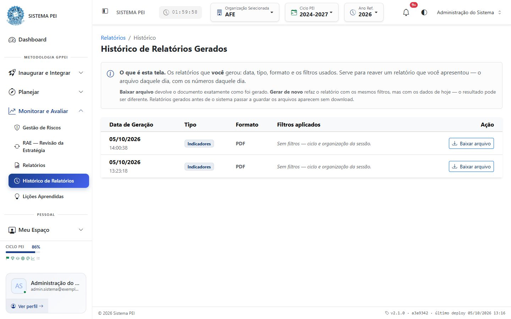
*Figura 85 — Histórico de Relatórios Gerados.*

- O quadro *O que é esta tela* explica que ali estão os relatórios que **você** gerou, para reaver o
  arquivo daquele dia, com os números daquele dia.
- A tabela (dez por página, do mais recente) tem as colunas **Data de Geração** (data e hora),
  **Tipo**, **Formato** (PDF, DOCX ou XLSX), **Filtros aplicados** (ano, período, unidade etc.; *"Sem
  filtros — ciclo e organização da sessão."* quando o relatório usou o que estava selecionado) e
  **Ação**.
- A ação é uma destas:
  - **Baixar arquivo** — devolve o documento exatamente como foi gerado;
  - **Gerar de novo** — só nos registros antigos, sem arquivo guardado: refaz o relatório com os mesmos
    filtros, mas com os **dados de hoje** (o resultado pode ser diferente);
  - *Registro histórico* — quando não há arquivo nem como refazer.

Cada pessoa vê apenas o próprio histórico. Os relatórios agendados também aparecem aqui.

### 26.10 Perguntas frequentes

- **O PDF saiu com os dados de outro ciclo.** Os relatórios usam o ciclo selecionado no topo. Troque o
  ciclo e gere de novo.
- **Escolhi a perspectiva, mas o relatório de Indicadores veio completo.** A perspectiva só filtra o
  Executivo e o de Objetivos (PDF).
- **O agendamento não gerou nada.** Veja se o quadro Agendamentos Ativos mostra o aviso de tarefa
  parada e se o agendamento não está pausado.

# PARTE V — RECURSOS E ADMINISTRAÇÃO

Esta parte cobre as telas de apoio ao planejamento (o acervo de **Documentos** e os guias de
referência) e as telas de administração do sistema: **Organizações**, **Usuários**, **Perfis de
Acesso**, **Configurações**, **Auditoria** e o seu **Perfil**. Boa parte dessas telas só aparece
para o Super Administrador; cada capítulo diz, na seção **Quem pode**, quem enxerga e quem altera.

---

## 27. Documentos (acervo)

### 27.1 Para que serve

O acervo de **Documentos** é a estante oficial do planejamento: guarda, em PDF, o decreto ou a
portaria que aprovou o PEI, as atas das reuniões de governança, os relatórios de gestão, as atas da
RAE, notas técnicas e demais documentos de referência. Quem precisar de um desses documentos
encontra a **versão oficial** num só lugar, com nome, número, data e origem padronizados. O GPPEI
recomenda formalizar e dar publicidade aos atos do planejamento; o acervo é o lugar para isso
dentro do sistema.

### 27.2 Como chegar

Menu lateral, grupo **Recursos** → **Documentos**.

### 27.3 Quem pode

| Perfil | Vê | Envia, edita e exclui |
|---|---|---|
| **Super Administrador** | Todos os documentos | Todos, inclusive os institucionais |
| **Administrador da Unidade** | Os institucionais, os da sua unidade e os das subordinadas | Os da sua unidade e das subordinadas. Documento **institucional** só se for Administrador da **unidade raiz** |
| **Gestor(a) Responsável** e **Gestor(a) Substituto(a)** | Os institucionais e os da sua unidade | Nada |
| **Consulta** | Os institucionais, os da sua unidade e os das subordinadas | Nada |

- O botão **Enviar documento** só aparece para quem pode enviar em pelo menos uma unidade.
- Os botões **Editar** e **Excluir** aparecem, em cada linha, só para quem pode alterar **aquele**
  documento.
- O PDF de uma unidade fora do seu alcance não abre nem pelo endereço direto: o sistema recusa.

### 27.4 O que aparece na tela

A tela mostra o título **Documentos** com a quantidade de documentos que você pode ver, a seção
educativa "O que é o acervo de Documentos?", os filtros e a tabela.

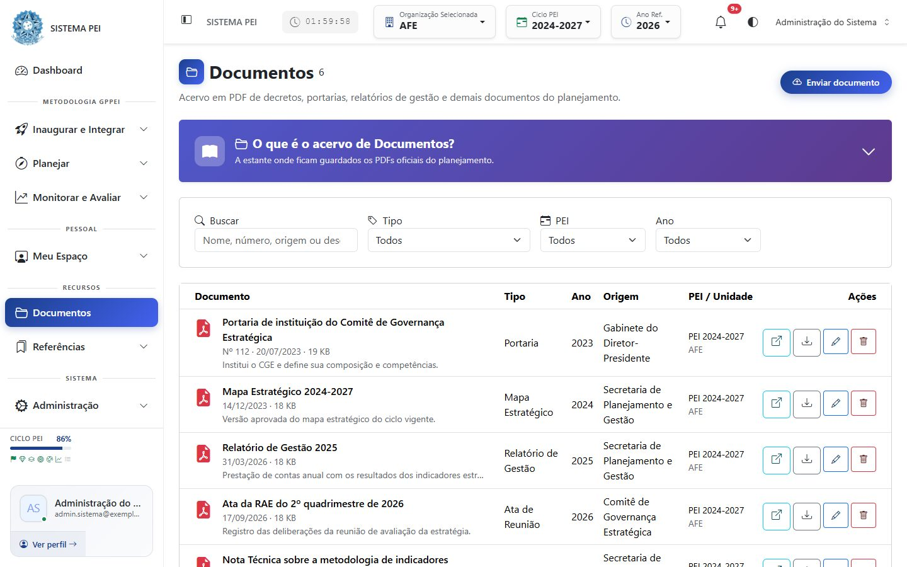
*Figura 86 — Acervo de Documentos.*

Na figura, o Super Administrador está com a unidade AFE selecionada no topo e o acervo mostra 6
documentos.

**Filtros (faixa acima da tabela):**

- **Buscar** — procura o texto digitado no nome, no número, na origem e na descrição do documento.
  A lista se atualiza enquanto você digita.
- **Tipo** — mostra só os documentos de um tipo (Portaria, Relatório de Gestão, Ata de Reunião…).
- **PEI** — mostra só os documentos ligados a um ciclo (ex.: PEI 2024-2027).
- **Ano** — mostra só os documentos de um **ano de referência**. A lista traz apenas os anos que
  têm documento.
- **Limpar** — aparece quando há algum filtro ativo e volta tudo para "Todos".

**Colunas da tabela:**

| Coluna | O que mostra |
|---|---|
| **Documento** | Ícone de PDF, nome do documento (clicável — abre o PDF em nova aba) e, abaixo, número, data do documento, tamanho do arquivo e o início da ementa/descrição. |
| **Tipo** | O tipo escolhido no cadastro. |
| **Ano** | O ano de referência ("—" se não informado). |
| **Origem** | Quem emitiu o documento ("—" se não informado). |
| **PEI / Unidade** | O ciclo ligado ("Sem PEI" se nenhum) e a unidade dona do documento (sigla) ou **Institucional**. |
| **Ações** | Os botões de cada documento (abaixo). |

**Botões de cada linha (da esquerda para a direita):**

- **Abrir PDF em nova aba** (seta saindo da caixa, verde-azulado) — abre o arquivo no navegador.
- **Baixar arquivo** (seta para baixo) — baixa o PDF com o nome original do arquivo.
- **Abrir link oficial (fora do sistema)** — só aparece se o documento tem link oficial cadastrado
  (por exemplo, a publicação no Diário Oficial).
- **Editar** (lápis azul) e **Excluir** (lixeira vermelha) — só para quem pode alterar o documento.

A lista é ordenada do documento enviado mais recentemente para o mais antigo e mostra 15 por página.

### 27.5 Enviar um documento

1. Clique em **Enviar documento** (canto superior direito).
2. Na janela **Enviar documento**, clique em **Escolher arquivo** e selecione o PDF.
3. Preencha **Nome do documento** e **Tipo de documento** (obrigatórios).
4. Preencha os demais campos que tiver: número, ano, data, origem, link oficial, PEI, área e ementa.
5. Clique em **Enviar documento**. Enquanto o arquivo sobe, o botão mostra "Gravando…".
6. A janela fecha e aparece a mensagem **"Documento enviado para o acervo."**

### 27.6 Editar um documento

A janela de edição é a mesma do envio, com o título **Editar documento**.

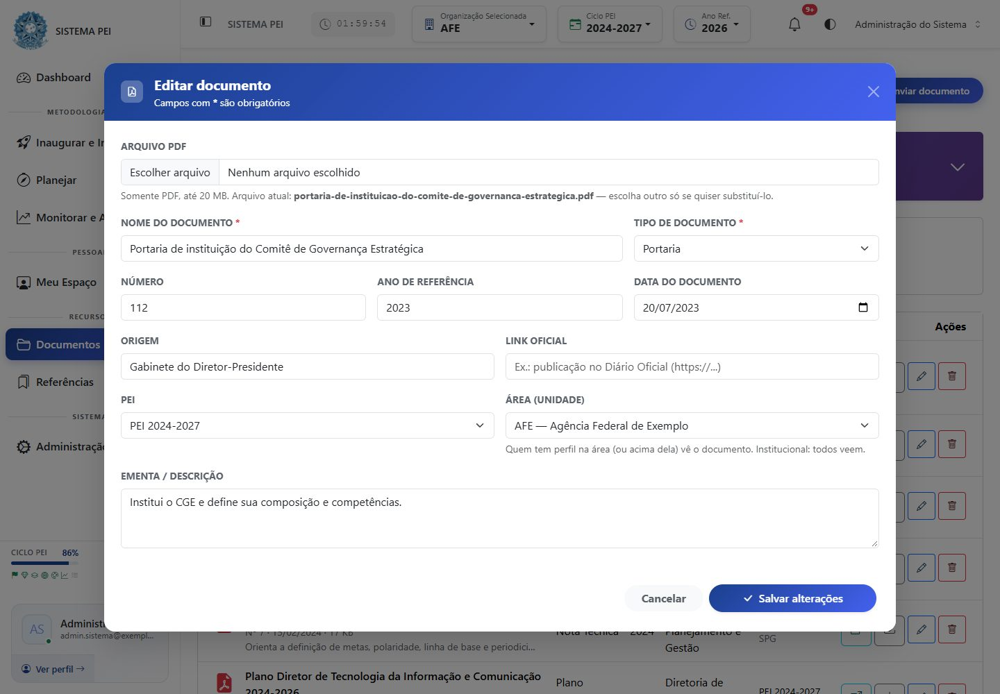
*Figura 87 — Janela Editar documento.*

Na figura, a portaria de instituição do Comitê de Governança Estratégica está aberta para edição.
Abaixo do campo **Arquivo PDF** o sistema mostra o nome do **arquivo atual** e avisa: escolha outro
só se quiser substituí-lo. Os campos com asterisco vermelho (**Nome do documento** e **Tipo de
documento**) são obrigatórios. No rodapé, **Cancelar** fecha sem gravar e **Salvar alterações**
grava.

1. Na linha do documento, clique em **Editar** (lápis).
2. Altere os campos desejados.
3. Para trocar o PDF, escolha um novo arquivo; para manter o atual, deixe o campo vazio.
4. Clique em **Salvar alterações**. Aparece a mensagem **"Documento atualizado."**

Quando você substitui o arquivo, o PDF antigo é apagado do servidor e o novo passa a valer.

### 27.7 Campos do formulário

| Campo | Obrigatório | O que informar | Exemplo |
|---|---|---|---|
| **Arquivo PDF** | Sim no envio; não na edição | Somente PDF, até 20 MB. | portaria-112-2023.pdf |
| **Nome do documento** | Sim | Como o documento deve aparecer na lista (até 255 caracteres). | Portaria de instituição do Comitê de Governança Estratégica |
| **Tipo de documento** | Sim | Escolha na lista agrupada (ver 27.8). | Portaria |
| **Número** | Não | O número do ato (até 60 caracteres). | 112 ou 123/2026 |
| **Ano de referência** | Não | O ano a que o documento se refere, com 4 dígitos. | 2025 (para o Relatório de Gestão 2025) |
| **Data do documento** | Não | Data de assinatura ou de publicação. | 20/07/2023 |
| **Origem** | Não | Órgão ou unidade que emitiu. | Gabinete do Diretor-Presidente |
| **Link oficial** | Não | Endereço completo da publicação oficial, começando por http:// ou https://. | https://… (publicação no Diário Oficial) |
| **PEI** | Não | O ciclo a que o documento se liga. No envio, vem sugerido o ciclo selecionado no topo. "Nenhum (não ligado a um ciclo)" deixa sem ciclo. | PEI 2024-2027 |
| **Área (unidade)** | Não | A unidade dona do documento. Define quem vê (ver 27.9). | SPG — Secretaria de Planejamento e Gestão |
| **Ementa / descrição** | Não | Do que trata o documento (até 5.000 caracteres). | Institui o CGE e define sua composição e competências. |

### 27.8 Tipos de documento

A lista de tipos é agrupada:

- **Atos normativos:** Lei, Lei Complementar, Medida Provisória, Decreto, Decreto Legislativo,
  Portaria, Portaria Conjunta, Portaria Interministerial, Instrução Normativa, Instrução Normativa
  Conjunta, Resolução, Deliberação, Regimento Interno, Estatuto, Ordem de Serviço.
- **Planejamento e gestão:** Plano Estratégico Institucional, Plano Plurianual (PPA), Plano Tático,
  Plano Operacional, Plano Diretor de TI (PDTI), Plano de Integridade, Plano Anual de Contratações,
  Política, Mapa Estratégico, Cadeia de Valor, Termo de Abertura.
- **Relatórios e prestação de contas:** Relatório de Gestão, Relatório de Atividades, Relatório de
  Monitoramento, Relatório de Avaliação, Relatório de Auditoria, Prestação de Contas.
- **Instrumentos e expedientes:** Acordo de Cooperação Técnica, Convênio, Contrato, Termo de
  Referência, Nota Técnica, Parecer, Despacho, Ofício, Memorando, Ata de Reunião.
- **Referência e orientação:** Manual, Guia, Cartilha, Apresentação, Estudo, **Outro** (para o que
  não se encaixar nos demais).

### 27.9 Área (unidade) e quem vê o documento

- **Institucional (vale para todo o órgão)** — todos os perfis de todas as unidades veem. Esta opção
  só aparece para o Super Administrador e para o Administrador da unidade raiz.
- **Uma unidade** (ex.: SPG) — veem quem tem perfil nessa unidade e quem tem perfil de Administrador
  ou Consulta numa unidade acima dela. A dica abaixo do campo resume: "Quem tem perfil na área (ou
  acima dela) vê o documento. Institucional: todos veem."
- A lista de unidades mostra só aquelas em que você pode enviar documento.

### 27.10 Excluir um documento

1. Na linha do documento, clique em **Excluir** (lixeira).
2. A janela **Excluir documento?** mostra o nome e avisa que ele sai do acervo e deixa de aparecer
   para todos, e que a exclusão fica registrada na auditoria.
3. Clique em **Excluir** para confirmar ou **Cancelar** para desistir.
4. Aparece a mensagem **"Documento excluído do acervo."**

### 27.11 Regras e validações

| Situação | Mensagem do sistema |
|---|---|
| Envio sem arquivo | "Selecione o arquivo PDF." |
| Arquivo que não é PDF | "O arquivo precisa ser um PDF." |
| Arquivo com extensão .pdf, mas conteúdo que não é PDF | "O arquivo enviado não é um PDF válido." (o sistema confere o conteúdo, não só o nome) |
| Arquivo acima de 20 MB | "O PDF pode ter no máximo 20 MB." |
| Nome vazio | "Informe o nome do documento." |
| Tipo não escolhido | "Selecione o tipo de documento." |
| Link incompleto | "Informe um endereço completo, começando por http:// ou https://." |
| Ano fora do formato | "Informe o ano com quatro dígitos." (aceita de 1900 a 2100) |
| Unidade fora do seu alcance | "Você não pode enviar documentos para esta unidade." |
| Institucional sem permissão | "Documento institucional (sem unidade) só pode ser enviado pelo Super Administrador ou pelo Administrador da unidade raiz." |
| Falha ao gravar | "Não foi possível gravar o documento. Tente novamente; se persistir, acione o suporte." |

### 27.12 Dicas e cuidados

- **Dica:** use sempre o mesmo padrão de nome e de tipo (ex.: "Ata da RAE do 2º quadrimestre de
  2026"), para que o documento seja encontrado depois pela busca.
- **Dica:** preencha o **Ano de referência**: é por ele que o filtro **Ano** funciona.
- **Cuidado:** ao trocar a **Área** de um documento, você muda quem o vê. Um documento movido de
  "Institucional" para uma unidade deixa de aparecer para as demais unidades.
- **Cuidado:** a exclusão tira o documento do acervo para todos. Ela fica registrada na
  **Auditoria** (ver capítulo 33), mas não há botão para desfazer na tela; se precisar recuperar,
  procure o suporte.

---

## 28. Guia GPPEI e Guia de Projetos

### 28.1 Para que serve

O sistema traz embutidos os dois guias de referência em que ele se baseia:

- o **Guia Prático de PEI (GPPEI/MGI 2025)**, a metodologia de planejamento estratégico que orienta
  os três módulos do sistema;
- o **Guia Prático de Projetos**, a referência para iniciativas, entregas, RACI, comunicação, riscos
  e lições aprendidas.

Assim, quem está preenchendo uma tela consulta a orientação oficial sem sair do sistema.

### 28.2 Como chegar

- Menu lateral, grupo **Recursos** → **Referências** → **Guia GPPEI** ou **Guia de Projetos**.
- **Atalho pelas telas:** muitas telas trazem, no cabeçalho, um link discreto como "GPPEI p.93 ·
  Matriz de Riscos" ou "Guia Projetos p.33 · Indicadores e Resultados-Chave". Ao clicar, o guia abre
  em nova aba **já na página citada**.

### 28.3 Quem pode

Todos os usuários com perfil de acesso. Não há botão de alteração: os guias são somente leitura.

### 28.4 O que aparece na tela

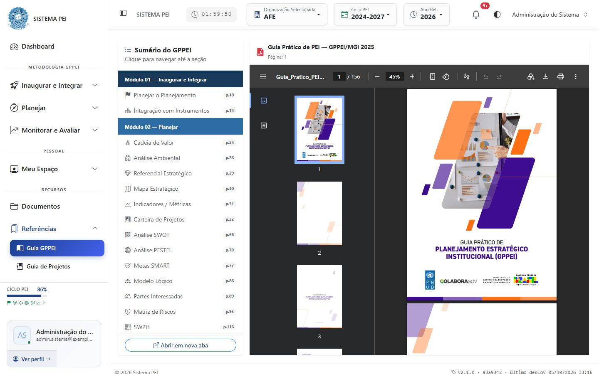
*Figura 88 — Guia GPPEI com sumário lateral.*

A tela tem duas partes:

- **Sumário do GPPEI** (à esquerda) — "Clique para navegar até a seção". Os itens estão agrupados
  por módulo, com o número da página à direita:
  - **Módulo 01 — Inaugurar e Integrar:** Planejar o Planejamento (p.10) e Integração com
    Instrumentos (p.14);
  - **Módulo 02 — Planejar:** Cadeia de Valor (p.24), Análise Ambiental (p.26), Referencial
    Estratégico (p.29), Mapa Estratégico (p.30), Indicadores / Métricas (p.31), Carteira de Projetos
    (p.32), Análise SWOT (p.66), Análise PESTEL (p.70), Metas SMART (p.77), Modelo Lógico (p.86),
    Partes Interessadas (p.89), Matriz de Riscos (p.93) e 5W2H (p.116).
  - No pé do sumário, o botão **Abrir em nova aba** abre o PDF inteiro numa aba própria.
- **Leitor do PDF** (à direita) — mostra o título "Guia Prático de PEI — GPPEI/MGI 2025" e a página
  atual. A barra escura do leitor é a do próprio navegador: miniaturas das páginas, campo da página
  (na figura, "1 / 156"), zoom (**−**, percentual, **+**), girar, baixar e imprimir.

### 28.5 Passo a passo

1. Abra **Referências** → **Guia GPPEI**.
2. No sumário, clique no tema que procura (ex.: **Matriz de Riscos**). O leitor salta para a página.
3. Use o zoom do leitor para ajustar a leitura ou **Abrir em nova aba** para ler em tela cheia.

O **Guia de Projetos** funciona da mesma forma, com o **Sumário do Guia** à esquerda. Os itens são:
Apresentação e Objetivos (p.1), Como Usar Este Guia (p.7), Estrutura dos Domínios (p.12), Início do
Domínio 1 (p.15), TAP — Termo de Abertura (p.23), Início do Domínio 2 (p.28), Indicadores e
Resultados-Chave (p.33), EAP — Estrutura Analítica (p.36), Início do Domínio 3 (p.85), Matriz RACI
(p.89), Início do Domínio 4 (p.105), Monitoramento de Entregas (p.115), Início do Domínio 5 (p.143),
Plano de Comunicação (p.155), Início do Domínio 6 (p.165), Mapeamento de Riscos (p.170), Início do
Domínio 7 (p.227) e Lições Aprendidas (p.230).

### 28.6 Dicas

- As referências "GPPEI p.N" espalhadas pelas telas são o caminho mais rápido: levam direto ao
  trecho do guia que explica aquela tela.
- Para guardar uma cópia, use o botão de baixar da barra do leitor.

---

## 29. Organizações (unidades)

### 29.1 Para que serve

A tela **Unidades Organizacionais** mantém a árvore do órgão: a **unidade raiz** (o órgão como um
todo) e as unidades que fazem parte dele, em quantos níveis forem necessários. A árvore é a base de
tudo no sistema: todo perfil de acesso é dado **numa unidade**, todo indicador e toda iniciativa
pertencem a uma unidade, e os resultados das unidades filhas se consolidam na unidade superior.

Na demonstração, a raiz é a **Agência Federal de Exemplo (AFE)**; abaixo dela estão a **SPG**
(Secretaria de Planejamento e Gestão) e a **DAC** (Diretoria de Atendimento ao Cidadão); abaixo da
SPG, a **DTI** (Diretoria de Tecnologia da Informação).

### 29.2 Como chegar

Menu lateral, grupo **Sistema** → **Administração** → **Organizações**.

### 29.3 Quem pode

| Perfil | Vê | Altera |
|---|---|---|
| **Super Administrador** | Todas as unidades | Cria, edita e exclui qualquer unidade; é o único que define uma unidade raiz |
| **Administrador da Unidade** | A sua unidade e as subordinadas | Edita a sua unidade e as subordinadas (sigla, nome e unidade superior) |
| **Gestor(a) Responsável**, **Gestor(a) Substituto(a)** e **Consulta** | As unidades do seu alcance | Nada |

- **Nova Organização** e **Excluir** aparecem só para o Super Administrador.
- No detalhe de uma unidade, a aba **Usuários** (com nome e e-mail das pessoas) aparece só para
  quem administra usuários daquela unidade.

### 29.4 O que aparece na tela

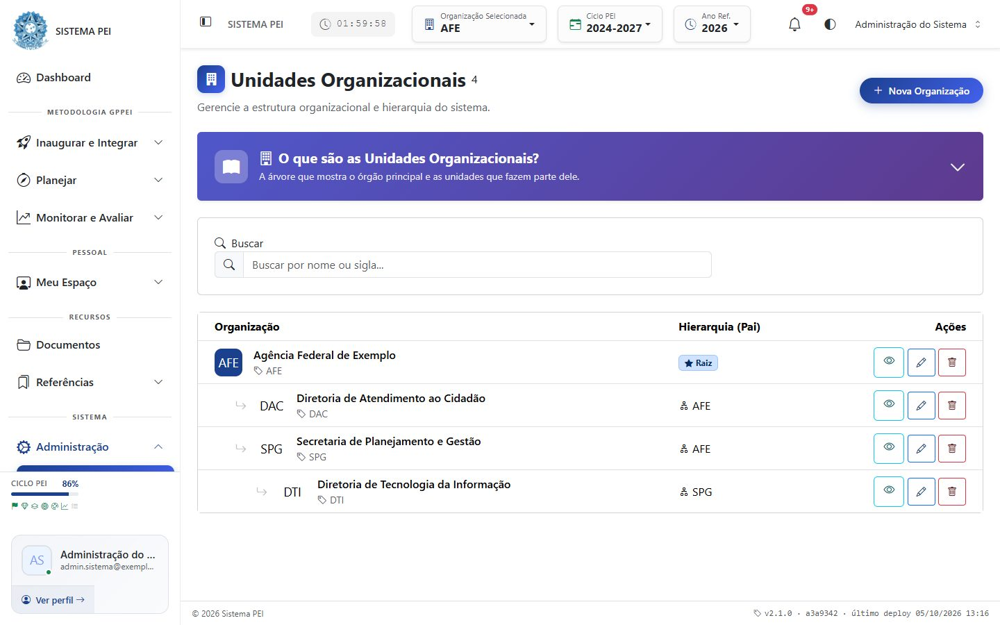
*Figura 89 — Lista de Unidades Organizacionais.*

- **Título** "Unidades Organizacionais" com o total de unidades (na figura, 4).
- **Nova Organização** (canto superior direito) — abre o cadastro.
- Seção educativa **"O que são as Unidades Organizacionais?"**.
- **Buscar** — procura pelo nome ou pela sigla. Sem busca, a lista aparece **em árvore**: cada unidade
  logo abaixo da sua superior, recuada e com uma seta (↳). Com busca, a lista vira uma lista simples
  em ordem alfabética.
- **Coluna Organização** — sigla em destaque, nome e etiqueta com a sigla.
- **Coluna Hierarquia (Pai)** — a sigla da unidade superior. A raiz mostra o selo **★ Raiz**.
- **Ações** — **Detalhar** (olho), **Editar** (lápis) e **Excluir** (lixeira), conforme o perfil.

### 29.5 Cadastrar uma unidade

1. Clique em **Nova Organização**.
2. Na janela **Nova Unidade Organizacional**, preencha **Sigla** e **Nome da Unidade**.
3. Em **Unidade Superior (Pai)**, escolha a unidade a que a nova unidade se subordina. Para cadastrar a
   raiz do órgão, escolha **Unidade Master (Raiz)**.
4. Clique em **Confirmar e Criar**. Aparece a janela de confirmação "Sucesso Institucional!" com o nome da
   unidade; clique no botão dela para fechar.

### 29.6 Editar uma unidade

A janela de edição tem o título **Configurar Unidade Organizacional**.

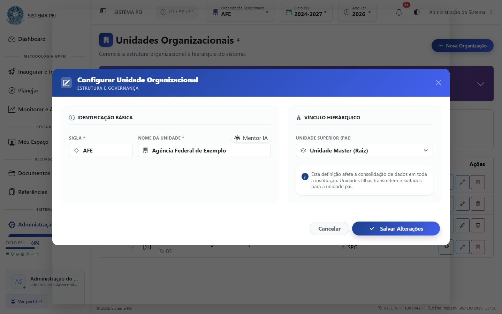
*Figura 90 — Janela Configurar Unidade Organizacional.*

Ela se divide em dois blocos:

- **Identificação básica** — **Sigla** e **Nome da Unidade** (ambos obrigatórios). Ao lado do nome
  fica o botão **Mentor IA** (ver 29.8).
- **Vínculo hierárquico** — **Unidade Superior (Pai)**. A nota abaixo lembra que essa definição afeta
  a consolidação dos dados: as unidades filhas transmitem resultados para a unidade pai.

Na figura, a AFE aparece com **Unidade Master (Raiz)**, porque é a raiz.

1. Na linha da unidade, clique em **Editar** (lápis). Também é possível clicar em **Editar** no
   detalhe da unidade: a lista abre já com a janela aberta.
2. Altere o que precisar.
3. Clique em **Salvar Alterações**. Aparece a confirmação "Unidade organizacional atualizada com
   sucesso."

### 29.7 Campos do formulário

| Campo | Obrigatório | O que informar | Exemplo |
|---|---|---|---|
| **Sigla** | Sim | Sigla oficial da unidade (até 20 caracteres). | DTI |
| **Nome da Unidade** | Sim | Nome por extenso (até 255 caracteres). | Diretoria de Tecnologia da Informação |
| **Unidade Superior (Pai)** | Não | A unidade a que esta se subordina. **Unidade Master (Raiz)** = sem superior. | SPG |

### 29.8 Mentor IA

O botão **Mentor IA**, ao lado do nome, pede ao agente de IA uma sugestão de **sigla** e de três
possíveis subunidades a partir do nome digitado. Digite o nome primeiro; sem ele aparece "Digite o
nome da organização primeiro.". Para usar a sigla sugerida, clique no botão de aplicar da caixa de
sugestão. O botão só aparece com a IA configurada (ver capítulo 32) e é uma sugestão: confira antes
de salvar.

### 29.9 Regras e validações

- **"A unidade superior não pode ser a própria unidade nem uma subordinada a ela."** — impede
  criar um laço na árvore.
- **"Somente o Super Administrador define uma unidade raiz. Escolha a unidade superior."** — o
  Administrador da Unidade não pode transformar uma unidade em raiz.
- **"Escolha como superior uma unidade que você administra."** — o Administrador da Unidade só pode
  pendurar uma unidade debaixo de outra que ele administra.
- Se a gravação falhar, aparece a janela "Falha na Governança" com a orientação: "Não foi possível
  salvar a unidade. Confira os campos e tente de novo; se persistir, informe o suporte."

### 29.10 Excluir uma unidade

1. Na linha da unidade, clique em **Excluir** (lixeira) — só o Super Administrador vê o botão.
2. A janela **Excluir Organização** pergunta se deseja excluir e avisa que todos os dados associados
   podem ser afetados.
3. Clique em **Excluir** para confirmar.

**Cuidado:** o sistema não impede a exclusão de uma unidade que ainda tem subunidades, usuários,
indicadores ou iniciativas. Antes de excluir, mova as subunidades para outra superior e retire os
vínculos dos usuários. Prefira excluir só unidades criadas por engano e ainda vazias.

### 29.11 Detalhe da unidade

Clique em **Detalhar** (olho) na linha da unidade. A figura mostra o detalhe da SPG.

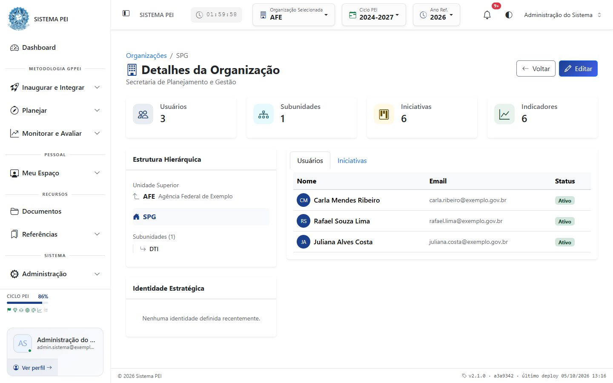
*Figura 91 — Detalhes da Organização.*

- **Topo:** trilha "Organizações / sigla" (na figura, "Organizações / SPG"), o título **Detalhes da
  Organização** com o nome da unidade e os botões **Voltar** e **Editar** (este só para quem pode
  editar; abre a janela de edição na lista de unidades).
- **Quatro contadores:** **Usuários** vinculados, **Subunidades**, **Iniciativas** da unidade e
  **Indicadores** ligados à unidade. Na figura, a SPG tem 3 usuários, 1 subunidade, 6 iniciativas e
  6 indicadores.
- **Estrutura Hierárquica:** a **Unidade Superior** (clicável — na figura, "AFE Agência Federal de
  Exemplo"), a própria unidade em destaque (SPG) e a lista de **Subunidades** (na figura, "Subunidades
  (1)": DTI). Cada unidade da lista é clicável e leva ao detalhe dela.
- **Identidade Estratégica:** a missão e a visão registradas para a unidade; sem registro, aparece
  "Nenhuma identidade definida recentemente.", como na figura.
- **Abas à direita:**
  - **Usuários** — **Nome**, **Email** e **Status** (Ativo/Inativo) de quem tem vínculo com a unidade
    (na figura, Carla Mendes Ribeiro, Rafael Souza Lima e Juliana Alves Costa, todos ativos). Só para
    quem administra usuários da unidade.
  - **Iniciativas** — as iniciativas da unidade, com responsável e status.

### 29.12 Dicas

- Cadastre a árvore **de cima para baixo**: primeiro a raiz, depois as unidades do primeiro nível,
  depois as subordinadas.
- Use as siglas oficiais: é a sigla que aparece nos seletores, nas listas e nos relatórios.

---

## 30. Usuários

### 30.1 Para que serve

A tela **Usuários** cadastra as pessoas que acessam o sistema e define, para cada uma, os
**vínculos**: em qual **unidade** ela atua e com qual **perfil de acesso**. É o perfil, naquela
unidade, que decide o que a pessoa vê e o que pode alterar (ver capítulo 4). Manter esta tela em dia
é um controle de segurança: quem muda de função ou deixa o órgão deve ter os vínculos ajustados ou a
conta desativada no mesmo dia.

### 30.2 Como chegar

Menu lateral, grupo **Sistema** → **Administração** → **Usuários**. Na tela **Perfis de Acesso**, o
botão **Gerenciar Usuários** também leva até aqui.

### 30.3 Quem pode

| Perfil | O que faz |
|---|---|
| **Super Administrador** | Vê todos os usuários; cria, edita, desativa e exclui. |
| **Administrador da Unidade** | Consulta (sem alterar) os usuários que têm vínculo com a sua unidade ou com as subordinadas. |
| **Gestores** e **Consulta** | Não acessam esta tela (o item não aparece no menu). |

- O Super Administrador não pode excluir a própria conta por esta tela (o botão **Excluir** não
  aparece na linha dele).
- Todo usuário pode abrir o **próprio** detalhe.

### 30.4 O que aparece na tela

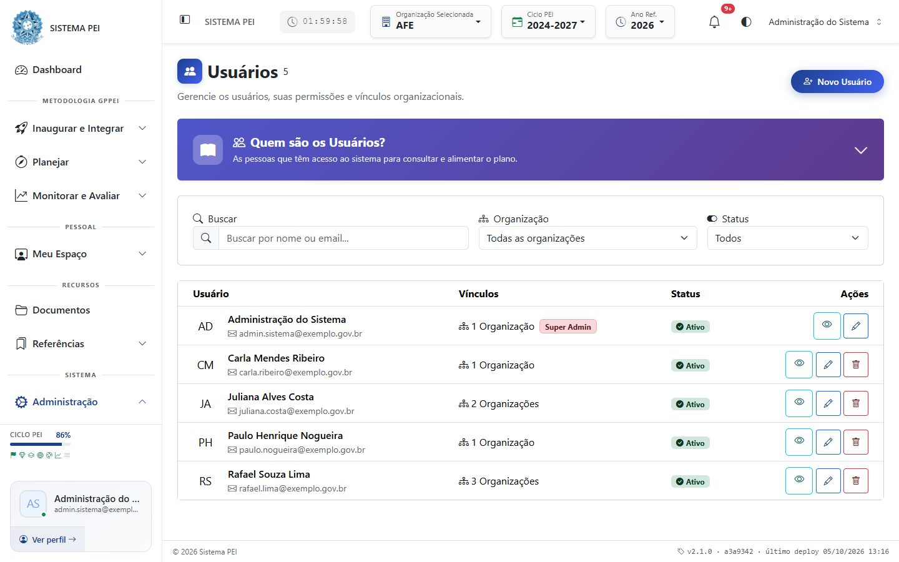
*Figura 92 — Lista de Usuários.*

- **Título** "Usuários" com o total (na figura, 5) e o botão **Novo Usuário** (só Super
  Administrador).
- Seção educativa **"Quem são os Usuários?"**.
- **Filtros:**
  - **Buscar** — por nome ou e-mail;
  - **Organização** — mostra só quem tem vínculo com a unidade escolhida (a lista traz as unidades
    que você administra);
  - **Status** — **Todos**, **Ativos** ou **Inativos**.
  Os filtros ativos aparecem como etiquetas logo abaixo; clicar numa etiqueta remove aquele filtro.
- **Colunas:**
  - **Usuário** — iniciais, nome e e-mail;
  - **Vínculos** — quantas unidades a pessoa tem (passe o mouse para ver as siglas); "Sem vínculos"
    se não tiver nenhuma; o selo **Super Admin** identifica o Super Administrador;
  - **Status** — **Ativo** (verde) ou **Inativo**;
  - **Ações** — **Detalhar** (olho), **Editar** (lápis) e **Excluir** (lixeira), conforme o perfil.

A lista é ordenada pelo nome e mostra 10 usuários por página.

### 30.5 Cadastrar um usuário

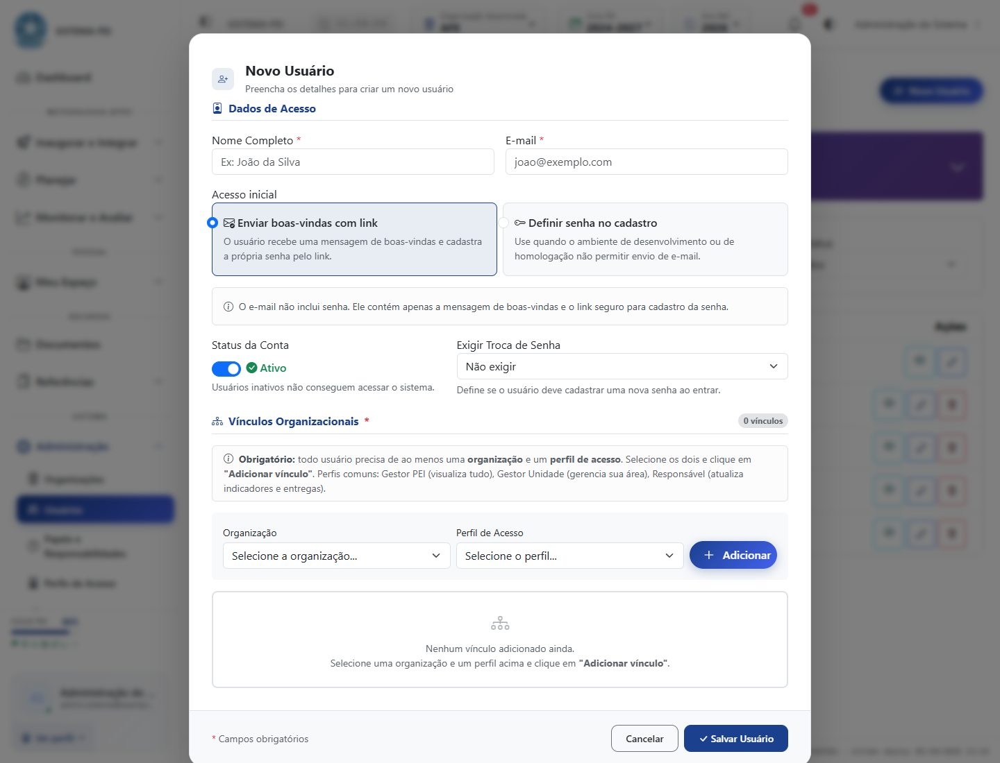
*Figura 93 — Janela Novo Usuário.*

A janela **Novo Usuário** tem três partes: **Dados de Acesso** (nome e e-mail), **Acesso inicial**
(como a senha será definida) com **Status da Conta** e **Exigir Troca de Senha**, e **Vínculos
Organizacionais**.

1. Clique em **Novo Usuário**.
2. Preencha **Nome Completo** e **E-mail**.
3. Em **Acesso inicial**, escolha a forma de definir a senha (ver 30.6). **Se o envio de e-mail não
   estiver configurado no seu órgão, escolha "Definir senha no cadastro".**
4. Se escolheu **Definir senha no cadastro**, preencha **Senha inicial** e **Confirmar senha** e, em
   **Exigir Troca de Senha**, escolha **Sim — no próximo acesso**.
5. Deixe **Status da Conta** em **Ativo**.
6. Em **Vínculos Organizacionais**, escolha a **Organização** e o **Perfil de Acesso** e clique em
   **Adicionar**. Repita para cada vínculo (ver 30.7).
7. Clique em **Salvar Usuário**.
8. Uma janela de confirmação mostra o resultado: "Usuário criado com sucesso. Senha inicial definida
   pelo gestor." ou "Usuário criado com sucesso. Boas-vindas com link para cadastro de senha enviadas
   por e-mail.".
9. Se escolheu a senha definida no cadastro, informe a senha à pessoa por um canal seguro (pessoalmente
   ou por mensagem que só ela leia), nunca em grupo ou em mensagem aberta.

### 30.6 As duas formas de senha inicial

| Opção na tela | Como funciona | Quando usar |
|---|---|---|
| **Enviar boas-vindas com link** (vem marcada) | O sistema cria a conta com uma senha aleatória, que ninguém conhece, e envia à pessoa um e-mail de boas-vindas com um link seguro para ela cadastrar a própria senha. O e-mail não contém senha. O link vale por 60 minutos. A conta já nasce marcada para troca de senha. | Só quando o **envio de e-mail estiver configurado no seu órgão**. |
| **Definir senha no cadastro** | Você digita a senha inicial e a confirmação. A mensagem de sucesso confirma: "Senha inicial definida pelo gestor." | **Sempre que o órgão não tiver envio de e-mail configurado.** A própria tela indica esta opção quando o ambiente não permite envio de e-mail. |

**Importante sobre o envio por link:** se o e-mail não puder ser enviado, o cadastro **não é
concluído** — nada é gravado e aparece a janela "Falha na transação" com a orientação "Não foi
possível concluir o cadastro. Nenhuma confirmação de sucesso foi emitida. Verifique a configuração de
e-mail, os dados informados e tente novamente.". Nesse caso, refaça o cadastro com **Definir senha no
cadastro**.

**Regras da senha** (valem aqui, na troca de senha e no Perfil): no mínimo 8 caracteres, com pelo
menos uma letra maiúscula, uma letra minúscula, um número e um caractere especial. Um medidor de força
aparece abaixo dos campos enquanto você digita.

### 30.7 Vínculos: usuário × unidade × perfil

Cada vínculo é um par **unidade + perfil**. Uma pessoa pode ter vários vínculos — por exemplo,
Administradora na SPG e Consulta na DAC.

- **Todo usuário ativo precisa de ao menos um vínculo.** Sem vínculo, o sistema recusa: "O usuário
  precisa de pelo menos um vínculo: selecione uma organização e um perfil de acesso e clique em
  'Adicionar vínculo'."
- Se você escolheu organização e perfil mas esqueceu de clicar em **Adicionar**, a tela avisa ("Você
  selecionou um vínculo. Clique em 'Adicionar vínculo'…") e, ao salvar, o sistema inclui esse vínculo
  automaticamente.
- O mesmo par repetido é recusado: "Este vínculo já existe."
- Para retirar um vínculo da lista, clique no ícone de remover da linha dele, antes de salvar.
- **O perfil vale na unidade do vínculo.** O perfil de Administrador da Unidade e o de Consulta valem
  também nas unidades abaixo; os perfis de Gestor valem na própria unidade (ver capítulo 4).
- Quem recebe o perfil **Super Administrador** em qualquer vínculo passa a ter acesso total ao
  sistema.

**Vínculo com uma iniciativa não é feito aqui.** O Gestor(a) Responsável e o Gestor(a) Substituto(a)
de uma iniciativa são designados na própria iniciativa, em **Gestores e Responsáveis** (ver capítulo
20). Esses vínculos não aparecem na lista de vínculos desta janela, e editar o usuário aqui **não os
apaga**.

Exemplos com os usuários da demonstração:

| Usuário | Vínculo |
|---|---|
| Carla Mendes Ribeiro | SPG — Administrador da Unidade |
| Paulo Henrique Nogueira | AFE — Consulta |
| Rafael Souza Lima | Gestor(a) Responsável de iniciativas da SPG, da DTI e da DAC (designado nas iniciativas) |
| Juliana Alves Costa | Gestora Substituta de iniciativas da SPG e da DAC (designada nas iniciativas) |

### 30.8 Campos do formulário

| Campo | Obrigatório | O que informar | Exemplo |
|---|---|---|---|
| **Nome Completo** | Sim | Nome da pessoa (até 255 caracteres). | Carla Mendes Ribeiro |
| **E-mail** | Sim | E-mail institucional. É o login da pessoa e não pode repetir outro já cadastrado. | carla.ribeiro@exemplo.gov.br |
| **Acesso inicial** | Sim (só no cadastro) | **Enviar boas-vindas com link** ou **Definir senha no cadastro**. | Definir senha no cadastro |
| **Senha inicial** / **Confirmar senha** | Sim, se escolheu definir a senha | Senha que segue as regras de 30.6. | — |
| **Nova senha** / **Confirmar senha** | Não (só na edição) | Preencha só se quiser trocar a senha da pessoa. "Deixe em branco para manter." | — |
| **Status da Conta** | — | Chave **Ativo** / **Inativo**. "Usuários inativos não conseguem acessar o sistema." | Ativo |
| **Exigir Troca de Senha** | — | **Não exigir**; **Sim — no próximo acesso (recomendado para novos usuários)**; **Já trocou (registro histórico)**. | Sim — no próximo acesso |
| **Organização** + **Perfil de Acesso** | Sim (ao menos um vínculo, se ativo) | A unidade e o perfil; clique em **Adicionar**. | SPG + Administrador da Unidade |

### 30.9 Troca de senha no primeiro acesso

Com **Exigir Troca de Senha = Sim — no próximo acesso**, a pessoa, ao entrar, é levada à tela de troca
de senha e não consegue abrir nenhuma outra tela antes de trocar. Ela informa a senha atual (a que
recebeu), a nova senha e a confirmação. Depois de trocar, o sistema encerra a sessão e mostra "Senha
alterada com sucesso! Faça login com a nova senha."; ela entra de novo com a senha nova. A opção passa
a constar como **Já trocou**. Detalhes da tela de troca no capítulo 2.

**Por que exigir a troca:** com a senha definida no cadastro, você conhece a senha inicial. Exigir a
troca garante que só a pessoa conheça a senha que vai usar. Ao escolher **Definir senha no cadastro**, a
opção **Exigir Troca de Senha** continua em **Não exigir** — mude-a para **Sim — no próximo acesso**.

### 30.10 Esqueci minha senha

O link **Esqueci minha senha** da tela de login envia um e-mail com link de redefinição e, por isso,
**só funciona se o envio de e-mail estiver configurado no seu órgão**. Sem e-mail, quem esqueceu a
senha deve procurar o Super Administrador, que:

1. abre **Usuários** e clica em **Editar** na linha da pessoa;
2. preenche **Nova senha** e **Confirmar senha**;
3. muda **Exigir Troca de Senha** para **Sim — no próximo acesso**;
4. clica em **Salvar Usuário** e informa a senha provisória à pessoa por canal seguro.

### 30.11 Editar um usuário

1. Na linha do usuário, clique em **Editar** (lápis) — ou em **Editar** no detalhe do usuário.
2. A janela **Editar Usuário** abre com os dados atuais. Não há escolha de **Acesso inicial** na
   edição: a senha só muda se você preencher **Nova senha**.
3. Altere nome, e-mail, status, troca de senha ou vínculos.
4. Clique em **Salvar Usuário**. Aparece "Usuário atualizado com sucesso.".

### 30.12 Desativar × excluir

**Desativar** bloqueia o acesso e preserva tudo o que a pessoa fez. **Excluir** apaga a conta
definitivamente — e só é permitido para quem **não tem nenhum registro** no sistema.

**Para desativar:**

1. Clique em **Editar** na linha do usuário.
2. Mude a chave **Status da Conta** para **Inativo**.
3. Clique em **Salvar Usuário**.

Uma conta inativa não precisa de vínculo. A pessoa não consegue mais entrar, e o histórico fica
intacto. Para reativar, volte a chave para **Ativo** (com ao menos um vínculo) e salve.

**Para excluir:**

1. Clique em **Excluir** (lixeira) na linha do usuário.
2. O sistema verifica o histórico da pessoa:
   - **Se ela tem registros**, a janela diz **"Este usuário não pode ser excluído"** e lista o que a
     exclusão apagaria — por exemplo, registros na trilha de auditoria, atribuições na matriz RACI,
     entregas sob sua responsabilidade, comentários, anexos, documentos enviados, riscos que monitora,
     relatórios gerados e vínculos de gestor de iniciativa, com a quantidade de cada um. O botão
     oferecido é **Desativar**: "Desativar bloqueia o acesso imediatamente e mantém todo o histórico.
     A conta pode ser reativada depois, se preciso." Ao clicar, aparece "Usuário desativado. Ele não
     consegue mais entrar no sistema, e todo o histórico dele foi preservado.".
   - **Se ela não tem nenhum registro**, a janela **Excluir Usuário** avisa que a conta e os vínculos
     serão apagados definitivamente. O botão é **Excluir Permanentemente**. Ao confirmar, aparece
     "Usuário excluído definitivamente.".

**Por que essa regra:** excluir uma conta com histórico apagaria junto a trilha de auditoria, o RACI e
os comentários dela. Por isso, servidor que saiu do órgão é **desativado**, nunca excluído.

### 30.13 Regras e validações

| Situação | Mensagem do sistema |
|---|---|
| Nome vazio | "Informe o nome completo do usuário." |
| E-mail vazio ou inválido | "Informe o e-mail institucional do usuário." / "Informe um e-mail válido para o usuário." |
| E-mail já usado por outra conta | "Já existe um usuário cadastrado com este e-mail." |
| Senha fora das regras | "A senha deve ter no mínimo 8 caracteres." / "A senha deve conter letra maiúscula, letra minúscula, número e caractere especial." |
| Confirmação diferente | "A confirmação da senha não confere." |
| Usuário ativo sem vínculo | "O usuário precisa de pelo menos um vínculo…" |
| Tentar tirar o perfil ou desativar o único Super Administrador ativo | "Esta é a única conta ativa de Super Administrador. Antes de retirar o perfil ou desativá-la, dê o perfil de Super Administrador a outra conta ativa." |
| Dar perfil a uma conta cujo e-mail não foi confirmado | "O e-mail desta conta ainda não foi confirmado. Peça à pessoa que use o link de confirmação enviado ao e-mail dela; depois disso o perfil pode ser atribuído." |
| Qualquer campo com erro | Janela "Cadastro não concluído": "O cadastro não foi concluído. Revise os campos destacados e tente novamente." |

### 30.14 Detalhe do usuário

Clique em **Detalhar** (olho) na linha do usuário.

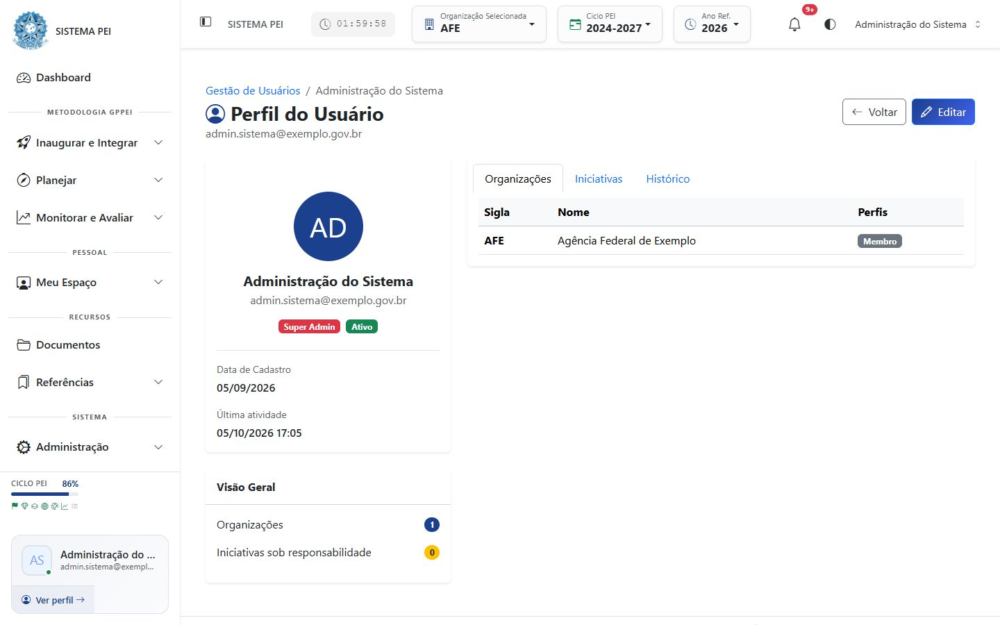
*Figura 94 — Perfil do Usuário (detalhe).*

- **Topo:** trilha "Gestão de Usuários / nome", título **Perfil do Usuário**, e-mail, botões
  **Voltar** e **Editar** (este só para o Super Administrador).
- **Cartão da pessoa:** iniciais, nome, e-mail, selos (**Super Admin**, se for o caso, e
  **Ativo**/**Inativo**), **Data de Cadastro** e **Última atividade** (o último movimento registrado
  numa sessão aberta da pessoa).
- **Visão Geral:** quantidade de **Organizações** e de **Iniciativas sob responsabilidade**.
- **Abas:**
  - **Organizações** — sigla e nome das unidades a que a pessoa está ligada. A coluna **Perfis** mostra
    sempre a etiqueta "Membro", qualquer que seja o perfil; para saber o perfil de cada vínculo, abra
    **Editar** e veja a lista de vínculos.
  - **Iniciativas** — iniciativas em que a pessoa é gestora, com status e prazo. O Administrador da
    Unidade vê só as iniciativas das unidades que administra.
  - **Histórico** — as 30 ações mais recentes da pessoa (Criou, Alterou, Excluiu, Restaurou) com data
    e registro afetado. Só para quem acessa a **Auditoria** (Super Administrador).

### 30.15 Dicas e cuidados

- **Dica:** prefira **Definir senha no cadastro** + **Exigir Troca de Senha = Sim** sempre que não
  houver certeza de que o e-mail do órgão funciona.
- **Cuidado:** o e-mail é o login. Ao corrigir o e-mail de alguém, avise a pessoa.
- **Cuidado:** retirar um vínculo tira o acesso àquela unidade imediatamente.
- **Cuidado:** o sistema não deixa ficar sem Super Administrador ativo; mantenha pelo menos duas
  contas de Super Administrador para não depender de uma só pessoa.

### 30.16 Perguntas frequentes

**A pessoa diz que não recebeu o e-mail de boas-vindas.** O envio de e-mail pode não estar
configurado no seu órgão, ou o link (válido por 60 minutos) expirou. Edite o usuário, defina uma
**Nova senha**, marque **Exigir Troca de Senha = Sim — no próximo acesso** e informe a senha à pessoa.

**Posso criar a conta e dar o perfil depois?** Não para conta ativa: todo usuário ativo precisa de ao
menos um vínculo ao ser salvo.

**Como faço alguém virar gestor de uma iniciativa?** Pela própria iniciativa, em **Gestores e
Responsáveis** (capítulo 20), não por esta tela.

**Existe "Criar conta" na tela de login?** Não. O autocadastro está desligado: contas são criadas só
pelo Super Administrador, nesta tela.

---

## 31. Perfis de Acesso e "assumir identidade"

### 31.1 Para que serve

A tela **Gestão de Perfis de Acesso** mostra os cinco perfis do sistema, quantas pessoas têm cada um e
a **Matriz de Permissões por Funcionalidade** — o que cada perfil pode fazer em cada módulo. A matriz
é lida da mesma regra que o sistema aplica a cada acesso: o que a tela mostra é o que de fato vale.

A mesma tela permite ao Super Administrador **assumir a identidade** de outro usuário, para ver o
sistema exatamente como essa pessoa vê — útil para responder a "por que não aparece o botão para
mim?".

### 31.2 Como chegar

Menu lateral, grupo **Sistema** → **Administração** → **Perfis de Acesso**.

### 31.3 Quem pode

Somente o **Super Administrador** abre esta tela e assume identidades. Os demais perfis não veem o
item no menu. Para todos os perfis existe a tela **Papéis e Responsabilidades** (ver capítulo 4), que
explica em linguagem simples quem pode o quê.

### 31.4 O que aparece na tela

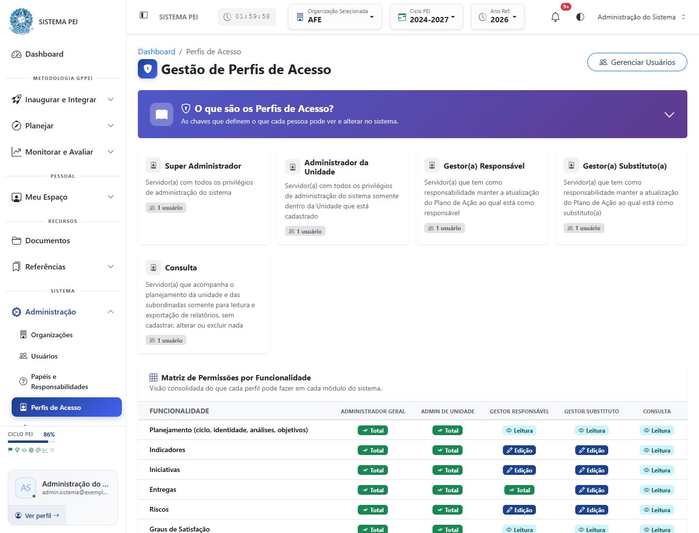
*Figura 95 — Gestão de Perfis de Acesso.*

- **Topo:** trilha "Dashboard / Perfis de Acesso", título e o botão **Gerenciar Usuários** (leva à
  tela de Usuários, capítulo 30).
- Seção educativa **"O que são os Perfis de Acesso?"**.
- **Cartões dos perfis** — um para cada perfil, com a descrição e a quantidade de usuários distintos
  que o têm (na figura, 1 usuário em cada):
  - **Super Administrador** — todos os privilégios de administração do sistema;
  - **Administrador da Unidade** — todos os privilégios, somente dentro da unidade em que está
    cadastrado;
  - **Gestor(a) Responsável** — mantém a atualização da iniciativa de que é responsável;
  - **Gestor(a) Substituto(a)** — mantém a atualização da iniciativa de que é substituto(a);
  - **Consulta** — acompanha o planejamento da unidade e das subordinadas somente para leitura e
    exportação de relatórios, sem cadastrar, alterar ou excluir nada.
- **Matriz de Permissões por Funcionalidade** — uma linha por módulo e uma coluna por perfil. Nas
  colunas, "Administrador Geral" é o Super Administrador e "Admin de Unidade" é o Administrador da
  Unidade. Cada célula tem um selo:

| Selo | Significado |
|---|---|
| **Total** (verde) | Cria, edita e exclui. |
| **Edição** (azul) | Cria e/ou edita, sem excluir. |
| **Leitura** (azul-claro, ícone de olho) | Apenas visualiza. |
| **Sem acesso** (cinza) | Bloqueado. |

Módulos da matriz: Planejamento (ciclo, identidade, análises, objetivos), Indicadores, Iniciativas,
Entregas, Riscos, Graus de Satisfação, Documentos, Relatórios, Organizações, Usuários, Perfis de
Acesso, Auditoria e Configurações do Sistema.

**Como ler a matriz junto com as regras do sistema:**

- O selo diz o máximo que o perfil pode **no módulo**. Sobre ele vale o **escopo**: cada perfil só age
  nas unidades a que está vinculado.
- Para os Gestores, "Edição" em Iniciativas, Indicadores e Riscos vale **só nas iniciativas a que
  estão vinculados** (titularidade).
- O que é da instituição inteira (perspectivas, objetivos estratégicos, graus de satisfação, cadeia de
  valor, documentos institucionais) só o Super Administrador ou o Administrador da **unidade raiz**
  alteram, mesmo que a matriz mostre "Total" para o Administrador da Unidade.
- Perfis de Acesso, Auditoria e Configurações do Sistema são exclusivos do Super Administrador.

### 31.5 Assumir identidade (impersonação)

Mais abaixo, na mesma tela, fica o bloco **Assumir Identidade (Impersonação)**: "Visualize o sistema
como outro usuário para diagnóstico. Toda ação fica registrada em log e exibe um banner de aviso." Ele
traz uma busca (**Buscar usuário por nome ou e-mail…**) e a lista de usuários com **Usuário**,
**E-mail**, **Situação** e **Ação**. Você não aparece na lista.

**Passo a passo para assumir:**

1. Em **Perfis de Acesso**, desça até **Assumir Identidade (Impersonação)**.
2. Busque a pessoa pelo nome ou e-mail.
3. Clique em **Assumir** na linha dela.
4. Confirme a pergunta "Assumir a identidade de [nome]?".
5. O sistema abre o **Dashboard** já com a identidade da pessoa e mostra "Você está agora visualizando o
   sistema como [nome]."

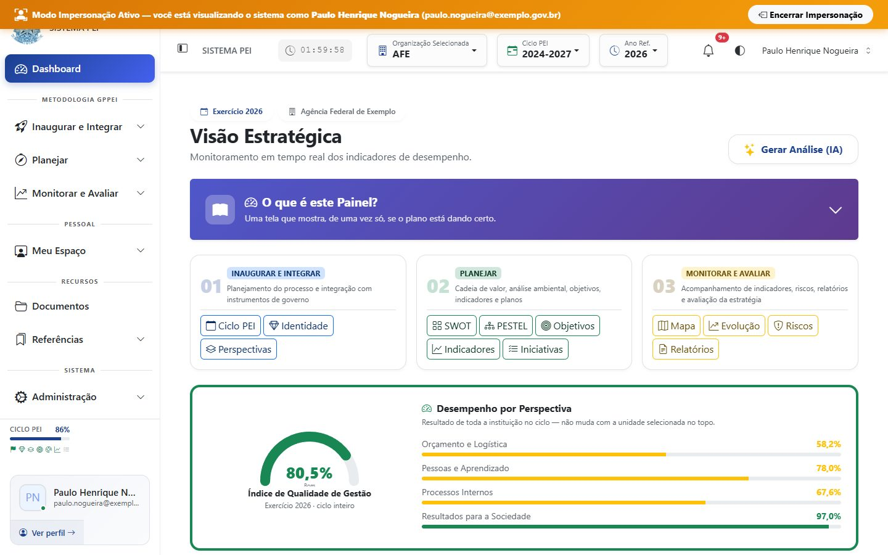
*Figura 96 — Sistema com identidade assumida.*

Na figura, o Super Administrador assumiu a identidade de Paulo Henrique Nogueira (perfil Consulta).
Enquanto a identidade estiver assumida:

- uma **faixa laranja no topo** mostra "Modo Impersonação Ativo — você está visualizando o sistema
  como [nome] ([e-mail])" e o botão **Encerrar Impersonação**;
- o nome no canto superior direito e o cartão no pé do menu passam a ser os da pessoa assumida;
- o menu, os seletores, os botões e os dados são exatamente os que a pessoa vê — na figura, o painel
  **Visão Estratégica** da AFE, exercício 2026, como Paulo o enxerga.

**Passo a passo para encerrar:**

1. Clique em **Encerrar Impersonação**, na faixa laranja do topo.
2. Você volta à sua própria identidade, na tela **Perfis de Acesso**, com a mensagem "Impersonação
   encerrada. Você voltou à sua identidade.".

### 31.6 Regras da impersonação

- Só o **Super Administrador** assume identidades.
- **Não é possível** assumir a identidade de outro Super Administrador (aparece "Não assumível") nem
  de uma conta inativa (aparece "Conta inativa"). Mensagem: "Não é possível assumir a identidade de
  outro Super Administrador nem de uma conta inativa."
- **Não é possível** assumir uma segunda identidade sem antes encerrar a atual.
- Se a pessoa assumida tem troca de senha pendente, o sistema **não** exige a troca de quem está
  assumindo: a senha é dela, não sua.
- O botão **Encerrar Impersonação** funciona mesmo que a pessoa assumida não tenha perfil.

### 31.7 A auditoria registra o autor real

Tudo o que você altera enquanto assume uma identidade fica na **Auditoria** em **seu nome** — o autor
real, quem estava ao teclado —, com a marca **"como [nome da pessoa assumida]"**. No detalhe do
registro aparece "Gravado assumindo a identidade de [nome]". Além disso, o início e o fim de cada
impersonação ficam registrados no log do servidor. Ver capítulo 33.

### 31.8 Cuidados

- **Cuidado:** com a identidade assumida, as alterações são reais. Use a impersonação para olhar; se
  precisar corrigir algo, prefira encerrar e corrigir com a sua conta.
- **Cuidado:** encerre a impersonação ao terminar. Ela continua ativa enquanto a sessão estiver
  aberta.

---

## 32. Configurações — agente de IA

### 32.1 Para que serve

A tela **Configuração Agente IA** liga o sistema a um serviço de inteligência artificial contratado
pelo órgão. Com ele configurado, várias telas oferecem botões de IA — análise do Dashboard, sugestões
de missão e visão, de temas, de itens PESTEL e SWOT, a sigla no cadastro de unidades, análises em
relatórios. O texto da IA é sempre um **rascunho**: quem usa valida antes de aproveitar.

### 32.2 Como chegar

Menu lateral, grupo **Sistema** → **Administração** → **Configurações**.

### 32.3 Quem pode

Somente o **Super Administrador**.

### 32.4 O que aparece na tela

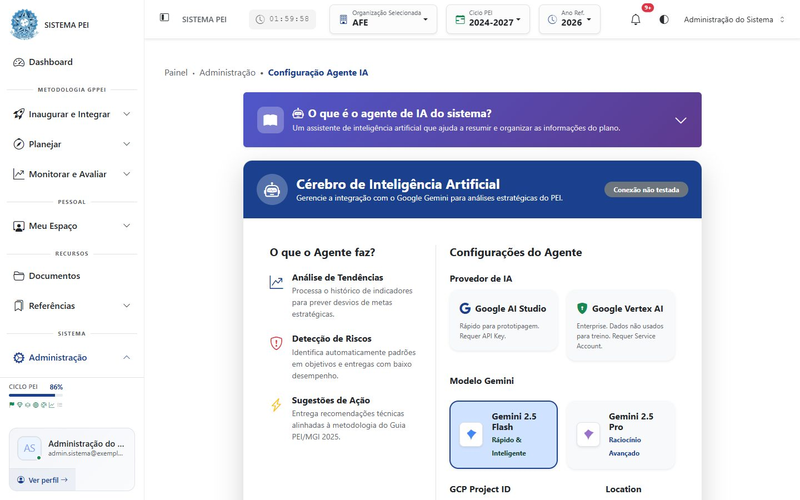
*Figura 97 — Configuração do agente de IA.*

- **Topo:** trilha "Painel • Administração • Configuração Agente IA" e a seção educativa **"O que é o
  agente de IA do sistema?"**.
- **Faixa azul "Cérebro de Inteligência Artificial"** — com o **selo de conexão** à direita:
  - **Conexão não testada** (cinza) — ainda não se testou nesta visita à tela;
  - **Testando...** — teste em andamento;
  - **Conexão verificada** (verde) — o último teste funcionou;
  - **Falha na conexão** (vermelho) — o último teste falhou.
  O selo mostra só o resultado do botão de teste; ele não muda sozinho.
- **O que o Agente faz?** (à esquerda) — Análise de Tendências, Detecção de Riscos e Sugestões de
  Ação, alinhadas ao Guia PEI/MGI 2025.
- **Configurações do Agente** (à direita):
  - **Provedor de IA** — dois cartões: **Google AI Studio** ("Rápido para prototipagem. Requer API
    Key.") e **Google Vertex AI** ("Enterprise. Dados não usados para treino. Requer Service
    Account.");
  - **Modelo Gemini** — **Gemini 2.5 Flash** (rápido) ou **Gemini 2.5 Pro** (raciocínio avançado);
  - **Credenciais**, que mudam conforme o provedor (ver 32.5);
  - botões **Salvar e Ativar Agente** e **Testar Comunicação agora**.

### 32.5 Campos do formulário

| Campo | Aparece quando | O que informar |
|---|---|---|
| **Provedor de IA** | Sempre | O serviço contratado pelo órgão. |
| **Modelo Gemini** | Sempre | Flash para respostas rápidas; Pro para análises mais elaboradas. |
| **Chave de API do Google AI** | Provedor Google AI Studio | A chave fornecida pela área de TI do órgão. |
| **GCP Project ID** | Provedor Vertex AI | O identificador do projeto na nuvem do órgão. |
| **Location** | Provedor Vertex AI | A região do serviço (vem preenchida com a padrão). |
| **Service Account JSON Key** | Provedor Vertex AI | O conteúdo do arquivo de credencial da conta de serviço, fornecido pela área de TI. |

**Sobre as credenciais:** a chave de API e o arquivo da conta de serviço são **guardados cifrados** no
banco de dados e **não voltam a aparecer na tela** — depois de salvos, o campo mostra apenas asteriscos.
Para manter a credencial atual, não mexa no campo; para trocá-la, apague os asteriscos e informe a
nova. Nunca envie credenciais por e-mail ou mensagem: peça à área de TI que as entregue diretamente a
quem vai configurar.

### 32.6 Passo a passo

1. Escolha o **Provedor de IA** contratado pelo órgão.
2. Escolha o **Modelo Gemini**.
3. Informe a credencial do provedor escolhido.
4. Clique em **Salvar e Ativar Agente**. Aparece "Configurações do Agente de IA salvas com sucesso!".
5. Clique em **Testar Comunicação agora**. Uma caixa mostra **Sucesso!** ou **Erro de Conexão**, com a
   mensagem do provedor, e o selo do topo muda.

Se faltar a credencial ao testar, aparece "Chave de API não informada." ou "JSON da Service Account não
informado.".

### 32.7 Cuidados

- **Cuidado:** o texto da IA é um rascunho. Leia e corrija antes de usar em documento oficial.
- **Cuidado:** não envie à IA dados pessoais ou sigilosos sem base legal (LGPD). O provedor Vertex AI
  declara que os dados não são usados para treino; confirme com a área de TI o que foi contratado.
- **Cuidado:** a troca de provedor ou de modelo vale para todo o sistema, para todos os usuários.

---

## 33. Auditoria

### 33.1 Para que serve

A **Auditoria** é o registro automático de **quem fez o quê, e quando**, no sistema: cada criação,
alteração, exclusão e restauração de registro fica gravada com o autor, a data e hora, a origem do
acesso e os valores de antes e de depois. No setor público é preciso provar a origem de cada número
publicado; a trilha permite investigar erros, responder aos órgãos de controle e dar segurança a quem
usa os dados.

### 33.2 Como chegar

- Menu lateral, grupo **Sistema** → **Administração** → **Auditoria**.
- **Atalhos:** em algumas telas de detalhe (por exemplo, o detalhe de uma iniciativa) há um link para
  o histórico daquele registro na Auditoria; na aba **Histórico** do detalhe do usuário (capítulo 30),
  cada ação leva ao registro correspondente.

### 33.3 Quem pode

Somente o **Super Administrador**.

### 33.4 O que aparece na tela

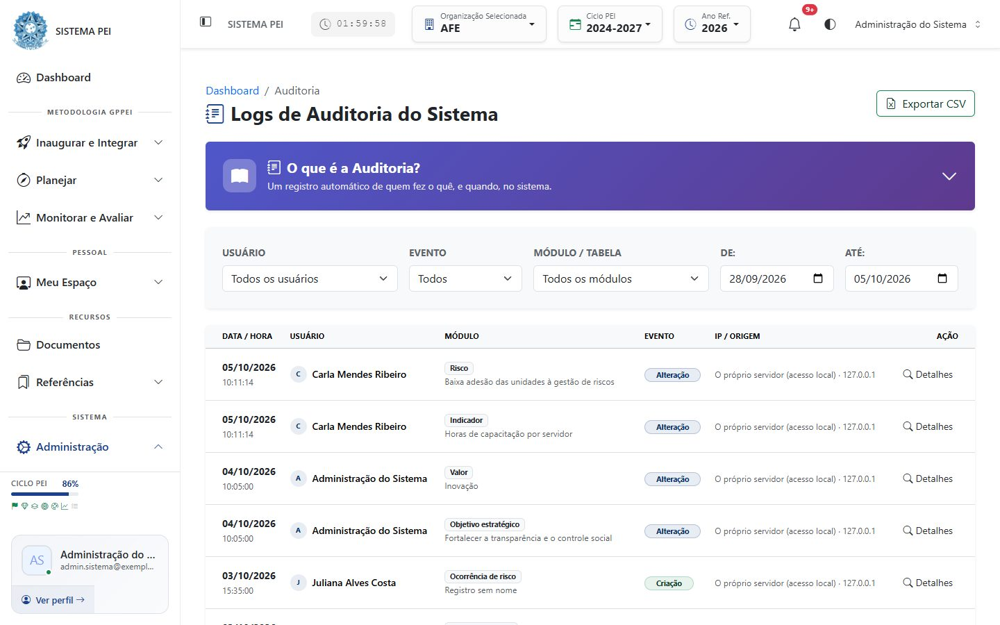
*Figura 98 — Logs de Auditoria do Sistema.*

- **Topo:** trilha "Dashboard / Auditoria", título **Logs de Auditoria do Sistema** e o botão
  **Exportar CSV**.
- Seção educativa **"O que é a Auditoria?"**.
- **Filtros:**
  - **Usuário** — "Todos os usuários" ou uma pessoa (a lista traz só quem tem registro);
  - **Evento** — Todos, **Criação**, **Alteração**, **Exclusão** ou **Restauração**;
  - **Módulo / Tabela** — o tipo de registro (Risco, Indicador, Valor, Objetivo estratégico, Ocorrência
    de risco…);
  - **De:** e **Até:** — o período. Ao abrir a tela, vêm preenchidos com **os últimos 7 dias**.
- **Colunas:**
  - **Data / Hora** do registro;
  - **Usuário** — o autor. Se a ação foi feita com identidade assumida, aparece ao lado a etiqueta
    **"como [nome]"** (ver 31.7). Ações feitas pelo próprio sistema aparecem como "Sistema";
  - **Módulo** — o tipo de registro (etiqueta) e o nome do registro afetado (ex.: "Risco — Baixa adesão
    das unidades à gestão de riscos");
  - **Evento** — Criação (verde), Alteração (azul), Exclusão, Restauração;
  - **IP / Origem** — de onde veio o acesso (na demonstração, "O próprio servidor (acesso local)");
  - **Ação** — **Detalhes**.

A lista mostra os registros mais recentes primeiro, 15 por página.

### 33.5 Passo a passo

**Investigar uma mudança:**

1. Ajuste o período em **De:** e **Até:** (o padrão cobre só os últimos 7 dias).
2. Filtre por **Usuário**, **Evento** ou **Módulo / Tabela**.
3. Clique em **Detalhes** na linha desejada.

**Exportar:**

1. Aplique os filtros desejados.
2. Clique em **Exportar CSV**. O arquivo baixado traz o recorte filtrado com as colunas ID, Data,
   Usuário, Evento, Módulo, ID do registro e IP, separadas por ponto e vírgula, e abre corretamente no
   Excel.

### 33.6 Detalhe de um registro

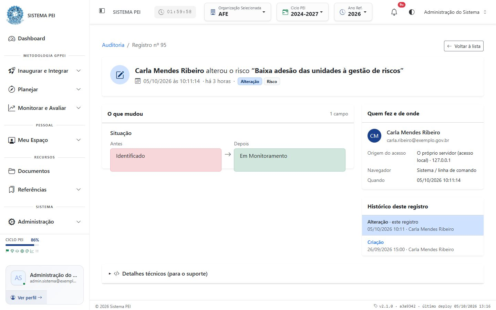
*Figura 99 — Detalhe de um registro de auditoria.*

- **Topo:** trilha "Auditoria / Registro nº N" e o botão **Voltar à lista**.
- **Frase-resumo** — quem fez o quê, em quê e quando. Na figura: "Carla Mendes Ribeiro alterou o risco
  'Baixa adesão das unidades à gestão de riscos'", com data e hora, há quanto tempo, o evento
  (**Alteração**) e o módulo (**Risco**).
- **O que mudou** — cada campo alterado, com o valor **Antes** (fundo vermelho-claro) e **Depois**
  (fundo verde-claro), e a contagem de campos (na figura, "1 campo": a Situação passou de
  "Identificado" para "Em Monitoramento"). Textos longos trazem "Ver o texto completo de antes e de
  depois". Numa exclusão, aparece como o registro estava no momento da exclusão.
- **Quem fez e de onde** — nome e e-mail do autor; se havia identidade assumida, "Gravado assumindo a
  identidade de [nome]"; **Origem do acesso**, **Navegador** e **Quando**.
- **Histórico deste registro** — todas as ações sobre o mesmo registro, da mais recente à mais antiga,
  com a atual destacada; clique numa delas para abri-la. Na figura, o risco foi criado em 26/09/2026 e
  alterado em 05/10/2026, ambos por Carla Mendes Ribeiro.
- **Detalhes técnicos (para o suporte)** — bloco recolhido com o navegador completo e os valores como
  gravados no banco. Serve à equipe de suporte.

### 33.7 Cuidados e perguntas frequentes

- A auditoria é **somente leitura**: não há como alterar ou apagar registros pela tela.
- **"Não encontro uma alteração antiga."** Confira o período: ao abrir, a tela mostra só os últimos 7
  dias.
- **"A alteração aparece em nome do Super Administrador, mas foi feita na conta de outra pessoa."**
  Foi feita com identidade assumida: a auditoria registra sempre o autor real, com a marca "como
  [nome]".
- **Por que um usuário com histórico não pode ser excluído?** Porque a exclusão apagaria os registros
  de auditoria dele. Ver 30.12.

---

## 34. Meu perfil

### 34.1 Para que serve

A tela **Configurações do perfil** reúne o que é da sua conta: nome e e-mail, cor do tema, senha,
autenticação em dois fatores e sessões abertas em outros navegadores.

### 34.2 Como chegar

- No pé do menu lateral, no cartão com o seu nome, clique em **Ver perfil**.
- Ou clique no seu nome, no canto superior direito, e escolha a opção de perfil.

### 34.3 Quem pode

Todo usuário, sobre a própria conta.

### 34.4 O que aparece na tela

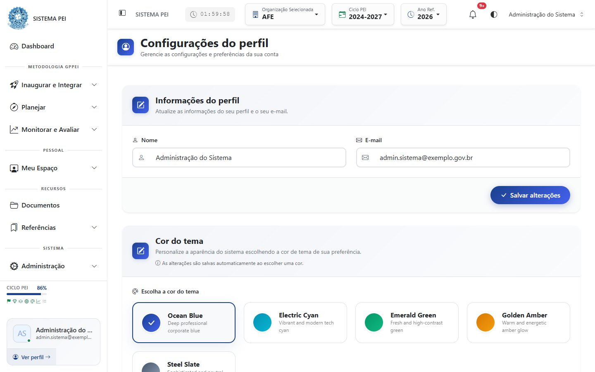
*Figura 100 — Configurações do perfil.*

A tela é uma sequência de blocos. A figura mostra os dois primeiros; os demais aparecem ao rolar a
página.

#### 34.4.1 Informações do perfil

Campos **Nome** e **E-mail** e o botão **Salvar alterações**.

**Cuidado ao trocar o próprio e-mail:** o sistema passa a exigir a confirmação do novo endereço por um
link enviado a ele, e as telas do sistema ficam bloqueadas até a confirmação. **Se o envio de e-mail não
estiver configurado no seu órgão, não troque o e-mail por aqui** — peça ao Super Administrador que faça
a troca pela tela **Usuários** (capítulo 30).

#### 34.4.2 Cor do tema

Escolha a cor de destaque do sistema entre **Ocean Blue** (azul, padrão), **Electric Cyan** (ciano),
**Emerald Green** (verde), **Golden Amber** (âmbar) e **Steel Slate** (cinza). A cor escolhida fica
marcada com um visto e é **salva automaticamente** ao clicar. A preferência vale só para a sua conta.
O tema claro/escuro é outra coisa: ele se troca pelo botão de meia-lua no topo da tela (ver capítulo 3).

#### 34.4.3 Alterar senha

Campos **Senha atual**, **Nova senha** e **Confirmar senha**. Ao salvar, aparece "Senha atualizada com
sucesso!". A nova senha precisa ter no mínimo 8 caracteres, com letra maiúscula, letra minúscula,
número e caractere especial.

O quadro de dicas ao lado da nova senha pede 12 caracteres e 2 caracteres especiais; essa é uma
recomendação de senha forte. O que o sistema exige de fato é a regra acima.

#### 34.4.4 Autenticação em dois fatores

Este recurso **está ativo** no sistema. Ele acrescenta uma segunda prova de identidade ao login: além
da senha, um código de 6 dígitos gerado por um aplicativo autenticador no celular (Google
Authenticator, Microsoft Authenticator ou similar).

1. No bloco **Autenticação em dois fatores**, clique no botão de ativar.
2. Confirme a sua senha, se o sistema pedir.
3. Leia o QR Code com o aplicativo autenticador (ou digite a **Chave de configuração** mostrada).
4. Digite o **Código de verificação** de 6 dígitos que o aplicativo mostra e clique em **Confirmar**.
5. Clique em **Mostrar códigos de recuperação** e guarde esses códigos em local seguro (um gerenciador
   de senhas, por exemplo). Eles permitem entrar se você perder o celular.

A partir daí, todo login pede o código do aplicativo. **Gerar novos códigos** substitui os códigos de
recuperação; o botão de desativar desliga o recurso.

**Cuidado:** se perder o celular **e** os códigos de recuperação, você não consegue entrar. Procure o
Super Administrador.

#### 34.4.5 Sessões do navegador

Lista as sessões abertas com a sua conta em outros navegadores e dispositivos, com a última atividade
de cada uma ("Este dispositivo" marca a atual). O botão **Encerrar outras sessões do navegador** pede a
sua senha e desconecta todas as outras sessões, mantendo só a atual. Use-o se esqueceu o sistema aberto
num computador compartilhado ou se suspeita que alguém usou a sua conta — e troque a senha em seguida.

#### 34.4.6 Excluir conta

O último bloco, **Excluir conta** ("Zona de risco"), apaga a conta de forma permanente após a
confirmação da senha. **Não use este botão.** A exclusão apagaria também o seu histórico no sistema
(auditoria, responsabilidades, comentários). Se você está deixando o órgão ou mudando de função, peça ao
Super Administrador que **desative** a sua conta ou ajuste os seus vínculos (capítulo 30).

### 34.5 O que não existe nesta tela

- **Foto de perfil** — o recurso está desligado; o sistema mostra as suas iniciais.
- **Chaves de acesso (passkeys)** — não estão disponíveis na tela de perfil.
- **Troca de perfil de acesso ou de unidade** — só o Super Administrador altera vínculos (capítulo 30).

---

# PARTE VI — PORTAL DA TRANSPARÊNCIA

## 35. Portal da Transparência

### 35.1 Para que serve

O **Portal da Transparência** é a face pública do PEI: qualquer cidadão, sem login e sem cadastro,
acompanha o planejamento do órgão — a missão, o mapa estratégico, os objetivos, os indicadores e as
iniciativas, com o desempenho de cada um. Os números vêm dos mesmos lançamentos que a gestão faz no
sistema. É a prestação de contas à sociedade que o GPPEI recomenda, feita a partir dos dados que a equipe
já lança, sem retrabalho.

### 35.2 Como chegar

- Pelo endereço principal do sistema, sem fazer login: a página inicial é o portal.
- De dentro do portal, pelos botões e links de cada página (ver 35.4 a 35.8).

### 35.3 Quem pode

Qualquer pessoa, sem login. O portal é **somente leitura**.

**O que é público:**

- o nome do órgão (unidade raiz), o ciclo PEI vigente e a missão;
- o atingimento global e o de cada perspectiva;
- o mapa estratégico com missão, visão, valores, temas norteadores, perspectivas, objetivos e ODS;
- a lista de objetivos, a lista de indicadores com desempenho e a ficha técnica de cada indicador;
- a quantidade de iniciativas ativas de cada objetivo e o progresso médio delas, no mapa;
- a contagem de riscos críticos, **somente se o órgão tiver ligado essa publicação** (vem desligada).

**O que não é público:**

- criar, editar ou excluir qualquer coisa — o portal recusa qualquer operação que não seja de leitura;
- os botões de ação (lançar evolução, metas, linha de base, editar, excluir) — não aparecem para o
  visitante;
- exportar relatórios em PDF ou Excel;
- usar a IA;
- nomes de servidores: equipe, gestores, RACI, plano de comunicação e lições aprendidas das iniciativas;
- comentários nos objetivos (o visitante não lê nem comenta);
- histórico de auditoria, documentos do acervo, usuários, riscos detalhados e qualquer tela de
  administração.

### 35.4 Página inicial

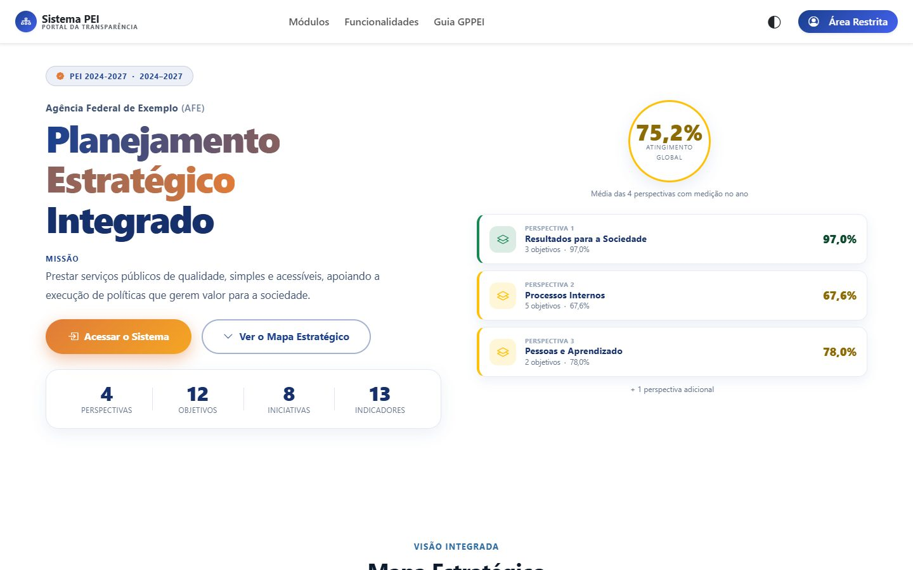
*Figura 101 — Portal da Transparência: página inicial.*

- **Barra superior:** a marca "Sistema PEI — Portal da Transparência" (volta ao início), os links
  **Módulos**, **Funcionalidades** e **Guia GPPEI**, o botão de tema claro/escuro e o botão **Área
  Restrita**, que leva ao login.
- **Selo do ciclo** — na figura, "PEI 2024-2027 · 2024–2027".
- **Nome do órgão** — "Agência Federal de Exemplo (AFE)", seguido do título "Planejamento Estratégico
  Integrado" e da **Missão**.
- **Botões:** **Acessar o Sistema** (login) e **Ver o Mapa Estratégico** (desce até o mapa, na mesma
  página).
- **Contadores:** perspectivas, objetivos, iniciativas e indicadores do ciclo (na figura, 4, 12, 8 e
  13).
- **Atingimento global** (anel à direita) — na figura, 75,2%, "Média das 4 perspectivas com medição no
  ano". A cor do anel segue a régua do farol (Graus de Satisfação, capítulo 17). Se nenhum indicador
  tiver medição no ano, o anel mostra **"Em preenchimento"** em vez de 0%.
- **Cartões das perspectivas** — as três primeiras, com o número de objetivos e o atingimento (ou "Sem
  medição"), e a borda na cor do farol. Na figura: Resultados para a Sociedade (3 objetivos, 97,0%,
  verde), Processos Internos (5 objetivos, 67,6%, amarelo) e Pessoas e Aprendizado (2 objetivos, 78,0%,
  amarelo). As demais aparecem como "+ N perspectiva(s) adicional(is)" (na figura, "+ 1 perspectiva
  adicional") e estão completas no mapa.

O portal mostra sempre a **unidade raiz** e o **ciclo vigente**, no **ano corrente**. Os números são
atualizados em até 5 minutos depois de um lançamento.

### 35.5 Mapa Estratégico

Clique em **Ver o Mapa Estratégico** ou role a página inicial até a seção **Visão Integrada — Mapa
Estratégico**.

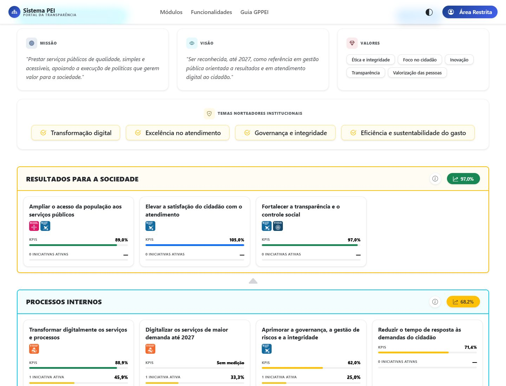
*Figura 102 — Portal: Mapa Estratégico.*

- **Missão**, **Visão** e **Valores** (em etiquetas), no alto.
- **Temas Norteadores Institucionais** — os temas do ciclo.
- **Uma faixa por perspectiva** (na figura, "Resultados para a Sociedade" com 97,0%, selo verde, e
  "Processos Internos" com 68,2%, selo amarelo), com o atingimento no selo à direita e o botão **(i)**,
  que explica como o número da perspectiva foi calculado.
- **Um cartão por objetivo**, com:
  - o nome do objetivo;
  - os ícones dos **ODS** a que o objetivo está ligado (Agenda 2030);
  - **KPIs** — o atingimento dos indicadores do objetivo, com a barra na cor do farol (ou "Sem
    medição", como em "Digitalizar os serviços de maior demanda até 2027");
  - **Iniciativas ativas** — quantas (ex.: "1 iniciativa ativa") e o progresso médio delas (ou "—" se
    não houver).
- A seta entre as faixas mostra a lógica de causa e efeito do mapa.

Para o visitante, a linha **KPIs** de um cartão leva à lista de **Indicadores** já filtrada pelos
indicadores daquele objetivo (ver 35.7). O clique no nome do objetivo só funciona para quem está
logado. As cores e a leitura dos números estão explicadas no capítulo 36.

### 35.6 Objetivos

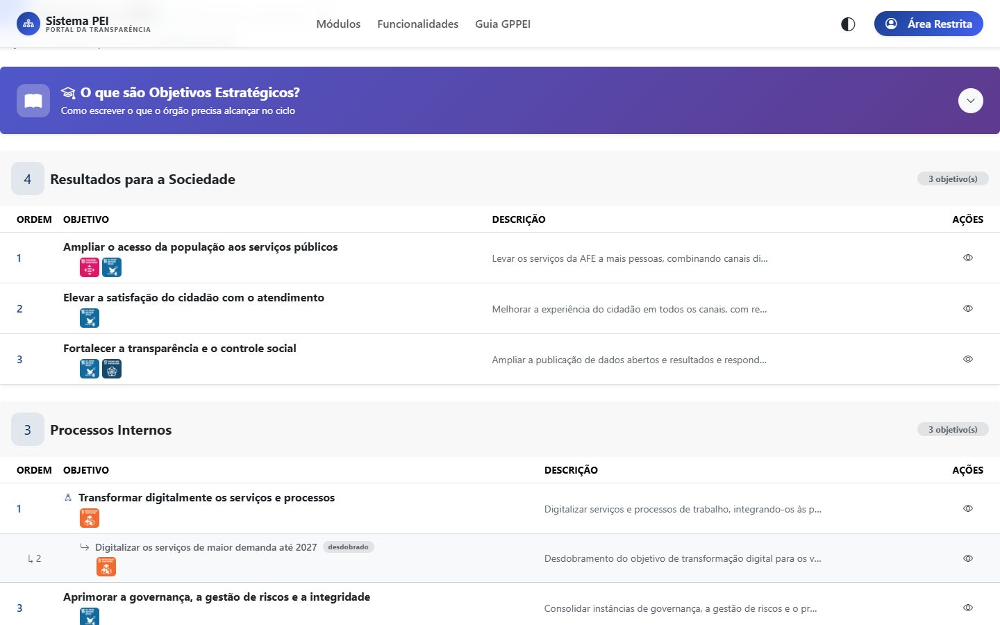
*Figura 103 — Portal: lista de objetivos.*

A página pública **Objetivos** fica no endereço do sistema seguido de `/objetivos`; o mapa público não
tem um link direto para ela. A lista mostra a seção educativa **"O que são Objetivos Estratégicos?"** e
um bloco por perspectiva,
com o número da perspectiva, o nome e a quantidade de objetivos (na figura, "4 Resultados para a
Sociedade — 3 objetivo(s)" e "3 Processos Internos — 3 objetivo(s)"). Em cada bloco, as colunas
**Ordem**, **Objetivo** (com os ícones dos ODS), **Descrição** (resumida) e **Ações**.

Um objetivo **desdobrado** de outro aparece logo abaixo do objetivo de origem, recuado, com a seta ↳ e a
etiqueta **desdobrado** (na figura, "Digitalizar os serviços de maior demanda até 2027", desdobrado de
"Transformar digitalmente os serviços e processos"). O **olho** abre o detalhe do objetivo, com seus
indicadores e iniciativas. O visitante não vê os botões de cadastro nem os comentários.

### 35.7 Indicadores

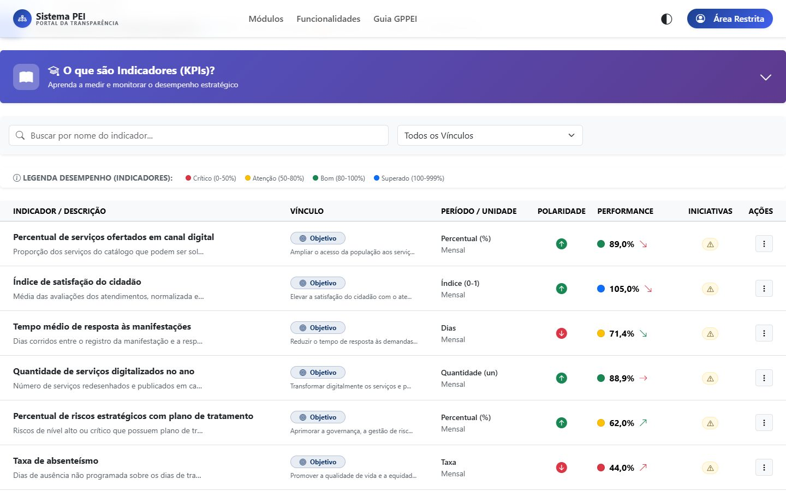
*Figura 104 — Portal: lista de indicadores.*

- **Busca** "Buscar por nome do indicador…" e o filtro de vínculo (**Todos os Vínculos**).
- **Legenda de desempenho:** **Crítico (0-50%)** vermelho, **Atenção (50-80%)** amarelo, **Bom
  (80-100%)** verde e **Superado (100-999%)** azul.
- **Colunas:**
  - **Indicador / Descrição**;
  - **Vínculo** — a que o indicador está ligado (na figura, sempre **Objetivo**) e o nome resumido;
  - **Período / Unidade** — a unidade de medida (Percentual, Índice, Dias, Quantidade, Taxa) e a
    periodicidade (Mensal);
  - **Polaridade** — seta verde para cima (quanto maior, melhor) ou seta vermelha para baixo (quanto
    menor, melhor);
  - **Performance** — o atingimento com a bolinha na cor do farol e uma seta de tendência;
  - **Iniciativas** — ícone de alerta quando o indicador não tem iniciativa associada;
  - **Ações** — o menu **⋮**, que para o visitante traz só **Ficha Técnica**.
- O botão **Exportar** (PDF/Excel) não aparece para o visitante.

### 35.8 Iniciativas

No portal, o andamento das iniciativas aparece no **Mapa Estratégico**: cada cartão de objetivo
informa quantas iniciativas ativas ele tem e o progresso médio delas (ver 35.5).

A página pública **Iniciativas**, aberta pela linha "Iniciativas ativas" de um cartão do mapa, mostra
hoje apenas a seção educativa **"O que são Iniciativas?"** e o aviso amarelo **"Selecione uma
Organização"** — sem a lista de iniciativas.

### 35.9 Perguntas frequentes

**O número do portal é diferente do Dashboard.** O portal mostra a unidade raiz, no ano corrente, com
a média das perspectivas que têm medição. O Dashboard mostra o **Índice de Qualidade de Gestão (IQG)**,
que combina indicadores e iniciativas, para a unidade, o ciclo e o ano escolhidos no topo. São medidas
diferentes; ver capítulo 36.

**Por que aparece "Sem medição"?** O indicador (ou todos os indicadores do objetivo) não tem evolução
lançada no ano. "Sem medição" não é 0%: é ausência de dado.

**O link "Guia GPPEI" do portal pede login.** O guia fica dentro da área restrita; o visitante é levado
à tela de login.

**O cidadão consegue alterar algo?** Não. O portal só aceita leitura; qualquer tentativa de gravação é
recusada pelo sistema.

# PARTE VII — REFERÊNCIA

## 36. Como ler números e cores

Este capítulo reúne as contas que o sistema faz para chegar a cada percentual e a cada cor. A regra é
uma só para o Dashboard, o Mapa Estratégico, as fichas, os relatórios e o Portal da Transparência —
com as exceções apontadas na seção 36.9.

### 36.1 Atingimento de um indicador e a polaridade

**Atingimento** é quanto do resultado esperado foi alcançado, em percentual. A conta depende da
**polaridade** do indicador, escolhida no cadastro (capítulo 19):

| Polaridade (como aparece no formulário) | Quando usar | Conta | Exemplo |
|---|---|---|---|
| **Positiva (Quanto maior, melhor)** | Satisfação, cobertura, serviços digitalizados. | realizado ÷ previsto × 100 | Meta 80, realizado 60 → **75%**. |
| **Negativa (Quanto menor, melhor)** | Prazo médio, defeitos, reclamações. | previsto ÷ realizado × 100 | Meta 10 dias, realizado 8 → **125%**; realizado 20 → **50%**. |
| **Estabilidade (Quanto mais próximo do alvo, melhor)** | Taxa de ocupação, nível de estoque. | 100% menos o desvio relativo, com piso em zero | Alvo 100: realizado 100 → **100%**; 150 ou 50 → **50%**. |
| **Não Aplicável (Informativo)** | Números só para registro (por exemplo, nº de servidores). | Não calcula atingimento. | Não entra em nenhuma média e não tem farol. |

Casos especiais:

- **Polaridade negativa com meta zero** (zero acidentes, zero reincidência): realizado zero = **100%**;
  qualquer valor acima de zero = **0%**.
- **Polaridade negativa com realizado zero** e meta maior que zero: **100%** (zerou o que se queria
  reduzir).
- **Polaridade positiva sem meta** (previsto zero e sem meta anual): não há como medir; o indicador
  fica **sem medição**.
- O atingimento **pode passar de 100%** quando a meta é superada.

### 36.2 Que lançamentos entram na conta: acumulado e valor pontual

Cada indicador recebe lançamentos mensais com **Previsto** e **Realizado** (capítulo 19). O campo
**É Acumulado?** do cadastro decide como os meses são combinados:

| É Acumulado? | Como o sistema combina os meses | Exemplo |
|---|---|---|
| **Sim (Soma mensal)** | Soma o previsto e soma o realizado de todos os meses **medidos** do período e compara as somas. | Atendimentos: jan 100/90, fev 100/110 → 200 previstos, 200 realizados → **100%**. |
| **Não (Valor pontual)** | Usa só o **último mês medido** do período. | Satisfação: jan 80/75, fev 80/82 → vale fevereiro → 82 ÷ 80 = **102,5%**. |

Que período entra:

- **Ano que já passou**: de janeiro a dezembro.
- **Ano corrente**: de janeiro até o **mês atual**.
- **Mês medido** é o mês com **Realizado** preenchido. Mês com Realizado em branco **não conta** —
  não é tratado como zero.

**Previsto em branco:** se o lançamento não tem Previsto, o sistema usa a **meta anual** do
indicador:

- indicador **acumulado**: a meta anual dividida por 12, vezes o número de meses medidos (meta 1.200
  no ano, 3 meses medidos → previsto 300);
- indicador **pontual**: a própria meta anual (meta 90 → previsto 90).

**Indicador baseado em iniciativa:** quando o cálculo do indicador é **Baseado em Iniciativa**, o
atingimento é o **progresso da iniciativa** vinculada, calculado pelas entregas (seção 36.5).

### 36.3 "Sem medição" — a diferença entre nada e zero

Um indicador está **sem medição** quando, no período, não tem nenhum mês com Realizado preenchido,
ou não tem previsto nem meta para comparar.

Sem medição **não é desempenho zero**. Por isso o sistema:

- pinta o farol de **cinza**, nunca da cor da pior faixa;
- deixa o indicador **fora** da média do objetivo, da perspectiva e do IQG;
- mostra o rótulo "**(sem medição)**" nos gráficos, sem barra;
- deixa em branco, na Curva de Evolução, o mês sem lançamento.

Indicadores **informativos** também ficam fora das médias e aparecem em cinza.

Se **tudo** o que compõe um objetivo ou uma perspectiva está sem medição, o objetivo ou a perspectiva
também fica **sem medição** (cinza), e não 0%.

### 36.4 O farol: a régua de Graus de Satisfação

A **cor** de cada número vem da régua de **Graus de Satisfação** do ciclo (capítulo 17). A régua é um
conjunto de faixas, cada uma com nome, cor, percentual mínimo e máximo. Exemplo da régua de
demonstração do ciclo PEI 2024-2027:

| Faixa | De | Até | Cor |
|---|---|---|---|
| **Crítico** | 0,00% | 49,99% | Vermelho |
| **Atenção** | 50,00% | 79,99% | Amarelo |
| **Bom** | 80,00% | 99,99% | Verde |
| **Superado** | 100,00% | 999,00% | Azul |

Como a cor é escolhida:

1. O valor recebe a cor da faixa em que cai (mínimo ≤ valor ≤ máximo).
2. **Abaixo da primeira faixa**: a cor da primeira.
3. **Acima da última faixa**: a cor da última — superar a meta nunca vira alarme.
4. **No intervalo entre duas faixas** (por exemplo, 79,995% entre 79,99 e 80,00): a cor da faixa de
   **baixo**. O sistema nunca promove um valor à cor melhor por falta de corte.
5. **Sem régua configurada** para o ciclo: **cinza**. Sem régua não há farol, em vez de tudo vermelho.
6. **Sem medição** ou indicador **informativo**: **cinza**.

**Cada ciclo tem a própria régua.** Um indicador é sempre julgado pela régua do ciclo a que pertence.

### 36.5 Régua do ano × régua do ciclo

Uma faixa pode valer para **todo o ciclo** (campo de ano em branco) ou para **um ano específico**.

- Se o ano de referência tem **faixas próprias**, **só elas** julgam aquele ano: elas **substituem** as
  faixas gerais do ciclo, não se misturam com elas.
- Se o ano **não** tem faixas próprias, valem as **faixas gerais** do ciclo.
- A régua de **outro** ano nunca julga o ano escolhido. Sem régua do ano e sem régua geral, o farol
  fica **cinza**.

Exemplo: o ciclo 2024-2027 tem a régua geral da seção 36.4. Se a equipe cadastrar, só para 2027,
"Bom" a partir de 85%, em 2027 um indicador a 82% fica **amarelo**; em 2026, o mesmo 82% fica
**verde**.

### 36.6 Progresso de uma iniciativa (pelas entregas)

O progresso de uma iniciativa sai das **entregas**, conforme a situação de cada uma:

| Situação da entrega | Vale |
|---|---|
| **Concluído** | 100% |
| **Em Andamento** | 50% |
| **Suspenso** | 25% |
| **Não Iniciado** | 0% |
| **Cancelado** | fica fora da conta |

- **Com pesos** nas entregas: média ponderada — Σ(peso × valor) ÷ Σ(pesos). Exemplo: entrega A peso 40
  concluída e entrega B peso 60 em andamento → (40 × 100% + 60 × 50%) ÷ 100 = **70%**.
- **Sem pesos**: média simples.
- Entregas **arquivadas** e entregas na **lixeira** não contam.
- Uma entrega com **sub-entregas** vale o progresso das suas sub-entregas, pela mesma regra.

**No ano de referência**, o Dashboard, o Mapa e o cálculo dos objetivos e perspectivas consideram só
as entregas principais (não as sub-entregas) com **prazo dentro do ano**. Iniciativa sem entrega com
prazo no ano não tem o que medir naquele ano (aparece como **Sem Entregas** no Dashboard) e fica fora
da média.

### 36.7 Atingimento de um objetivo e de uma perspectiva

O atingimento de um **objetivo** e de uma **perspectiva** combina duas notas, com os **pesos
definidos na perspectiva** (campos de peso de indicadores e de iniciativas, que precisam somar 100% —
capítulo 14):

1. **Nota dos indicadores** — a média simples do atingimento dos indicadores **medidos** (sem medição
   e informativos ficam fora);
2. **Nota das iniciativas** — o progresso das entregas do ano (seção 36.6), somando todas as entregas
   das iniciativas do objetivo (ou da perspectiva). Aqui, **entrega sem peso conta com peso 1**.

**Atingimento = (nota dos indicadores × peso dos indicadores + nota das iniciativas × peso das
iniciativas) ÷ soma dos pesos usados.**

Exemplo: perspectiva com pesos **70% indicadores e 30% iniciativas**; indicadores medidos com média
90%; entregas do ano com progresso 50% → (90 × 70 + 50 × 30) ÷ 100 = **78%**.

**Componente sem dado sai da conta e os pesos se reajustam.** Se a mesma perspectiva não tem nenhum
indicador medido, o resultado é só a nota das iniciativas (50%), e não 50% × 30% = 15%. Se nenhum dos
dois componentes tem dado — ou o único com dado tem peso zero —, o resultado é **sem medição**.

A perspectiva usa os mesmos componentes, somando os indicadores e as iniciativas de **todos os seus
objetivos**.

### 36.8 O Índice de Qualidade de Gestão (IQG)

O **IQG** é a nota-resumo do ciclo no ano: a **média ponderada do atingimento das perspectivas que
têm medição** no ano. Perspectiva sem medição fica fora.

**O peso de cada perspectiva é o seu nível** (o número cadastrado na perspectiva: 1, 2, 3, 4…). O
nível 1 é a **base** do mapa estratégico e o nível mais alto é o **topo**. Assim, a perspectiva do
topo — em geral a de resultados para a sociedade — é a que mais pesa: uma de nível 4 pesa quatro
vezes mais que uma de nível 1.

Exemplo com os dados de demonstração de 2026 (Figura da seção 5.2):

| Perspectiva | Nível (peso) | Atingimento | Atingimento × peso |
|---|---|---|---|
| Orçamento e Logística | 1 | 58,2% | 58,2 |
| Pessoas e Aprendizado | 2 | 78,0% | 156,0 |
| Processos Internos | 3 | 67,6% | 202,8 |
| Resultados para a Sociedade | 4 | 97,0% | 388,0 |
| **Total** | **10** | | **805,0** |

IQG = 805,0 ÷ 10 = **80,5%**, na faixa **Bom** (verde). Uma média simples das quatro perspectivas
daria 75,2% (Atenção): o peso maior da perspectiva do topo, que está em 97,0%, puxa o índice para
cima.

**Atenção:** como o peso é o nível, **a posição das perspectivas no mapa muda o IQG**. Ao cadastrar ou
reordenar perspectivas (capítulo 14), a equipe de planejamento deve ter isso em mente.

O IQG é **do ciclo inteiro**, da instituição toda: não muda com a unidade selecionada no topo.

### 36.9 Onde cada número aparece

| Número | Onde aparece | Recorte |
|---|---|---|
| Atingimento e farol do **indicador** | Indicadores, ficha do indicador, Mapa, relatórios | Ano de referência |
| Atingimento do **objetivo** (indicadores + iniciativas) | Mapa Estratégico, detalhe do objetivo, relatórios, Portal | Ano de referência |
| Atingimento da **perspectiva** | Dashboard, Mapa, detalhe da perspectiva, relatórios, Portal | Ano de referência |
| **IQG** | Dashboard | Ciclo inteiro, ano de referência |
| **Curva de Evolução** | Dashboard | Mês a mês, ciclo inteiro |

> **Exceção:** a lista de objetivos dentro do **detalhe de uma perspectiva** e o **painel da Agenda
> 2030** mostram, para cada objetivo, um percentual calculado **só com os indicadores** (inclusive os
> das iniciativas do objetivo), ponderado pelo peso de cada indicador, sem a parte das entregas. Por
> isso o mesmo objetivo pode aparecer ali com um percentual diferente do Mapa.

### 36.10 Formato dos números e datas

- Números no padrão brasileiro: **vírgula** para decimais e **ponto** para milhar (1.234,5).
- Percentuais com uma casa decimal (80,5%).
- Datas no formato **dd/mm/aaaa**.
- Tempos relativos em português ("há 3 dias", "em 2 dias"); passe o mouse para ver a data exata.

---

## 37. Regras do sistema que todo usuário deve conhecer

Estas regras valem em todo o sistema. Conhecê-las evita surpresas e perda de trabalho.

### 37.1 Toda entrega pertence a uma iniciativa

Não existe entrega solta. Ao abrir **Planejar → Gerenciar Entregas** sem uma iniciativa escolhida, a
tela **pede que você escolha a iniciativa** antes de mostrar qualquer quadro (capítulo 21). O sistema
não escolhe uma iniciativa sozinho.

### 37.2 O prazo da entrega fica dentro do período da iniciativa

O prazo de uma entrega precisa estar entre a **data de início** e a **data de fim** da iniciativa. Se
não estiver, o sistema recusa com a mensagem: "O prazo precisa estar dentro do período da iniciativa
(dd/mm/aaaa a dd/mm/aaaa)." A regra vale ao criar, ao editar e ao mover a entrega no calendário ou na
linha do tempo. Para estender um prazo além do fim, primeiro amplie o período da iniciativa.

### 37.3 Exclusões levam junto o que depende do registro

Excluir certos registros exclui também, automaticamente, tudo o que só existe por causa deles:

| Ao excluir… | Vai junto |
|---|---|
| **Um ciclo PEI** | Perspectivas, objetivos (com futuro almejado e comentários), iniciativas (com entregas, indicadores e vínculos de gestor), indicadores dos objetivos, identidade, valores, temas, graus de satisfação (a régua do farol), análises PESTEL e SWOT, estratégias TOWS, partes interessadas, cenários, cadeia de valor (com processos), abertura do ciclo, integração com instrumentos, calendário, RAE (com encaminhamentos) e riscos (com mitigações e ocorrências). |
| **Uma perspectiva** | Os objetivos dela, com futuro almejado, comentários, iniciativas (e o que vai com elas) e indicadores. |
| **Uma iniciativa** | As entregas, os indicadores da iniciativa e os vínculos de Gestor(a) Responsável e Substituto(a) com ela. |
| **Uma atividade da cadeia de valor** | Os processos dessa atividade. |

Os **documentos do acervo** (capítulo 27) não vão junto com o ciclo: eles existem por si e apenas
citam o ciclo.

As janelas de confirmação dessas exclusões dizem o que será afetado. **Leia antes de confirmar.**

### 37.4 Exclusão lógica × exclusão definitiva

- Quase toda exclusão no sistema é **lógica**: o registro sai das telas, dos cálculos e dos
  relatórios, mas continua guardado no banco de dados, com o registro de quem excluiu na auditoria.
- **Pela tela, só as entregas podem ser restauradas**, a partir da **lixeira** do quadro de entregas
  (capítulo 21). Lá também é possível a **exclusão permanente**, que apaga a entrega e os arquivos
  anexados **sem volta**.
- Para recuperar outro registro excluído por engano (uma iniciativa, um ciclo), é preciso acionar a
  equipe técnica do sistema; não há botão de restauração.
- **Arquivar** uma entrega não é excluir: ela some do quadro e dos cálculos, mas volta com **Mostrar
  arquivados** e **desarquivar**.
- **Contas de usuário** são a exceção: a exclusão de uma conta é **definitiva** — e por isso só é
  permitida para contas sem histórico (seção 37.7).

### 37.5 Cada perspectiva ocupa um nível único no ciclo

Dentro de um ciclo, duas perspectivas não podem ter o mesmo **nível**. Ao tentar, o sistema recusa:
"Já existe uma perspectiva neste nível do ciclo. Escolha outro nível." O nível define a posição da
perspectiva no Mapa Estratégico (nível 1 na base; o nível mais alto no topo, mostrado primeiro) e o
**peso dela no IQG** (ver seção 36.8).

### 37.6 Uma pessoa tem um só papel de gestão em cada iniciativa

Na mesma iniciativa, uma pessoa é **ou** Gestor(a) Responsável **ou** Gestor(a) Substituto(a), nunca
os dois. Ao tentar, o sistema avisa: "Esta pessoa já é Gestor(a) Responsável desta iniciativa. Para
trocar o papel, remova o atual primeiro." Também não é possível designar a si mesmo: a lista oferece
só usuários da unidade da iniciativa, exceto você. Designar gestores é ato do Administrador da
unidade (ou do Super Administrador).

### 37.7 Usuário com histórico não é excluído: é desativado

Uma conta que já deixou qualquer registro no sistema — alterações na auditoria, entregas ou
comentários, atribuições RACI, riscos que monitora, documentos enviados, relatórios gerados, vínculo
de gestor de iniciativa, entre outros — **não pode ser excluída**. O sistema mostra "Este usuário tem
registros no sistema e não pode ser excluído sem apagá-los. Use 'Desativar': o acesso é bloqueado e
o histórico fica preservado."

- **Desativar** bloqueia o login ("Sua conta está inativa. Entre em contato com o administrador.") e
  preserva tudo.
- A **última conta ativa de Super Administrador** não pode ser desativada.
- **Excluir definitivamente** só é possível para conta que nunca deixou rastro.

### 37.8 Não há autocadastro

A opção de criar a própria conta está **desligada**. Contas são criadas pelo Super Administrador em
**Administração → Usuários**, já com unidade e perfil (seção 2.1). Uma conta sem vínculo, se existir,
só vê a página "Acesso aguardando liberação" (seção 2.6).

### 37.9 A auditoria registra quem realmente fez a alteração

O Super Administrador pode **assumir a identidade** de outro usuário para ver o sistema como ele vê
(capítulo 31). Enquanto isso:

- uma **faixa laranja** no topo avisa "Modo Impersonação Ativo — você está visualizando o sistema como
  *nome* (*e-mail*)", com o botão **Encerrar Impersonação**;
- toda alteração feita nesse modo fica na **auditoria em nome do Super Administrador**, que é quem
  está ao teclado, com a marcação de qual usuário estava sendo assumido. Nada fica registrado como se
  a pessoa assumida tivesse feito;
- não é possível assumir a identidade de outro Super Administrador nem de uma conta inativa.

### 37.10 Outras regras úteis

- **Os pesos de uma perspectiva** (indicadores × iniciativas) precisam somar exatamente 100%: "A
  soma dos pesos deve ser exatamente 100%."
- **O que é da instituição inteira** só é alterado pelo Super Administrador ou pelo Administrador da
  unidade raiz (seção 4.5).
- **A Agenda 2030 é opcional**: nenhum objetivo é obrigado a ter ODS vinculado.
- **O ano e o ciclo andam juntos** nos seletores do topo (seções 3.4 e 3.5).

---

## 38. Perguntas frequentes

### 38.1 Acesso e conta

**Como crio a minha conta?**
Não há autocadastro. Peça ao administrador do sistema do seu órgão (seção 2.1).

**Esqueci a senha e o e-mail de redefinição não chega.**
Confira o spam. Se não chegar, o envio de e-mail pode estar desligado no servidor: peça ao
administrador uma nova senha inicial (seção 2.5).

**Entrei e só vejo "Acesso aguardando liberação".**
A sua conta ainda não tem unidade e perfil. Peça o vínculo ao administrador e entre de novo (seção
2.6).

**O sistema me mandou de volta para a tela de entrada no meio do trabalho.**
A sessão expirou por inatividade (seção 2.3). Entre de novo; o que não tinha sido salvo precisa ser
refeito.

**Aparece "Sua conta está inativa".**
A conta foi desativada. Só o administrador pode reativá-la.

### 38.2 Telas e dados

**A tela está vazia. Os dados sumiram?**
Quase sempre é o recorte do topo. Confira a **unidade**, o **ciclo** e o **ano** (seções 3.3 a 3.5).
Num ano futuro, por exemplo, ainda não há resultados.

**Mudei o ano e o ciclo mudou sozinho (ou o contrário).**
É proposital: o ano sempre pertence ao ciclo em uso (seções 3.4 e 3.5).

**Não encontro uma unidade no seletor.**
O seletor mostra só as unidades do seu escopo (seção 3.3). Se precisar de outra, peça um novo
vínculo ao administrador.

**Um botão descrito no manual não aparece para mim.**
O seu perfil não tem essa permissão, ou a ação é de quem responde pela iniciativa (capítulo 4).

### 38.3 Números e cores

**Por que o farol está cinza?**
Ou o item está **sem medição** no ano, ou é um indicador **informativo**, ou o ciclo não tem régua de
graus de satisfação. Cinza nunca significa desempenho ruim (seção 36.3).

**O mesmo indicador está verde num ano e amarelo em outro, com o mesmo percentual.**
O ano pode ter uma régua própria de graus de satisfação, que substitui a régua geral do ciclo (seção
36.5).

**Por que o IQG não muda quando troco a unidade?**
Porque é do ciclo inteiro, da instituição toda (seção 36.8).

**O percentual de um objetivo no Mapa é diferente do que aparece no detalhe da perspectiva.**
O Mapa combina indicadores e iniciativas; a lista do detalhe da perspectiva considera só os
indicadores (seção 36.9).

**Lancei a evolução e o percentual não mudou.**
Confira se o **Realizado** foi preenchido (mês sem Realizado não conta) e se o mês está dentro do
período considerado: no ano corrente, só até o mês atual (seção 36.2).

### 38.4 Iniciativas, entregas e indicadores

**Sou Gestor e não consigo editar a iniciativa / lançar a evolução.**
Você age só nas iniciativas às quais foi designado. Peça ao Administrador da unidade que confira o
vínculo em **Iniciativas → Gestores e Responsáveis** (seção 4.7).

**O sistema não aceita o prazo da entrega.**
O prazo precisa estar dentro do período da iniciativa (seção 37.2).

**Excluí uma entrega por engano. Consigo recuperar?**
Sim, se não foi exclusão permanente: abra a **lixeira** no quadro de entregas da iniciativa e
restaure (capítulo 21).

**Excluí uma iniciativa por engano.**
A exclusão é lógica, mas não há restauração pela tela. Acione a equipe técnica o quanto antes e
informe o nome da iniciativa e a hora aproximada (seção 37.4).

### 38.5 Dashboard e IA

**Cliquei em "Gerar Análise (IA)" e nada aconteceu.**
O agente de IA não está configurado ou está desligado, ou você passou de 20 pedidos por minuto
(seção 5.5).

**O botão "Ciclo PEI" do Dashboard dá acesso negado.**
A tela de ciclos é exclusiva do Super Administrador (seção 5.2).

---

## 39. Glossário

**5W2H** — Ferramenta para detalhar uma ação respondendo a sete perguntas: o quê, por quê, onde,
quando, quem, como e quanto custa. No sistema, usada no detalhamento das entregas.

**Acumulado (indicador)** — Indicador cujo resultado é a **soma** dos meses (por exemplo, número de
atendimentos). O oposto é o indicador de **valor pontual** (seção 36.2).

**Administrador da Unidade** — Perfil de quem conduz o planejamento de uma unidade, com permissões
na unidade e nas subordinadas (capítulo 4).

**Agenda 2030** — Agenda global da ONU com os Objetivos de Desenvolvimento Sustentável (ODS). No
sistema, é um eixo **opcional**: os objetivos estratégicos podem ser vinculados aos ODS (capítulo 18).

**Alerta Estratégico** — Aviso dirigido a você no sino, como a tendência desfavorável de um indicador
(seção 3.6).

**Ano de referência (Ano Ref.)** — O exercício usado para metas, resultados e farol. Escolhido no
topo da tela (seção 3.5).

**Arquivar** — Tirar uma entrega do quadro e dos cálculos sem excluí-la. Pode ser desfeito.

**Assumir identidade (impersonação)** — Recurso do Super Administrador para ver o sistema como outro
usuário vê. As alterações feitas nesse modo ficam na auditoria em nome do Super Administrador (seção
37.9).

**Atingimento** — Percentual do resultado esperado que foi alcançado, calculado conforme a polaridade
(seção 36.1).

**Auditoria** — Registro de quem criou, alterou ou excluiu cada informação, quando e com quais valores
antes e depois (capítulo 33).

**Balanced Scorecard (BSC)** — Metodologia que organiza os objetivos estratégicos em **perspectivas**
ligadas por relações de causa e efeito. É a base do Mapa Estratégico.

**Cadeia de Valor** — Representação das atividades finalísticas e de suporte pelas quais o órgão gera
valor público para a sociedade (capítulo 8).

**Cenários Prospectivos** — Hipóteses sobre futuros possíveis do ambiente, usadas para testar a
estratégia (capítulo 13).

**Ciclo PEI** — Um plano estratégico com período definido (por exemplo, 2024-2027), com as próprias
perspectivas, objetivos, indicadores, iniciativas e régua de cores (capítulo 6).

**Consulta** — Perfil de leitura e exportação de relatórios, sem cadastrar, alterar ou excluir nada
(capítulo 4).

**Dashboard** — Painel inicial do sistema, com a visão geral do desempenho (capítulo 5).

**Desdobramento** — Divisão de um objetivo estratégico em objetivos menores, ligados a ele (capítulo
15).

**Entrega** — Produto ou resultado concreto de uma iniciativa, com prazo, responsáveis e situação.
Toda entrega pertence a uma iniciativa (capítulos 21 e 37).

**Exercício** — O ano de referência, como aparece no Dashboard ("Exercício 2026").

**Farol** — A cor que indica o desempenho de um item, conforme a régua de Graus de Satisfação (seção
36.4).

**Futuro Almejado** — Descrição da situação desejada para um objetivo estratégico ao fim do ciclo
(capítulo 15).

**Gestor(a) Responsável** — Perfil de quem responde por iniciativas específicas: edita a iniciativa,
as entregas e lança a evolução dos indicadores dela (capítulo 4).

**Gestor(a) Substituto(a)** — Perfil de quem cobre o Gestor Responsável numa iniciativa, com menos
permissões (não exclui entregas) (capítulo 4).

**GPPEI/MGI 2025** — O guia de planejamento estratégico do Ministério da Gestão e da Inovação em
Serviços Públicos, metodologia seguida pelo sistema. Disponível em **Referências → Guia GPPEI**.

**Grau de Satisfação** — Faixa da régua que dá nome e cor a um percentual (por exemplo, "Atenção",
50% a 79,99%, amarelo) (capítulo 17).

**Identidade Estratégica** — Missão e visão da unidade no ciclo (capítulo 9).

**Índice de Qualidade de Gestão (IQG)** — Nota-resumo do ciclo no ano: média ponderada do
atingimento das perspectivas com medição (seção 36.8).

**Indicador** — Medida usada para acompanhar um objetivo ou uma iniciativa, com metas anuais e
lançamentos mensais (capítulo 19).

**Informativo (indicador)** — Indicador de polaridade "Não Aplicável": registra um número sem julgar
desempenho. Não entra em médias nem tem farol.

**Iniciativa** — Projeto, programa ou ação que contribui para um objetivo estratégico. Tem período,
unidade, gestores e entregas (capítulo 20).

**Inaugurar e Integrar** — Módulo 01 do GPPEI: abrir o ciclo, planejar o processo e integrá-lo a
outros instrumentos (capítulo 7).

**Lição Aprendida** — Registro do que deu certo ou errado numa iniciativa, para orientar as próximas
(capítulo 25).

**Linha de base** — Valor do indicador no ponto de partida, antes das ações do plano (capítulo 19).

**LOA (Lei Orçamentária Anual)** — Lei que estima receitas e fixa despesas do ano. Um dos instrumentos
com que o plano se integra.

**Lixeira** — Área do quadro de entregas onde ficam as entregas excluídas, que podem ser restauradas
ou excluídas permanentemente.

**Mapa Estratégico** — Representação do plano em uma página: identidade, perspectivas e objetivos, com
o farol de cada um (capítulo 16).

**Matriz de Riscos** — Grade de probabilidade × impacto que classifica os riscos em Baixo, Médio,
Alto e Crítico (capítulo 23).

**Mentor Estratégico** — Checklist do Dashboard que mostra quais etapas do planejamento já foram
cadastradas (seção 5.3).

**Meta** — Valor que se pretende alcançar num indicador num período. A meta anual é usada quando o
lançamento não traz Previsto (seção 36.2).

**Missão** — A razão de ser do órgão: o que faz, para quem e para quê.

**Mitigação** — Ação planejada para reduzir a probabilidade ou o impacto de um risco (capítulo 23).

**Objetivo Estratégico** — Resultado que a instituição quer alcançar no ciclo, dentro de uma
perspectiva (capítulo 15).

**ODS (Objetivos de Desenvolvimento Sustentável)** — Os objetivos da Agenda 2030. O total vem do
cadastro do sistema.

**Ocorrência (de risco)** — Registro de que um risco efetivamente aconteceu (capítulo 23).

**Partes Interessadas** — Pessoas, grupos e organizações afetados pela atuação do órgão ou capazes de
influenciá-la (capítulo 13).

**Perfil de Acesso** — Conjunto de permissões: Super Administrador, Administrador da Unidade,
Gestor(a) Responsável, Gestor(a) Substituto(a) ou Consulta (capítulo 4).

**Perspectiva** — Dimensão do BSC em que os objetivos são agrupados (por exemplo, Resultados para a
Sociedade, Processos Internos). Tem nível único no ciclo e pesos para indicadores e iniciativas
(capítulo 14).

**PESTEL** — Análise dos fatores externos Políticos, Econômicos, Sociais, Tecnológicos, Ambientais
(Ecológicos) e Legais (capítulo 12).

**Peso** — Importância relativa de um item numa média: das entregas no progresso da iniciativa, dos
indicadores e das iniciativas na perspectiva (capítulo 36).

**Polaridade** — Sentido em que o indicador melhora: positiva (quanto maior, melhor), negativa (quanto
menor, melhor), estabilidade (quanto mais próximo do alvo, melhor) ou não aplicável (informativo)
(seção 36.1).

**Portal da Transparência** — Parte pública do sistema, sem login, com o mapa e os resultados em
modo somente leitura (capítulo 35).

**PPA (Plano Plurianual)** — Instrumento de planejamento do governo para quatro anos. Um dos
instrumentos com que o plano se integra.

**Previsto** — Valor esperado de um indicador num mês.

**RACI** — Matriz que define, para cada atividade, quem é **R**esponsável, quem **A**prova
(autoridade), quem é **C**onsultado e quem é **I**nformado (capítulo 20).

**RAE (Revisão e Avaliação da Estratégia)** — Reunião periódica para avaliar os resultados e decidir
ajustes no plano, com encaminhamentos e análise de causas (capítulo 24).

**Realizado** — Valor efetivamente alcançado por um indicador num mês. Mês sem Realizado não conta
nos cálculos.

**Régua** — O conjunto de faixas de Graus de Satisfação de um ciclo (ou de um ano) (seções 36.4 e
36.5).

**Risco** — Evento incerto que, se ocorrer, afeta os objetivos. É classificado por probabilidade ×
impacto (capítulo 23).

**Sem medição** — Situação de um item que não tem resultado lançado para comparar no período. Aparece
em cinza e fica fora das médias — não é zero (seção 36.3).

**Sub-entrega** — Entrega subordinada a outra entrega; o progresso da entrega principal sai das
sub-entregas.

**Super Administrador** — Perfil com todas as permissões, em todas as unidades (capítulo 4).

**SWOT** — Análise de Forças e Fraquezas (internas) e Oportunidades e Ameaças (externas) (capítulo 13).

**Temas Norteadores** — Grandes eixos que orientam a estratégia do ciclo (capítulo 11).

**Titularidade** — A terceira camada da permissão: o Gestor só age na iniciativa pela qual responde
(seção 4.3).

**TOWS** — Cruzamento dos quadrantes da SWOT para gerar estratégias (forças × oportunidades, e
assim por diante) (capítulo 13).

**Unidade (organização)** — Área do órgão (por exemplo, SPG, DTI, DAC), organizada em hierarquia a
partir da **unidade raiz** (capítulo 29).

**Unidade raiz** — A unidade do topo da hierarquia (na demonstração, a AFE). O Administrador da
unidade raiz pode alterar o que é da instituição inteira.

**Valores Institucionais** — Princípios éticos e de conduta que orientam como o órgão age (capítulo
10).

**Vínculo** — Combinação de uma unidade com um perfil, que dá permissão a uma pessoa (capítulo 4).

**Visão** — A situação futura que o órgão quer alcançar ao fim do ciclo.
